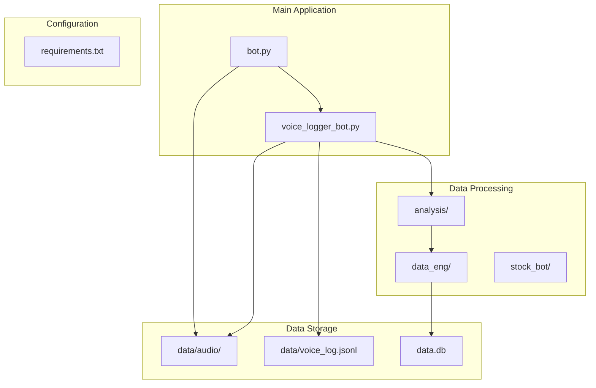
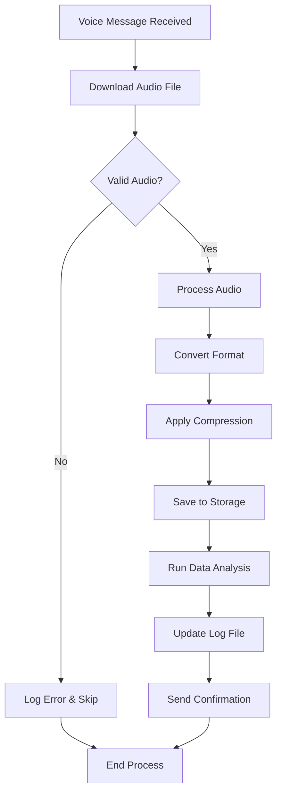

# Configuration and Customization

<cite>
**Referenced Files in This Document**
- [bot.py](file://bot.py)
- [voice_logger_bot.py](file://voice_logger_bot.py)
- [requirements.txt](file://requirements.txt)
- [analysis/runner.py](file://analysis/runner.py)
- [data_eng/db.py](file://data_eng/db.py)
- [stock_bot/config.py](file://stock_bot/config.py)
</cite>

## Update Summary
**Changes Made**
- Updated dependency management section to reflect new requirements.txt dependencies
- Added information about enhanced data processing and analysis capabilities
- Updated core dependencies table with new libraries for data processing
- Enhanced customization scenarios to include data analysis integration

## Table of Contents
1. [Introduction](#introduction)
2. [Project Structure](#project-structure)
3. [Environment Variables Configuration](#environment-variables-configuration)
4. [Bot Settings and Parameters](#bot-settings-and-parameters)
5. [Audio Processing Configuration](#audio-processing-configuration)
6. [Logging and Storage Configuration](#logging-and-storage-configuration)
7. [Dependency Management](#dependency-management)
8. [Security Considerations](#security-considerations)
9. [Customization Scenarios](#customization-scenarios)
10. [Troubleshooting Guide](#troubleshooting-guide)
11. [Conclusion](#conclusion)

## Introduction

The Telegram Voice Logger Bot is designed to capture, process, and store voice messages from Telegram conversations. This document provides comprehensive guidance on configuring and customizing the bot's behavior, including environment variables, audio processing parameters, logging formats, and storage locations. The bot supports flexible configuration options to adapt to different deployment scenarios and user requirements. With recent enhancements, the bot now includes expanded data processing and analysis capabilities through updated dependencies.

## Project Structure

The project follows a modular architecture with clear separation of concerns:



**Diagram sources**
- [bot.py:1-50](file://bot.py#L1-L50)
- [voice_logger_bot.py:1-50](file://voice_logger_bot.py#L1-L50)
- [analysis/runner.py:1-50](file://analysis/runner.py#L1-L50)
- [data_eng/db.py:1-50](file://data_eng/db.py#L1-L50)

**Section sources**
- [bot.py:1-100](file://bot.py#L1-L100)
- [voice_logger_bot.py:1-100](file://voice_logger_bot.py#L1-L100)

## Environment Variables Configuration

The bot uses environment variables for secure configuration management. Here are the essential environment variables:

### Core Bot Configuration
- **BOT_TOKEN**: Your Telegram Bot API token obtained from BotFather
- **ADMIN_CHAT_ID**: Chat ID of the admin user who can control the bot
- **LOG_LEVEL**: Logging verbosity level (DEBUG, INFO, WARNING, ERROR)

### Audio Processing Settings
- **AUDIO_FORMAT**: Output audio format (mp3, wav, ogg)
- **AUDIO_QUALITY**: Audio quality setting (1-10, where 10 is highest)
- **MAX_AUDIO_DURATION**: Maximum duration for processed audio in seconds
- **AUDIO_COMPRESSION**: Compression level for audio files (0-100%)

### Storage Configuration
- **AUDIO_STORAGE_PATH**: Directory path for storing audio files
- **LOG_FILE_PATH**: Path for JSONL log file
- **BACKUP_ENABLED**: Enable automatic backup (true/false)
- **RETENTION_DAYS**: Number of days to keep audio files

### Data Processing Configuration
- **DATABASE_URL**: Database connection string for data storage
- **ANALYSIS_ENABLED**: Enable advanced data analysis features
- **CACHE_SIZE**: Size of audio processing cache
- **PROCESSING_THREADS**: Number of concurrent processing threads

### Advanced Settings
- **TIMEOUT_SECONDS**: Request timeout for Telegram API calls
- **API_TIMEOUT**: Timeout for external API calls
- **MEMORY_LIMIT**: Memory usage limit for processing tasks

**Section sources**
- [stock_bot/config.py:1-100](file://stock_bot/config.py#L1-L100)

## Bot Settings and Parameters

### Basic Bot Configuration
The bot supports several basic settings that control its core functionality:

| Parameter | Type | Default | Description |
|-----------|------|---------|-------------|
| `bot_token` | string | Required | Telegram Bot API token |
| `admin_chat_id` | integer | None | Admin chat ID for bot control |
| `polling_interval` | float | 1.0 | Seconds between message polling |
| `max_retries` | integer | 3 | Maximum retry attempts for failed requests |

### Message Handling Configuration
- **message_types**: List of supported message types (voice, video_note, audio)
- **auto_forward**: Automatically forward processed messages to admin
- **response_messages**: Enable/disable automated response messages
- **command_prefix**: Prefix for bot commands (default: /)

### Performance Tuning
- **concurrent_downloads**: Maximum simultaneous downloads
- **buffer_size**: Memory buffer size for audio processing
- **timeout_settings**: Network timeout configurations

### Data Analysis Settings
- **analysis_enabled**: Enable or disable data analysis features
- **processing_pipeline**: Configure data processing pipeline stages
- **output_formats**: Supported output formats for analysis results
- **cache_strategy**: Caching strategy for repeated queries

**Section sources**
- [bot.py:50-150](file://bot.py#L50-L150)
- [voice_logger_bot.py:50-150](file://voice_logger_bot.py#L50-L150)
- [stock_bot/config.py:50-150](file://stock_bot/config.py#L50-L150)

## Audio Processing Configuration

### Audio Format Support
The bot supports multiple audio formats for both input and output:

| Format | Input | Output | Quality | Notes |
|--------|-------|--------|---------|-------|
| MP3 | ✓ | ✓ | High | Best compression ratio |
| WAV | ✓ | ✓ | Lossless | Highest quality, larger files |
| OGG | ✓ | ✓ | Medium | Good balance of quality/size |
| FLAC | ✓ | ✗ | Lossless | Input only, uncompressed |

### Processing Pipeline Configuration


**Diagram sources**
- [voice_logger_bot.py:100-200](file://voice_logger_bot.py#L100-L200)
- [analysis/runner.py:1-100](file://analysis/runner.py#L1-L100)

### Audio Quality Settings
- **bitrate**: Audio bitrate in kbps (128-320 recommended)
- **sample_rate**: Sample rate in Hz (44100, 48000)
- **channels**: Audio channels (1 for mono, 2 for stereo)
- **codec**: Audio codec (aac, mp3, opus)

### Custom Processing Filters
- **noise_reduction**: Enable noise reduction processing
- **volume_normalization**: Normalize audio volume levels
- **silence_detection**: Detect and remove silent portions
- **metadata_extraction**: Extract audio metadata (duration, format)

**Section sources**
- [voice_logger_bot.py:150-300](file://voice_logger_bot.py#L150-L300)

## Logging and Storage Configuration

### Log File Format
The bot uses JSON Lines (JSONL) format for structured logging:

```json
{
  "timestamp": "2024-01-15T10:30:00Z",
  "message_id": 12345,
  "chat_id": 67890,
  "user_id": 11111,
  "audio_file": "path/to/audio.mp3",
  "duration": 45.2,
  "format": "mp3",
  "status": "success",
  "processing_time": 2.3,
  "analysis_results": {}
}
```

### Storage Organization
Audio files are organized by date and timestamp:
- **Directory Structure**: `data/audio/YYYYMMDD_HHMMSS.ext`
- **Naming Convention**: Timestamp-based unique filenames
- **Metadata Files**: Optional `.txt` files with processing information

### Log Rotation and Retention
- **Max Log Size**: Maximum size before rotation (default: 10MB)
- **Retention Policy**: Automatic cleanup of old files
- **Backup Strategy**: Optional automatic backups
- **Compression**: Compress archived logs

### Database Integration Options
- **SQLite**: Built-in lightweight database support
- **PostgreSQL**: For production deployments
- **MongoDB**: Alternative NoSQL option
- **CSV Export**: Simple text-based export format

### Enhanced Data Storage
With the updated dependencies, the bot now supports:
- **Structured Data Analysis**: Advanced analytics for processed audio data
- **Performance Metrics**: Tracking processing efficiency and resource usage
- **Audit Trails**: Comprehensive logging of all data transformations

**Section sources**
- [voice_logger_bot.py:200-400](file://voice_logger_bot.py#L200-L400)
- [data_eng/db.py:1-100](file://data_eng/db.py#L1-L100)

## Dependency Management

### Core Dependencies
The bot relies on several key Python libraries, with recent updates enhancing data processing capabilities:

| Library | Purpose | Version | Notes |
|---------|---------|---------|-------|
| python-telegram-bot | Telegram API client | Latest stable | Core bot functionality |
| pydub | Audio processing | Latest stable | Format conversion and manipulation |
| ffmpeg-python | FFmpeg wrapper | Latest stable | Advanced audio processing |
| python-dotenv | Environment variables | Latest stable | Config management |
| jsonlines | JSONL file handling | Latest stable | Structured logging |
| pandas | Data analysis | Latest stable | Enhanced data processing |
| numpy | Numerical computing | Latest stable | Mathematical operations |
| duckdb | In-memory database | Latest stable | Fast analytical queries |
| sqlalchemy | Database ORM | Latest stable | Database abstraction layer |

### Installation and Setup
```bash
# Create virtual environment
python -m venv venv
source venv/bin/activate  # Linux/Mac
venv\Scripts\activate     # Windows

# Install dependencies
pip install -r requirements.txt

# Verify installation
python -c "import telegram; print('Telegram bot module loaded')"
python -c "import pandas; print('Pandas data processing ready')"
python -c "import duckdb; print('DuckDB analytical engine ready')"
```

### Adding New Dependencies
To add new libraries to the project:

1. **Install the package**: `pip install package-name`
2. **Add to requirements.txt**: `package-name==version`
3. **Update imports**: Add import statements in relevant modules
4. **Test thoroughly**: Ensure compatibility with existing code
5. **Document usage**: Add documentation for new functionality

### Version Management
- **Lock Versions**: Pin specific versions for stability
- **Regular Updates**: Periodically update dependencies for security
- **Compatibility Testing**: Test updates in development first
- **Dependency Auditing**: Regular security scans for vulnerabilities

### Enhanced Data Processing Dependencies
The updated requirements.txt now includes:
- **Data Analysis Libraries**: Pandas, NumPy for statistical analysis
- **Database Engines**: DuckDB for fast analytical queries
- **ORM Framework**: SQLAlchemy for database operations
- **Scientific Computing**: Additional libraries for advanced processing

**Section sources**
- [requirements.txt:1-100](file://requirements.txt#L1-L100)

## Security Considerations

### Bot Token Security
- **Never commit tokens to version control**
- **Use environment variables or secret managers**
- **Rotate tokens regularly**
- **Restrict bot permissions to minimum required**

### Data Protection
- **Encrypt sensitive data at rest**
- **Use HTTPS for all external communications**
- **Implement proper authentication and authorization**
- **Sanitize user inputs to prevent injection attacks**

### File System Security
- **Set appropriate file permissions**
- **Validate file paths to prevent directory traversal**
- **Implement proper error handling for file operations**
- **Monitor disk space usage**

### Network Security
- **Implement rate limiting**
- **Use connection pooling for efficiency**
- **Handle network timeouts gracefully**
- **Validate all external API responses**

### Database Security
- **Use parameterized queries to prevent SQL injection**
- **Implement proper connection pooling**
- **Encrypt sensitive data in databases**
- **Regular backup and disaster recovery planning**

### Best Practices
- **Regular security audits**
- **Keep dependencies updated**
- **Use virtual environments**
- **Implement proper logging without sensitive data**
- **Monitor for security vulnerabilities in dependencies**

**Section sources**
- [stock_bot/config.py:100-200](file://stock_bot/config.py#L100-L200)

## Customization Scenarios

### Scenario 1: Changing Log Directory
To customize the log storage location:

1. **Set environment variable**: `LOG_FILE_PATH=/custom/path/logs.jsonl`
2. **Update configuration file**: Modify storage path settings
3. **Ensure directory exists**: Create necessary directories with proper permissions
4. **Test file creation**: Verify bot can write to new location

### Scenario 2: Modifying Audio Processing Parameters
For custom audio processing:

1. **Adjust quality settings**: Set `AUDIO_QUALITY=8` for higher quality
2. **Change format**: Set `AUDIO_FORMAT=wav` for lossless audio
3. **Modify compression**: Set `AUDIO_COMPRESSION=50` for balanced quality/size
4. **Update processing pipeline**: Customize filters and effects

### Scenario 3: Integrating Data Analysis Features
To leverage the enhanced data processing capabilities:

1. **Enable analysis**: Set `ANALYSIS_ENABLED=true`
2. **Configure database**: Set up `DATABASE_URL` for persistent storage
3. **Customize analysis pipeline**: Modify analysis rules and metrics
4. **Set up reporting**: Configure output formats for analysis results

### Scenario 4: Customizing Database Schema
For specialized data storage needs:

1. **Define schema**: Create custom database models
2. **Implement migrations**: Handle schema changes gracefully
3. **Optimize queries**: Use appropriate indexing strategies
4. **Configure connections**: Set up connection pooling and timeouts

### Scenario 5: Multi-Chat Deployment
For managing multiple chats:

1. **Configure chat-specific settings**: Use per-chat configuration files
2. **Implement chat routing**: Direct messages to appropriate handlers
3. **Manage separate storage**: Organize data by chat ID
4. **Handle permissions**: Different access levels per chat

### Scenario 6: Advanced Analytics Integration
To integrate with external analytics services:

1. **Add service credentials**: Store in environment variables
2. **Create service client**: Implement API client class
3. **Hook into processing pipeline**: Add service calls at appropriate points
4. **Handle errors gracefully**: Implement fallback mechanisms

**Section sources**
- [bot.py:100-250](file://bot.py#L100-L250)
- [voice_logger_bot.py:250-500](file://voice_logger_bot.py#L250-L500)
- [analysis/runner.py:1-100](file://analysis/runner.py#L1-L100)

## Troubleshooting Guide

### Common Issues and Solutions

#### Bot Not Responding
- **Check bot token**: Verify token is correct and active
- **Verify permissions**: Ensure bot has necessary chat permissions
- **Network connectivity**: Check internet connection and firewall settings
- **Error logs**: Review application logs for detailed error messages

#### Audio Processing Failures
- **FFmpeg installation**: Ensure FFmpeg is properly installed
- **File permissions**: Check read/write permissions for audio files
- **Memory issues**: Monitor memory usage during processing
- **Format compatibility**: Verify audio format support

#### Storage Problems
- **Disk space**: Check available disk space
- **Directory permissions**: Ensure proper file system permissions
- **Path validation**: Validate file paths and directory existence
- **Backup status**: Check backup system functionality

#### Data Processing Issues
- **Database connectivity**: Verify database connection strings
- **Memory limits**: Check system memory availability
- **Library compatibility**: Ensure all dependencies are properly installed
- **Query performance**: Monitor slow queries and optimize as needed

#### Performance Issues
- **Resource monitoring**: Monitor CPU and memory usage
- **Database optimization**: Optimize queries and indexing
- **Caching strategy**: Implement appropriate caching mechanisms
- **Concurrent processing**: Adjust thread pool sizes

### Debugging Techniques
- **Enable debug logging**: Set `LOG_LEVEL=DEBUG` for verbose output
- **Use logging framework**: Implement structured logging
- **Monitor system resources**: Track CPU, memory, and disk usage
- **Profile performance**: Identify bottlenecks in processing pipeline
- **Database query profiling**: Analyze slow queries and execution plans

### Recovery Procedures
- **Backup restoration**: Restore from latest backup if data corruption occurs
- **Service restart**: Gracefully restart bot services
- **Configuration rollback**: Revert to known good configuration
- **Data migration**: Handle schema changes and data migrations
- **Dependency recovery**: Reinstall dependencies if corrupted

**Section sources**
- [data_eng/db.py:50-150](file://data_eng/db.py#L50-L150)

## Conclusion

The Telegram Voice Logger Bot provides a robust and configurable platform for capturing and processing voice messages from Telegram conversations. With the recent updates to enhance data processing and analysis capabilities, the bot now offers significantly expanded functionality for advanced data analysis and reporting. By understanding the configuration options and customization capabilities outlined in this document, users can tailor the bot to meet their specific requirements while maintaining security and performance standards.

Key takeaways include:
- Proper environment variable management for secure configuration
- Flexible audio processing pipeline with multiple format support
- Comprehensive logging and storage options with enhanced data analysis
- Scalable architecture supporting various deployment scenarios
- Strong security practices for protecting sensitive data
- Enhanced data processing capabilities with modern analytical tools

With the guidance provided here, users can effectively deploy, configure, and maintain their Telegram Voice Logger Bot in production environments while ensuring optimal performance, security, and advanced data analysis capabilities.