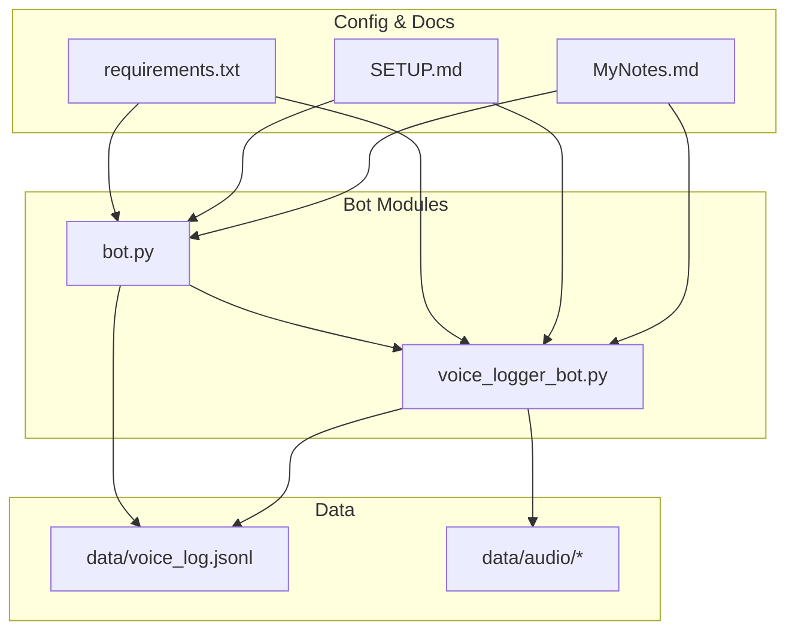
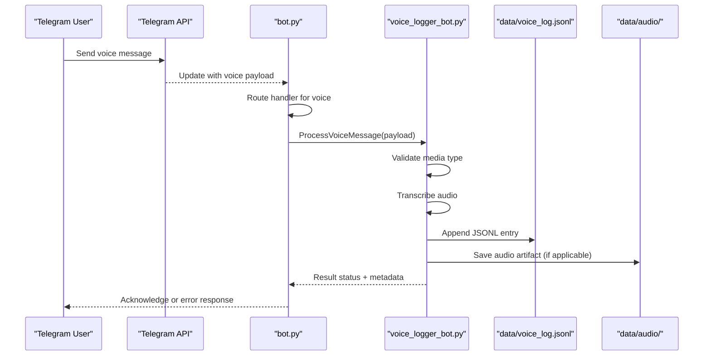
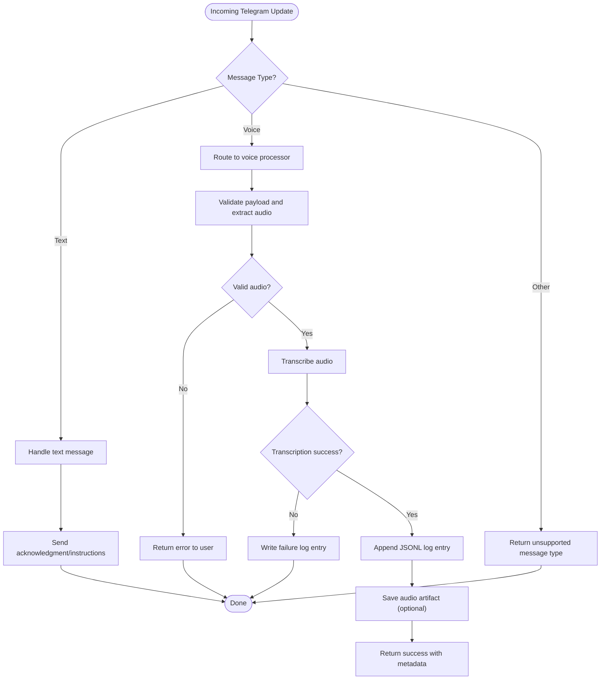
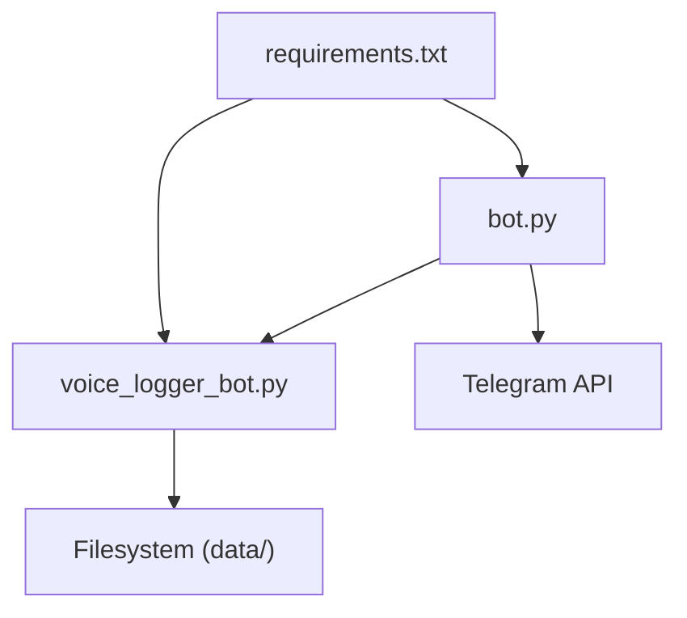

# Core Components

<cite>
**Referenced Files in This Document**
- [bot.py](file://bot.py)
- [voice_logger_bot.py](file://voice_logger_bot.py)
- [requirements.txt](file://requirements.txt)
- [SETUP.md](file://SETUP.md)
- [MyNotes.md](file://MyNotes.md)
- [data/voice_log.jsonl](file://data/voice_log.jsonl)
</cite>

## Table of Contents
1. [Introduction](#introduction)
2. [Project Structure](#project-structure)
3. [Core Components](#core-components)
4. [Architecture Overview](#architecture-overview)
5. [Detailed Component Analysis](#detailed-component-analysis)
6. [Dependency Analysis](#dependency-analysis)
7. [Performance Considerations](#performance-considerations)
8. [Troubleshooting Guide](#troubleshooting-guide)
9. [Conclusion](#conclusion)
10. [Appendices](#appendices)

## Introduction
This document explains the core components of the Telegram Voice Logger Bot, focusing on how the bot initializes and processes voice messages from Telegram, converts them to text, and stores logs and metadata. It covers the modular architecture that separates Telegram integration (bot.py) from audio processing logic (voice_logger_bot.py), details message handling flows, data models for voice messages and log entries, and provides guidance for error handling and conversation state management.

## Project Structure
The repository is organized around two primary Python modules:
- bot.py: Telegram API integration and message routing
- voice_logger_bot.py: Audio processing pipeline and logging utilities

Supporting files include configuration and setup documentation, dependency declarations, and sample notes. Data storage includes a JSONL log file and an audio directory for processed outputs.

**Diagram sources**
- [bot.py](file://bot.py)
- [voice_logger_bot.py](file://voice_logger_bot.py)
- [requirements.txt](file://requirements.txt)
- [SETUP.md](file://SETUP.md)
- [MyNotes.md](file://MyNotes.md)
- [data/voice_log.jsonl](file://data/voice_log.jsonl)

**Section sources**
- [bot.py](file://bot.py)
- [voice_logger_bot.py](file://voice_logger_bot.py)
- [requirements.txt](file://requirements.txt)
- [SETUP.md](file://SETUP.md)
- [MyNotes.md](file://MyNotes.md)
- [data/voice_log.jsonl](file://data/voice_log.jsonl)

## Core Components
- Telegram Integration Layer (bot.py): Initializes the bot, sets up handlers for incoming messages, routes voice messages to the processing module, and manages basic conversation state and user feedback.
- Audio Processing Layer (voice_logger_bot.py): Implements the voice-to-text pipeline, handles different media types, writes structured logs, and manages file metadata for stored audio and transcripts.

Key responsibilities:
- Message routing based on content type (text vs. voice)
- Error handling and fallback responses
- Logging to a JSONL file with consistent schema
- File I/O for audio assets and metadata

**Section sources**
- [bot.py](file://bot.py)
- [voice_logger_bot.py](file://voice_logger_bot.py)

## Architecture Overview
The system follows a clear separation of concerns:
- Telegram API events are received by bot.py, which dispatches to appropriate handlers.
- Voice messages are forwarded to voice_logger_bot.py for transcription and logging.
- Processed results are persisted to data/voice_log.jsonl and any generated audio artifacts are saved under data/audio/.

**Diagram sources**
- [bot.py](file://bot.py)
- [voice_logger_bot.py](file://voice_logger_bot.py)
- [data/voice_log.jsonl](file://data/voice_log.jsonl)

## Detailed Component Analysis

### Telegram Integration Layer (bot.py)
Responsibilities:
- Initialize the bot with credentials and polling/webhook settings
- Register message handlers for text and voice messages
- Extract relevant fields from Telegram updates (user info, chat id, timestamp)
- Forward voice payloads to the processing module
- Provide user feedback and handle errors gracefully

Message handling flow:
- Text messages: Respond with usage instructions or echo behavior
- Voice messages: Trigger transcription pipeline and return status
- Non-supported types: Inform users and suggest supported formats

Conversation state:
- Maintains minimal per-chat context if needed (e.g., pending operations)
- Uses simple flags or dictionaries keyed by chat_id

Error handling:
- Network timeouts and API rate limits
- Invalid payloads or unsupported media types
- Disk write failures for logs and audio files

**Section sources**
- [bot.py](file://bot.py)

### Audio Processing Layer (voice_logger_bot.py)
Responsibilities:
- Validate incoming media types and extract audio bytes or file paths
- Perform voice-to-text conversion using configured engines
- Generate structured log entries and persist them to JSONL
- Manage file metadata and save artifacts under data/audio/
- Expose functions for batch processing and testing

Processing logic:
- Input validation and sanitization
- Transcription via external service or local model
- Metadata extraction (duration, format, source chat, user id)
- Atomic writes to avoid partial logs

Data models:
- VoiceMessage: Represents a Telegram voice payload with identifiers and timestamps
- LogEntry: Structured record written to JSONL with fields like user_id, chat_id, timestamp, duration, transcript, status
- FileMetadata: Tracks file path, checksum, and generation time for audio artifacts

Error handling:
- Transcription failures with retry/backoff strategies
- Disk space checks before writing
- Graceful degradation when optional features are unavailable

**Section sources**
- [voice_logger_bot.py](file://voice_logger_bot.py)

### Message Handling Flow
End-to-end sequence from Telegram reception to storage:

**Diagram sources**
- [bot.py](file://bot.py)
- [voice_logger_bot.py](file://voice_logger_bot.py)

### Data Models
- VoiceMessage: Encapsulates Telegram voice update fields such as file_id, duration, mime_type, and associated user/chat identifiers.
- LogEntry: Immutable record containing user_id, chat_id, timestamp, duration, transcript, status, and optional artifact references.
- FileMetadata: Records file_path, size_bytes, checksum, created_at, and related log_entry_id.

These models ensure consistency across processing steps and enable reliable querying and auditing of logged voice interactions.

**Section sources**
- [voice_logger_bot.py](file://voice_logger_bot.py)
- [data/voice_log.jsonl](file://data/voice_log.jsonl)

### Code Examples and Usage Patterns
- Processing text messages: Demonstrate how bot.py responds to /help or echo commands.
- Processing voice messages: Show how bot.py forwards voice payloads to voice_logger_bot.py and handles success/failure responses.
- Error scenarios: Illustrate handling invalid payloads, transcription failures, and disk write errors.
- Conversation state: Example of maintaining per-chat context for multi-step interactions.

[No code snippets provided; refer to section sources for implementation details]

**Section sources**
- [bot.py](file://bot.py)
- [voice_logger_bot.py](file://voice_logger_bot.py)

## Dependency Analysis
External dependencies declared in requirements.txt drive the Telegram client library and audio processing tools. The modular design ensures that changes to one layer do not cascade into the other unless interfaces change.

**Diagram sources**
- [requirements.txt](file://requirements.txt)
- [bot.py](file://bot.py)
- [voice_logger_bot.py](file://voice_logger_bot.py)

**Section sources**
- [requirements.txt](file://requirements.txt)
- [bot.py](file://bot.py)
- [voice_logger_bot.py](file://voice_logger_bot.py)

## Performance Considerations
- Asynchronous processing: Use non-blocking calls for Telegram API and transcription services to improve throughput.
- Caching: Cache frequently used configurations and transcription models where possible.
- Batch logging: Buffer log entries and write atomically to reduce I/O overhead.
- Resource limits: Monitor memory usage during large audio processing and implement chunked reading if necessary.

[No sources needed since this section provides general guidance]

## Troubleshooting Guide
Common issues and resolutions:
- Authentication failures: Verify bot token and permissions in SETUP.md.
- Transcription errors: Check network connectivity and service availability; review error logs in data/voice_log.jsonl.
- Disk write failures: Ensure sufficient disk space and correct permissions for data/audio/ and data/voice_log.jsonl.
- Unsupported media types: Confirm that incoming messages match expected formats; add explicit handling for new types.

**Section sources**
- [SETUP.md](file://SETUP.md)
- [data/voice_log.jsonl](file://data/voice_log.jsonl)

## Conclusion
The Telegram Voice Logger Bot implements a clean separation between Telegram integration and audio processing, enabling maintainable and scalable functionality. By standardizing data models and robust error handling, it reliably captures voice interactions, transcribes audio, and persists structured logs. Future enhancements can focus on performance optimizations, additional media support, and richer conversation states.

[No sources needed since this section summarizes without analyzing specific files]

## Appendices
- Setup instructions and environment configuration are documented in SETUP.md.
- Additional notes and examples can be found in MyNotes.md.
- Dependencies are listed in requirements.txt.

**Section sources**
- [SETUP.md](file://SETUP.md)
- [MyNotes.md](file://MyNotes.md)
- [requirements.txt](file://requirements.txt)