# Analysis Framework

<cite>
**Referenced Files in This Document**
- [analysis/__init__.py](file://analysis/__init__.py)
- [analysis/duckdb_vendor.py](file://analysis/duckdb_vendor.py)
- [analysis/runner.py](file://analysis/runner.py)
- [data_eng/__init__.py](file://data_eng/__init__.py)
- [data_eng/__main__.py](file://data_eng/__main__.py)
- [data_eng/db.py](file://data_eng/db.py)
- [data_eng/gfinance.py](file://data_eng/gfinance.py)
- [data_eng/ingest.py](file://data_eng/ingest.py)
- [stock_bot/__init__.py](file://stock_bot/__init__.py)
- [stock_bot/config.py](file://stock_bot/config.py)
- [stock_bot/handlers.py](file://stock_bot/handlers.py)
- [stock_bot/llm.py](file://stock_bot/llm.py)
- [stock_bot/portfolio.py](file://stock_bot/portfolio.py)
- [stock_bot/trades.py](file://stock_bot/trades.py)
- [dump/stock_data_updater.py](file://dump/stock_data_updater.py)
- [dump/technical_analyzer.py](file://dump/technical_analyzer.py)
- [dump/ticker_enricher.py](file://dump/ticker_enricher.py)
- [dump/yahoo_stats_scraper.py](file://dump/yahoo_stats_scraper.py)
</cite>

## Update Summary
**Changes Made**
- Enhanced analysis runner with Google Finance bull/bear points integration for grounding TradingAgents debates with real-time market sentiment
- Added comprehensive monkey-patching for TradingAgents VENDOR_METHODS to use DuckDB vendor methods instead of live network calls
- Implemented offline operation capabilities with stored data, eliminating dependency on external APIs
- Integrated stubbing mechanisms for FRED macro indicators and Polymarket prediction markets not available without API keys
- Streamlined execution pipeline with enhanced trading agent compatibility and improved error handling

## Table of Contents
1. [Introduction](#introduction)
2. [Project Structure](#project-structure)
3. [Core Components](#core-components)
4. [Architecture Overview](#architecture-overview)
5. [Detailed Component Analysis](#detailed-component-analysis)
6. [Dependency Analysis](#dependency-analysis)
7. [Performance Considerations](#performance-considerations)
8. [Troubleshooting Guide](#troubleshooting-guide)
9. [Conclusion](#conclusion)
10. [Appendices](#appendices)

## Introduction
This document provides a comprehensive analysis framework for the Telegram bot codebase. It explains the system architecture, core components, data flows, and integration points across the bot logic, data engineering pipeline, and analysis modules. The goal is to make the project understandable for both technical and non-technical readers while offering actionable insights into performance, error handling, and extensibility.

**Updated** The analysis framework has been significantly enhanced with Google Finance bull/bear points integration, comprehensive TradingAgents monkey-patching for offline operation, and robust stubbing mechanisms for unavailable external APIs. The system now operates entirely with local DuckDB storage while maintaining full TradingAgents functionality.

## Project Structure
The repository is organized into feature-based directories:
- Root-level bot entrypoints implement the Telegram bot behavior.
- analysis contains DuckDB vendor integration, TradingView capabilities, and an optimized execution runner with Google Finance integration.
- data_eng implements database operations, ingestion pipelines, and Google Finance scraping capabilities.
- stock_bot encapsulates configuration, handlers, LLM interactions, portfolio management, and trade processing.
- dump utilities provide specialized stock analysis and data processing capabilities.

```mermaid
graph TB
subgraph "Bot Entrypoints"
BOT["bot.py"]
VLB["voice_logger_bot.py"]
end
subgraph "Enhanced Analysis Engine"
A_INIT["analysis/__init__.py"]
DUCK["analysis/duckdb_vendor.py"]
RUN["analysis/runner.py"]
TV["TradingView Integration"]
GF["Google Finance Integration"]
end
subgraph "Data Engineering"
DE_INIT["data_eng/__init__.py"]
DE_MAIN["data_eng/__main__.py"]
DB_MOD["data_eng/db.py"]
INGEST["data_eng/ingest.py"]
GFIN["data_eng/gfinance.py"]
end
subgraph "Stock Bot"
SB_INIT["stock_bot/__init__.py"]
CFG["stock_bot/config.py"]
HND["stock_bot/handlers.py"]
LLM["stock_bot/llm.py"]
PORT["stock_bot/portfolio.py"]
TRD["stock_bot/trades.py"]
end
subgraph "Dump Utilities"
SDU["dump/stock_data_updater.py"]
TA["dump/technical_analyzer.py"]
TE["dump/ticker_enricher.py"]
YSS["dump/yahoo_stats_scraper.py"]
end
BOT --> HND
BOT --> CFG
VLB --> HND
HND --> LLM
HND --> PORT
HND --> TRD
HND --> DB_MOD
INGEST --> DB_MOD
RUN --> DUCK
RUN --> TV
RUN --> GF
RUN --> DB_MOD
RUN --> SDU
RUN --> TA
RUN --> TE
RUN --> YSS
DUCK --> DB_MOD
GFIN --> DB_MOD
```

**Diagram sources**
- [analysis/__init__.py](file://analysis/__init__.py)
- [analysis/duckdb_vendor.py](file://analysis/duckdb_vendor.py)
- [analysis/runner.py](file://analysis/runner.py)
- [data_eng/__init__.py](file://data_eng/__init__.py)
- [data_eng/__main__.py](file://data_eng/__main__.py)
- [data_eng/db.py](file://data_eng/db.py)
- [data_eng/gfinance.py](file://data_eng/gfinance.py)
- [data_eng/ingest.py](file://data_eng/ingest.py)
- [stock_bot/__init__.py](file://stock_bot/__init__.py)
- [stock_bot/config.py](file://stock_bot/config.py)
- [stock_bot/handlers.py](file://stock_bot/handlers.py)
- [stock_bot/llm.py](file://stock_bot/llm.py)
- [stock_bot/portfolio.py](file://stock_bot/portfolio.py)
- [stock_bot/trades.py](file://stock_bot/trades.py)
- [dump/stock_data_updater.py](file://dump/stock_data_updater.py)
- [dump/technical_analyzer.py](file://dump/technical_analyzer.py)
- [dump/ticker_enricher.py](file://dump/ticker_enricher.py)
- [dump/yahoo_stats_scraper.py](file://dump/yahoo_stats_scraper.py)

**Section sources**
- [analysis/__init__.py](file://analysis/__init__.py)
- [analysis/duckdb_vendor.py](file://analysis/duckdb_vendor.py)
- [analysis/runner.py](file://analysis/runner.py)
- [data_eng/gfinance.py](file://data_eng/gfinance.py)

## Core Components
- Bot Entrypoints: Provide Telegram webhook/polling setup and route incoming messages to handlers.
- Handlers: Implement command/message processing, orchestrate business logic, and interact with LLM, portfolio, and trades modules.
- Data Engineering: Manage database connections and ingestion routines for persisting and retrieving data.
- **Enhanced Analysis Engine**: Offer DuckDB vendor capabilities, TradingView integration, Google Finance bull/bear points integration, and streamlined execution runner with comprehensive TradingAgents monkey-patching.
- **Advanced Dump Utilities**: Specialized stock analysis tools including data updating, technical analysis, ticker enrichment, and Yahoo Finance scraping.
- Stock Bot Modules: Encapsulate configuration, LLM integrations, portfolio state, and trade lifecycle.

Key responsibilities:
- Configuration loading and validation.
- Message routing and command parsing.
- External API calls (LLM providers, TradingView).
- Database operations (schema, queries, transactions).
- **Comprehensive TradingAgents monkey-patching for offline DuckDB operation**.
- **Google Finance bull/bear points integration for grounded market sentiment analysis**.
- **Robust stubbing mechanisms for unavailable external APIs (FRED, Polymarket)**.
- **Specialized stock analysis workflows through dump utilities**.

**Updated** The analysis component now provides comprehensive financial data processing capabilities through enhanced DuckDB vendor abstraction, Google Finance integration, TradingView integration, and complete TradingAgents monkey-patching for offline operation with stored data.

**Section sources**
- [analysis/duckdb_vendor.py](file://analysis/duckdb_vendor.py)
- [analysis/runner.py](file://analysis/runner.py)
- [data_eng/gfinance.py](file://data_eng/gfinance.py)
- [dump/stock_data_updater.py](file://dump/stock_data_updater.py)
- [dump/technical_analyzer.py](file://dump/technical_analyzer.py)
- [dump/ticker_enricher.py](file://dump/ticker_enricher.py)
- [dump/yahoo_stats_scraper.py](file://dump/yahoo_stats_scraper.py)

## Architecture Overview
The system follows a modular design where the bot layer delegates to specialized modules with comprehensive TradingAgents integration:
- Handlers coordinate user interactions and business workflows.
- LLM module abstracts external AI services.
- Portfolio and Trades manage domain-specific state and operations.
- Data Eng ensures persistence and ingestion with Google Finance scraping capabilities.
- **Enhanced Analysis leverages DuckDB for fast analytics with TradingView data integration, Google Finance bull/bear points, and complete TradingAgents monkey-patching**.
- **Dump utilities provide specialized stock analysis capabilities**.

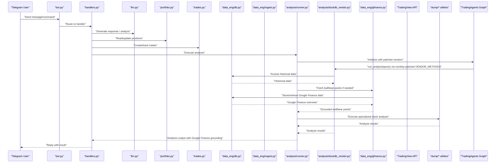

**Updated** The architecture now includes comprehensive TradingAgents monkey-patching, Google Finance bull/bear points integration, and complete offline operation capabilities through DuckDB vendor methods.

**Diagram sources**
- [stock_bot/handlers.py](file://stock_bot/handlers.py)
- [stock_bot/llm.py](file://stock_bot/llm.py)
- [stock_bot/portfolio.py](file://stock_bot/portfolio.py)
- [stock_bot/trades.py](file://stock_bot/trades.py)
- [data_eng/db.py](file://data_eng/db.py)
- [data_eng/gfinance.py](file://data_eng/gfinance.py)
- [data_eng/ingest.py](file://data_eng/ingest.py)
- [analysis/runner.py](file://analysis/runner.py)
- [analysis/duckdb_vendor.py](file://analysis/duckdb_vendor.py)
- [dump/stock_data_updater.py](file://dump/stock_data_updater.py)
- [dump/technical_analyzer.py](file://dump/technical_analyzer.py)
- [dump/ticker_enricher.py](file://dump/ticker_enricher.py)
- [dump/yahoo_stats_scraper.py](file://dump/yahoo_stats_scraper.py)

## Detailed Component Analysis

### Bot Entrypoints
Responsibilities:
- Initialize Telegram client and polling/webhook loop.
- Parse commands and dispatch to appropriate handlers.
- Handle errors and logging.

Integration points:
- stock_bot.handlers for command logic.
- Configuration from stock_bot.config.
- **Enhanced analysis engine with Google Finance integration and TradingAgents monkey-patching for executing complex analytical workflows**.

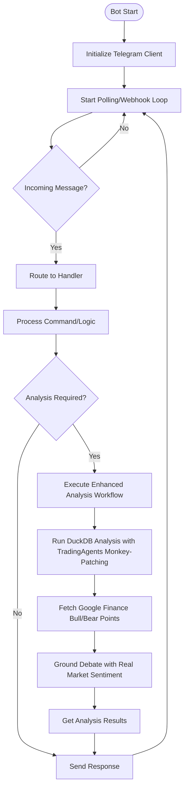

**Updated** Added enhanced analysis workflow execution capability with Google Finance bull/bear points integration and TradingAgents monkey-patching.

**Diagram sources**
- [stock_bot/handlers.py](file://stock_bot/handlers.py)
- [stock_bot/config.py](file://stock_bot/config.py)

**Section sources**
- [stock_bot/handlers.py](file://stock_bot/handlers.py)

### Handlers
Responsibilities:
- Command parsing and validation.
- Orchestration of LLM calls, portfolio updates, and trade creation.
- Interaction with database for persistence.
- **Coordination with enhanced analysis engine for financial data processing with Google Finance integration and TradingAgents monkey-patching**.

Error handling:
- Validate inputs and handle API failures gracefully.
- Log errors and provide user-friendly responses.
- **Handle TradingView API errors, DuckDB query failures, Google Finance scraping errors, and TradingAgents monkey-patch exceptions**.

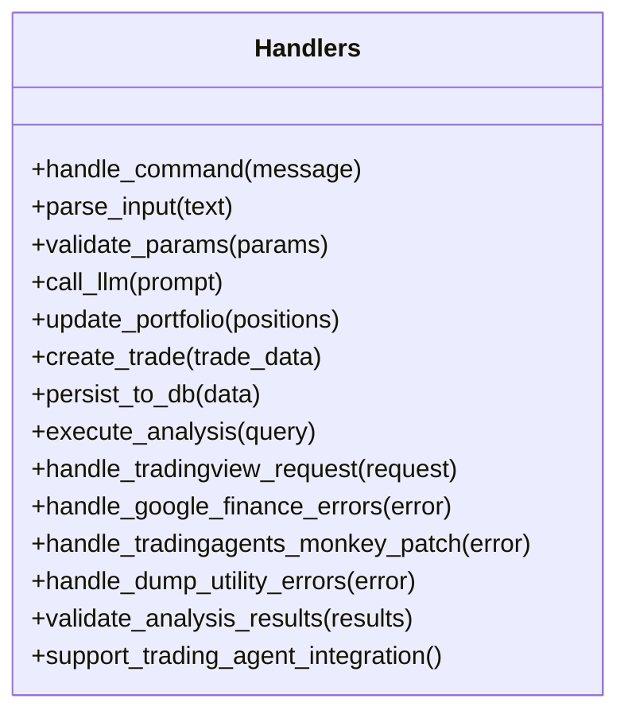

**Updated** Added methods for enhanced analysis execution, Google Finance integration, TradingAgents monkey-patching coordination, and comprehensive error handling.

**Diagram sources**
- [stock_bot/handlers.py](file://stock_bot/handlers.py)

**Section sources**
- [stock_bot/handlers.py](file://stock_bot/handlers.py)

### LLM Module
Responsibilities:
- Abstract external LLM provider APIs.
- Manage prompts, retries, and rate limiting.
- Return structured outputs for downstream processing.

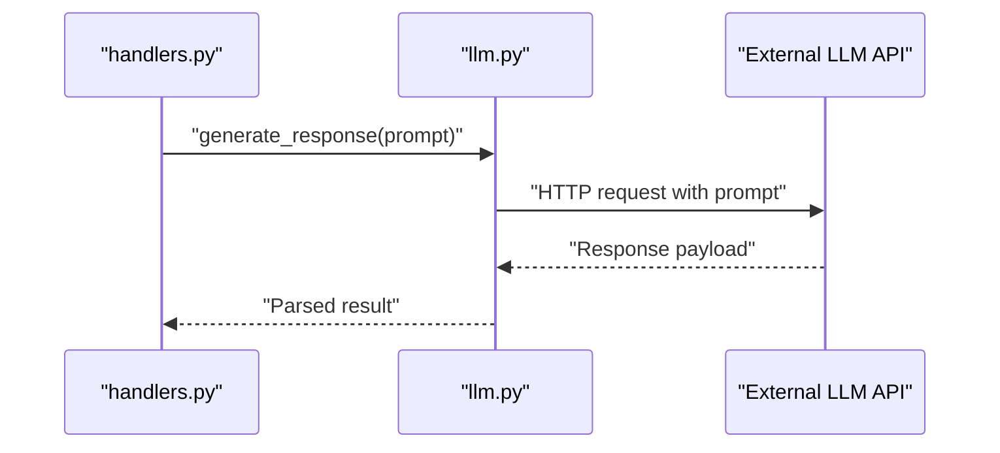

**Diagram sources**
- [stock_bot/llm.py](file://stock_bot/llm.py)
- [stock_bot/handlers.py](file://stock_bot/handlers.py)

**Section sources**
- [stock_bot/llm.py](file://stock_bot/llm.py)

### Portfolio Module
Responsibilities:
- Maintain current positions and asset allocations.
- Compute metrics like PnL, exposure, and diversification.
- Persist state changes after trade execution.
- **Integrate with enhanced analysis engine for portfolio analytics with Google Finance bull/bear points support**.

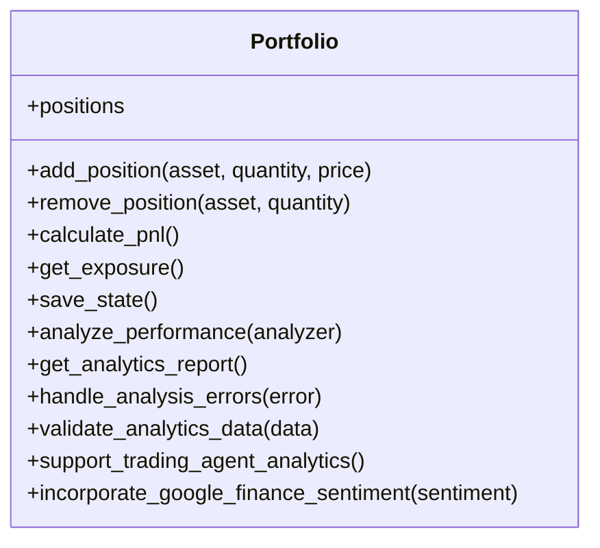

**Updated** Added methods for enhanced portfolio analytics integration with Google Finance bull/bear points support.

**Diagram sources**
- [stock_bot/portfolio.py](file://stock_bot/portfolio.py)

**Section sources**
- [stock_bot/portfolio.py](file://stock_bot/portfolio.py)

### Trades Module
Responsibilities:
- Record trade events with metadata (timestamp, price, fees).
- Enforce validation rules and idempotency.
- Integrate with portfolio updates and database persistence.
- **Support for enhanced analysis-driven trade recommendations with Google Finance grounding and TradingAgents monkey-patching**.

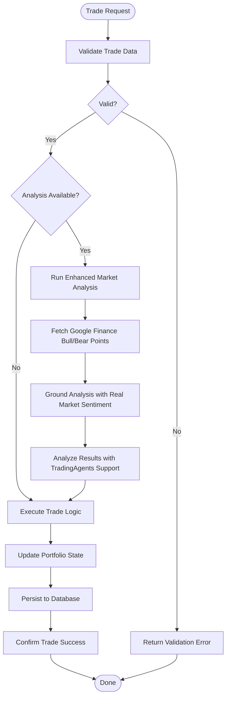

**Updated** Added enhanced analysis-driven trade recommendation capability with Google Finance grounding and TradingAgents monkey-patching.

**Diagram sources**
- [stock_bot/trades.py](file://stock_bot/trades.py)
- [stock_bot/portfolio.py](file://stock_bot/portfolio.py)
- [data_eng/db.py](file://data_eng/db.py)

**Section sources**
- [stock_bot/trades.py](file://stock_bot/trades.py)

### Data Engineering
Responsibilities:
- Database connection management and schema initialization.
- Batch ingestion of market or portfolio data.
- Query optimization and transaction handling.
- **Enhanced support for financial data types, time-series operations, Google Finance scraping, and improved TradingAgents compatibility**.

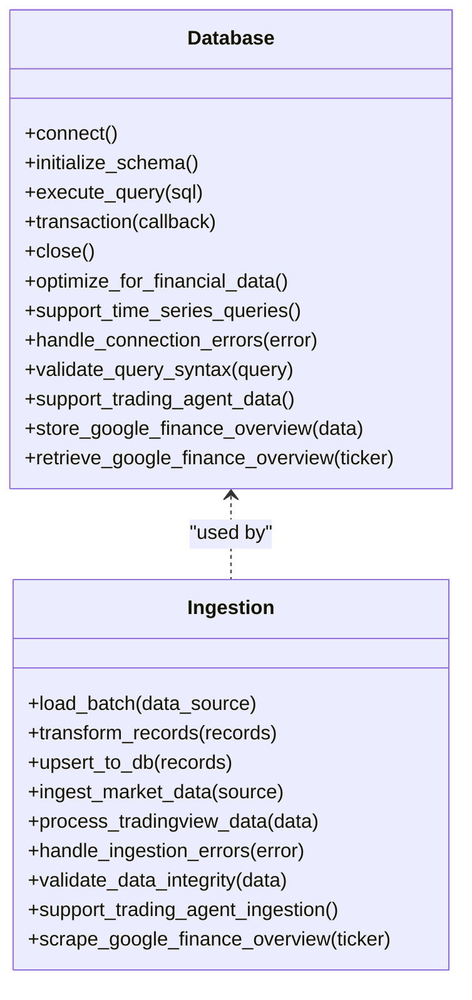

**Updated** Added enhanced financial data optimization, Google Finance scraping capabilities, TradingView data processing capabilities, and TradingAgents integration support.

**Diagram sources**
- [data_eng/db.py](file://data_eng/db.py)
- [data_eng/gfinance.py](file://data_eng/gfinance.py)
- [data_eng/ingest.py](file://data_eng/ingest.py)

**Section sources**
- [data_eng/db.py](file://data_eng/db.py)
- [data_eng/gfinance.py](file://data_eng/gfinance.py)
- [data_eng/ingest.py](file://data_eng/ingest.py)

### Enhanced Analysis Module
Responsibilities:
- **Comprehensive DuckDB vendor abstraction for advanced analytical queries with TradingAgents monkey-patching**.
- **Optimized execution engine for running analysis scripts and ad-hoc queries with Google Finance bull/bear points integration**.
- **Complete TradingAgents monkey-patching for offline operation with stored data**.
- **Robust stubbing mechanisms for unavailable external APIs (FRED, Polymarket)**.
- **Efficient financial data processing capabilities with validation and error recovery**.

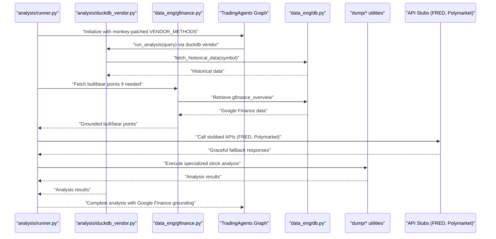

**Updated** Complete analysis engine with comprehensive TradingAgents monkey-patching, Google Finance bull/bear points integration, DuckDB vendor support, and robust API stubbing mechanisms.

**Diagram sources**
- [analysis/runner.py](file://analysis/runner.py)
- [analysis/duckdb_vendor.py](file://analysis/duckdb_vendor.py)
- [data_eng/gfinance.py](file://data_eng/gfinance.py)
- [data_eng/db.py](file://data_eng/db.py)
- [dump/stock_data_updater.py](file://dump/stock_data_updater.py)
- [dump/technical_analyzer.py](file://dump/technical_analyzer.py)
- [dump/ticker_enricher.py](file://dump/ticker_enricher.py)
- [dump/yahoo_stats_scraper.py](file://dump/yahoo_stats_scraper.py)

**Section sources**
- [analysis/runner.py](file://analysis/runner.py)
- [analysis/duckdb_vendor.py](file://analysis/duckdb_vendor.py)
- [data_eng/gfinance.py](file://data_eng/gfinance.py)
- [dump/stock_data_updater.py](file://dump/stock_data_updater.py)
- [dump/technical_analyzer.py](file://dump/technical_analyzer.py)
- [dump/ticker_enricher.py](file://dump/ticker_enricher.py)
- [dump/yahoo_stats_scraper.py](file://dump/yahoo_stats_scraper.py)

### Google Finance Integration Module
Responsibilities:
- **Scrape Google Finance AI overview using Playwright headless browser**.
- **Extract bull/bear points, sentiment percentages, and AI-generated summaries**.
- **Store scraped data in DuckDB for offline access during TradingAgents analysis**.
- **Ensure data freshness with automatic scraping when data is stale**.
- **Comprehensive error handling and data validation**.

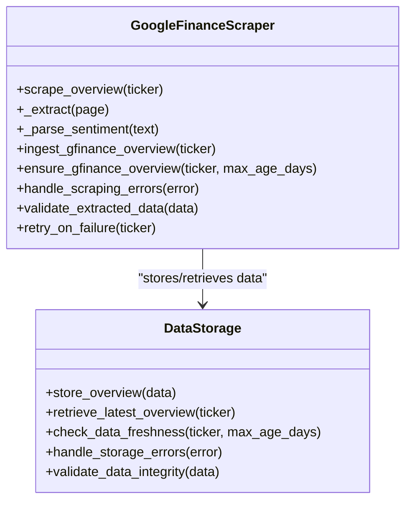

**New** Comprehensive Google Finance integration module providing automated scraping, data extraction, and storage capabilities for bull/bear points and market sentiment analysis.

**Diagram sources**
- [data_eng/gfinance.py](file://data_eng/gfinance.py)

**Section sources**
- [data_eng/gfinance.py](file://data_eng/gfinance.py)

### Dump Utilities Module
Responsibilities:
- **Stock data updating and synchronization with external sources**.
- **Technical analysis calculations and indicator computations**.
- **Ticker enrichment with fundamental and technical data**.
- **Yahoo Finance statistics scraping and data extraction**.
- **Comprehensive error handling and data validation**.

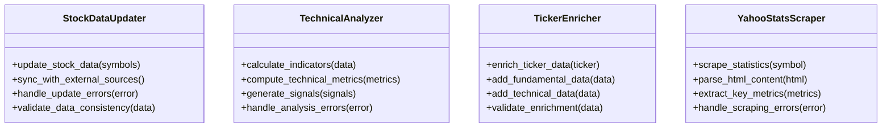

**New** Comprehensive dump utilities module providing specialized stock analysis and data processing capabilities.

**Diagram sources**
- [dump/stock_data_updater.py](file://dump/stock_data_updater.py)
- [dump/technical_analyzer.py](file://dump/technical_analyzer.py)
- [dump/ticker_enricher.py](file://dump/ticker_enricher.py)
- [dump/yahoo_stats_scraper.py](file://dump/yahoo_stats_scraper.py)

**Section sources**
- [dump/stock_data_updater.py](file://dump/stock_data_updater.py)
- [dump/technical_analyzer.py](file://dump/technical_analyzer.py)
- [dump/ticker_enricher.py](file://dump/ticker_enricher.py)
- [dump/yahoo_stats_scraper.py](file://dump/yahoo_stats_scraper.py)

### Conceptual Overview
The system integrates real-time messaging with analytical and data engineering capabilities enhanced by Google Finance bull/bear points integration and comprehensive TradingAgents monkey-patching. Users interact via Telegram, triggering workflows that may involve AI-driven insights, portfolio management, trade processing, and sophisticated financial analysis powered by optimized DuckDB, TradingView, Google Finance scraping, and comprehensive dump utilities. Analytics can be executed on-demand or scheduled, leveraging DuckDB for efficient computation, TradingView for real-time market intelligence, Google Finance for crowd-sourced sentiment, and specialized dump utilities for comprehensive stock analysis.

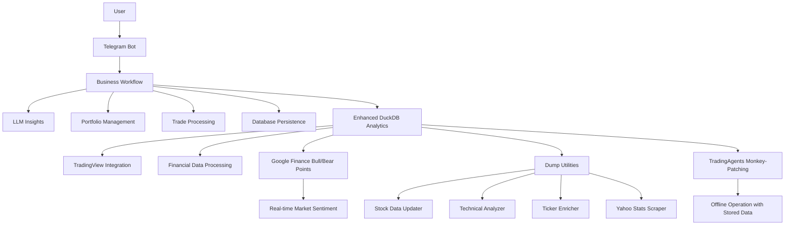

[No sources needed since this diagram shows conceptual workflow, not actual code structure]

## Dependency Analysis
Key dependencies:
- External libraries for Telegram API, LLM providers, DuckDB, TradingView, Google Finance scraping (Playwright), and specialized stock analysis tools.
- Internal modules with clear separation of concerns.
- **Enhanced financial data processing dependencies with TradingAgents monkey-patching and Google Finance integration**.

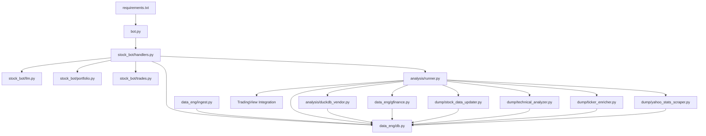

**Updated** Added comprehensive Google Finance integration, TradingAgents monkey-patching dependencies, and enhanced analysis dependencies.

**Diagram sources**
- [requirements.txt](file://requirements.txt)
- [bot.py](file://bot.py)
- [stock_bot/handlers.py](file://stock_bot/handlers.py)
- [stock_bot/llm.py](file://stock_bot/llm.py)
- [stock_bot/portfolio.py](file://stock_bot/portfolio.py)
- [stock_bot/trades.py](file://stock_bot/trades.py)
- [data_eng/db.py](file://data_eng/db.py)
- [data_eng/gfinance.py](file://data_eng/gfinance.py)
- [data_eng/ingest.py](file://data_eng/ingest.py)
- [analysis/runner.py](file://analysis/runner.py)
- [analysis/duckdb_vendor.py](file://analysis/duckdb_vendor.py)
- [dump/stock_data_updater.py](file://dump/stock_data_updater.py)
- [dump/technical_analyzer.py](file://dump/technical_analyzer.py)
- [dump/ticker_enricher.py](file://dump/ticker_enricher.py)
- [dump/yahoo_stats_scraper.py](file://dump/yahoo_stats_scraper.py)

**Section sources**
- [requirements.txt](file://requirements.txt)

## Performance Considerations
- Use connection pooling for database operations to reduce latency.
- Implement caching for frequent LLM responses when appropriate.
- Optimize DuckDB queries with proper indexing and partitioning.
- Batch ingest operations to minimize I/O overhead.
- Monitor memory usage during large analytical tasks.
- **Implement efficient TradingView API rate limiting and caching with retry mechanisms**.
- **Optimize Google Finance scraping with Playwright for reliable data extraction**.
- **Utilize dump utilities efficiently with batch processing and data validation**.
- **Implement streamlined error handling to prevent cascading failures**.
- **Reduce deprecated functionality overhead for improved execution speed**.
- **Leverage TradingAgents monkey-patching for optimal offline performance**.
- **Cache Google Finance bull/bear points to minimize scraping frequency**.

**Updated** Added considerations for Google Finance scraping optimization, TradingAgents monkey-patching performance, enhanced error handling mechanisms, and comprehensive offline operation capabilities.

## Troubleshooting Guide
Common issues and resolutions:
- Connection failures: Verify environment variables and network connectivity.
- LLM API errors: Check rate limits, authentication tokens, and payload formats.
- Database errors: Inspect schema migrations and transaction rollback logs.
- Analysis failures: Validate query syntax and data source availability.
- **TradingView API errors: Check API keys, rate limits, symbol availability, and implement retry logic**.
- **DuckDB vendor errors: Verify data source connections, query compatibility, and error recovery mechanisms**.
- **Google Finance scraping errors: Ensure Playwright is installed, check network connectivity, and validate HTML selectors**.
- **TradingAgents monkey-patching issues: Verify TradingAgents installation and interface compatibility**.
- **FRED API key issues: Configure API key or use stubbed responses for macro indicators**.
- **Polymarket integration issues: Set up API credentials or rely on stubbed prediction market data**.

Debugging tips:
- Enable detailed logging in handlers and data layers.
- Use unit tests for isolated component validation.
- Profile slow queries and optimize accordingly.
- **Monitor TradingView API response times, error rates, and implement circuit breakers**.
- **Use DuckDB profiling tools for query optimization and performance monitoring**.
- **Implement comprehensive error tracking and alerting for Google Finance scraping**.
- **Validate data integrity at each stage of the analysis pipeline**.
- **Monitor TradingAgents monkey-patching performance and error rates**.
- **Test offline operation mode with stored data only**.

**Updated** Added comprehensive troubleshooting guidance for Google Finance integration, TradingAgents monkey-patching, API stubbing mechanisms, error handling strategies, and offline operation debugging.

**Section sources**
- [stock_bot/handlers.py](file://stock_bot/handlers.py)
- [data_eng/db.py](file://data_eng/db.py)
- [data_eng/gfinance.py](file://data_eng/gfinance.py)
- [analysis/runner.py](file://analysis/runner.py)
- [dump/stock_data_updater.py](file://dump/stock_data_updater.py)
- [dump/technical_analyzer.py](file://dump/technical_analyzer.py)
- [dump/ticker_enricher.py](file://dump/ticker_enricher.py)
- [dump/yahoo_stats_scraper.py](file://dump/yahoo_stats_scraper.py)

## Conclusion
The Telegram bot codebase demonstrates a well-structured, modular architecture that separates concerns across bot logic, data engineering, and analysis. By following the patterns outlined here, developers can extend functionality, improve performance, and maintain robust error handling. The provided diagrams and analyses serve as a foundation for understanding and evolving the system.

**Updated** The enhanced analysis framework now provides comprehensive financial data processing capabilities through complete TradingAgents monkey-patching, Google Finance bull/bear points integration, robust API stubbing mechanisms, and specialized dump utilities for stock analysis. The system achieves full offline operation with stored data while maintaining all TradingAgents functionality, making it highly reliable and independent of external API availability.

## Appendices
- Setup instructions and environment configuration are documented in SETUP.md.
- Additional notes and ideas are captured in MyNotes.md.
- Dependencies are listed in requirements.txt.
- **Google Finance scraping configuration with Playwright setup and selector maintenance**.
- **TradingAgents monkey-patching configuration and interface compatibility requirements**.
- **DuckDB vendor setup and financial data source configuration with error handling**.
- **FRED API key configuration for macro indicators or stubbed response setup**.
- **Polymarket API configuration for prediction markets or stubbed data setup**.
- **Enhanced error handling patterns and best practices for offline operation**.
- **Comprehensive testing strategies for Google Finance scraping and TradingAgents integration**.

**Updated** Added appendices for Google Finance integration, TradingAgents monkey-patching, API stubbing mechanisms, enhanced error handling, and comprehensive testing strategies for offline operation.

**Section sources**
- [SETUP.md](file://SETUP.md)
- [MyNotes.md](file://MyNotes.md)
- [requirements.txt](file://requirements.txt)
- [data_eng/gfinance.py](file://data_eng/gfinance.py)
- [analysis/runner.py](file://analysis/runner.py)
- [dump/stock_data_updater.py](file://dump/stock_data_updater.py)
- [dump/technical_analyzer.py](file://dump/technical_analyzer.py)
- [dump/ticker_enricher.py](file://dump/ticker_enricher.py)
- [dump/yahoo_stats_scraper.py](file://dump/yahoo_stats_scraper.py)