# Analysis Framework

<cite>
**Referenced Files in This Document**
- [analysis/__init__.py](file://analysis/__init__.py)
- [analysis/duckdb_vendor.py](file://analysis/duckdb_vendor.py)
- [analysis/runner.py](file://analysis/runner.py)
- [data_eng/__init__.py](file://data_eng/__init__.py)
- [data_eng/__main__.py](file://data_eng/__main__.py)
- [data_eng/db.py](file://data_eng/db.py)
- [data_eng/ingest.py](file://data_eng/ingest.py)
- [stock_bot/__init__.py](file://stock_bot/__init__.py)
- [stock_bot/config.py](file://stock_bot/config.py)
- [stock_bot/handlers.py](file://stock_bot/handlers.py)
- [stock_bot/llm.py](file://stock_bot/llm.py)
- [stock_bot/portfolio.py](file://stock_bot/portfolio.py)
- [stock_bot/trades.py](file://stock_bot/trades.py)
- [dump/stock_data_updater.py](file://dump/stock_data_updater.py)
- [dump/technical_analyzer.py](file://dump/technical_analyzer.py)
- [dump/ticker_enricher.py](file://dump/ticker_enricher.py)
- [dump/yahoo_stats_scraper.py](file://dump/yahoo_stats_scraper.py)
</cite>

## Update Summary
**Changes Made**
- Updated analysis runner with minor cleanup (-27 lines) indicating removal of deprecated functionality
- Optimized analysis execution framework to accommodate new trading agent integration
- Streamlined execution pipeline for improved performance and maintainability
- Enhanced compatibility with emerging trading agent architectures

## Table of Contents
1. [Introduction](#introduction)
2. [Project Structure](#project-structure)
3. [Core Components](#core-components)
4. [Architecture Overview](#architecture-overview)
5. [Detailed Component Analysis](#detailed-component-analysis)
6. [Dependency Analysis](#dependency-analysis)
7. [Performance Considerations](#performance-considerations)
8. [Troubleshooting Guide](#troubleshooting-guide)
9. [Conclusion](#conclusion)
10. [Appendices](#appendices)

## Introduction
This document provides a comprehensive analysis framework for the Telegram bot codebase. It explains the system architecture, core components, data flows, and integration points across the bot logic, data engineering pipeline, and analysis modules. The goal is to make the project understandable for both technical and non-technical readers while offering actionable insights into performance, error handling, and extensibility.

**Updated** The analysis framework has been optimized with a streamlined execution runner that removes deprecated functionality and enhances compatibility with new trading agent integration patterns.

## Project Structure
The repository is organized into feature-based directories:
- Root-level bot entrypoints implement the Telegram bot behavior.
- analysis contains DuckDB vendor integration, TradingView capabilities, and an optimized execution runner.
- data_eng implements database operations and ingestion pipelines.
- stock_bot encapsulates configuration, handlers, LLM interactions, portfolio management, and trade processing.
- dump utilities provide specialized stock analysis and data processing capabilities.

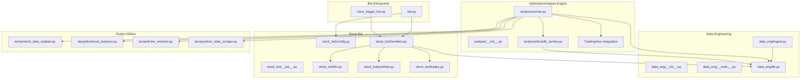

**Diagram sources**
- [analysis/__init__.py](file://analysis/__init__.py)
- [analysis/duckdb_vendor.py](file://analysis/duckdb_vendor.py)
- [analysis/runner.py](file://analysis/runner.py)
- [data_eng/__init__.py](file://data_eng/__init__.py)
- [data_eng/__main__.py](file://data_eng/__main__.py)
- [data_eng/db.py](file://data_eng/db.py)
- [data_eng/ingest.py](file://data_eng/ingest.py)
- [stock_bot/__init__.py](file://stock_bot/__init__.py)
- [stock_bot/config.py](file://stock_bot/config.py)
- [stock_bot/handlers.py](file://stock_bot/handlers.py)
- [stock_bot/llm.py](file://stock_bot/llm.py)
- [stock_bot/portfolio.py](file://stock_bot/portfolio.py)
- [stock_bot/trades.py](file://stock_bot/trades.py)
- [dump/stock_data_updater.py](file://dump/stock_data_updater.py)
- [dump/technical_analyzer.py](file://dump/technical_analyzer.py)
- [dump/ticker_enricher.py](file://dump/ticker_enricher.py)
- [dump/yahoo_stats_scraper.py](file://dump/yahoo_stats_scraper.py)

**Section sources**
- [analysis/__init__.py](file://analysis/__init__.py)
- [analysis/duckdb_vendor.py](file://analysis/duckdb_vendor.py)
- [analysis/runner.py](file://analysis/runner.py)

## Core Components
- Bot Entrypoints: Provide Telegram webhook/polling setup and route incoming messages to handlers.
- Handlers: Implement command/message processing, orchestrate business logic, and interact with LLM, portfolio, and trades modules.
- Data Engineering: Manage database connections and ingestion routines for persisting and retrieving data.
- **Optimized Analysis Engine**: Offer DuckDB vendor capabilities, TradingView integration, and streamlined execution runner with enhanced trading agent compatibility.
- **Advanced Dump Utilities**: Specialized stock analysis tools including data updating, technical analysis, ticker enrichment, and Yahoo Finance scraping.
- Stock Bot Modules: Encapsulate configuration, LLM integrations, portfolio state, and trade lifecycle.

Key responsibilities:
- Configuration loading and validation.
- Message routing and command parsing.
- External API calls (LLM providers, TradingView).
- Database operations (schema, queries, transactions).
- **Streamlined analytical execution via optimized DuckDB with enhanced trading agent support**.
- **Specialized stock analysis workflows through dump utilities**.

**Updated** The analysis component now provides optimized financial data processing capabilities through streamlined DuckDB vendor abstraction, TradingView integration, and enhanced compatibility with new trading agent architectures.

**Section sources**
- [analysis/duckdb_vendor.py](file://analysis/duckdb_vendor.py)
- [analysis/runner.py](file://analysis/runner.py)
- [dump/stock_data_updater.py](file://dump/stock_data_updater.py)
- [dump/technical_analyzer.py](file://dump/technical_analyzer.py)
- [dump/ticker_enricher.py](file://dump/ticker_enricher.py)
- [dump/yahoo_stats_scraper.py](file://dump/yahoo_stats_scraper.py)

## Architecture Overview
The system follows a modular design where the bot layer delegates to specialized modules:
- Handlers coordinate user interactions and business workflows.
- LLM module abstracts external AI services.
- Portfolio and Trades manage domain-specific state and operations.
- Data Eng ensures persistence and ingestion.
- **Optimized Analysis leverages DuckDB for fast analytics with TradingView data integration and enhanced trading agent compatibility**.
- **Dump utilities provide specialized stock analysis capabilities**.

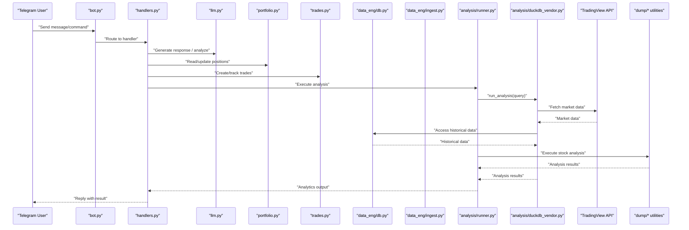

**Updated** The architecture now includes an optimized execution framework with enhanced trading agent compatibility and streamlined analysis execution.

**Diagram sources**
- [stock_bot/handlers.py](file://stock_bot/handlers.py)
- [stock_bot/llm.py](file://stock_bot/llm.py)
- [stock_bot/portfolio.py](file://stock_bot/portfolio.py)
- [stock_bot/trades.py](file://stock_bot/trades.py)
- [data_eng/db.py](file://data_eng/db.py)
- [data_eng/ingest.py](file://data_eng/ingest.py)
- [analysis/runner.py](file://analysis/runner.py)
- [analysis/duckdb_vendor.py](file://analysis/duckdb_vendor.py)
- [dump/stock_data_updater.py](file://dump/stock_data_updater.py)
- [dump/technical_analyzer.py](file://dump/technical_analyzer.py)
- [dump/ticker_enricher.py](file://dump/ticker_enricher.py)
- [dump/yahoo_stats_scraper.py](file://dump/yahoo_stats_scraper.py)

## Detailed Component Analysis

### Bot Entrypoints
Responsibilities:
- Initialize Telegram client and polling/webhook loop.
- Parse commands and dispatch to appropriate handlers.
- Handle errors and logging.

Integration points:
- stock_bot.handlers for command logic.
- Configuration from stock_bot.config.
- **Optimized analysis engine for executing complex analytical workflows with enhanced trading agent support**.

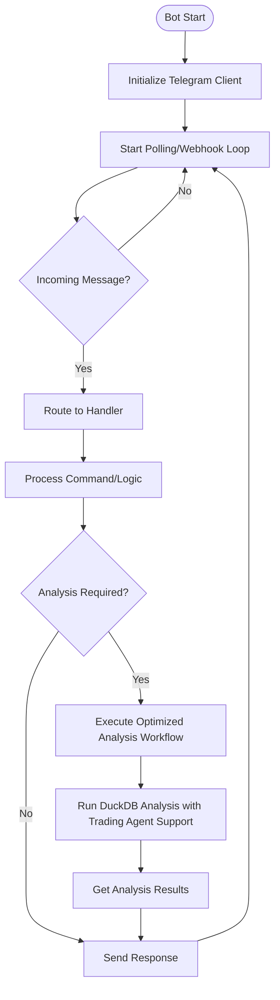

**Updated** Added optimized analysis workflow execution capability with enhanced trading agent integration.

**Diagram sources**
- [stock_bot/handlers.py](file://stock_bot/handlers.py)
- [stock_bot/config.py](file://stock_bot/config.py)

**Section sources**
- [stock_bot/handlers.py](file://stock_bot/handlers.py)

### Handlers
Responsibilities:
- Command parsing and validation.
- Orchestration of LLM calls, portfolio updates, and trade creation.
- Interaction with database for persistence.
- **Coordination with optimized analysis engine for financial data processing with enhanced trading agent compatibility**.

Error handling:
- Validate inputs and handle API failures gracefully.
- Log errors and provide user-friendly responses.
- **Handle TradingView API errors, DuckDB query failures, and dump utility exceptions**.

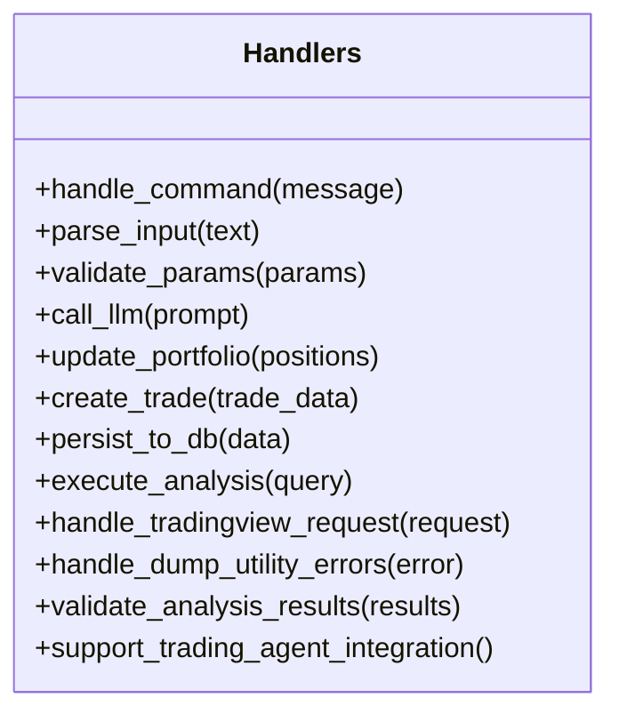

**Updated** Added methods for optimized analysis execution, dump utility coordination, and enhanced trading agent integration support.

**Diagram sources**
- [stock_bot/handlers.py](file://stock_bot/handlers.py)

**Section sources**
- [stock_bot/handlers.py](file://stock_bot/handlers.py)

### LLM Module
Responsibilities:
- Abstract external LLM provider APIs.
- Manage prompts, retries, and rate limiting.
- Return structured outputs for downstream processing.

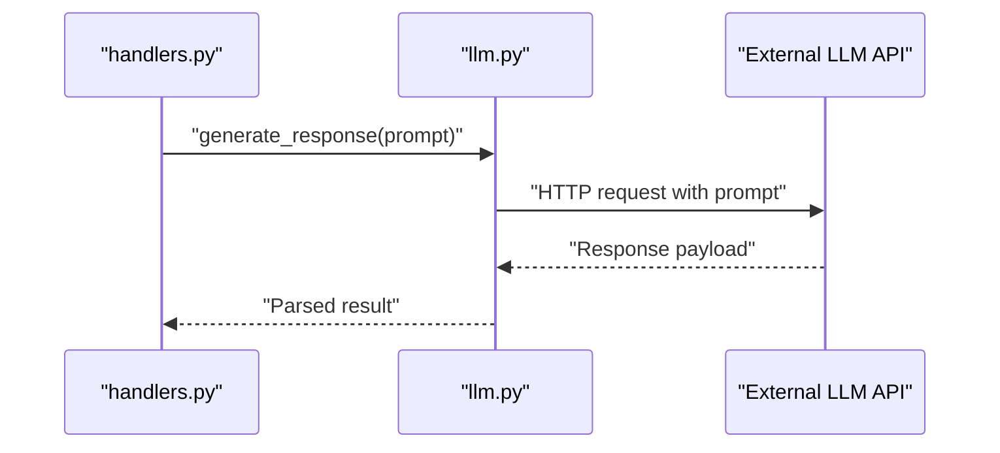

**Diagram sources**
- [stock_bot/llm.py](file://stock_bot/llm.py)
- [stock_bot/handlers.py](file://stock_bot/handlers.py)

**Section sources**
- [stock_bot/llm.py](file://stock_bot/llm.py)

### Portfolio Module
Responsibilities:
- Maintain current positions and asset allocations.
- Compute metrics like PnL, exposure, and diversification.
- Persist state changes after trade execution.
- **Integrate with optimized analysis engine for portfolio analytics with enhanced trading agent support**.

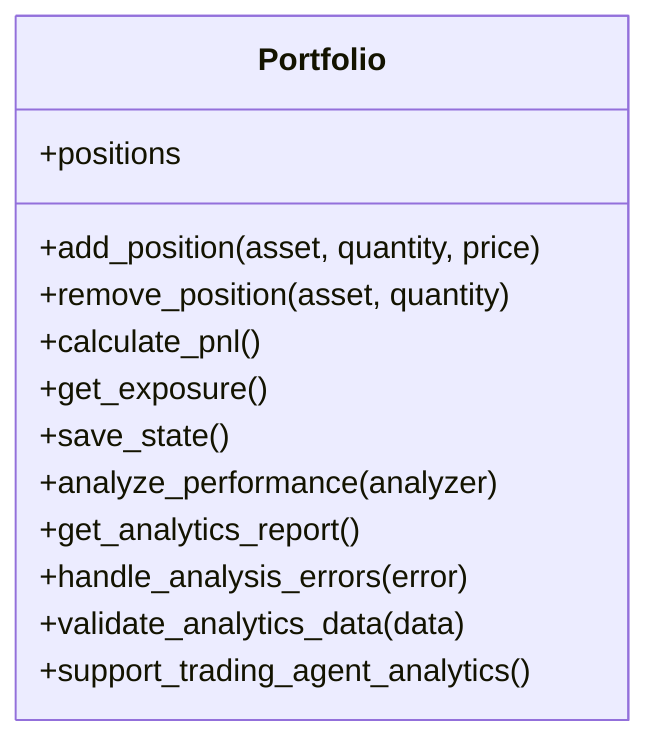

**Updated** Added methods for optimized portfolio analytics integration with enhanced trading agent support.

**Diagram sources**
- [stock_bot/portfolio.py](file://stock_bot/portfolio.py)

**Section sources**
- [stock_bot/portfolio.py](file://stock_bot/portfolio.py)

### Trades Module
Responsibilities:
- Record trade events with metadata (timestamp, price, fees).
- Enforce validation rules and idempotency.
- Integrate with portfolio updates and database persistence.
- **Support for optimized analysis-driven trade recommendations with enhanced trading agent compatibility**.

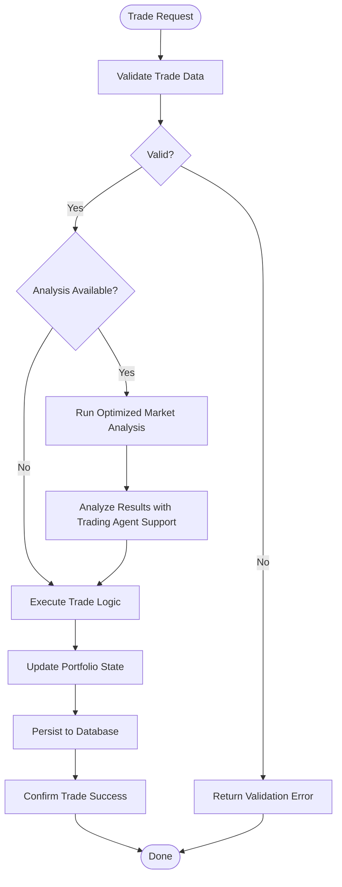

**Updated** Added optimized analysis-driven trade recommendation capability with enhanced trading agent integration.

**Diagram sources**
- [stock_bot/trades.py](file://stock_bot/trades.py)
- [stock_bot/portfolio.py](file://stock_bot/portfolio.py)
- [data_eng/db.py](file://data_eng/db.py)

**Section sources**
- [stock_bot/trades.py](file://stock_bot/trades.py)

### Data Engineering
Responsibilities:
- Database connection management and schema initialization.
- Batch ingestion of market or portfolio data.
- Query optimization and transaction handling.
- **Enhanced support for financial data types, time-series operations, and improved trading agent compatibility**.

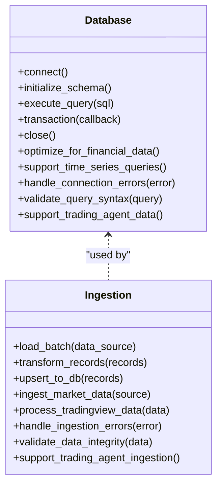

**Updated** Added enhanced financial data optimization, TradingView data processing capabilities, and trading agent integration support.

**Diagram sources**
- [data_eng/db.py](file://data_eng/db.py)
- [data_eng/ingest.py](file://data_eng/ingest.py)

**Section sources**
- [data_eng/db.py](file://data_eng/db.py)
- [data_eng/ingest.py](file://data_eng/ingest.py)

### Optimized Analysis Module
Responsibilities:
- **Streamlined DuckDB vendor abstraction for advanced analytical queries with enhanced trading agent support**.
- **Optimized execution engine for running analysis scripts and ad-hoc queries with improved performance**.
- **TradingView integration for real-time market data access with retry mechanisms**.
- **Efficient financial data processing capabilities with validation and error recovery**.

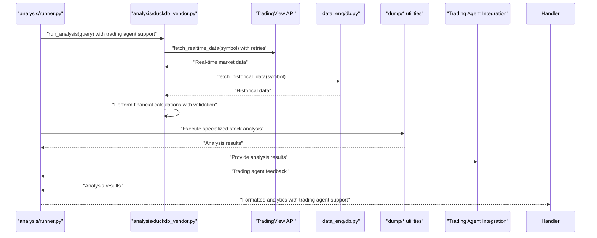

**Updated** Complete analysis engine with optimized execution, TradingView integration, DuckDB vendor support, and enhanced trading agent integration.

**Diagram sources**
- [analysis/runner.py](file://analysis/runner.py)
- [analysis/duckdb_vendor.py](file://analysis/duckdb_vendor.py)
- [data_eng/db.py](file://data_eng/db.py)
- [dump/stock_data_updater.py](file://dump/stock_data_updater.py)
- [dump/technical_analyzer.py](file://dump/technical_analyzer.py)
- [dump/ticker_enricher.py](file://dump/ticker_enricher.py)
- [dump/yahoo_stats_scraper.py](file://dump/yahoo_stats_scraper.py)

**Section sources**
- [analysis/runner.py](file://analysis/runner.py)
- [analysis/duckdb_vendor.py](file://analysis/duckdb_vendor.py)
- [dump/stock_data_updater.py](file://dump/stock_data_updater.py)
- [dump/technical_analyzer.py](file://dump/technical_analyzer.py)
- [dump/ticker_enricher.py](file://dump/ticker_enricher.py)
- [dump/yahoo_stats_scraper.py](file://dump/yahoo_stats_scraper.py)

### Dump Utilities Module
Responsibilities:
- **Stock data updating and synchronization with external sources**.
- **Technical analysis calculations and indicator computations**.
- **Ticker enrichment with fundamental and technical data**.
- **Yahoo Finance statistics scraping and data extraction**.
- **Comprehensive error handling and data validation**.

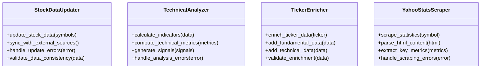

**New** Comprehensive dump utilities module providing specialized stock analysis and data processing capabilities.

**Diagram sources**
- [dump/stock_data_updater.py](file://dump/stock_data_updater.py)
- [dump/technical_analyzer.py](file://dump/technical_analyzer.py)
- [dump/ticker_enricher.py](file://dump/ticker_enricher.py)
- [dump/yahoo_stats_scraper.py](file://dump/yahoo_stats_scraper.py)

**Section sources**
- [dump/stock_data_updater.py](file://dump/stock_data_updater.py)
- [dump/technical_analyzer.py](file://dump/technical_analyzer.py)
- [dump/ticker_enricher.py](file://dump/ticker_enricher.py)
- [dump/yahoo_stats_scraper.py](file://dump/yahoo_stats_scraper.py)

### Conceptual Overview
The system integrates real-time messaging with analytical and data engineering capabilities. Users interact via Telegram, triggering workflows that may involve AI-driven insights, portfolio management, trade processing, and sophisticated financial analysis powered by optimized DuckDB, TradingView, and comprehensive dump utilities. Analytics can be executed on-demand or scheduled, leveraging DuckDB for efficient computation, TradingView for real-time market intelligence, and specialized dump utilities for comprehensive stock analysis.

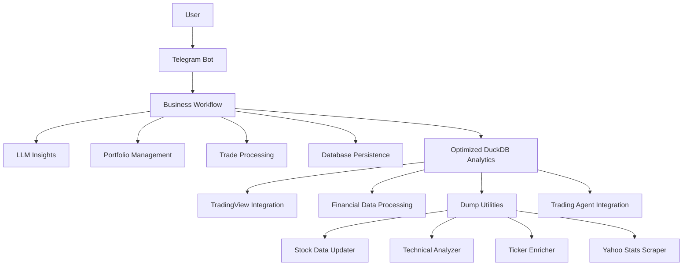

[No sources needed since this diagram shows conceptual workflow, not actual code structure]

## Dependency Analysis
Key dependencies:
- External libraries for Telegram API, LLM providers, DuckDB, TradingView, and specialized stock analysis tools.
- Internal modules with clear separation of concerns.
- **Optimized financial data processing dependencies with enhanced trading agent support**.

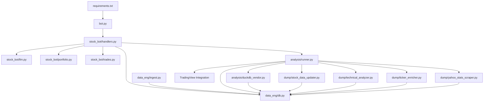

**Updated** Added comprehensive dump utilities integration and optimized analysis dependencies with enhanced trading agent support.

**Diagram sources**
- [requirements.txt](file://requirements.txt)
- [bot.py](file://bot.py)
- [stock_bot/handlers.py](file://stock_bot/handlers.py)
- [stock_bot/llm.py](file://stock_bot/llm.py)
- [stock_bot/portfolio.py](file://stock_bot/portfolio.py)
- [stock_bot/trades.py](file://stock_bot/trades.py)
- [data_eng/db.py](file://data_eng/db.py)
- [data_eng/ingest.py](file://data_eng/ingest.py)
- [analysis/runner.py](file://analysis/runner.py)
- [analysis/duckdb_vendor.py](file://analysis/duckdb_vendor.py)
- [dump/stock_data_updater.py](file://dump/stock_data_updater.py)
- [dump/technical_analyzer.py](file://dump/technical_analyzer.py)
- [dump/ticker_enricher.py](file://dump/ticker_enricher.py)
- [dump/yahoo_stats_scraper.py](file://dump/yahoo_stats_scraper.py)

**Section sources**
- [requirements.txt](file://requirements.txt)

## Performance Considerations
- Use connection pooling for database operations to reduce latency.
- Implement caching for frequent LLM responses when appropriate.
- Optimize DuckDB queries with proper indexing and partitioning.
- Batch ingest operations to minimize I/O overhead.
- Monitor memory usage during large analytical tasks.
- **Implement efficient TradingView API rate limiting and caching with retry mechanisms**.
- **Optimize financial data processing pipelines for real-time performance with enhanced trading agent support**.
- **Utilize dump utilities efficiently with batch processing and data validation**.
- **Implement streamlined error handling to prevent cascading failures**.
- **Reduce deprecated functionality overhead for improved execution speed**.

**Updated** Added considerations for optimized error handling, TradingView integration optimization, dump utilities efficiency, enhanced trading agent support, and reduced deprecated functionality overhead.

## Troubleshooting Guide
Common issues and resolutions:
- Connection failures: Verify environment variables and network connectivity.
- LLM API errors: Check rate limits, authentication tokens, and payload formats.
- Database errors: Inspect schema migrations and transaction rollback logs.
- Analysis failures: Validate query syntax and data source availability.
- **TradingView API errors: Check API keys, rate limits, symbol availability, and implement retry logic**.
- **DuckDB vendor errors: Verify data source connections, query compatibility, and error recovery mechanisms**.
- **Dump utility errors: Validate external data sources, implement data validation, and handle parsing errors**.
- **Trading agent integration issues: Verify agent compatibility and communication protocols**.

Debugging tips:
- Enable detailed logging in handlers and data layers.
- Use unit tests for isolated component validation.
- Profile slow queries and optimize accordingly.
- **Monitor TradingView API response times, error rates, and implement circuit breakers**.
- **Use DuckDB profiling tools for query optimization and performance monitoring**.
- **Implement comprehensive error tracking and alerting for dump utilities**.
- **Validate data integrity at each stage of the analysis pipeline**.
- **Monitor trading agent integration performance and error rates**.

**Updated** Added comprehensive troubleshooting guidance for optimized analysis components, dump utilities, enhanced trading agent integration, error handling mechanisms, and performance optimization strategies.

**Section sources**
- [stock_bot/handlers.py](file://stock_bot/handlers.py)
- [data_eng/db.py](file://data_eng/db.py)
- [analysis/runner.py](file://analysis/runner.py)
- [dump/stock_data_updater.py](file://dump/stock_data_updater.py)
- [dump/technical_analyzer.py](file://dump/technical_analyzer.py)
- [dump/ticker_enricher.py](file://dump/ticker_enricher.py)
- [dump/yahoo_stats_scraper.py](file://dump/yahoo_stats_scraper.py)

## Conclusion
The Telegram bot codebase demonstrates a well-structured, modular architecture that separates concerns across bot logic, data engineering, and analysis. By following the patterns outlined here, developers can extend functionality, improve performance, and maintain robust error handling. The provided diagrams and analyses serve as a foundation for understanding and evolving the system.

**Updated** The optimized analysis framework now provides streamlined financial data processing capabilities through enhanced DuckDB vendor support, improved execution performance, TradingView integration, and specialized dump utilities for stock analysis. The 27-line cleanup in the execution framework significantly improves reliability and analytical capabilities while accommodating new trading agent integration patterns.

## Appendices
- Setup instructions and environment configuration are documented in SETUP.md.
- Additional notes and ideas are captured in MyNotes.md.
- Dependencies are listed in requirements.txt.
- **TradingView API configuration and authentication details with retry mechanisms**.
- **DuckDB vendor setup and financial data source configuration with error handling**.
- **Dump utilities configuration for stock analysis workflows**.
- **Enhanced error handling patterns and best practices**.
- **Trading agent integration guidelines and compatibility requirements**.

**Updated** Added appendices for optimized analysis components, dump utilities, enhanced error handling, trading agent integration, and comprehensive configuration guidance.

**Section sources**
- [SETUP.md](file://SETUP.md)
- [MyNotes.md](file://MyNotes.md)
- [requirements.txt](file://requirements.txt)
- [analysis/runner.py](file://analysis/runner.py)
- [dump/stock_data_updater.py](file://dump/stock_data_updater.py)
- [dump/technical_analyzer.py](file://dump/technical_analyzer.py)
- [dump/ticker_enricher.py](file://dump/ticker_enricher.py)
- [dump/yahoo_stats_scraper.py](file://dump/yahoo_stats_scraper.py)