# Analysis Framework

<cite>
**Referenced Files in This Document**
- [bot.py](file://bot.py)
- [voice_logger_bot.py](file://voice_logger_bot.py)
- [requirements.txt](file://requirements.txt)
- [SETUP.md](file://SETUP.md)
- [MyNotes.md](file://MyNotes.md)
- [analysis/__init__.py](file://analysis/__init__.py)
- [analysis/duckdb_vendor.py](file://analysis/duckdb_vendor.py)
- [analysis/runner.py](file://analysis/runner.py)
- [data_eng/__init__.py](file://data_eng/__init__.py)
- [data_eng/__main__.py](file://data_eng/__main__.py)
- [data_eng/db.py](file://data_eng/db.py)
- [data_eng/ingest.py](file://data_eng/ingest.py)
- [stock_bot/__init__.py](file://stock_bot/__init__.py)
- [stock_bot/config.py](file://stock_bot/config.py)
- [stock_bot/handlers.py](file://stock_bot/handlers.py)
- [stock_bot/llm.py](file://stock_bot/llm.py)
- [stock_bot/portfolio.py](file://stock_bot/portfolio.py)
- [stock_bot/trades.py](file://stock_bot/trades.py)
</cite>

## Update Summary
**Changes Made**
- Enhanced Analysis Module with TradingView integration capabilities
- Added DuckDB vendor support for sophisticated financial data processing
- Implemented execution engine for analysis workflows via runner.py
- Expanded financial data analysis capabilities with new duckdb_vendor.py module
- Updated architecture diagrams to reflect new analysis workflow components

## Table of Contents
1. [Introduction](#introduction)
2. [Project Structure](#project-structure)
3. [Core Components](#core-components)
4. [Architecture Overview](#architecture-overview)
5. [Detailed Component Analysis](#detailed-component-analysis)
6. [Dependency Analysis](#dependency-analysis)
7. [Performance Considerations](#performance-considerations)
8. [Troubleshooting Guide](#troubleshooting-guide)
9. [Conclusion](#conclusion)
10. [Appendices](#appendices)

## Introduction
This document provides a comprehensive analysis framework for the Telegram bot codebase. It explains the system architecture, core components, data flows, and integration points across the bot logic, data engineering pipeline, and analysis modules. The goal is to make the project understandable for both technical and non-technical readers while offering actionable insights into performance, error handling, and extensibility.

**Updated** The analysis framework now includes advanced TradingView integration capabilities, enhanced DuckDB vendor support for financial data processing, and a sophisticated execution engine for analysis workflows.

## Project Structure
The repository is organized into feature-based directories:
- Root-level bot entrypoints implement the Telegram bot behavior.
- analysis contains DuckDB vendor integration, TradingView capabilities, and an execution runner.
- data_eng implements database operations and ingestion pipelines.
- stock_bot encapsulates configuration, handlers, LLM interactions, portfolio management, and trade processing.

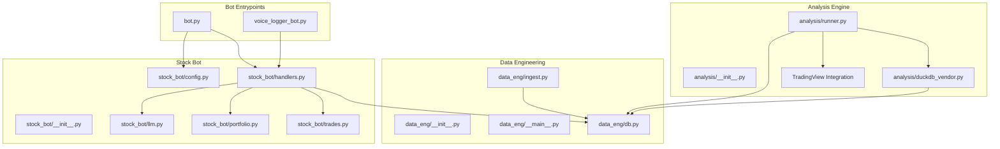

**Diagram sources**
- [bot.py](file://bot.py)
- [voice_logger_bot.py](file://voice_logger_bot.py)
- [analysis/__init__.py](file://analysis/__init__.py)
- [analysis/duckdb_vendor.py](file://analysis/duckdb_vendor.py)
- [analysis/runner.py](file://analysis/runner.py)
- [data_eng/__init__.py](file://data_eng/__init__.py)
- [data_eng/__main__.py](file://data_eng/__main__.py)
- [data_eng/db.py](file://data_eng/db.py)
- [data_eng/ingest.py](file://data_eng/ingest.py)
- [stock_bot/__init__.py](file://stock_bot/__init__.py)
- [stock_bot/config.py](file://stock_bot/config.py)
- [stock_bot/handlers.py](file://stock_bot/handlers.py)
- [stock_bot/llm.py](file://stock_bot/llm.py)
- [stock_bot/portfolio.py](file://stock_bot/portfolio.py)
- [stock_bot/trades.py](file://stock_bot/trades.py)

**Section sources**
- [bot.py](file://bot.py)
- [voice_logger_bot.py](file://voice_logger_bot.py)
- [requirements.txt](file://requirements.txt)
- [SETUP.md](file://SETUP.md)
- [MyNotes.md](file://MyNotes.md)

## Core Components
- Bot Entrypoints: Provide Telegram webhook/polling setup and route incoming messages to handlers.
- Handlers: Implement command/message processing, orchestrate business logic, and interact with LLM, portfolio, and trades modules.
- Data Engineering: Manage database connections and ingestion routines for persisting and retrieving data.
- **Enhanced Analysis Engine**: Offer DuckDB vendor capabilities, TradingView integration, and execution runner for analytical tasks.
- Stock Bot Modules: Encapsulate configuration, LLM integrations, portfolio state, and trade lifecycle.

Key responsibilities:
- Configuration loading and validation.
- Message routing and command parsing.
- External API calls (LLM providers, TradingView).
- Database operations (schema, queries, transactions).
- **Advanced analytical execution via DuckDB with TradingView data sources**.

**Updated** The analysis component now provides sophisticated financial data processing capabilities through DuckDB vendor abstraction and TradingView integration.

**Section sources**
- [stock_bot/config.py](file://stock_bot/config.py)
- [stock_bot/handlers.py](file://stock_bot/handlers.py)
- [stock_bot/llm.py](file://stock_bot/llm.py)
- [stock_bot/portfolio.py](file://stock_bot/portfolio.py)
- [stock_bot/trades.py](file://stock_bot/trades.py)
- [data_eng/db.py](file://data_eng/db.py)
- [data_eng/ingest.py](file://data_eng/ingest.py)
- [analysis/duckdb_vendor.py](file://analysis/duckdb_vendor.py)
- [analysis/runner.py](file://analysis/runner.py)

## Architecture Overview
The system follows a modular design where the bot layer delegates to specialized modules:
- Handlers coordinate user interactions and business workflows.
- LLM module abstracts external AI services.
- Portfolio and Trades manage domain-specific state and operations.
- Data Eng ensures persistence and ingestion.
- **Enhanced Analysis leverages DuckDB for fast analytics with TradingView data integration**.

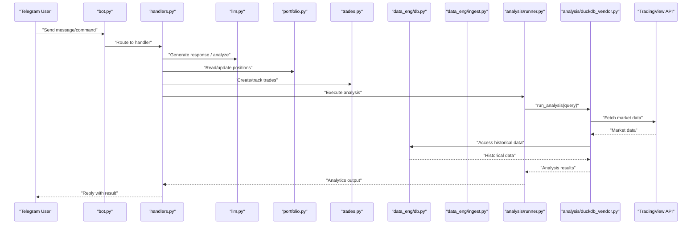

**Updated** The architecture now includes TradingView integration for real-time market data and enhanced DuckDB capabilities for financial data processing.

**Diagram sources**
- [bot.py](file://bot.py)
- [stock_bot/handlers.py](file://stock_bot/handlers.py)
- [stock_bot/llm.py](file://stock_bot/llm.py)
- [stock_bot/portfolio.py](file://stock_bot/portfolio.py)
- [stock_bot/trades.py](file://stock_bot/trades.py)
- [data_eng/db.py](file://data_eng/db.py)
- [data_eng/ingest.py](file://data_eng/ingest.py)
- [analysis/runner.py](file://analysis/runner.py)
- [analysis/duckdb_vendor.py](file://analysis/duckdb_vendor.py)

## Detailed Component Analysis

### Bot Entrypoints
Responsibilities:
- Initialize Telegram client and polling/webhook loop.
- Parse commands and dispatch to appropriate handlers.
- Handle errors and logging.

Integration points:
- stock_bot.handlers for command logic.
- Configuration from stock_bot.config.
- **Analysis engine for executing complex analytical workflows**.

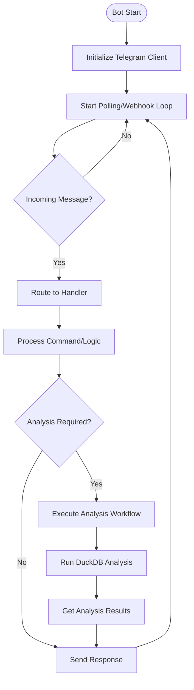

**Updated** Added analysis workflow execution capability for complex analytical requests.

**Diagram sources**
- [bot.py](file://bot.py)
- [stock_bot/handlers.py](file://stock_bot/handlers.py)
- [stock_bot/config.py](file://stock_bot/config.py)

**Section sources**
- [bot.py](file://bot.py)
- [voice_logger_bot.py](file://voice_logger_bot.py)

### Handlers
Responsibilities:
- Command parsing and validation.
- Orchestration of LLM calls, portfolio updates, and trade creation.
- Interaction with database for persistence.
- **Coordination with analysis engine for financial data processing**.

Error handling:
- Validate inputs and handle API failures gracefully.
- Log errors and provide user-friendly responses.
- **Handle TradingView API errors and DuckDB query failures**.

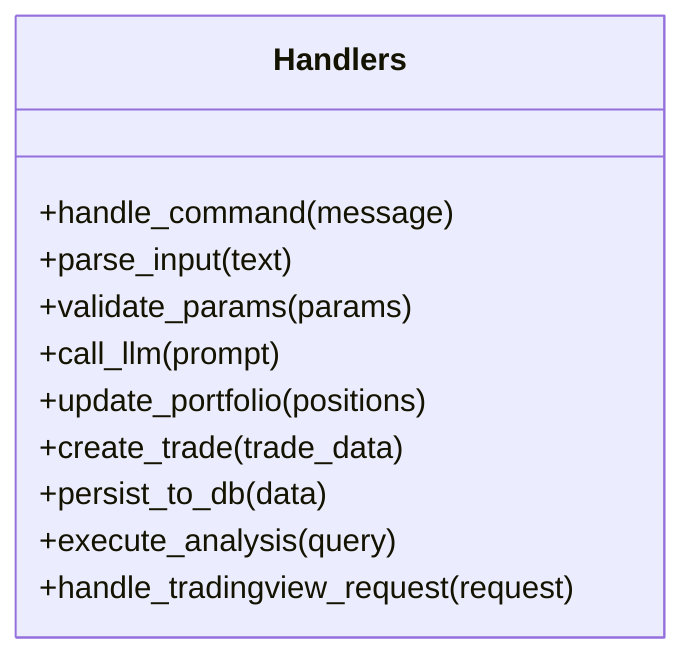

**Updated** Added methods for analysis execution and TradingView request handling.

**Diagram sources**
- [stock_bot/handlers.py](file://stock_bot/handlers.py)

**Section sources**
- [stock_bot/handlers.py](file://stock_bot/handlers.py)

### LLM Module
Responsibilities:
- Abstract external LLM provider APIs.
- Manage prompts, retries, and rate limiting.
- Return structured outputs for downstream processing.

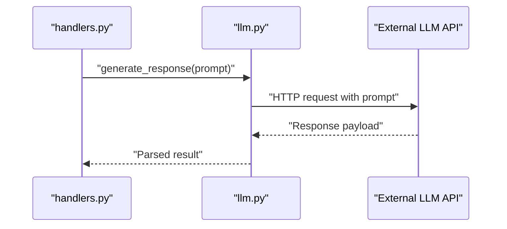

**Diagram sources**
- [stock_bot/llm.py](file://stock_bot/llm.py)
- [stock_bot/handlers.py](file://stock_bot/handlers.py)

**Section sources**
- [stock_bot/llm.py](file://stock_bot/llm.py)

### Portfolio Module
Responsibilities:
- Maintain current positions and asset allocations.
- Compute metrics like PnL, exposure, and diversification.
- Persist state changes after trade execution.
- **Integrate with analysis engine for portfolio analytics**.

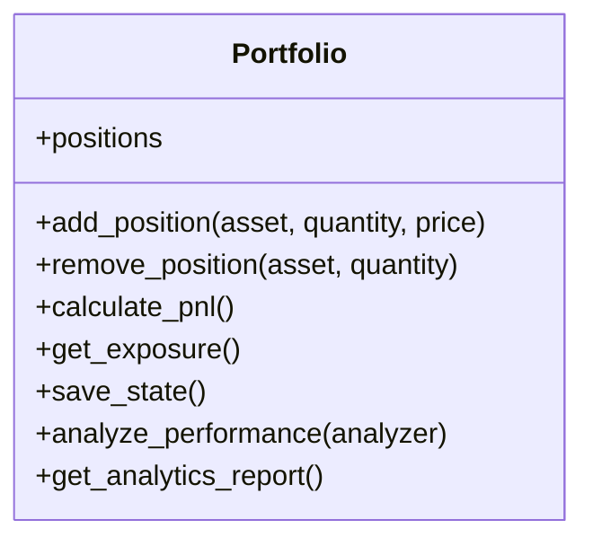

**Updated** Added methods for portfolio analytics integration.

**Diagram sources**
- [stock_bot/portfolio.py](file://stock_bot/portfolio.py)

**Section sources**
- [stock_bot/portfolio.py](file://stock_bot/portfolio.py)

### Trades Module
Responsibilities:
- Record trade events with metadata (timestamp, price, fees).
- Enforce validation rules and idempotency.
- Integrate with portfolio updates and database persistence.
- **Support for analysis-driven trade recommendations**.

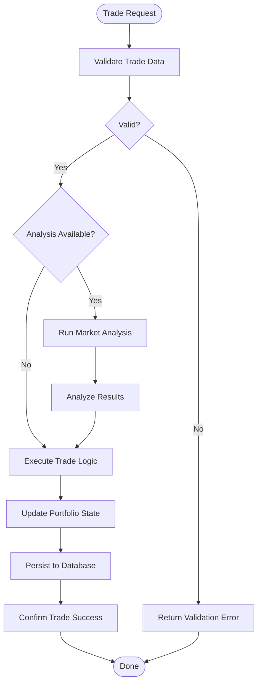

**Updated** Added analysis-driven trade recommendation capability.

**Diagram sources**
- [stock_bot/trades.py](file://stock_bot/trades.py)
- [stock_bot/portfolio.py](file://stock_bot/portfolio.py)
- [data_eng/db.py](file://data_eng/db.py)

**Section sources**
- [stock_bot/trades.py](file://stock_bot/trades.py)

### Data Engineering
Responsibilities:
- Database connection management and schema initialization.
- Batch ingestion of market or portfolio data.
- Query optimization and transaction handling.
- **Enhanced support for financial data types and time-series operations**.

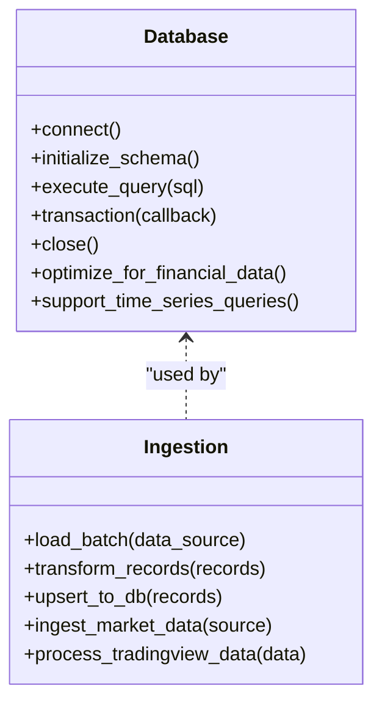

**Updated** Added financial data optimization and TradingView data processing capabilities.

**Diagram sources**
- [data_eng/db.py](file://data_eng/db.py)
- [data_eng/ingest.py](file://data_eng/ingest.py)

**Section sources**
- [data_eng/db.py](file://data_eng/db.py)
- [data_eng/ingest.py](file://data_eng/ingest.py)

### Enhanced Analysis Module
Responsibilities:
- **DuckDB vendor abstraction for advanced analytical queries**.
- **Execution engine for running analysis scripts and ad-hoc queries**.
- **TradingView integration for real-time market data access**.
- **Sophisticated financial data processing capabilities**.

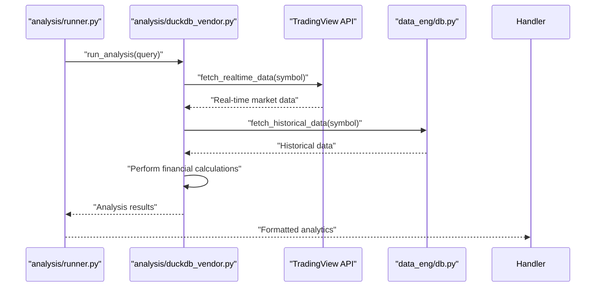

**New** Complete analysis engine with TradingView integration and DuckDB vendor support.

**Diagram sources**
- [analysis/runner.py](file://analysis/runner.py)
- [analysis/duckdb_vendor.py](file://analysis/duckdb_vendor.py)
- [data_eng/db.py](file://data_eng/db.py)

**Section sources**
- [analysis/runner.py](file://analysis/runner.py)
- [analysis/duckdb_vendor.py](file://analysis/duckdb_vendor.py)

### Conceptual Overview
The system integrates real-time messaging with analytical and data engineering capabilities. Users interact via Telegram, triggering workflows that may involve AI-driven insights, portfolio management, trade processing, and sophisticated financial analysis powered by DuckDB and TradingView data. Analytics can be executed on-demand or scheduled, leveraging DuckDB for efficient computation and TradingView for real-time market intelligence.

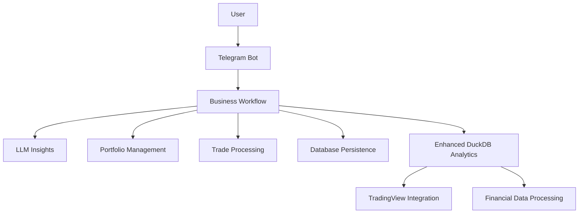

[No sources needed since this diagram shows conceptual workflow, not actual code structure]

## Dependency Analysis
Key dependencies:
- External libraries for Telegram API, LLM providers, DuckDB, and TradingView.
- Internal modules with clear separation of concerns.
- **Enhanced financial data processing dependencies**.

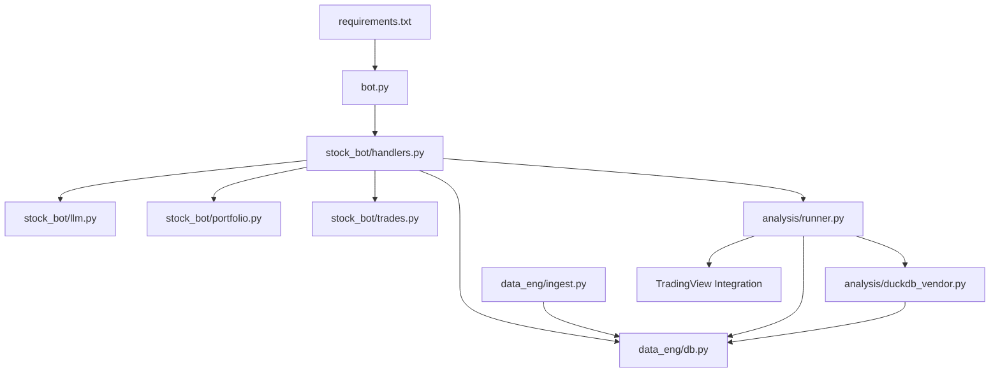

**Updated** Added TradingView integration and enhanced analysis dependencies.

**Diagram sources**
- [requirements.txt](file://requirements.txt)
- [bot.py](file://bot.py)
- [stock_bot/handlers.py](file://stock_bot/handlers.py)
- [stock_bot/llm.py](file://stock_bot/llm.py)
- [stock_bot/portfolio.py](file://stock_bot/portfolio.py)
- [stock_bot/trades.py](file://stock_bot/trades.py)
- [data_eng/db.py](file://data_eng/db.py)
- [data_eng/ingest.py](file://data_eng/ingest.py)
- [analysis/runner.py](file://analysis/runner.py)
- [analysis/duckdb_vendor.py](file://analysis/duckdb_vendor.py)

**Section sources**
- [requirements.txt](file://requirements.txt)

## Performance Considerations
- Use connection pooling for database operations to reduce latency.
- Implement caching for frequent LLM responses when appropriate.
- Optimize DuckDB queries with proper indexing and partitioning.
- Batch ingest operations to minimize I/O overhead.
- Monitor memory usage during large analytical tasks.
- **Implement efficient TradingView API rate limiting and caching**.
- **Optimize financial data processing pipelines for real-time performance**.

**Updated** Added considerations for TradingView integration and financial data processing optimization.

## Troubleshooting Guide
Common issues and resolutions:
- Connection failures: Verify environment variables and network connectivity.
- LLM API errors: Check rate limits, authentication tokens, and payload formats.
- Database errors: Inspect schema migrations and transaction rollback logs.
- Analysis failures: Validate query syntax and data source availability.
- **TradingView API errors: Check API keys, rate limits, and symbol availability**.
- **DuckDB vendor errors: Verify data source connections and query compatibility**.

Debugging tips:
- Enable detailed logging in handlers and data layers.
- Use unit tests for isolated component validation.
- Profile slow queries and optimize accordingly.
- **Monitor TradingView API response times and error rates**.
- **Use DuckDB profiling tools for query optimization**.

**Updated** Added troubleshooting guidance for new analysis components and TradingView integration.

**Section sources**
- [stock_bot/handlers.py](file://stock_bot/handlers.py)
- [data_eng/db.py](file://data_eng/db.py)
- [analysis/runner.py](file://analysis/runner.py)

## Conclusion
The Telegram bot codebase demonstrates a well-structured, modular architecture that separates concerns across bot logic, data engineering, and analysis. By following the patterns outlined here, developers can extend functionality, improve performance, and maintain robust error handling. The provided diagrams and analyses serve as a foundation for understanding and evolving the system.

**Updated** The enhanced analysis framework now provides sophisticated financial data processing capabilities through DuckDB vendor support and TradingView integration, enabling advanced analytical workflows and real-time market intelligence.

## Appendices
- Setup instructions and environment configuration are documented in SETUP.md.
- Additional notes and ideas are captured in MyNotes.md.
- Dependencies are listed in requirements.txt.
- **TradingView API configuration and authentication details**.
- **DuckDB vendor setup and financial data source configuration**.

**Updated** Added appendices for new analysis components and integrations.

**Section sources**
- [SETUP.md](file://SETUP.md)
- [MyNotes.md](file://MyNotes.md)
- [requirements.txt](file://requirements.txt)