# Analysis Framework

<cite>
**Referenced Files in This Document**
- [analysis/__init__.py](file://analysis/__init__.py)
- [analysis/duckdb_vendor.py](file://analysis/duckdb_vendor.py)
- [analysis/runner.py](file://analysis/runner.py)
- [data_eng/__init__.py](file://data_eng/__init__.py)
- [data_eng/__main__.py](file://data_eng/__main__.py)
- [data_eng/db.py](file://data_eng/db.py)
- [data_eng/gfinance.py](file://data_eng/gfinance.py)
- [data_eng/ingest.py](file://data_eng/ingest.py)
- [stock_bot/__init__.py](file://stock_bot/__init__.py)
- [stock_bot/config.py](file://stock_bot/config.py)
- [stock_bot/handlers.py](file://stock_bot/handlers.py)
- [stock_bot/llm.py](file://stock_bot/llm.py)
- [stock_bot/portfolio.py](file://stock_bot/portfolio.py)
- [stock_bot/trades.py](file://stock_bot/trades.py)
- [dump/stock_data_updater.py](file://dump/stock_data_updater.py)
- [dump/technical_analyzer.py](file://dump/technical_analyzer.py)
- [dump/ticker_enricher.py](file://dump/ticker_enricher.py)
- [dump/yahoo_stats_scraper.py](file://dump/yahoo_stats_scraper.py)
</cite>

## Update Summary
**Changes Made**
- **Major Architectural Change**: Completely rewrote `_create_grounded_researcher` as `_create_gfinance_evidence_node` in `analysis/runner.py`, eliminating LLM-based bull/bear research generation
- **Direct Database Integration**: Replaced LLM calls with direct DuckDB queries for Google Finance sentiment data, significantly reducing processing time and eliminating local model tool call failures
- **Enhanced Performance**: New implementation saves approximately two long generations per analysis by bypassing LLM calls entirely for bull/bear points
- **Improved Reliability**: Eliminates dependency on local LLM models for market sentiment data, using pre-scraped Google Finance data instead

## Table of Contents
1. [Introduction](#introduction)
2. [Project Structure](#project-structure)
3. [Core Components](#core-components)
4. [Architecture Overview](#architecture-overview)
5. [Detailed Component Analysis](#detailed-component-analysis)
6. [Dependency Analysis](#dependency-analysis)
7. [Performance Considerations](#performance-considerations)
8. [Troubleshooting Guide](#troubleshooting-guide)
9. [Conclusion](#conclusion)
10. [Appendices](#appendices)

## Introduction
This document provides a comprehensive analysis framework for the Telegram bot codebase. It explains the system architecture, core components, data flows, and integration points across the bot logic, data engineering pipeline, and analysis modules. The goal is to make the project understandable for both technical and non-technical readers while offering actionable insights into performance, error handling, and extensibility.

**Updated** The analysis framework has undergone a significant architectural transformation with the introduction of direct Google Finance data integration. The new `_create_gfinance_evidence_node` function eliminates LLM-based bull/bear research generation in favor of efficient database queries, dramatically improving performance and reliability while maintaining the same analytical output format.

## Project Structure
The repository is organized into feature-based directories:
- Root-level bot entrypoints implement the Telegram bot behavior.
- analysis contains DuckDB vendor integration, TradingView capabilities, and an optimized execution runner with Google Finance integration and enhanced LLM response handling.
- data_eng implements database operations, ingestion pipelines, and Google Finance scraping capabilities.
- stock_bot encapsulates configuration, handlers, LLM interactions, portfolio management, and trade processing.
- dump utilities provide specialized stock analysis and data processing capabilities.

```mermaid
graph TB
subgraph "Bot Entrypoints"
BOT["bot.py"]
VLB["voice_logger_bot.py"]
end
subgraph "Enhanced Analysis Engine"
A_INIT["analysis/__init__.py"]
DUCK["analysis/duckdb_vendor.py"]
RUN["analysis/runner.py"]
TV["TradingView Integration"]
GF["Google Finance Integration"]
LLM_ENH["Enhanced LLM Response Handling"]
GFIN_NODE["_create_gfinance_evidence_node"]
end
subgraph "Data Engineering"
DE_INIT["data_eng/__init__.py"]
DE_MAIN["data_eng/__main__.py"]
DB_MOD["data_eng/db.py"]
INGEST["data_eng/ingest.py"]
GFIN["data_eng/gfinance.py"]
end
subgraph "Stock Bot"
SB_INIT["stock_bot/__init__.py"]
CFG["stock_bot/config.py"]
HND["stock_bot/handlers.py"]
LLM["stock_bot/llm.py"]
PORT["stock_bot/portfolio.py"]
TRD["stock_bot/trades.py"]
end
subgraph "Dump Utilities"
SDU["dump/stock_data_updater.py"]
TA["dump/technical_analyzer.py"]
TE["dump/ticker_enricher.py"]
YSS["dump/yahoo_stats_scraper.py"]
end
BOT --> HND
BOT --> CFG
VLB --> HND
HND --> LLM
HND --> PORT
HND --> TRD
HND --> DB_MOD
INGEST --> DB_MOD
RUN --> DUCK
RUN --> TV
RUN --> GF
RUN --> GFIN_NODE
RUN --> DB_MOD
RUN --> SDU
RUN --> TA
RUN --> TE
RUN --> YSS
RUN --> LLM_ENH
DUCK --> DB_MOD
GFIN --> DB_MOD
GFIN_NODE --> DB_MOD
```

**Diagram sources**
- [analysis/__init__.py](file://analysis/__init__.py)
- [analysis/duckdb_vendor.py](file://analysis/duckdb_vendor.py)
- [analysis/runner.py](file://analysis/runner.py)
- [data_eng/__init__.py](file://data_eng/__init__.py)
- [data_eng/__main__.py](file://data_eng/__main__.py)
- [data_eng/db.py](file://data_eng/db.py)
- [data_eng/gfinance.py](file://data_eng/gfinance.py)
- [data_eng/ingest.py](file://data_eng/ingest.py)
- [stock_bot/__init__.py](file://stock_bot/__init__.py)
- [stock_bot/config.py](file://stock_bot/config.py)
- [stock_bot/handlers.py](file://stock_bot/handlers.py)
- [stock_bot/llm.py](file://stock_bot/llm.py)
- [stock_bot/portfolio.py](file://stock_bot/portfolio.py)
- [stock_bot/trades.py](file://stock_bot/trades.py)
- [dump/stock_data_updater.py](file://dump/stock_data_updater.py)
- [dump/technical_analyzer.py](file://dump/technical_analyzer.py)
- [dump/ticker_enricher.py](file://dump/ticker_enricher.py)
- [dump/yahoo_stats_scraper.py](file://dump/yahoo_stats_scraper.py)

**Section sources**
- [analysis/__init__.py](file://analysis/__init__.py)
- [analysis/duckdb_vendor.py](file://analysis/duckdb_vendor.py)
- [analysis/runner.py](file://analysis/runner.py)
- [data_eng/gfinance.py](file://data_eng/gfinance.py)

## Core Components
- Bot Entrypoints: Provide Telegram webhook/polling setup and route incoming messages to handlers.
- Handlers: Implement command/message processing, orchestrate business logic, and interact with LLM, portfolio, and trades modules.
- Data Engineering: Manage database connections and ingestion routines for persisting and retrieving data.
- **Enhanced Analysis Engine**: Offer DuckDB vendor capabilities, TradingView integration, Google Finance bull/bear points integration, streamlined execution runner with comprehensive TradingAgents monkey-patching, sophisticated LLM response handling with degenerate-answer detection, and direct database-driven sentiment analysis.
- **Advanced Dump Utilities**: Specialized stock analysis tools including data updating, technical analysis, ticker enrichment, and Yahoo Finance scraping.
- Stock Bot Modules: Encapsulate configuration, LLM integrations, portfolio state, and trade lifecycle.

Key responsibilities:
- Configuration loading and validation.
- Message routing and command parsing.
- External API calls (LLM providers, TradingView).
- Database operations (schema, queries, transactions).
- **Comprehensive TradingAgents monkey-patching for offline DuckDB operation**.
- **Direct Google Finance bull/bear points integration via database queries**.
- **Robust stubbing mechanisms for unavailable external APIs (FRED, Polymarket)**.
- **Sophisticated LLM response validation and retry mechanisms for local models**.
- **Specialized stock analysis workflows through dump utilities**.

**Updated** The analysis component now provides comprehensive financial data processing capabilities through enhanced DuckDB vendor abstraction, Google Finance integration, TradingView integration, complete TradingAgents monkey-patching for offline operation, advanced LLM response handling with degenerate-answer detection, and direct database-driven sentiment analysis that eliminates LLM dependencies for market sentiment data.

**Section sources**
- [analysis/duckdb_vendor.py](file://analysis/duckdb_vendor.py)
- [analysis/runner.py](file://analysis/runner.py)
- [data_eng/gfinance.py](file://data_eng/gfinance.py)
- [dump/stock_data_updater.py](file://dump/stock_data_updater.py)
- [dump/technical_analyzer.py](file://dump/technical_analyzer.py)
- [dump/ticker_enricher.py](file://dump/ticker_enricher.py)
- [dump/yahoo_stats_scraper.py](file://dump/yahoo_stats_scraper.py)

## Architecture Overview
The system follows a modular design where the bot layer delegates to specialized modules with comprehensive TradingAgents integration and enhanced LLM response handling:
- Handlers coordinate user interactions and business workflows.
- LLM module abstracts external AI services with improved error handling.
- Portfolio and Trades manage domain-specific state and operations.
- Data Eng ensures persistence and ingestion with Google Finance scraping capabilities.
- **Enhanced Analysis leverages DuckDB for fast analytics with TradingView data integration, direct Google Finance bull/bear points via database queries, complete TradingAgents monkey-patching, and sophisticated LLM response validation**.
- **Dump utilities provide specialized stock analysis capabilities**.

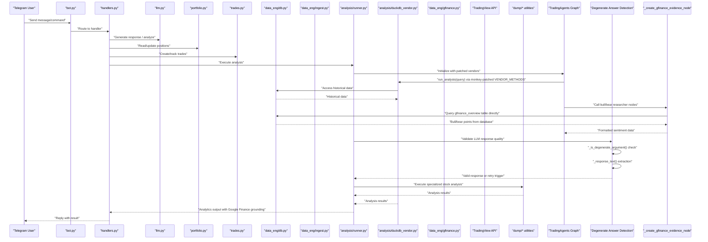

**Updated** The architecture now includes comprehensive TradingAgents monkey-patching, direct Google Finance bull/bear points integration via database queries (eliminating LLM calls), complete offline operation capabilities through DuckDB vendor methods, and sophisticated LLM response validation with automatic retry mechanisms.

**Diagram sources**
- [stock_bot/handlers.py](file://stock_bot/handlers.py)
- [stock_bot/llm.py](file://stock_bot/llm.py)
- [stock_bot/portfolio.py](file://stock_bot/portfolio.py)
- [stock_bot/trades.py](file://stock_bot/trades.py)
- [data_eng/db.py](file://data_eng/db.py)
- [data_eng/gfinance.py](file://data_eng/gfinance.py)
- [data_eng/ingest.py](file://data_eng/ingest.py)
- [analysis/runner.py](file://analysis/runner.py)
- [analysis/duckdb_vendor.py](file://analysis/duckdb_vendor.py)
- [dump/stock_data_updater.py](file://dump/stock_data_updater.py)
- [dump/technical_analyzer.py](file://dump/technical_analyzer.py)
- [dump/ticker_enricher.py](file://dump/ticker_enricher.py)
- [dump/yahoo_stats_scraper.py](file://dump/yahoo_stats_scraper.py)

## Detailed Component Analysis

### Bot Entrypoints
Responsibilities:
- Initialize Telegram client and polling/webhook loop.
- Parse commands and dispatch to appropriate handlers.
- Handle errors and logging.

Integration points:
- stock_bot.handlers for command logic.
- Configuration from stock_bot.config.
- **Enhanced analysis engine with Google Finance integration, TradingAgents monkey-patching, sophisticated LLM response handling, and direct database-driven sentiment analysis for executing complex analytical workflows**.

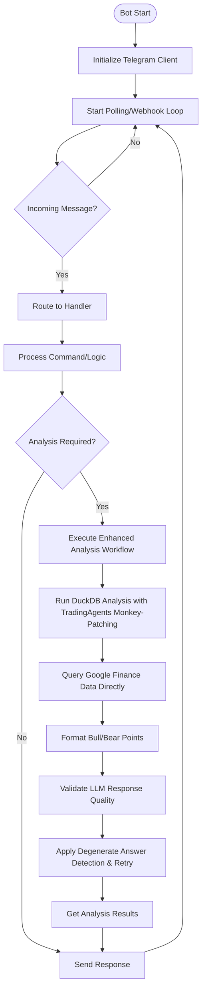

**Updated** Added enhanced analysis workflow execution capability with direct Google Finance database queries, TradingAgents monkey-patching, and sophisticated LLM response validation with automatic retry mechanisms.

**Diagram sources**
- [stock_bot/handlers.py](file://stock_bot/handlers.py)
- [stock_bot/config.py](file://stock_bot/config.py)

**Section sources**
- [stock_bot/handlers.py](file://stock_bot/handlers.py)

### Handlers
Responsibilities:
- Command parsing and validation.
- Orchestration of LLM calls, portfolio updates, and trade creation.
- Interaction with database for persistence.
- **Coordination with enhanced analysis engine for financial data processing with direct Google Finance database integration, TradingAgents monkey-patching, and LLM response validation**.

Error handling:
- Validate inputs and handle API failures gracefully.
- Log errors and provide user-friendly responses.
- **Handle TradingView API errors, DuckDB query failures, Google Finance scraping errors, TradingAgents monkey-patch exceptions, LLM response validation failures, and direct database query errors**.

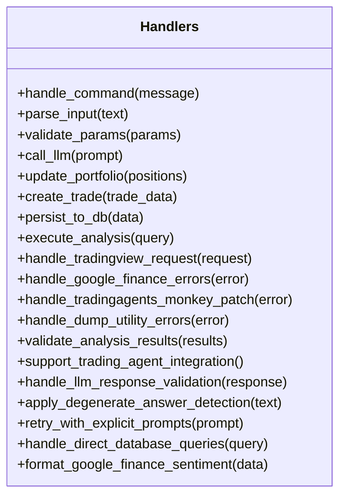

**Updated** Added methods for enhanced analysis execution, direct Google Finance database integration, TradingAgents monkey-patching coordination, LLM response validation, degenerate answer detection, comprehensive error handling, and direct database query processing.

**Diagram sources**
- [stock_bot/handlers.py](file://stock_bot/handlers.py)

**Section sources**
- [stock_bot/handlers.py](file://stock_bot/handlers.py)

### LLM Module
Responsibilities:
- Abstract external LLM provider APIs.
- Manage prompts, retries, and rate limiting.
- Return structured outputs for downstream processing.
- **Enhanced with centralized configuration management using LLAMA_BASE_URL and LLAMA_MODEL constants**.

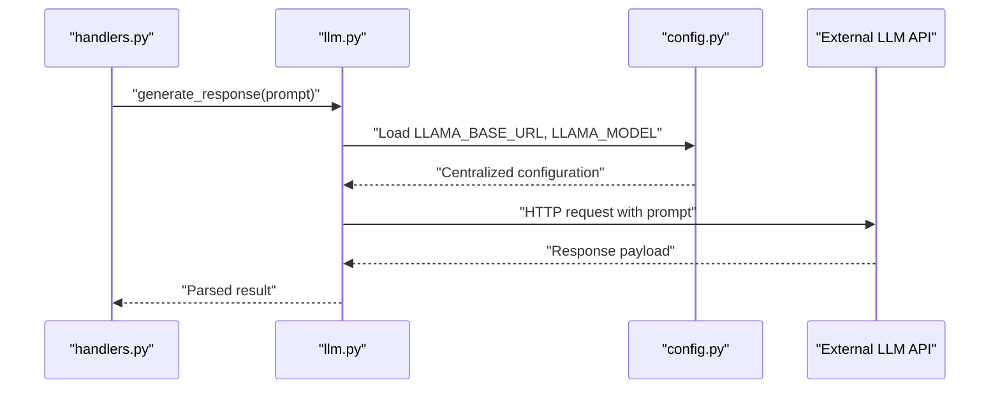

**Updated** Enhanced configuration management with centralized LLAMA_BASE_URL and LLAMA_MODEL constants for consistent LLM endpoint configuration across the application.

**Diagram sources**
- [stock_bot/llm.py](file://stock_bot/llm.py)
- [stock_bot/handlers.py](file://stock_bot/handlers.py)
- [stock_bot/config.py](file://stock_bot/config.py)

**Section sources**
- [stock_bot/llm.py](file://stock_bot/llm.py)
- [stock_bot/config.py](file://stock_bot/config.py)

### Portfolio Module
Responsibilities:
- Maintain current positions and asset allocations.
- Compute metrics like PnL, exposure, and diversification.
- Persist state changes after trade execution.
- **Integrate with enhanced analysis engine for portfolio analytics with direct Google Finance database integration, TradingAgents monkey-patching, and validated LLM responses**.

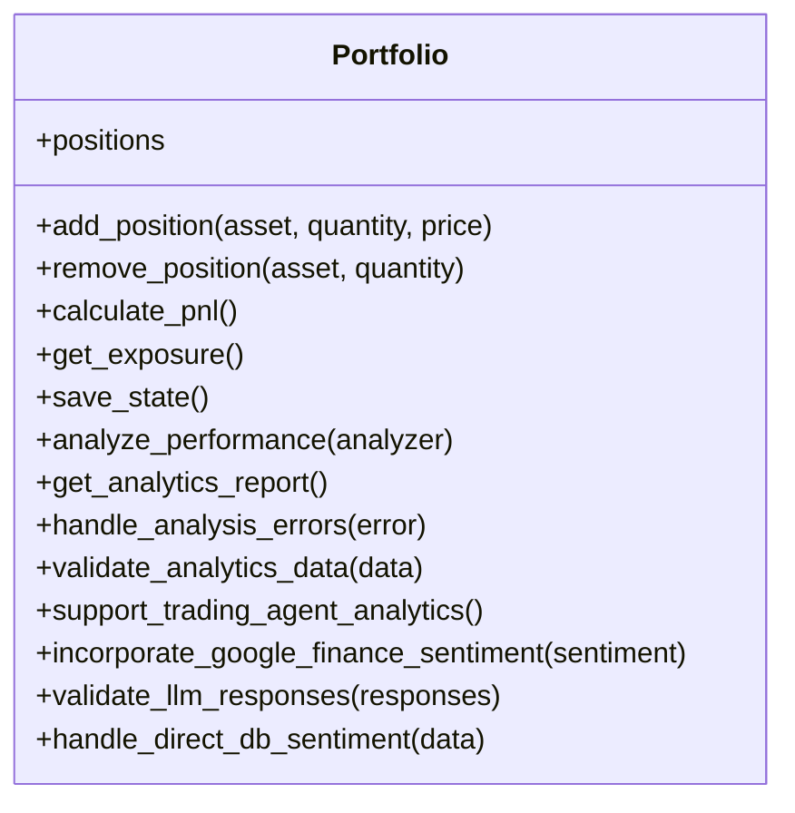

**Updated** Added methods for enhanced portfolio analytics integration with direct Google Finance database integration, TradingAgents monkey-patching support, and LLM response validation.

**Diagram sources**
- [stock_bot/portfolio.py](file://stock_bot/portfolio.py)

**Section sources**
- [stock_bot/portfolio.py](file://stock_bot/portfolio.py)

### Trades Module
Responsibilities:
- Record trade events with metadata (timestamp, price, fees).
- Enforce validation rules and idempotency.
- Integrate with portfolio updates and database persistence.
- **Support for enhanced analysis-driven trade recommendations with direct Google Finance database integration, TradingAgents monkey-patching, and validated LLM responses**.

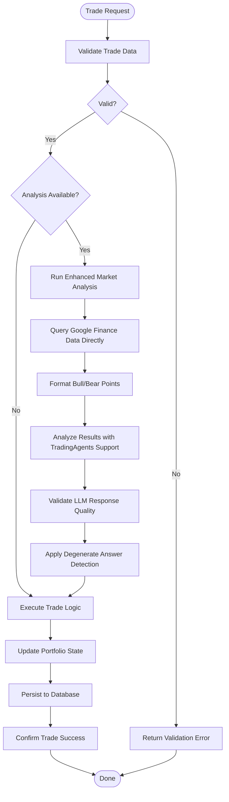

**Updated** Added enhanced analysis-driven trade recommendation capability with direct Google Finance database integration, TradingAgents monkey-patching, and sophisticated LLM response validation with automatic retry mechanisms.

**Diagram sources**
- [stock_bot/trades.py](file://stock_bot/trades.py)
- [stock_bot/portfolio.py](file://stock_bot/portfolio.py)
- [data_eng/db.py](file://data_eng/db.py)

**Section sources**
- [stock_bot/trades.py](file://stock_bot/trades.py)

### Data Engineering
Responsibilities:
- Database connection management and schema initialization.
- Batch ingestion of market or portfolio data.
- Query optimization and transaction handling.
- **Enhanced support for financial data types, time-series operations, Google Finance scraping, improved TradingAgents compatibility, and validated LLM response storage**.

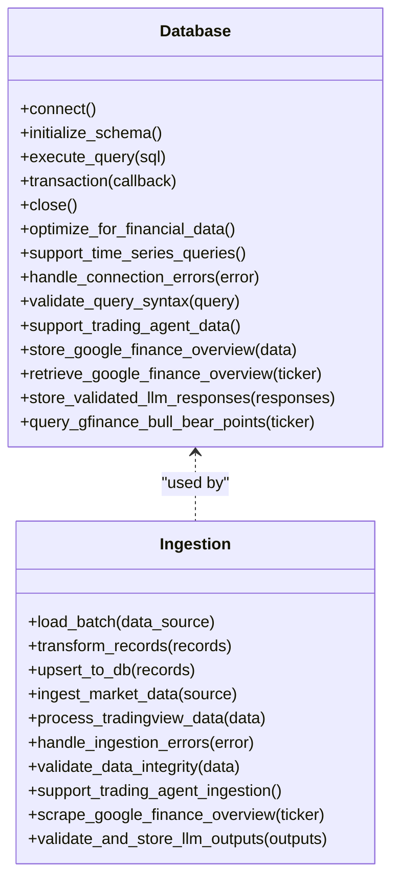

**Updated** Added enhanced financial data optimization, Google Finance scraping capabilities, TradingView data processing capabilities, TradingAgents integration support, LLM response validation and storage capabilities, and direct Google Finance bull/bear points querying.

**Diagram sources**
- [data_eng/db.py](file://data_eng/db.py)
- [data_eng/gfinance.py](file://data_eng/gfinance.py)
- [data_eng/ingest.py](file://data_eng/ingest.py)

**Section sources**
- [data_eng/db.py](file://data_eng/db.py)
- [data_eng/gfinance.py](file://data_eng/gfinance.py)
- [data_eng/ingest.py](file://data_eng/ingest.py)

### Enhanced Analysis Module
Responsibilities:
- **Comprehensive DuckDB vendor abstraction for advanced analytical queries with TradingAgents monkey-patching**.
- **Optimized execution engine for running analysis scripts and ad-hoc queries with direct Google Finance database integration**.
- **Complete TradingAgents monkey-patching for offline operation with stored data**.
- **Robust stubbing mechanisms for unavailable external APIs (FRED, Polymarket)**.
- **Efficient financial data processing capabilities with validation and error recovery**.
- **Sophisticated LLM response validation with degenerate-answer detection and automatic retry logic**.
- **Direct database-driven bull/bear sentiment analysis via _create_gfinance_evidence_node**.

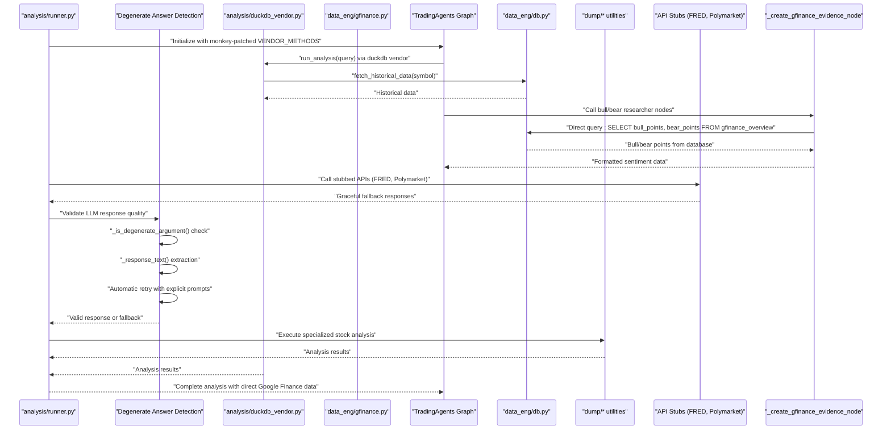

**Updated** Complete analysis engine with comprehensive TradingAgents monkey-patching, direct Google Finance database integration via `_create_gfinance_evidence_node`, DuckDB vendor support, robust API stubbing mechanisms, and sophisticated LLM response validation with degenerate-answer detection and automatic retry logic.

**Diagram sources**
- [analysis/runner.py](file://analysis/runner.py)
- [analysis/duckdb_vendor.py](file://analysis/duckdb_vendor.py)
- [data_eng/gfinance.py](file://data_eng/gfinance.py)
- [data_eng/db.py](file://data_eng/db.py)
- [dump/stock_data_updater.py](file://dump/stock_data_updater.py)
- [dump/technical_analyzer.py](file://dump/technical_analyzer.py)
- [dump/ticker_enricher.py](file://dump/ticker_enricher.py)
- [dump/yahoo_stats_scraper.py](file://dump/yahoo_stats_scraper.py)

**Section sources**
- [analysis/runner.py](file://analysis/runner.py)
- [analysis/duckdb_vendor.py](file://analysis/duckdb_vendor.py)
- [data_eng/gfinance.py](file://data_eng/gfinance.py)
- [dump/stock_data_updater.py](file://dump/stock_data_updater.py)
- [dump/technical_analyzer.py](file://dump/technical_analyzer.py)
- [dump/ticker_enricher.py](file://dump/ticker_enricher.py)
- [dump/yahoo_stats_scraper.py](file://dump/yahoo_stats_scraper.py)

### Google Finance Integration Module
Responsibilities:
- **Scrape Google Finance AI overview using Playwright headless browser**.
- **Extract bull/bear points, sentiment percentages, and AI-generated summaries**.
- **Store scraped data in DuckDB for offline access during TradingAgents analysis**.
- **Ensure data freshness with automatic scraping when data is stale**.
- **Comprehensive error handling and data validation**.

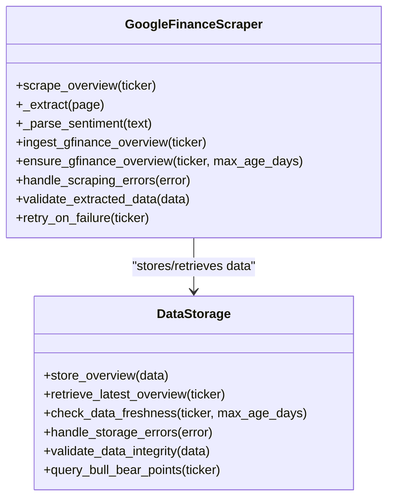

**New** Comprehensive Google Finance integration module providing automated scraping, data extraction, and storage capabilities for bull/bear points and market sentiment analysis.

**Diagram sources**
- [data_eng/gfinance.py](file://data_eng/gfinance.py)

**Section sources**
- [data_eng/gfinance.py](file://data_eng/gfinance.py)

### Dump Utilities Module
Responsibilities:
- **Stock data updating and synchronization with external sources**.
- **Technical analysis calculations and indicator computations**.
- **Ticker enrichment with fundamental and technical data**.
- **Yahoo Finance statistics scraping and data extraction**.
- **Comprehensive error handling and data validation**.

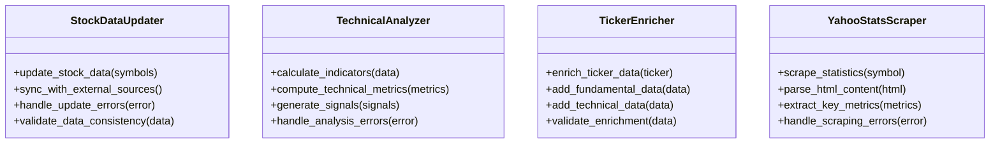

**New** Comprehensive dump utilities module providing specialized stock analysis and data processing capabilities.

**Diagram sources**
- [dump/stock_data_updater.py](file://dump/stock_data_updater.py)
- [dump/technical_analyzer.py](file://dump/technical_analyzer.py)
- [dump/ticker_enricher.py](file://dump/ticker_enricher.py)
- [dump/yahoo_stats_scraper.py](file://dump/yahoo_stats_scraper.py)

**Section sources**
- [dump/stock_data_updater.py](file://dump/stock_data_updater.py)
- [dump/technical_analyzer.py](file://dump/technical_analyzer.py)
- [dump/ticker_enricher.py](file://dump/ticker_enricher.py)
- [dump/yahoo_stats_scraper.py](file://dump/yahoo_stats_scraper.py)

### Conceptual Overview
The system integrates real-time messaging with analytical and data engineering capabilities enhanced by direct Google Finance database integration, comprehensive TradingAgents monkey-patching, and sophisticated LLM response validation. Users interact via Telegram, triggering workflows that may involve AI-driven insights, portfolio management, trade processing, and sophisticated financial analysis powered by optimized DuckDB, TradingView, direct Google Finance database queries, specialized dump utilities, and robust LLM response handling. Analytics can be executed on-demand or scheduled, leveraging DuckDB for efficient computation, TradingView for real-time market intelligence, direct Google Finance database queries for crowd-sourced sentiment, specialized dump utilities for comprehensive stock analysis, and advanced LLM response validation for reliable local model operation.

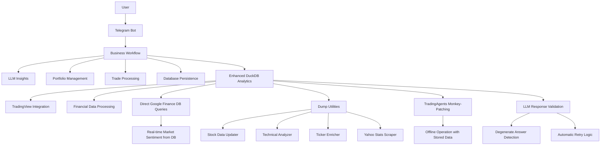

[No sources needed since this diagram shows conceptual workflow, not actual code structure]

## Dependency Analysis
Key dependencies:
- External libraries for Telegram API, LLM providers, DuckDB, TradingView, Google Finance scraping (Playwright), and specialized stock analysis tools.
- Internal modules with clear separation of concerns.
- **Enhanced financial data processing dependencies with TradingAgents monkey-patching, direct Google Finance database integration, and sophisticated LLM response validation**.

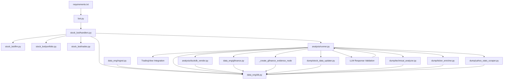

**Updated** Added comprehensive Google Finance integration, TradingAgents monkey-patching dependencies, enhanced analysis dependencies, sophisticated LLM response validation capabilities, and direct database-driven sentiment analysis via `_create_gfinance_evidence_node`.

**Diagram sources**
- [requirements.txt](file://requirements.txt)
- [bot.py](file://bot.py)
- [stock_bot/handlers.py](file://stock_bot/handlers.py)
- [stock_bot/llm.py](file://stock_bot/llm.py)
- [stock_bot/portfolio.py](file://stock_bot/portfolio.py)
- [stock_bot/trades.py](file://stock_bot/trades.py)
- [data_eng/db.py](file://data_eng/db.py)
- [data_eng/gfinance.py](file://data_eng/gfinance.py)
- [data_eng/ingest.py](file://data_eng/ingest.py)
- [analysis/runner.py](file://analysis/runner.py)
- [analysis/duckdb_vendor.py](file://analysis/duckdb_vendor.py)
- [dump/stock_data_updater.py](file://dump/stock_data_updater.py)
- [dump/technical_analyzer.py](file://dump/technical_analyzer.py)
- [dump/ticker_enricher.py](file://dump/ticker_enricher.py)
- [dump/yahoo_stats_scraper.py](file://dump/yahoo_stats_scraper.py)

**Section sources**
- [requirements.txt](file://requirements.txt)

## Performance Considerations
- Use connection pooling for database operations to reduce latency.
- Implement caching for frequent LLM responses when appropriate.
- Optimize DuckDB queries with proper indexing and partitioning.
- Batch ingest operations to minimize I/O overhead.
- Monitor memory usage during large analytical tasks.
- **Implement efficient TradingView API rate limiting and caching with retry mechanisms**.
- **Optimize Google Finance scraping with Playwright for reliable data extraction**.
- **Utilize dump utilities efficiently with batch processing and data validation**.
- **Implement streamlined error handling to prevent cascading failures**.
- **Reduce deprecated functionality overhead for improved execution speed**.
- **Leverage TradingAgents monkey-patching for optimal offline performance**.
- **Cache Google Finance bull/bear points to minimize scraping frequency**.
- **Optimize LLM response validation with efficient degenerate-answer detection algorithms**.
- **Minimize retry attempts to balance reliability with response time**.
- **Eliminate LLM calls for bull/bear points via direct database queries, saving ~2 generations per analysis**.

**Updated** Added considerations for Google Finance scraping optimization, TradingAgents monkey-patching performance, enhanced error handling mechanisms, comprehensive offline operation capabilities, sophisticated LLM response validation with efficient degenerate-answer detection and controlled retry logic, and direct database-driven sentiment analysis that eliminates LLM dependencies for market sentiment data.

## Troubleshooting Guide
Common issues and resolutions:
- Connection failures: Verify environment variables and network connectivity.
- LLM API errors: Check rate limits, authentication tokens, and payload formats.
- Database errors: Inspect schema migrations and transaction rollback logs.
- Analysis failures: Validate query syntax and data source availability.
- **TradingView API errors: Check API keys, rate limits, symbol availability, and implement retry logic**.
- **DuckDB vendor errors: Verify data source connections, query compatibility, and error recovery mechanisms**.
- **Google Finance scraping errors: Ensure Playwright is installed, check network connectivity, and validate HTML selectors**.
- **TradingAgents monkey-patching issues: Verify TradingAgents installation and interface compatibility**.
- **FRED API key issues: Configure API key or use stubbed responses for macro indicators**.
- **Polymarket integration issues: Set up API credentials or rely on stubbed prediction market data**.
- **LLM response validation issues: Check degenerate-answer detection thresholds and retry logic configuration**.
- **Direct database query issues: Verify gfinance_overview table exists and contains data for requested tickers**.

Debugging tips:
- Enable detailed logging in handlers and data layers.
- Use unit tests for isolated component validation.
- Profile slow queries and optimize accordingly.
- **Monitor TradingView API response times, error rates, and implement circuit breakers**.
- **Use DuckDB profiling tools for query optimization and performance monitoring**.
- **Implement comprehensive error tracking and alerting for Google Finance scraping**.
- **Validate data integrity at each stage of the analysis pipeline**.
- **Monitor TradingAgents monkey-patching performance and error rates**.
- **Test offline operation mode with stored data only**.
- **Monitor LLM response validation effectiveness and adjust degenerate-answer detection thresholds as needed**.
- **Log retry attempts and their outcomes for debugging LLM response quality issues**.
- **Verify gfinance_overview table schema and data consistency for direct database queries**.

**Updated** Added comprehensive troubleshooting guidance for Google Finance integration, TradingAgents monkey-patching, API stubbing mechanisms, error handling strategies, offline operation debugging, sophisticated LLM response validation with degenerate-answer detection and retry logic troubleshooting, and direct database query troubleshooting for Google Finance sentiment data.

**Section sources**
- [stock_bot/handlers.py](file://stock_bot/handlers.py)
- [data_eng/db.py](file://data_eng/db.py)
- [data_eng/gfinance.py](file://data_eng/gfinance.py)
- [analysis/runner.py](file://analysis/runner.py)
- [dump/stock_data_updater.py](file://dump/stock_data_updater.py)
- [dump/technical_analyzer.py](file://dump/technical_analyzer.py)
- [dump/ticker_enricher.py](file://dump/ticker_enricher.py)
- [dump/yahoo_stats_scraper.py](file://dump/yahoo_stats_scraper.py)

## Conclusion
The Telegram bot codebase demonstrates a well-structured, modular architecture that separates concerns across bot logic, data engineering, and analysis. By following the patterns outlined here, developers can extend functionality, improve performance, and maintain robust error handling. The provided diagrams and analyses serve as a foundation for understanding and evolving the system.

**Updated** The enhanced analysis framework now provides comprehensive financial data processing capabilities through complete TradingAgents monkey-patching, direct Google Finance database integration via `_create_gfinance_evidence_node`, robust API stubbing mechanisms, specialized dump utilities for stock analysis, and sophisticated LLM response validation with degenerate-answer detection and automatic retry logic. The system achieves full offline operation with stored data while maintaining all TradingAgents functionality, making it highly reliable and independent of external API availability. The new direct database-driven approach eliminates LLM dependencies for market sentiment data, significantly improving performance and reliability while maintaining the same analytical output format.

## Appendices
- Setup instructions and environment configuration are documented in SETUP.md.
- Additional notes and ideas are captured in MyNotes.md.
- Dependencies are listed in requirements.txt.
- **Google Finance scraping configuration with Playwright setup and selector maintenance**.
- **TradingAgents monkey-patching configuration and interface compatibility requirements**.
- **DuckDB vendor setup and financial data source configuration with error handling**.
- **FRED API key configuration for macro indicators or stubbed response setup**.
- **Polymarket API configuration for prediction markets or stubbed data setup**.
- **Enhanced error handling patterns and best practices for offline operation**.
- **Comprehensive testing strategies for Google Finance scraping and TradingAgents integration**.
- **LLM response validation configuration with degenerate-answer detection thresholds and retry logic tuning**.
- **Centralized LLM configuration management with LLAMA_BASE_URL and LLAMA_MODEL constants**.
- **Direct database query optimization for Google Finance sentiment data retrieval**.
- **_create_gfinance_evidence_node configuration and performance tuning**.

**Updated** Added appendices for Google Finance integration, TradingAgents monkey-patching, API stubbing mechanisms, enhanced error handling, comprehensive testing strategies for offline operation, sophisticated LLM response validation with degenerate-answer detection, centralized LLM configuration management, and direct database-driven sentiment analysis via `_create_gfinance_evidence_node`.

**Section sources**
- [SETUP.md](file://SETUP.md)
- [MyNotes.md](file://MyNotes.md)
- [requirements.txt](file://requirements.txt)
- [data_eng/gfinance.py](file://data_eng/gfinance.py)
- [analysis/runner.py](file://analysis/runner.py)
- [dump/stock_data_updater.py](file://dump/stock_data_updater.py)
- [dump/technical_analyzer.py](file://dump/technical_analyzer.py)
- [dump/ticker_enricher.py](file://dump/ticker_enricher.py)
- [dump/yahoo_stats_scraper.py](file://dump/yahoo_stats_scraper.py)
- [stock_bot/config.py](file://stock_bot/config.py)