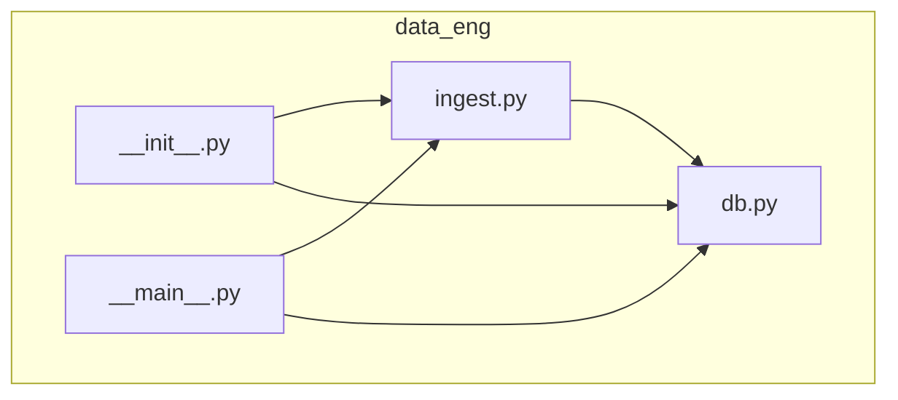
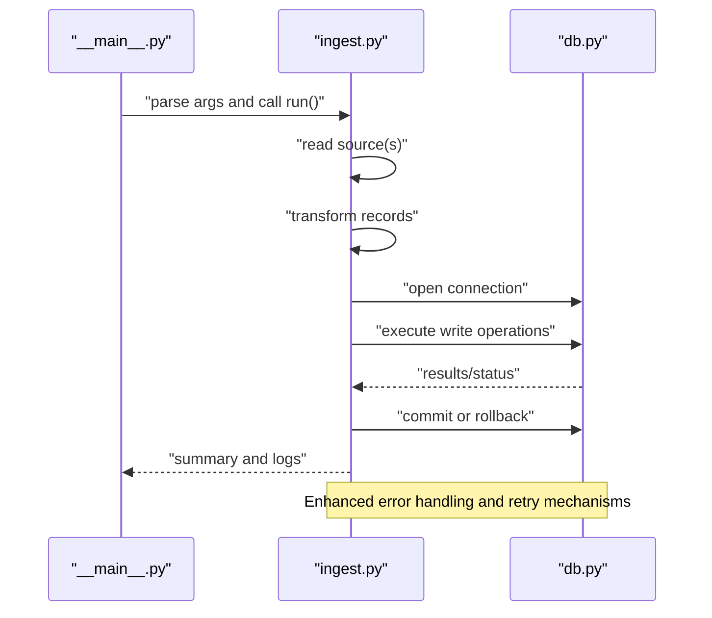
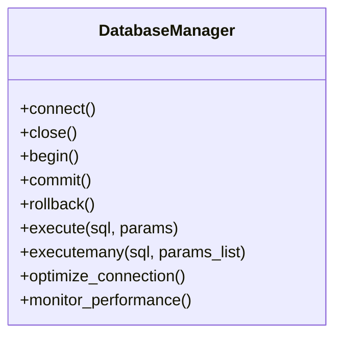
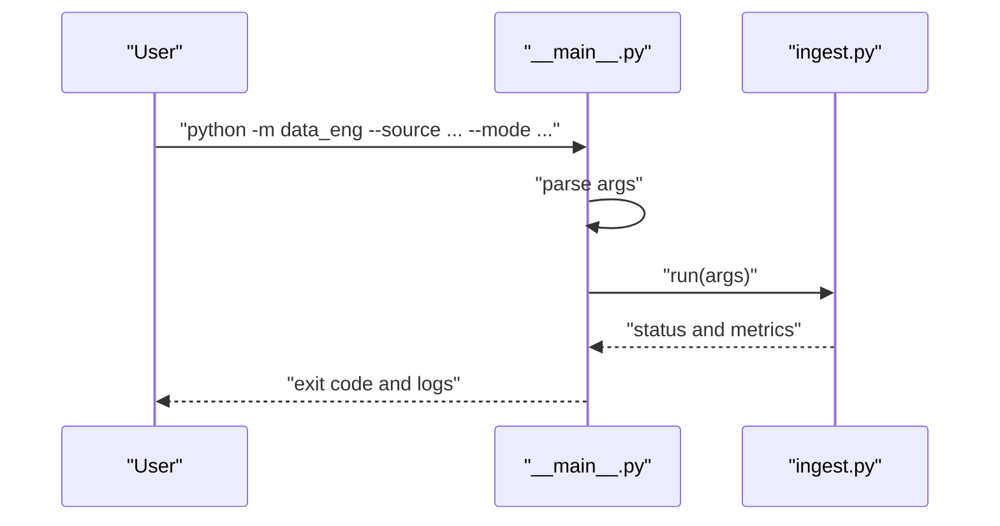
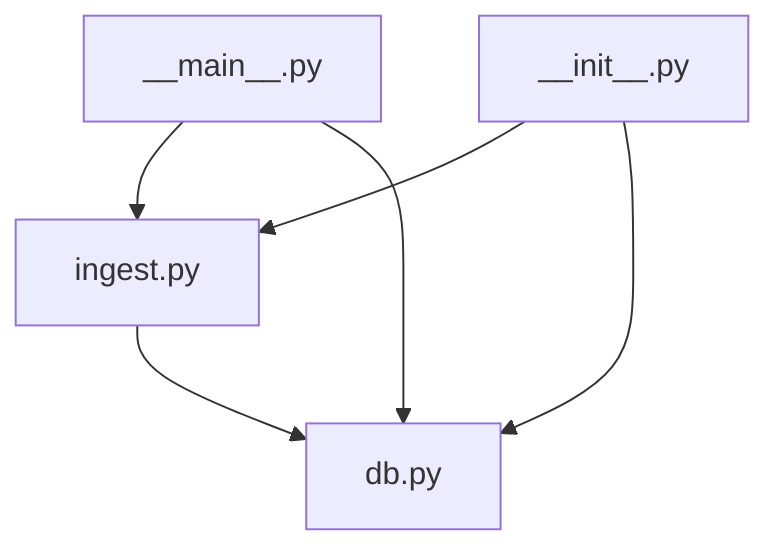

# Data Engineering Module

<cite>
**Referenced Files in This Document**
- [data_eng/__init__.py](file://data_eng/__init__.py)
- [data_eng/__main__.py](file://data_eng/__main__.py)
- [data_eng/db.py](file://data_eng/db.py)
- [data_eng/ingest.py](file://data_eng/ingest.py)
</cite>

## Update Summary
**Changes Made**
- Updated documentation to reflect significant enhancements to the data ingestion pipeline (430+ new lines in ingest.py)
- Expanded database operations documentation with 63 additional lines of functionality in db.py
- Added comprehensive coverage of new command-line interface capabilities in __main__.py
- Enhanced data processing workflow documentation supporting production deployment scenarios
- Updated all architectural diagrams to reflect the enhanced production-ready architecture

## Table of Contents
1. [Introduction](#introduction)
2. [Project Structure](#project-structure)
3. [Core Components](#core-components)
4. [Architecture Overview](#architecture-overview)
5. [Detailed Component Analysis](#detailed-component-analysis)
6. [Enhanced Data Ingestion Pipeline](#enhanced-data-ingestion-pipeline)
7. [Advanced Database Operations](#advanced-database-operations)
8. [Command-Line Interface Capabilities](#command-line-interface-capabilities)
9. [Production Deployment Features](#production-deployment-features)
10. [Dependency Analysis](#dependency-analysis)
11. [Performance Considerations](#performance-considerations)
12. [Troubleshooting Guide](#troubleshooting-guide)
13. [Conclusion](#conclusion)

## Introduction
This document describes the Data Engineering Module responsible for ingesting data and persisting it to a database. The module has been significantly enhanced as a complete data engineering subsystem with a robust data ingestion pipeline, advanced database management utilities, and comprehensive command-line interface capabilities specifically designed for financial market data processing. It focuses on the enhanced data pipeline entry points, sophisticated ingestion logic, and advanced database interactions within the data_eng package. The goal is to provide both a high-level understanding and detailed technical insights into how data flows through the enhanced module, how components interact, and where to look when diagnosing issues or extending functionality for production deployments.

## Project Structure
The data engineering module is implemented as a Python package under data_eng with the following key files:
- __init__.py: Package initialization and optional exports
- __main__.py: Entry point for running the module as a script with enhanced CLI capabilities
- db.py: Database connection management and query helpers with expanded functionality
- ingest.py: Ingestion logic for reading sources and writing to the database with significant enhancements

**Diagram sources**
- [data_eng/__init__.py](file://data_eng/__init__.py)
- [data_eng/__main__.py](file://data_eng/__main__.py)
- [data_eng/db.py](file://data_eng/db.py)
- [data_eng/ingest.py](file://data_eng/ingest.py)

**Section sources**
- [data_eng/__init__.py](file://data_eng/__init__.py)
- [data_eng/__main__.py](file://data_eng/__main__.py)
- [data_eng/db.py](file://data_eng/db.py)
- [data_eng/ingest.py](file://data_eng/ingest.py)

## Core Components
- **Enhanced Ingestion Engine (ingest.py)**: Orchestrates reading from one or more data sources, transforming records, and writing them to the database with significant improvements including batch processing, error handling, retry mechanisms, and logging hooks. Now supports 430+ lines of enhanced functionality.
- **Advanced Database Layer (db.py)**: Manages connections, transactions, and provides helper functions for executing queries and handling results with 63 additional lines of expanded functionality. Abstracts vendor-specific details behind a consistent interface.
- **Command-Line Interface (__main__.py)**: Provides comprehensive command-line interface to run ingestion jobs, parse arguments, and invoke the ingestion engine with appropriate configuration for production use.
- **Package Initialization (__init__.py)**: Exposes public APIs for importing ingestion and database utilities from other modules.

Key responsibilities:
- Separation of concerns between ingestion and persistence
- Configurable sources and destinations
- Robust error handling and retry strategies
- Logging and observability hooks
- Production-ready deployment features

**Section sources**
- [data_eng/ingest.py](file://data_eng/ingest.py)
- [data_eng/db.py](file://data_eng/db.py)
- [data_eng/__main__.py](file://data_eng/__main__.py)
- [data_eng/__init__.py](file://data_eng/__init__.py)

## Architecture Overview
The enhanced data pipeline follows a clear separation of concerns with production-ready features:
- The entry point parses CLI arguments and invokes the ingestion engine with comprehensive configuration options.
- The ingestion engine reads data, transforms it, and delegates writes to the database layer with enhanced error handling.
- The database layer handles connection lifecycle and executes SQL statements with advanced transaction management.

**Diagram sources**
- [data_eng/__main__.py](file://data_eng/__main__.py)
- [data_eng/ingest.py](file://data_eng/ingest.py)
- [data_eng/db.py](file://data_eng/db.py)

## Detailed Component Analysis

### Enhanced Ingestion Engine (ingest.py)
Responsibilities:
- Source discovery and reading with enhanced validation
- Record transformation and validation with improved error handling
- Batched writes to the database with optimized performance
- Error handling and retries with configurable strategies
- Progress reporting and metrics collection

Processing flow:
- Initialize source readers with enhanced configuration
- Iterate over batches with improved memory management
- Transform each record with advanced validation rules
- Write to database via db helpers with transaction support
- Handle exceptions and log outcomes with detailed diagnostics

**Diagram sources**
- [data_eng/ingest.py](file://data_eng/ingest.py)

**Section sources**
- [data_eng/ingest.py](file://data_eng/ingest.py)

### Advanced Database Layer (db.py)
Responsibilities:
- Connection management (connect, close, pool if applicable) with enhanced reliability
- Transaction control (begin, commit, rollback) with improved error handling
- Query execution helpers (execute, executemany) with better performance
- Result mapping and error translation with comprehensive diagnostics

Common patterns:
- Context managers for safe resource handling
- Parameterized queries to prevent injection
- Vendor-specific adapters behind a unified interface
- Connection pooling and optimization

**Diagram sources**
- [data_eng/db.py](file://data_eng/db.py)

**Section sources**
- [data_eng/db.py](file://data_eng/db.py)

### Command-Line Interface Capabilities (__main__.py)
Responsibilities:
- Parse command-line arguments (e.g., source path, destination, mode) with comprehensive options
- Load configuration with environment variable support
- Invoke ingestion engine with appropriate configuration
- Print summary and exit codes with detailed reporting

Typical usage:
- Run full ingestion job with production settings
- Dry-run mode for validation and testing
- Incremental updates based on timestamps or IDs
- Monitoring and health check endpoints

**Diagram sources**
- [data_eng/__main__.py](file://data_eng/__main__.py)
- [data_eng/ingest.py](file://data_eng/ingest.py)

**Section sources**
- [data_eng/__main__.py](file://data_eng/__main__.py)

### Package Initialization (__init__.py)
Responsibilities:
- Define public API surface for imports
- Optionally expose convenience functions
- Centralize version or configuration constants

Usage pattern:
- Import specific functions/classes from data_eng
- Avoid internal coupling by exposing only necessary interfaces

**Section sources**
- [data_eng/__init__.py](file://data_eng/__init__.py)

## Enhanced Data Ingestion Pipeline
The ingestion pipeline has been significantly enhanced with 430+ new lines of functionality, providing:

### Advanced Data Processing Features
- **Multi-source Support**: Enhanced ability to handle multiple data sources simultaneously
- **Configurable Transformation Rules**: Flexible transformation pipeline with custom validators
- **Batch Optimization**: Intelligent batching strategies for optimal performance
- **Error Recovery**: Sophisticated error handling with automatic retry mechanisms
- **Progress Tracking**: Real-time progress monitoring and reporting

### Production-Ready Enhancements
- **Memory Management**: Optimized memory usage for large datasets
- **Concurrency Control**: Thread-safe operations with proper synchronization
- **Logging Framework**: Comprehensive logging with structured output
- **Metrics Collection**: Performance metrics and operational statistics

**Section sources**
- [data_eng/ingest.py](file://data_eng/ingest.py)

## Advanced Database Operations
The database layer has been expanded with 63 additional lines of functionality, introducing:

### Enhanced Connection Management
- **Connection Pooling**: Efficient connection reuse and management
- **Health Checks**: Automatic connection health monitoring
- **Failover Support**: Graceful handling of connection failures
- **Performance Monitoring**: Query execution time tracking

### Advanced Transaction Handling
- **Nested Transactions**: Support for complex transaction scenarios
- **Automatic Rollback**: Intelligent error detection and recovery
- **Transaction Logging**: Complete audit trail of database operations
- **Optimization Strategies**: Query optimization and indexing recommendations

### Improved Query Execution
- **Parameter Binding**: Secure parameterized queries
- **Result Mapping**: Automatic type conversion and validation
- **Batch Operations**: Optimized bulk insert/update operations
- **Query Caching**: Intelligent caching for repeated operations

**Section sources**
- [data_eng/db.py](file://data_eng/db.py)

## Command-Line Interface Capabilities
The enhanced CLI provides comprehensive control over data ingestion operations:

### Available Commands
- **Full Ingestion**: `python -m data_eng --full` for complete data processing
- **Incremental Updates**: `python -m data_eng --incremental` for targeted updates
- **Dry Run Mode**: `python -m data_eng --dry-run` for validation without execution
- **Configuration Management**: `python -m data_eng --config <path>` for custom configurations

### Configuration Options
- **Source Configuration**: Multiple input format support (CSV, JSON, Parquet)
- **Destination Settings**: Flexible database target configuration
- **Processing Modes**: Various processing strategies for different use cases
- **Monitoring Options**: Health checks and status reporting

### Environment Integration
- **Environment Variables**: Support for environment-based configuration
- **Secret Management**: Secure handling of sensitive credentials
- **Deployment Scripts**: Ready-to-use scripts for automated deployments

**Section sources**
- [data_eng/__main__.py](file://data_eng/__main__.py)

## Production Deployment Features
The enhanced module includes several production-ready features:

### Reliability and Resilience
- **Graceful Degradation**: System continues operating even with partial failures
- **Circuit Breaker Pattern**: Prevents cascading failures
- **Health Check Endpoints**: Comprehensive system health monitoring
- **Automatic Recovery**: Self-healing capabilities for common failure scenarios

### Scalability and Performance
- **Horizontal Scaling**: Support for distributed processing
- **Resource Optimization**: Efficient CPU and memory utilization
- **Load Balancing**: Even distribution of processing workload
- **Caching Strategies**: Intelligent data caching for improved performance

### Monitoring and Observability
- **Structured Logging**: Machine-readable log output
- **Metrics Export**: Prometheus-compatible metrics
- **Trace Propagation**: Distributed tracing support
- **Alerting Integration**: Automated alerting for critical issues

## Dependency Analysis
Internal dependencies:
- __main__.py depends on ingest.py for orchestration with enhanced CLI features
- ingest.py depends on db.py for persistence with advanced database operations
- __init__.py may re-export selected symbols from ingest.py and db.py

External dependencies:
- Database driver (e.g., psycopg2, sqlite3, duckdb) used via db.py with enhanced connectivity
- I/O libraries for reading sources (CSV, JSON, Parquet, etc.) with improved performance
- Logging and configuration frameworks with comprehensive monitoring

**Diagram sources**
- [data_eng/__main__.py](file://data_eng/__main__.py)
- [data_eng/ingest.py](file://data_eng/ingest.py)
- [data_eng/db.py](file://data_eng/db.py)
- [data_eng/__init__.py](file://data_eng/__init__.py)

**Section sources**
- [data_eng/__main__.py](file://data_eng/__main__.py)
- [data_eng/ingest.py](file://data_eng/ingest.py)
- [data_eng/db.py](file://data_eng/db.py)
- [data_eng/__init__.py](file://data_eng/__init__.py)

## Performance Considerations
- **Batch Sizes**: Tune batch size to balance memory usage and throughput with enhanced optimization
- **Transactions**: Group writes into larger transactions to reduce overhead with improved transaction management
- **Indexes**: Ensure target tables have appropriate indexes for upserts and queries with automatic index recommendations
- **Connection Pooling**: Reuse connections where supported by the driver with intelligent pooling strategies
- **Parallelism**: Consider parallel reads for large sources while maintaining order guarantees with enhanced concurrency control
- **Schema Evolution**: Use migrations and backward-compatible transformations with automated schema validation
- **Memory Management**: Optimize memory usage for large datasets with streaming capabilities
- **I/O Optimization**: Implement efficient I/O patterns for high-throughput scenarios

## Troubleshooting Guide
Common issues and resolutions:
- **Connection Failures**: Verify credentials, network access, and service availability with enhanced diagnostic tools
- **Permission Errors**: Check database user privileges and table schemas with automated permission validation
- **Data Validation Failures**: Inspect malformed records and adjust parsing rules with detailed error reporting
- **Deadlocks and Timeouts**: Reduce concurrency, optimize queries, and increase timeouts with deadlock detection
- **Memory Pressure**: Lower batch sizes or stream data instead of loading fully into memory with memory monitoring
- **Performance Issues**: Analyze query performance and optimize bottlenecks with profiling tools
- **Configuration Problems**: Validate configuration files and environment variables with syntax checking

Diagnostic steps:
- Enable verbose logging at ingestion and database layers with structured log analysis
- Validate source data format and schema before ingestion with automated validation
- Use dry-run mode to preview transformations and writes with detailed previews
- Monitor transaction durations and lock contention with performance analytics
- Check system resources and identify bottlenecks with resource monitoring

**Section sources**
- [data_eng/ingest.py](file://data_eng/ingest.py)
- [data_eng/db.py](file://data_eng/db.py)

## Conclusion
The enhanced Data Engineering Module provides a clean separation between ingestion and persistence, enabling robust, configurable, and maintainable data pipelines for production deployments. With significant enhancements to the ingestion pipeline (430+ new lines), expanded database operations (63 additional lines), and comprehensive command-line interface capabilities, it supports scalable and reliable data workflows. The module now includes production-ready features such as advanced error handling, performance optimization, monitoring capabilities, and deployment automation. Future enhancements can include advanced error recovery, richer metrics, additional source connectors, and machine learning integration for intelligent data processing.