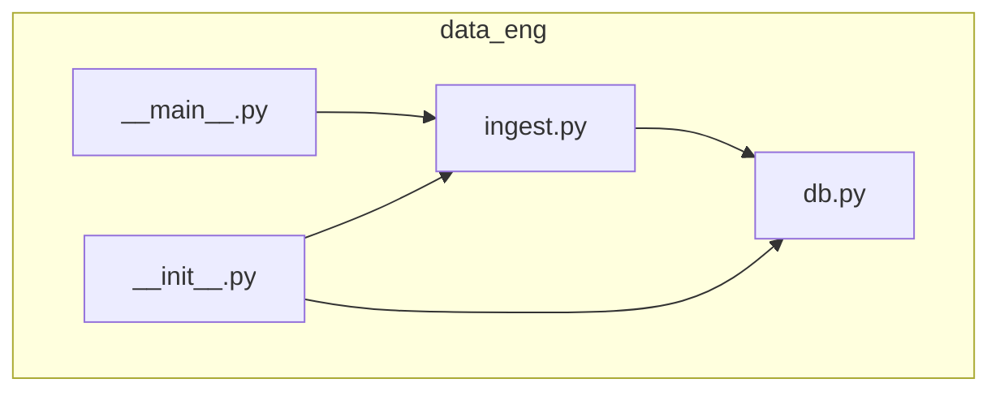
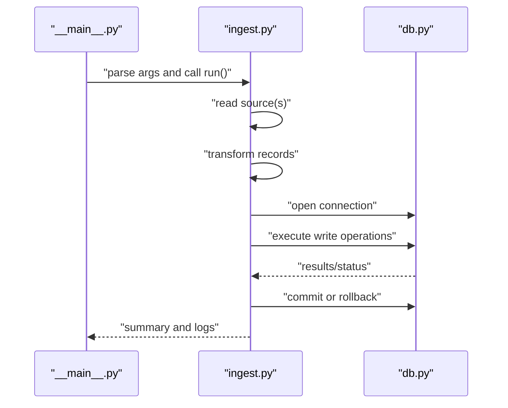
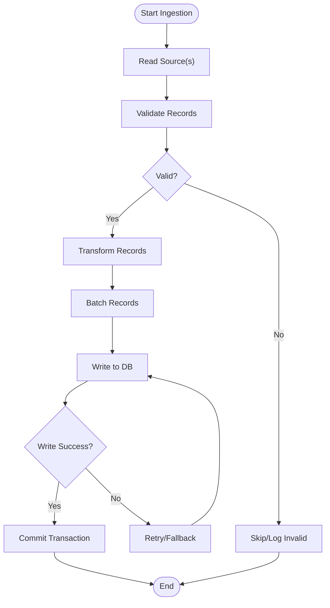
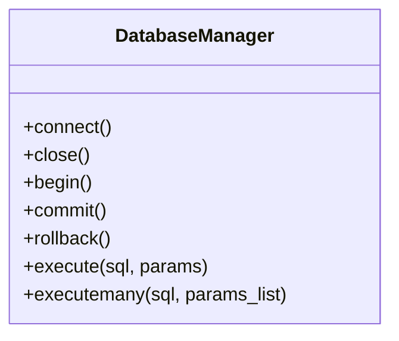
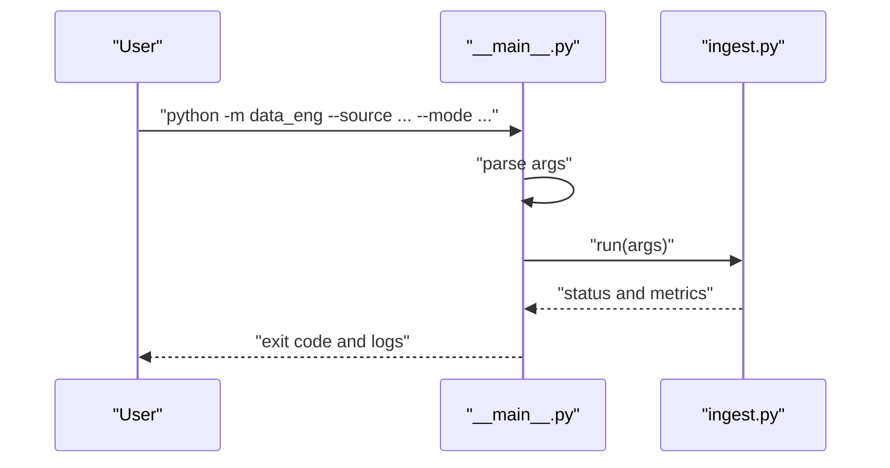
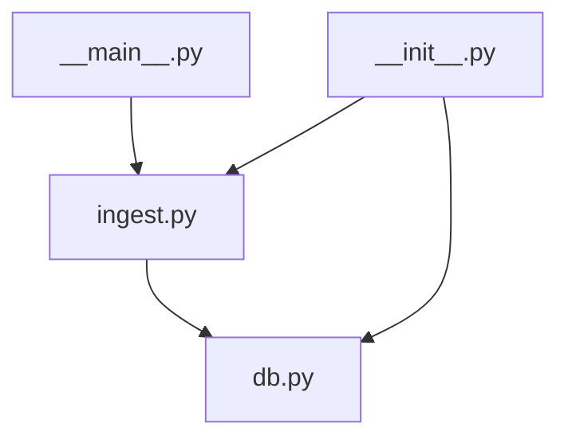

# Data Engineering Module

<cite>
**Referenced Files in This Document**
- [data_eng/__init__.py](file://data_eng/__init__.py)
- [data_eng/__main__.py](file://data_eng/__main__.py)
- [data_eng/db.py](file://data_eng/db.py)
- [data_eng/ingest.py](file://data_eng/ingest.py)
</cite>

## Table of Contents
1. [Introduction](#introduction)
2. [Project Structure](#project-structure)
3. [Core Components](#core-components)
4. [Architecture Overview](#architecture-overview)
5. [Detailed Component Analysis](#detailed-component-analysis)
6. [Dependency Analysis](#dependency-analysis)
7. [Performance Considerations](#performance-considerations)
8. [Troubleshooting Guide](#troubleshooting-guide)
9. [Conclusion](#conclusion)

## Introduction
This document describes the Data Engineering Module responsible for ingesting data and persisting it to a database. It focuses on the data pipeline entry points, ingestion logic, and database interactions within the data_eng package. The goal is to provide both a high-level understanding and detailed technical insights into how data flows through the module, how components interact, and where to look when diagnosing issues or extending functionality.

## Project Structure
The data engineering module is implemented as a Python package under data_eng with the following key files:
- __init__.py: Package initialization and optional exports
- __main__.py: Entry point for running the module as a script
- db.py: Database connection management and query helpers
- ingest.py: Ingestion logic for reading sources and writing to the database

**Diagram sources**
- [data_eng/__init__.py](file://data_eng/__init__.py)
- [data_eng/__main__.py](file://data_eng/__main__.py)
- [data_eng/db.py](file://data_eng/db.py)
- [data_eng/ingest.py](file://data_eng/ingest.py)

**Section sources**
- [data_eng/__init__.py](file://data_eng/__init__.py)
- [data_eng/__main__.py](file://data_eng/__main__.py)
- [data_eng/db.py](file://data_eng/db.py)
- [data_eng/ingest.py](file://data_eng/ingest.py)

## Core Components
- Ingestion Engine (ingest.py): Orchestrates reading from one or more data sources, transforming records, and writing them to the database. It encapsulates batch processing, error handling, and logging hooks.
- Database Layer (db.py): Manages connections, transactions, and provides helper functions for executing queries and handling results. It abstracts vendor-specific details behind a consistent interface.
- Script Entry Point (__main__.py): Provides a command-line interface to run ingestion jobs, parse arguments, and invoke the ingestion engine with appropriate configuration.
- Package Initialization (__init__.py): Exposes public APIs for importing ingestion and database utilities from other modules.

Key responsibilities:
- Separation of concerns between ingestion and persistence
- Configurable sources and destinations
- Robust error handling and retry strategies
- Logging and observability hooks

**Section sources**
- [data_eng/ingest.py](file://data_eng/ingest.py)
- [data_eng/db.py](file://data_eng/db.py)
- [data_eng/__main__.py](file://data_eng/__main__.py)
- [data_eng/__init__.py](file://data_eng/__init__.py)

## Architecture Overview
The data pipeline follows a clear separation of concerns:
- The entry point parses CLI arguments and invokes the ingestion engine.
- The ingestion engine reads data, transforms it, and delegates writes to the database layer.
- The database layer handles connection lifecycle and executes SQL statements.

**Diagram sources**
- [data_eng/__main__.py](file://data_eng/__main__.py)
- [data_eng/ingest.py](file://data_eng/ingest.py)
- [data_eng/db.py](file://data_eng/db.py)

## Detailed Component Analysis

### Ingestion Engine (ingest.py)
Responsibilities:
- Source discovery and reading
- Record transformation and validation
- Batched writes to the database
- Error handling and retries
- Progress reporting and metrics

Processing flow:
- Initialize source readers
- Iterate over batches
- Transform each record
- Write to database via db helpers
- Handle exceptions and log outcomes

**Diagram sources**
- [data_eng/ingest.py](file://data_eng/ingest.py)

**Section sources**
- [data_eng/ingest.py](file://data_eng/ingest.py)

### Database Layer (db.py)
Responsibilities:
- Connection management (connect, close, pool if applicable)
- Transaction control (begin, commit, rollback)
- Query execution helpers (execute, executemany)
- Result mapping and error translation

Common patterns:
- Context managers for safe resource handling
- Parameterized queries to prevent injection
- Vendor-specific adapters behind a unified interface

**Diagram sources**
- [data_eng/db.py](file://data_eng/db.py)

**Section sources**
- [data_eng/db.py](file://data_eng/db.py)

### Script Entry Point (__main__.py)
Responsibilities:
- Parse command-line arguments (e.g., source path, destination, mode)
- Load configuration
- Invoke ingestion engine
- Print summary and exit codes

Typical usage:
- Run full ingestion job
- Dry-run mode for validation
- Incremental updates based on timestamps or IDs

**Diagram sources**
- [data_eng/__main__.py](file://data_eng/__main__.py)
- [data_eng/ingest.py](file://data_eng/ingest.py)

**Section sources**
- [data_eng/__main__.py](file://data_eng/__main__.py)

### Package Initialization (__init__.py)
Responsibilities:
- Define public API surface for imports
- Optionally expose convenience functions
- Centralize version or configuration constants

Usage pattern:
- Import specific functions/classes from data_eng
- Avoid internal coupling by exposing only necessary interfaces

**Section sources**
- [data_eng/__init__.py](file://data_eng/__init__.py)

## Dependency Analysis
Internal dependencies:
- __main__.py depends on ingest.py for orchestration
- ingest.py depends on db.py for persistence
- __init__.py may re-export selected symbols from ingest.py and db.py

External dependencies:
- Database driver (e.g., psycopg2, sqlite3, duckdb) used via db.py
- I/O libraries for reading sources (CSV, JSON, Parquet, etc.)
- Logging and configuration frameworks

**Diagram sources**
- [data_eng/__main__.py](file://data_eng/__main__.py)
- [data_eng/ingest.py](file://data_eng/ingest.py)
- [data_eng/db.py](file://data_eng/db.py)
- [data_eng/__init__.py](file://data_eng/__init__.py)

**Section sources**
- [data_eng/__main__.py](file://data_eng/__main__.py)
- [data_eng/ingest.py](file://data_eng/ingest.py)
- [data_eng/db.py](file://data_eng/db.py)
- [data_eng/__init__.py](file://data_eng/__init__.py)

## Performance Considerations
- Batch sizes: Tune batch size to balance memory usage and throughput
- Transactions: Group writes into larger transactions to reduce overhead
- Indexes: Ensure target tables have appropriate indexes for upserts and queries
- Connection pooling: Reuse connections where supported by the driver
- Parallelism: Consider parallel reads for large sources while maintaining order guarantees
- Schema evolution: Use migrations and backward-compatible transformations

[No sources needed since this section provides general guidance]

## Troubleshooting Guide
Common issues and resolutions:
- Connection failures: Verify credentials, network access, and service availability
- Permission errors: Check database user privileges and table schemas
- Data validation failures: Inspect malformed records and adjust parsing rules
- Deadlocks and timeouts: Reduce concurrency, optimize queries, and increase timeouts
- Memory pressure: Lower batch sizes or stream data instead of loading fully into memory

Diagnostic steps:
- Enable verbose logging at ingestion and database layers
- Validate source data format and schema before ingestion
- Use dry-run mode to preview transformations and writes
- Monitor transaction durations and lock contention

**Section sources**
- [data_eng/ingest.py](file://data_eng/ingest.py)
- [data_eng/db.py](file://data_eng/db.py)

## Conclusion
The Data Engineering Module provides a clean separation between ingestion and persistence, enabling robust, configurable, and maintainable data pipelines. By leveraging batched operations, transaction control, and clear entry points, it supports scalable data workflows. Future enhancements can include advanced error recovery, richer metrics, and additional source connectors.

[No sources needed since this section summarizes without analyzing specific files]