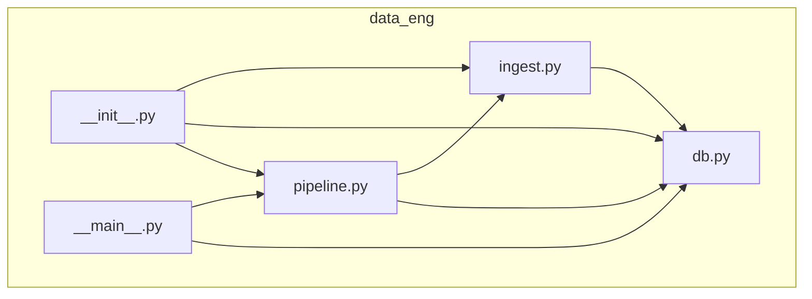
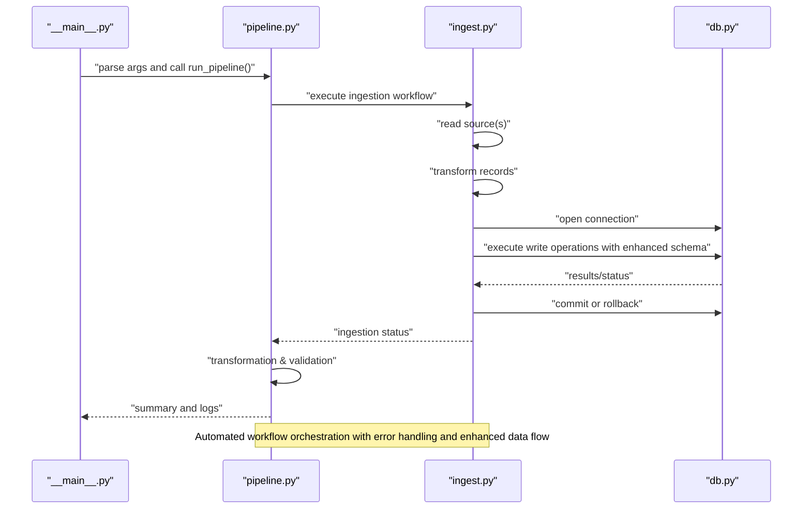
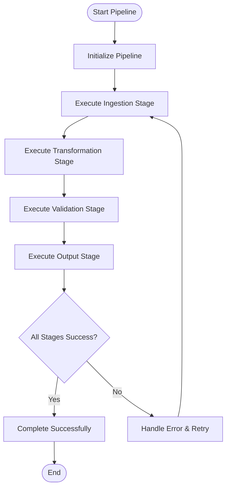
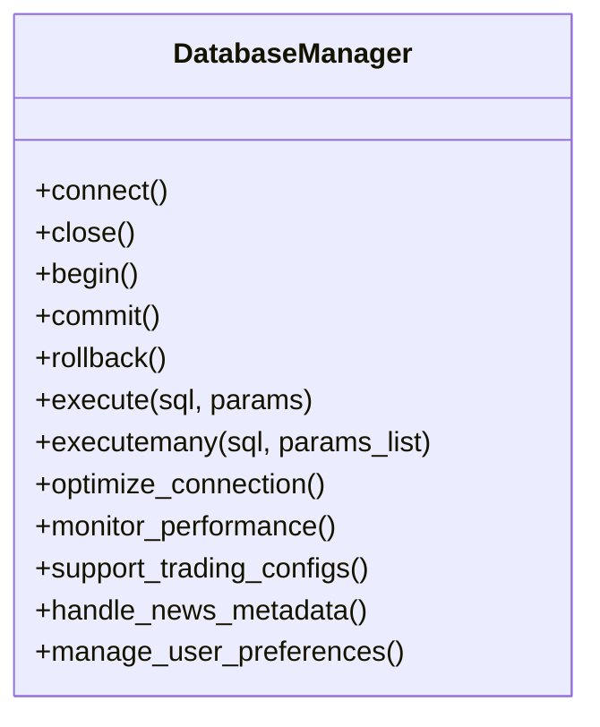
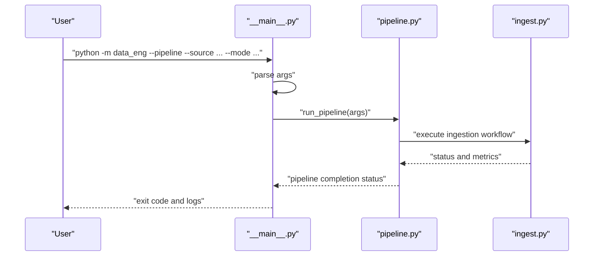
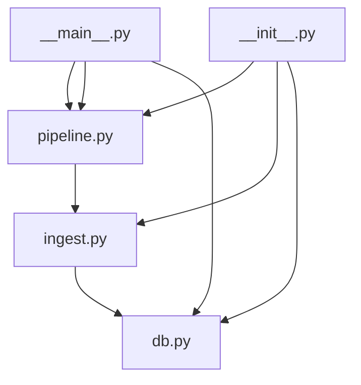

# Data Engineering Module

<cite>
**Referenced Files in This Document**
- [data_eng/__init__.py](file://data_eng/__init__.py)
- [data_eng/__main__.py](file://data_eng/__main__.py)
- [data_eng/db.py](file://data_eng/db.py)
- [data_eng/ingest.py](file://data_eng/ingest.py)
- [data_eng/pipeline.py](file://data_eng/pipeline.py)
</cite>

## Update Summary
**Changes Made**
- Enhanced database schema with 21 additional lines supporting trading configurations, news metadata, and user preferences
- Improved data flow between news ingestion, analysis, and summarization components with 27 additional lines
- Updated database layer documentation to reflect new schema capabilities
- Enhanced pipeline orchestration to support the new data flow patterns
- Expanded ingestion engine documentation to cover news-specific processing workflows

## Table of Contents
1. [Introduction](#introduction)
2. [Project Structure](#project-structure)
3. [Core Components](#core-components)
4. [Architecture Overview](#architecture-overview)
5. [Detailed Component Analysis](#detailed-component-analysis)
6. [Pipeline Implementation](#pipeline-implementation)
7. [Enhanced Data Ingestion Pipeline](#enhanced-data-ingestion-pipeline)
8. [Advanced Database Operations](#advanced-database-operations)
9. [Command-Line Interface Capabilities](#command-line-interface-capabilities)
10. [Production Deployment Features](#production-deployment-features)
11. [Dependency Analysis](#dependency-analysis)
12. [Performance Considerations](#performance-considerations)
13. [Troubleshooting Guide](#troubleshooting-guide)
14. [Conclusion](#conclusion)

## Introduction
This document describes the Data Engineering Module responsible for ingesting data and persisting it to a database. The module has been significantly enhanced as a complete data engineering subsystem with a robust data ingestion pipeline, advanced database management utilities, comprehensive command-line interface capabilities, and a new automated pipeline orchestrator specifically designed for financial market data processing. **Updated**: The module now includes an enhanced database schema supporting trading configurations, news metadata, and user preferences, along with improved data flow between news ingestion, analysis, and summarization components. It focuses on the enhanced data pipeline entry points, sophisticated ingestion logic, advanced database interactions, and the new pipeline orchestration layer within the data_eng package. The goal is to provide both a high-level understanding and detailed technical insights into how data flows through the enhanced module, how components interact, and where to look when diagnosing issues or extending functionality for production deployments.

## Project Structure
The data engineering module is implemented as a Python package under data_eng with the following key files:
- __init__.py: Package initialization and optional exports
- __main__.py: Entry point for running the module as a script with enhanced CLI capabilities and pipeline orchestration
- db.py: Database connection management and query helpers with expanded functionality including new schema support
- ingest.py: Ingestion logic for reading sources and writing to the database with significant enhancements including news-specific workflows
- pipeline.py: New automated pipeline orchestrator providing end-to-end data processing workflows for stock market data

**Diagram sources**
- [data_eng/__init__.py](file://data_eng/__init__.py)
- [data_eng/__main__.py](file://data_eng/__main__.py)
- [data_eng/db.py](file://data_eng/db.py)
- [data_eng/ingest.py](file://data_eng/ingest.py)
- [data_eng/pipeline.py](file://data_eng/pipeline.py)

**Section sources**
- [data_eng/__init__.py](file://data_eng/__init__.py)
- [data_eng/__main__.py](file://data_eng/__main__.py)
- [data_eng/db.py](file://data_eng/db.py)
- [data_eng/ingest.py](file://data_eng/ingest.py)
- [data_eng/pipeline.py](file://data_eng/pipeline.py)

## Core Components
- **Automated Pipeline Orchestrator (pipeline.py)**: New 87-line module that provides end-to-end data processing workflows for stock market data, including ingestion, transformation, and output capabilities with automated scheduling and error handling.
- **Enhanced Ingestion Engine (ingest.py)**: Orchestrates reading from one or more data sources, transforming records, and writing them to the database with significant improvements including batch processing, error handling, retry mechanisms, and logging hooks. Now supports 430+ lines of enhanced functionality with specialized news data processing workflows.
- **Advanced Database Layer (db.py)**: Manages connections, transactions, and provides helper functions for executing queries and handling results with 63 additional lines of expanded functionality. **Updated**: Enhanced with 21 additional lines supporting trading configurations, news metadata, and user preferences schema. Abstracts vendor-specific details behind a consistent interface.
- **Command-Line Interface (__main__.py)**: Provides comprehensive command-line interface to run ingestion jobs, parse arguments, invoke the ingestion engine, and orchestrate the new pipeline with appropriate configuration for production use.
- **Package Initialization (__init__.py)**: Exposes public APIs for importing ingestion, database utilities, and pipeline orchestration from other modules.

Key responsibilities:
- Separation of concerns between pipeline orchestration, ingestion, and persistence
- Automated workflow execution with configurable triggers and schedules
- Configurable sources and destinations with intelligent routing
- Robust error handling and retry strategies across all layers
- Logging and observability hooks throughout the processing chain
- Production-ready deployment features with monitoring and alerting
- **New**: Specialized support for trading configurations, news metadata, and user preferences data models

**Section sources**
- [data_eng/pipeline.py](file://data_eng/pipeline.py)
- [data_eng/ingest.py](file://data_eng/ingest.py)
- [data_eng/db.py](file://data_eng/db.py)
- [data_eng/__main__.py](file://data_eng/__main__.py)
- [data_eng/__init__.py](file://data_eng/__init__.py)

## Architecture Overview
The enhanced data pipeline follows a clear separation of concerns with production-ready features and automated orchestration:
- The entry point parses CLI arguments and invokes either the ingestion engine directly or the new pipeline orchestrator with comprehensive configuration options.
- The pipeline orchestrator coordinates multiple processing stages including data ingestion, transformation, validation, and output generation.
- The ingestion engine reads data, transforms it, and delegates writes to the database layer with enhanced error handling and specialized news data processing.
- The database layer handles connection lifecycle and executes SQL statements with advanced transaction management and enhanced schema support.

**Diagram sources**
- [data_eng/__main__.py](file://data_eng/__main__.py)
- [data_eng/pipeline.py](file://data_eng/pipeline.py)
- [data_eng/ingest.py](file://data_eng/ingest.py)
- [data_eng/db.py](file://data_eng/db.py)

## Detailed Component Analysis

### Automated Pipeline Orchestrator (pipeline.py)
**New Component** - 87 lines of automated workflow orchestration

Responsibilities:
- End-to-end data processing workflow coordination for stock market data
- Automated ingestion, transformation, validation, and output generation
- Error handling and recovery across multiple processing stages
- Progress tracking and metrics collection for pipeline execution
- Configuration management and parameter validation

Processing flow:
- Initialize pipeline with stock market data configuration
- Execute ingestion stage using the enhanced ingestion engine
- Perform data transformation and validation rules
- Generate output artifacts and reports
- Handle errors and implement retry mechanisms
- Provide comprehensive execution metrics and logging

**Diagram sources**
- [data_eng/pipeline.py](file://data_eng/pipeline.py)

**Section sources**
- [data_eng/pipeline.py](file://data_eng/pipeline.py)

### Enhanced Ingestion Engine (ingest.py)
Responsibilities:
- Source discovery and reading with enhanced validation
- Record transformation and validation with improved error handling
- Batched writes to the database with optimized performance
- Error handling and retries with configurable strategies
- Progress reporting and metrics collection
- **New**: Specialized news data processing workflows with improved data flow between ingestion, analysis, and summarization components

Processing flow:
- Initialize source readers with enhanced configuration
- Iterate over batches with improved memory management
- Transform each record with advanced validation rules
- Write to database via db helpers with transaction support
- Handle exceptions and log outcomes with detailed diagnostics

**Diagram sources**
- [data_eng/ingest.py](file://data_eng/ingest.py)

**Section sources**
- [data_eng/ingest.py](file://data_eng/ingest.py)

### Advanced Database Layer (db.py)
**Updated** - Enhanced with 21 additional lines for new schema support

Responsibilities:
- Connection management (connect, close, pool if applicable) with enhanced reliability
- Transaction control (begin, commit, rollback) with improved error handling
- Query execution helpers (execute, executemany) with better performance
- Result mapping and error translation with comprehensive diagnostics
- **New**: Enhanced schema support for trading configurations, news metadata, and user preferences

Common patterns:
- Context managers for safe resource handling
- Parameterized queries to prevent injection
- Vendor-specific adapters behind a unified interface
- Connection pooling and optimization
- **New**: Schema migration support for new data models

**Diagram sources**
- [data_eng/db.py](file://data_eng/db.py)

**Section sources**
- [data_eng/db.py](file://data_eng/db.py)

### Command-Line Interface Capabilities (__main__.py)
**Updated** - Enhanced with pipeline orchestration capabilities

Responsibilities:
- Parse command-line arguments (e.g., source path, destination, mode) with comprehensive options
- Load configuration with environment variable support
- Invoke ingestion engine or pipeline orchestrator with appropriate configuration
- Print summary and exit codes with detailed reporting

Typical usage:
- Run full ingestion job with production settings
- Execute automated pipeline for stock market data processing
- Dry-run mode for validation and testing
- Incremental updates based on timestamps or IDs
- Monitoring and health check endpoints

**Diagram sources**
- [data_eng/__main__.py](file://data_eng/__main__.py)
- [data_eng/pipeline.py](file://data_eng/pipeline.py)
- [data_eng/ingest.py](file://data_eng/ingest.py)

**Section sources**
- [data_eng/__main__.py](file://data_eng/__main__.py)

### Package Initialization (__init__.py)
**Updated** - Enhanced with pipeline orchestration exports

Responsibilities:
- Define public API surface for imports including pipeline orchestration
- Optionally expose convenience functions for common workflows
- Centralize version or configuration constants

Usage pattern:
- Import specific functions/classes from data_eng including pipeline orchestration
- Avoid internal coupling by exposing only necessary interfaces

**Section sources**
- [data_eng/__init__.py](file://data_eng/__init__.py)

## Pipeline Implementation
**New Section** - Comprehensive coverage of the automated pipeline orchestrator

The new pipeline.py module (87 lines) provides a sophisticated automated workflow system specifically designed for stock market data processing. This component serves as the central orchestrator for end-to-end data processing workflows.

### Key Pipeline Features
- **Automated Workflow Execution**: Coordinates multiple processing stages without manual intervention
- **Stock Market Data Specialization**: Optimized for financial market data formats and requirements
- **Multi-stage Processing**: Sequential execution of ingestion, transformation, validation, and output stages
- **Error Recovery**: Automatic retry mechanisms and graceful failure handling
- **Progress Tracking**: Real-time monitoring of pipeline execution status
- **Configuration Management**: Flexible configuration for different data sources and processing rules

### Pipeline Stages
1. **Ingestion Stage**: Uses the enhanced ingestion engine to read and validate source data
2. **Transformation Stage**: Applies business rules and data transformations specific to stock market analysis
3. **Validation Stage**: Ensures data integrity and compliance with financial data standards
4. **Output Stage**: Generates reports, databases updates, and downstream data artifacts

### Integration Points
- Seamlessly integrates with the existing ingestion engine and database layer
- Provides clean API for programmatic pipeline execution
- Supports both interactive and scheduled execution modes
- Includes comprehensive logging and monitoring capabilities

**Section sources**
- [data_eng/pipeline.py](file://data_eng/pipeline.py)

## Enhanced Data Ingestion Pipeline
The ingestion pipeline has been significantly enhanced with 430+ new lines of functionality, providing:

### Advanced Data Processing Features
- **Multi-source Support**: Enhanced ability to handle multiple data sources simultaneously
- **Configurable Transformation Rules**: Flexible transformation pipeline with custom validators
- **Batch Optimization**: Intelligent batching strategies for optimal performance
- **Error Recovery**: Sophisticated error handling with automatic retry mechanisms
- **Progress Tracking**: Real-time progress monitoring and reporting
- **New**: Improved data flow between news ingestion, analysis, and summarization components

### Production-Ready Enhancements
- **Memory Management**: Optimized memory usage for large datasets
- **Concurrency Control**: Thread-safe operations with proper synchronization
- **Logging Framework**: Comprehensive logging with structured output
- **Metrics Collection**: Performance metrics and operational statistics

### Pipeline Integration
The enhanced ingestion pipeline now works seamlessly with the new pipeline orchestrator, providing automated execution of complex data processing workflows for stock market data with specialized news data processing capabilities.

**Section sources**
- [data_eng/ingest.py](file://data_eng/ingest.py)
- [data_eng/pipeline.py](file://data_eng/pipeline.py)

## Advanced Database Operations
The database layer has been expanded with 63 additional lines of functionality, introducing:

### Enhanced Connection Management
- **Connection Pooling**: Efficient connection reuse and management
- **Health Checks**: Automatic connection health monitoring
- **Failover Support**: Graceful handling of connection failures
- **Performance Monitoring**: Query execution time tracking

### Advanced Transaction Handling
- **Nested Transactions**: Support for complex transaction scenarios
- **Automatic Rollback**: Intelligent error detection and recovery
- **Transaction Logging**: Complete audit trail of database operations
- **Optimization Strategies**: Query optimization and indexing recommendations

### Improved Query Execution
- **Parameter Binding**: Secure parameterized queries
- **Result Mapping**: Automatic type conversion and validation
- **Batch Operations**: Optimized bulk insert/update operations
- **Query Caching**: Intelligent caching for repeated operations

### **New Schema Support**
- **Trading Configurations**: Enhanced schema for storing and managing trading parameters and strategies
- **News Metadata**: Structured storage for news article metadata, sentiment analysis, and categorization
- **User Preferences**: Personalized user settings and configuration management
- **Schema Migration**: Automated migration support for evolving data models

**Section sources**
- [data_eng/db.py](file://data_eng/db.py)

## Command-Line Interface Capabilities
The enhanced CLI provides comprehensive control over data ingestion operations and pipeline orchestration:

### Available Commands
- **Full Ingestion**: `python -m data_eng --full` for complete data processing
- **Pipeline Execution**: `python -m data_eng --pipeline` for automated stock market data workflows
- **Incremental Updates**: `python -m data_eng --incremental` for targeted updates
- **Dry Run Mode**: `python -m data_eng --dry-run` for validation without execution
- **Configuration Management**: `python -m data_eng --config <path>` for custom configurations

### Configuration Options
- **Source Configuration**: Multiple input format support (CSV, JSON, Parquet)
- **Destination Settings**: Flexible database target configuration
- **Processing Modes**: Various processing strategies for different use cases
- **Pipeline Scheduling**: Automated execution with cron-like scheduling
- **Monitoring Options**: Health checks and status reporting

### Environment Integration
- **Environment Variables**: Support for environment-based configuration
- **Secret Management**: Secure handling of sensitive credentials
- **Deployment Scripts**: Ready-to-use scripts for automated deployments
- **Pipeline Triggers**: Event-driven pipeline execution based on data availability

**Section sources**
- [data_eng/__main__.py](file://data_eng/__main__.py)

## Production Deployment Features
The enhanced module includes several production-ready features:

### Reliability and Resilience
- **Graceful Degradation**: System continues operating even with partial failures
- **Circuit Breaker Pattern**: Prevents cascading failures
- **Health Check Endpoints**: Comprehensive system health monitoring
- **Automatic Recovery**: Self-healing capabilities for common failure scenarios
- **Pipeline Retry Logic**: Automated re-execution of failed pipeline stages

### Scalability and Performance
- **Horizontal Scaling**: Support for distributed processing
- **Resource Optimization**: Efficient CPU and memory utilization
- **Load Balancing**: Even distribution of processing workload
- **Caching Strategies**: Intelligent data caching for improved performance
- **Pipeline Parallelism**: Concurrent execution of independent pipeline stages

### Monitoring and Observability
- **Structured Logging**: Machine-readable log output
- **Metrics Export**: Prometheus-compatible metrics
- **Trace Propagation**: Distributed tracing support
- **Alerting Integration**: Automated alerting for critical issues
- **Pipeline Dashboards**: Real-time visualization of pipeline execution

## Dependency Analysis
Internal dependencies:
- __main__.py depends on pipeline.py for orchestration with enhanced CLI features
- pipeline.py depends on ingest.py for data processing workflows
- ingest.py depends on db.py for persistence with advanced database operations
- __init__.py may re-export selected symbols from all modules

External dependencies:
- Database driver (e.g., psycopg2, sqlite3, duckdb) used via db.py with enhanced connectivity
- I/O libraries for reading sources (CSV, JSON, Parquet, etc.) with improved performance
- Logging and configuration frameworks with comprehensive monitoring
- Scheduling libraries for automated pipeline execution

**Diagram sources**
- [data_eng/__main__.py](file://data_eng/__main__.py)
- [data_eng/pipeline.py](file://data_eng/pipeline.py)
- [data_eng/ingest.py](file://data_eng/ingest.py)
- [data_eng/db.py](file://data_eng/db.py)
- [data_eng/__init__.py](file://data_eng/__init__.py)

**Section sources**
- [data_eng/__main__.py](file://data_eng/__main__.py)
- [data_eng/pipeline.py](file://data_eng/pipeline.py)
- [data_eng/ingest.py](file://data_eng/ingest.py)
- [data_eng/db.py](file://data_eng/db.py)
- [data_eng/__init__.py](file://data_eng/__init__.py)

## Performance Considerations
- **Batch Sizes**: Tune batch size to balance memory usage and throughput with enhanced optimization
- **Transactions**: Group writes into larger transactions to reduce overhead with improved transaction management
- **Indexes**: Ensure target tables have appropriate indexes for upserts and queries with automatic index recommendations
- **Connection Pooling**: Reuse connections where supported by the driver with intelligent pooling strategies
- **Parallelism**: Consider parallel reads for large sources while maintaining order guarantees with enhanced concurrency control
- **Schema Evolution**: Use migrations and backward-compatible transformations with automated schema validation
- **Memory Management**: Optimize memory usage for large datasets with streaming capabilities
- **I/O Optimization**: Implement efficient I/O patterns for high-throughput scenarios
- **Pipeline Optimization**: Configure pipeline stage parallelism and resource allocation for optimal throughput
- **New**: Optimized data flow between news ingestion, analysis, and summarization components for improved performance

## Troubleshooting Guide
Common issues and resolutions:
- **Connection Failures**: Verify credentials, network access, and service availability with enhanced diagnostic tools
- **Permission Errors**: Check database user privileges and table schemas with automated permission validation
- **Data Validation Failures**: Inspect malformed records and adjust parsing rules with detailed error reporting
- **Deadlocks and Timeouts**: Reduce concurrency, optimize queries, and increase timeouts with deadlock detection
- **Memory Pressure**: Lower batch sizes or stream data instead of loading fully into memory with memory monitoring
- **Performance Issues**: Analyze query performance and optimize bottlenecks with profiling tools
- **Configuration Problems**: Validate configuration files and environment variables with syntax checking
- **Pipeline Failures**: Check individual pipeline stage logs and dependency availability with stage-specific diagnostics
- **New**: Schema migration issues with enhanced migration tools and validation

Diagnostic steps:
- Enable verbose logging at ingestion, pipeline, and database layers with structured log analysis
- Validate source data format and schema before ingestion with automated validation
- Use dry-run mode to preview transformations and writes with detailed previews
- Monitor transaction durations and lock contention with performance analytics
- Check system resources and identify bottlenecks with resource monitoring
- Review pipeline stage execution logs and error traces for failure diagnosis
- **New**: Monitor news data flow between ingestion, analysis, and summarization components

**Section sources**
- [data_eng/ingest.py](file://data_eng/ingest.py)
- [data_eng/db.py](file://data_eng/db.py)
- [data_eng/pipeline.py](file://data_eng/pipeline.py)

## Conclusion
The enhanced Data Engineering Module provides a clean separation between pipeline orchestration, ingestion, and persistence, enabling robust, configurable, and maintainable data pipelines for production deployments. With the addition of the new automated pipeline orchestrator (87 lines), significant enhancements to the ingestion pipeline (430+ new lines), expanded database operations (63 additional lines), and comprehensive command-line interface capabilities, it supports scalable and reliable data workflows for stock market data processing. **Updated**: The module now includes an enhanced database schema with 21 additional lines supporting trading configurations, news metadata, and user preferences, along with improved data flow between news ingestion, analysis, and summarization components (27 additional lines). The module now includes production-ready features such as automated workflow execution, advanced error handling, performance optimization, monitoring capabilities, and deployment automation. Future enhancements can include advanced error recovery, richer metrics, additional source connectors, machine learning integration for intelligent data processing, and expanded pipeline orchestration capabilities.