# Data Engineering Module

<cite>
**Referenced Files in This Document**
- [data_eng/__init__.py](file://data_eng/__init__.py)
- [data_eng/__main__.py](file://data_eng/__main__.py)
- [data_eng/db.py](file://data_eng/db.py)
- [data_eng/ingest.py](file://data_eng/ingest.py)
- [data_eng/pipeline.py](file://data_eng/pipeline.py)
- [data_eng/gfinance.py](file://data_eng/gfinance.py)
- [data_eng/portfolio_engine.py](file://data_eng/portfolio_engine.py)
- [data_eng/candidates.py](file://data_eng/candidates.py)
- [data_eng/events.py](file://data_eng/events.py)
- [data_eng/screener.py](file://data_eng/screener.py)
- [data_eng/universe.py](file://data_eng/universe.py)
- [data_eng/portfolio_review.py](file://data_eng/portfolio_review.py)
- [data_eng/enrich.py](file://data_eng/enrich.py)
- [analysis/duckdb_vendor.py](file://analysis/duckdb_vendor.py)
- [dump/data_utils.py](file://dump/data_utils.py)
- [dump/scrape_stock_prices.py](file://dump/scrape_stock_prices.py)
- [dump/scrape_sector.py](file://dump/scrape_sector.py)
- [dump/report_generator.py](file://dump/report_generator.py)
- [dump/notes.md](file://dump/notes.md)
- [migrate_technicals.py](file://migrate_technicals.py)
</cite>

## Update Summary
**Changes Made**
- Enhanced data scheduling and priority system completely restructured from rating-filtered (Strong Buy/Buy only) to sophisticated priority-ordered processing that handles ALL universe tickers with watchlist membership, rating priority, sector priority, and data staleness ordering
- Added skip tracking system for API failures with automatic ticker skipping after 2 consecutive failures for 30 days
- Enhanced night pipeline architecture with event-gated analysis scheduling combining event-triggered and stale-data queues
- Database schema updated to include new skip_tickers table functionality for handling API failures gracefully
- Removed references to old rating-only filtering system that only processed 'Strong Buy' and 'Buy' rated stocks

## Table of Contents
1. [Introduction](#introduction)
2. [Project Structure](#project-structure)
3. [Core Components](#core-components)
4. [Architecture Overview](#architecture-overview)
5. [Detailed Component Analysis](#detailed-component-analysis)
6. [Enrichment System](#enrichment-system)
7. [Enhanced Pipeline Architecture](#enhanced-pipeline-architecture)
8. [Technical Indicators Migration](#technical-indicators-migration)
9. [Portfolio Management System](#portfolio-management-system)
10. [Candidate Selection Logic](#candidate-selection-logic)
11. [Event-Driven Architecture](#event-driven-architecture)
12. [Advanced Screening Capabilities](#advanced-screening-capabilities)
13. [Investment Universe Management](#investment-universe-management)
14. [Portfolio Review Functionality](#portfolio-review-functionality)
15. [Database Schema Enhancements](#database-schema-enhancements)
16. [Command-Line Interface Capabilities](#command-line-interface-capabilities)
17. [Data Processing and Reporting Module](#data-processing-and-reporting-module)
18. [Financial Market Analysis Capabilities](#financial-market-analysis-capabilities)
19. [Production Deployment Features](#production-deployment-features)
20. [Dependency Analysis](#dependency-analysis)
21. [Performance Considerations](#performance-considerations)
22. [Troubleshooting Guide](#troubleshooting-guide)
23. [Conclusion](#conclusion)

## Introduction
This document describes the Data Engineering Module responsible for ingesting data and persisting it to a database. The module has been significantly enhanced as a complete data engineering subsystem with a robust data ingestion pipeline, advanced database management utilities, comprehensive command-line interface capabilities, and a new automated pipeline orchestrator specifically designed for financial market data processing. **Updated**: The module now includes a sophisticated enrichment system with rolling batch processing, enhanced pipeline architecture with night/day separation, technical indicators migration to dedicated tables, improved batch processing capabilities, new database schema support, and comprehensive command-line interface enhancements. The system features smart scheduling for API rate limits, specialized technical indicator computation, and complete portfolio management integration. It focuses on the enhanced data pipeline entry points, sophisticated ingestion logic, advanced database interactions, Google Finance data sourcing, the new pipeline orchestration layer within the data_eng package, comprehensive portfolio management capabilities, and the new comprehensive data processing and reporting capabilities in the dump/ directory. The goal is to provide both a high-level understanding and detailed technical insights into how data flows through the enhanced module, how components interact, and where to look when diagnosing issues or extending functionality for production deployments.

## Project Structure
The data engineering module is implemented as a Python package under data_eng with the following key files:
- __init__.py: Package initialization and optional exports
- __main__.py: Entry point for running the module as a script with enhanced CLI capabilities and pipeline orchestration
- db.py: Database connection management and query helpers with expanded functionality including new schema support
- ingest.py: Ingestion logic for reading sources and writing to the database with significant enhancements including news-specific workflows
- pipeline.py: New automated pipeline orchestrator providing end-to-end data processing workflows for stock market data with performance optimizations
- gfinance.py: **New** Google Finance integration module for financial data sourcing and processing
- **enrich.py**: **New** Sophisticated enrichment system with rolling batch processing and smart scheduling
- **portfolio_engine.py**: **New** Comprehensive portfolio management system for investment tracking and performance metrics
- **candidates.py**: **New** Candidate selection logic for automated stock screening and selection
- **events.py**: **New** Event-driven architecture for real-time market data processing and notifications
- **screener.py**: **New** Advanced screening capabilities for sophisticated financial analysis
- **universe.py**: **New** Investment universe management for dynamic portfolio construction
- **portfolio_review.py**: **New** Portfolio review functionality for performance analysis and reporting

Additionally, the new dump/ directory provides comprehensive data processing and reporting capabilities:
- data_utils.py: Data utility functions and common processing operations
- scrape_stock_prices.py: Stock price scraping functionality for real-time and historical data
- scrape_sector.py: Sector analysis and data collection tools
- report_generator.py: Automated report generation for financial analysis
- notes.md: Documentation and usage notes for the data processing module

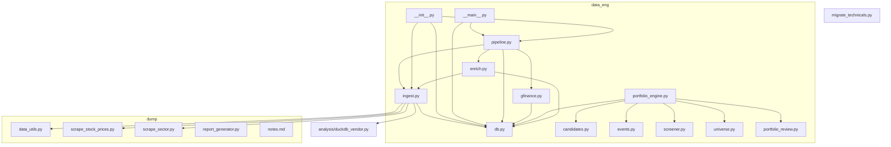

**Diagram sources**
- [data_eng/__init__.py](file://data_eng/__init__.py)
- [data_eng/__main__.py](file://data_eng/__main__.py)
- [data_eng/db.py](file://data_eng/db.py)
- [data_eng/ingest.py](file://data_eng/ingest.py)
- [data_eng/pipeline.py](file://data_eng/pipeline.py)
- [data_eng/gfinance.py](file://data_eng/gfinance.py)
- [data_eng/enrich.py](file://data_eng/enrich.py)
- [data_eng/portfolio_engine.py](file://data_eng/portfolio_engine.py)
- [data_eng/candidates.py](file://data_eng/candidates.py)
- [data_eng/events.py](file://data_eng/events.py)
- [data_eng/screener.py](file://data_eng/screener.py)
- [data_eng/universe.py](file://data_eng/universe.py)
- [data_eng/portfolio_review.py](file://data_eng/portfolio_review.py)
- [dump/data_utils.py](file://dump/data_utils.py)
- [dump/scrape_stock_prices.py](file://dump/scrape_stock_prices.py)
- [dump/scrape_sector.py](file://dump/scrape_sector.py)
- [dump/report_generator.py](file://dump/report_generator.py)
- [analysis/duckdb_vendor.py](file://analysis/duckdb_vendor.py)
- [migrate_technicals.py](file://migrate_technicals.py)

## Core Components
- **Automated Pipeline Orchestrator (pipeline.py)**: New 346-line module that provides end-to-end data processing workflows for stock market data, including ingestion, transformation, and output capabilities with automated scheduling, error handling, and **performance optimizations for improved processing speed**. Features night/day pipeline separation with smart scheduling.
- **Enhanced Ingestion Engine (ingest.py)**: Orchestrates reading from one or more data sources, transforming records, and writing them to the database with significant improvements including batch processing, error handling, retry mechanisms, and logging hooks. Now supports 874+ lines of enhanced functionality with specialized news data processing workflows and **optimized data flow patterns**. Includes technical indicators batch processing.
- **Sophisticated Enrichment System (enrich.py)**: **New** 344-line module providing rolling batch enrichment with watchlist prioritization, staleness-based scheduling, and smart API rate limit management. Supports fundamentals, analyst targets, and ticker enrichment with configurable limits. **Updated**: Completely restructured from rating-filtered processing to sophisticated priority-ordered processing that handles ALL universe tickers with watchlist membership, rating priority, sector priority, and data staleness ordering.
- **Google Finance Integration (gfinance.py)**: **New** Module providing seamless integration with Google Finance API for real-time and historical financial data retrieval, price updates, and market information.
- **Advanced Database Layer (db.py)**: Manages connections, transactions, and provides helper functions for executing queries and handling results with 364 lines of expanded functionality. **Updated**: Enhanced with comprehensive schema support for trading configurations, news metadata, user preferences, technical indicators, portfolio management, and new skip_tickers table for API failure handling. Abstracts vendor-specific details behind a consistent interface with **optimized query execution**.
- **DuckDB Vendor Support (analysis/duckdb_vendor.py)**: **New** Specialized vendor implementation for DuckDB database with optimized query execution and analytical capabilities.
- **Command-Line Interface (__main__.py)**: Provides comprehensive command-line interface to run ingestion jobs, parse arguments, invoke the ingestion engine, and orchestrate the new pipeline with appropriate configuration for production use. **Updated**: Enhanced with night pipeline, enrichment, screening, candidate selection, event detection, and portfolio management commands.
- **Package Initialization (__init__.py)**: Exposes public APIs for importing ingestion, database utilities, and pipeline orchestration from other modules.
- **Data Processing Utilities (dump/data_utils.py)**: **New** Comprehensive data utility functions for financial market data processing, cleaning, and transformation.
- **Stock Price Scraping (dump/scrape_stock_prices.py)**: **New** Dedicated module for scraping real-time and historical stock prices from various financial data sources.
- **Sector Analysis (dump/scrape_sector.py)**: **New** Module for collecting and analyzing sector-specific financial data and market trends.
- **Report Generation (dump/report_generator.py)**: **New** Automated report generation system for creating comprehensive financial analysis reports.
- **Portfolio Management System (portfolio_engine.py)**: **New** Comprehensive portfolio management system for investment tracking, performance metrics, and portfolio optimization.
- **Candidate Selection Logic (candidates.py)**: **New** Automated stock screening and selection algorithms for identifying investment opportunities.
- **Event-Driven Architecture (events.py)**: **New** Real-time market data processing and notification system for immediate response to market changes.
- **Advanced Screening Capabilities (screener.py)**: **New** Sophisticated financial analysis tools for comprehensive stock screening and evaluation.
- **Investment Universe Management (universe.py)**: **New** Dynamic portfolio construction and investment universe management system.
- **Portfolio Review Functionality (portfolio_review.py)**: **New** Performance analysis and reporting system for portfolio evaluation and optimization.
- **Technical Indicators Migration (migrate_technicals.py)**: **New** Migration tool for splitting technical indicators from ticker_enriched to dedicated technicals table.

Key responsibilities:
- Separation of concerns between pipeline orchestration, ingestion, and persistence
- Automated workflow execution with configurable triggers and schedules
- Configurable sources and destinations with intelligent routing
- Robust error handling and retry strategies across all layers
- Logging and observability hooks throughout the processing chain
- Production-ready deployment features with monitoring and alerting
- **New**: Sophisticated enrichment system with rolling batch processing and smart scheduling
- **New**: Night/day pipeline separation with staleness-based optimization
- **New**: Technical indicators migration to dedicated table with batch processing
- **New**: Enhanced database schema supporting trading configurations, news metadata, user preferences, technical indicators, and portfolio management
- **New**: Google Finance API integration for comprehensive financial data sourcing
- **New**: DuckDB vendor support for advanced analytical workloads
- **New**: Comprehensive data processing and reporting capabilities in dump/ directory
- **New**: Automated stock price scraping and sector analysis tools
- **New**: Complete portfolio management system with performance tracking and optimization
- **New**: Event-driven architecture for real-time market data processing
- **New**: Advanced screening and candidate selection algorithms
- **Performance**: Optimized processing speed through batch operations, memory management, parallel execution, and smart scheduling

**Section sources**
- [data_eng/pipeline.py](file://data_eng/pipeline.py)
- [data_eng/ingest.py](file://data_eng/ingest.py)
- [data_eng/enrich.py](file://data_eng/enrich.py)
- [data_eng/gfinance.py](file://data_eng/gfinance.py)
- [data_eng/db.py](file://data_eng/db.py)
- [analysis/duckdb_vendor.py](file://analysis/duckdb_vendor.py)
- [data_eng/__main__.py](file://data_eng/__main__.py)
- [data_eng/__init__.py](file://data_eng/__init__.py)
- [dump/data_utils.py](file://dump/data_utils.py)
- [dump/scrape_stock_prices.py](file://dump/scrape_stock_prices.py)
- [dump/scrape_sector.py](file://dump/scrape_sector.py)
- [dump/report_generator.py](file://dump/report_generator.py)
- [data_eng/portfolio_engine.py](file://data_eng/portfolio_engine.py)
- [data_eng/candidates.py](file://data_eng/candidates.py)
- [data_eng/events.py](file://data_eng/events.py)
- [data_eng/screener.py](file://data_eng/screener.py)
- [data_eng/universe.py](file://data_eng/universe.py)
- [data_eng/portfolio_review.py](file://data_eng/portfolio_review.py)
- [migrate_technicals.py](file://migrate_technicals.py)

## Architecture Overview
The enhanced data pipeline follows a clear separation of concerns with production-ready features and automated orchestration:
- The entry point parses CLI arguments and invokes either the ingestion engine directly or the new pipeline orchestrator with comprehensive configuration options.
- The pipeline orchestrator coordinates multiple processing stages including data ingestion, transformation, validation, and output generation with **optimized execution patterns** and night/day separation.
- The ingestion engine reads data from multiple sources including Google Finance, transforms it, and delegates writes to the database layer with enhanced error handling and specialized news data processing.
- The database layer handles connection lifecycle and executes SQL statements with advanced transaction management and enhanced schema support.
- **New**: Sophisticated enrichment system provides rolling batch processing with watchlist prioritization and staleness-based scheduling.
- **New**: Night pipeline handles bulk enrichment operations while day pipeline focuses on real-time data updates.
- **New**: Technical indicators are computed separately and stored in dedicated table for optimal performance.
- **New**: Dump directory provides comprehensive data processing and reporting capabilities with automated scraping and analysis tools.
- **New**: Portfolio management system integrates seamlessly with the pipeline for comprehensive investment tracking and performance analysis.
- **New**: Event-driven architecture enables real-time market data processing and immediate response to market changes.

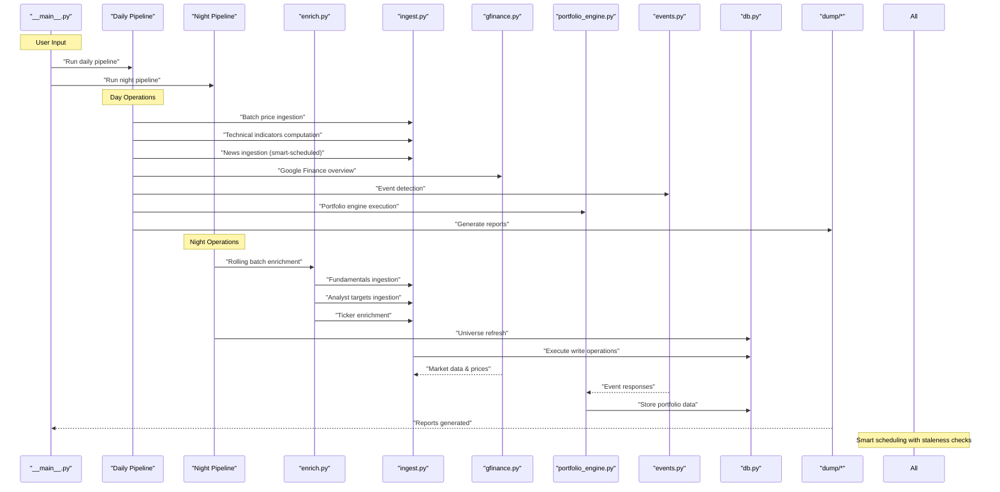

**Diagram sources**
- [data_eng/__main__.py](file://data_eng/__main__.py)
- [data_eng/pipeline.py](file://data_eng/pipeline.py)
- [data_eng/ingest.py](file://data_eng/ingest.py)
- [data_eng/enrich.py](file://data_eng/enrich.py)
- [data_eng/gfinance.py](file://data_eng/gfinance.py)
- [data_eng/portfolio_engine.py](file://data_eng/portfolio_engine.py)
- [data_eng/events.py](file://data_eng/events.py)
- [data_eng/db.py](file://data_eng/db.py)
- [dump/data_utils.py](file://dump/data_utils.py)
- [dump/scrape_stock_prices.py](file://dump/scrape_stock_prices.py)
- [dump/scrape_sector.py](file://dump/scrape_sector.py)
- [dump/report_generator.py](file://dump/report_generator.py)

## Detailed Component Analysis

### Sophisticated Enrichment System (enrich.py)
**Updated** - 344 lines of rolling batch enrichment with sophisticated priority-ordered scheduling

Responsibilities:
- Rolling batch enrichment for fundamentals, analyst targets, and ticker data
- **Priority-Ordered Processing**: Processes ALL universe tickers (any rating), ordered by watchlist membership, rating priority, sector priority, and data staleness
- **Skip Tracking System**: Automatic ticker skipping after 2 consecutive API failures for 30 days
- Staleness-based scheduling to optimize API usage
- Configurable batch limits and sector filtering
- Progress tracking and error handling with retry mechanisms
- **Smart Scheduling**: Processes oldest-loaded tickers first to maintain data freshness

Processing flow:
- Load watchlist and build eligible ticker query with priority ordering
- Query database for stale/missing data ordered by watchlist → rating → sector → staleness
- Process tickers in batches with API pause between requests
- Track progress and handle failures gracefully with skip tracking
- Return success count for monitoring and logging

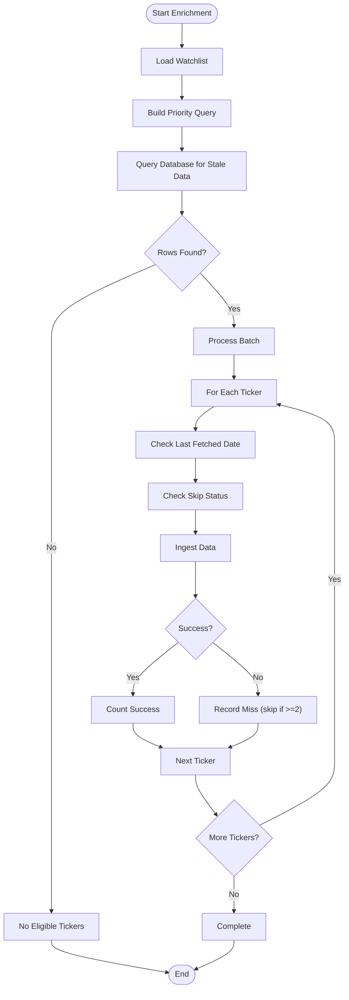

**Diagram sources**
- [data_eng/enrich.py](file://data_eng/enrich.py)

**Section sources**
- [data_eng/enrich.py](file://data_eng/enrich.py)

### Enhanced Pipeline Architecture (pipeline.py)
**Updated** - 440 lines with night/day separation and smart scheduling

Responsibilities:
- Dual pipeline architecture with separate day and night operations
- Smart scheduling based on data staleness thresholds
- Coordinated execution of multiple data sources with rate limiting
- Technical indicators computation and storage
- Portfolio engine integration with event-driven processing
- **Night Pipeline**: Handles bulk enrichment operations with rolling batches and event-gated analysis
- **Day Pipeline**: Focuses on real-time updates and analysis

Processing flow:
- Initialize pipeline with configuration parameters
- Execute day pipeline: prices, news, technicals, AI summaries, screening
- Execute night pipeline: universe refresh, financials, bulk enrichment, event-gated analysis
- Apply smart scheduling to skip fresh data and optimize API usage
- Generate comprehensive logs and metrics for monitoring

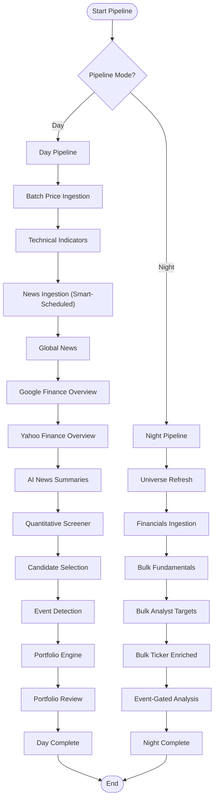

**Diagram sources**
- [data_eng/pipeline.py](file://data_eng/pipeline.py)

**Section sources**
- [data_eng/pipeline.py](file://data_eng/pipeline.py)

### Technical Indicators Migration (migrate_technicals.py)
**New Component** - Migration tool for technical indicators separation

Responsibilities:
- Create dedicated technicals table for technical indicator data
- Migrate existing technical columns from ticker_enriched to technicals table
- Drop migrated columns from ticker_enriched to reduce table size
- Idempotent migration that can be safely re-run
- Safe column existence checking and partial migration support

Migration process:
- Create technicals table with all required columns
- Check if ticker_enriched contains technical columns
- Copy data from ticker_enriched to technicals table
- Drop migrated columns from ticker_enriched
- Report migration statistics and completion status

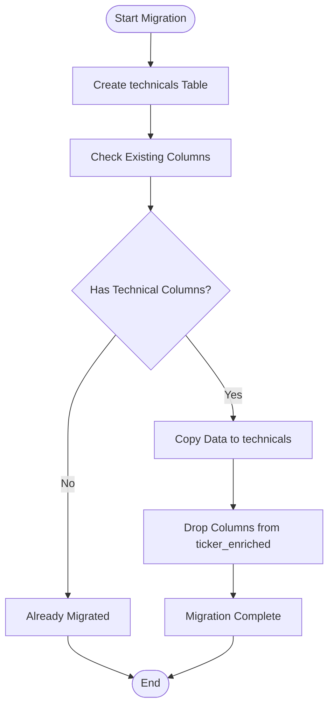

**Diagram sources**
- [migrate_technicals.py](file://migrate_technicals.py)

**Section sources**
- [migrate_technicals.py](file://migrate_technicals.py)

### Enhanced Ingestion Engine (ingest.py)
Responsibilities:
- Source discovery and reading with enhanced validation
- Record transformation and validation with improved error handling
- Batched writes to the database with optimized performance
- Error handling and retries with configurable strategies
- Progress reporting and metrics collection
- **New**: Technical indicators batch processing with compute_technicals function
- **New**: Enhanced batch_ingest_technicals for computing and storing technical indicators
- **Performance**: Optimized batch processing and memory management for improved throughput

Processing flow:
- Initialize source readers with enhanced configuration
- Iterate over batches with improved memory management
- Transform each record with advanced validation rules
- Write to database via db helpers with transaction support
- Handle exceptions and log outcomes with detailed diagnostics
- **New**: Technical indicators computation and storage

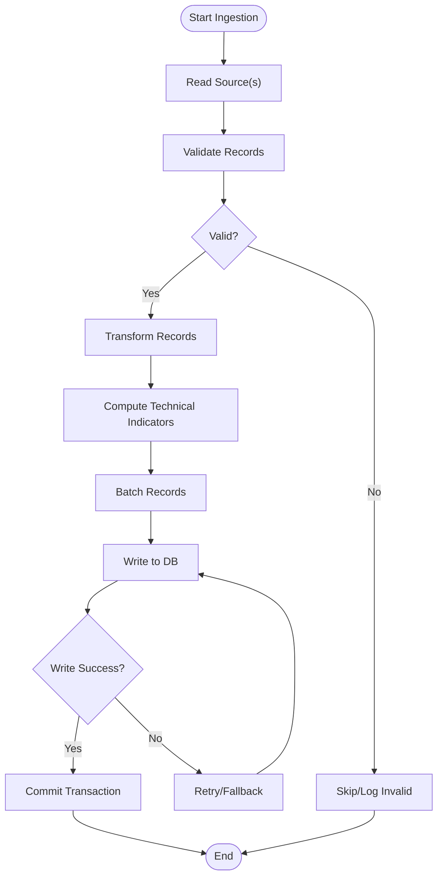

**Diagram sources**
- [data_eng/ingest.py](file://data_eng/ingest.py)

**Section sources**
- [data_eng/ingest.py](file://data_eng/ingest.py)

### Google Finance Integration (gfinance.py)
**New Component** - Dedicated module for Google Finance API integration

Responsibilities:
- Real-time stock price retrieval and historical data access
- Market information and financial metrics extraction
- Symbol validation and ticker symbol normalization
- Rate limiting and API quota management
- Error handling for network failures and API limitations
- Data caching and refresh strategies for optimal performance

Key features:
- **Real-time Price Fetching**: Live stock quotes and market data
- **Historical Data Access**: Time-series price data for analysis
- **Market Information**: Company fundamentals and market statistics
- **Symbol Management**: Ticker symbol validation and standardization
- **API Integration**: Robust Google Finance API client with retry logic

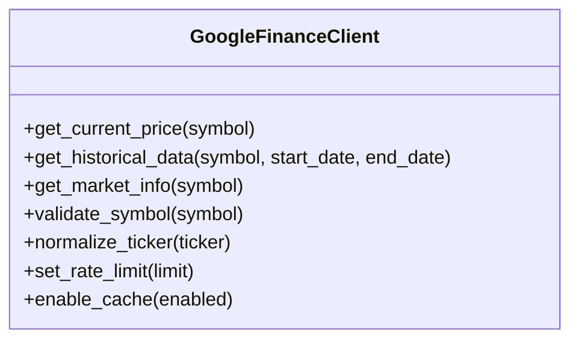

**Diagram sources**
- [data_eng/gfinance.py](file://data_eng/gfinance.py)

**Section sources**
- [data_eng/gfinance.py](file://data_eng/gfinance.py)

### DuckDB Vendor Support (analysis/duckdb_vendor.py)
**New Component** - Specialized DuckDB database vendor implementation

Responsibilities:
- DuckDB-specific connection management and optimization
- Analytical query execution with vectorized processing
- Columnar storage optimization for financial data analysis
- Advanced SQL dialect support for analytical workloads
- Memory-efficient data processing for large datasets
- Integration with pandas and numpy ecosystems

Key capabilities:
- **Vectorized Query Execution**: High-performance analytical queries
- **Columnar Storage**: Optimized storage for time-series financial data
- **Memory Management**: Efficient memory usage for large datasets
- **Pandas Integration**: Seamless data exchange with pandas DataFrames
- **Analytical Functions**: Built-in statistical and mathematical functions

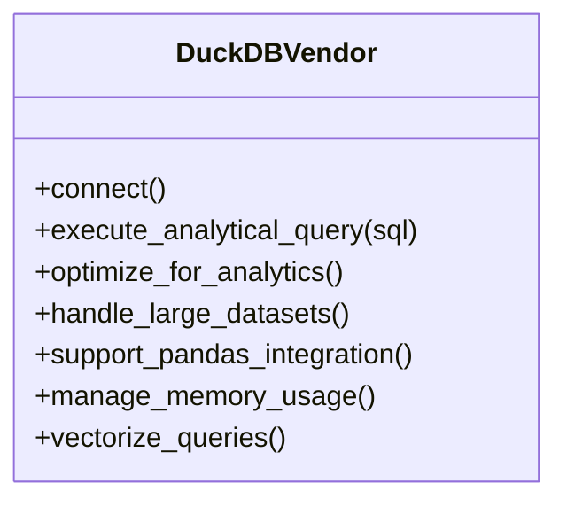

**Diagram sources**
- [analysis/duckdb_vendor.py](file://analysis/duckdb_vendor.py)

**Section sources**
- [analysis/duckdb_vendor.py](file://analysis/duckdb_vendor.py)

### Advanced Database Layer (db.py)
**Updated** - 364 lines with comprehensive schema support and skip tracking

Responsibilities:
- Connection management (connect, close, pool if applicable) with enhanced reliability
- Transaction control (begin, commit, rollback) with improved error handling
- Query execution helpers (execute, executemany) with better performance
- Result mapping and error translation with comprehensive diagnostics
- **New**: Comprehensive schema support for trading configurations, news metadata, user preferences, technical indicators, portfolio management, and skip_tickers table
- **New**: Skip tracking system for API failures with automatic ticker skipping after 2 consecutive failures for 30 days
- **Performance**: Optimized query execution and connection pooling

Common patterns:
- Context managers for safe resource handling
- Parameterized queries to prevent injection
- Vendor-specific adapters behind a unified interface
- Connection pooling and optimization
- **New**: Schema migration support for new data models including skip_tickers table

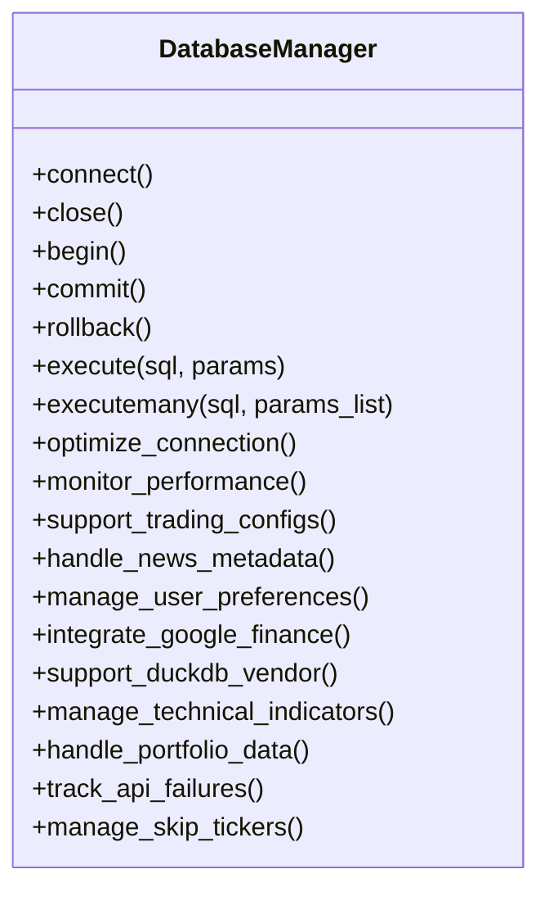

**Diagram sources**
- [data_eng/db.py](file://data_eng/db.py)

**Section sources**
- [data_eng/db.py](file://data_eng/db.py)

### Command-Line Interface Capabilities (__main__.py)
**Updated** - Enhanced with comprehensive pipeline orchestration

Responsibilities:
- Parse command-line arguments (e.g., source path, destination, mode) with comprehensive options
- Load configuration with environment variable support
- Invoke ingestion engine or pipeline orchestrator with appropriate configuration
- Print summary and exit codes with detailed reporting

Typical usage:
- Run full ingestion job with production settings
- Execute automated pipeline for stock market data processing
- Dry-run mode for validation and testing
- Incremental updates based on timestamps or IDs
- Monitoring and health check endpoints
- **New**: Night pipeline execution with bulk enrichment
- **New**: Enrichment commands with sector filtering and limits
- **New**: Screening, candidate selection, and event detection commands
- **New**: Portfolio engine and review execution

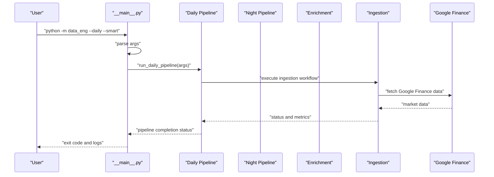

**Diagram sources**
- [data_eng/__main__.py](file://data_eng/__main__.py)
- [data_eng/pipeline.py](file://data_eng/pipeline.py)
- [data_eng/ingest.py](file://data_eng/ingest.py)
- [data_eng/enrich.py](file://data_eng/enrich.py)
- [data_eng/gfinance.py](file://data_eng/gfinance.py)

**Section sources**
- [data_eng/__main__.py](file://data_eng/__main__.py)

### Package Initialization (__init__.py)
**Updated** - Enhanced with pipeline orchestration exports

Responsibilities:
- Define public API surface for imports including pipeline orchestration
- Optionally expose convenience functions for common workflows
- Centralize version or configuration constants

Usage pattern:
- Import specific functions/classes from data_eng including pipeline orchestration
- Avoid internal coupling by exposing only necessary interfaces

**Section sources**
- [data_eng/__init__.py](file://data_eng/__init__.py)

## Enrichment System
**Updated Section** - Comprehensive coverage of the sophisticated enrichment system with priority-ordered processing

The new enrich.py module (344 lines) provides a sophisticated rolling batch enrichment system specifically designed for financial data processing. **Updated**: The system has been completely restructured from rating-filtered processing (Strong Buy/Buy only) to sophisticated priority-ordered processing that handles ALL universe tickers with watchlist membership, rating priority, sector priority, and data staleness ordering. This component serves as the core engine for managing data freshness and optimizing API usage through intelligent scheduling.

### Key Features
- **Priority-Ordered Processing**: Processes ALL universe tickers (any rating), ordered by watchlist membership, rating priority, sector priority, and data staleness
- **Watchlist Prioritization**: Always processes watchlist tickers first regardless of rating
- **Rating-Based Priority**: Strong Buy > Buy > Hold > Sell > Underperform > NULL/other
- **Sector-Based Priority**: technology > industrials > consumer-defensive > healthcare > financial-services > consumer-cyclical > energy > communication-services > utilities > basic-materials > real-estate > unknown
- **Staleness-Based Scheduling**: Prioritizes tickers with oldest data for refresh
- **Skip Tracking System**: Automatic ticker skipping after 2 consecutive API failures for 30 days
- **Sector Filtering**: Optional sector-based filtering for targeted enrichment
- **Configurable Limits**: Adjustable batch sizes and processing limits
- **Progress Tracking**: Detailed logging and progress monitoring
- **Error Handling**: Graceful failure handling with retry mechanisms

### Processing Workflow
1. **Watchlist Loading**: Load watchlist from JSON file with fallback handling
2. **Priority Query Building**: Build complex SQL query with watchlist, rating, sector, and staleness ordering
3. **Skip Condition Filtering**: Exclude tickers with recent API failures using skip_tickers table
4. **Staleness Calculation**: Order tickers by last fetched date (oldest first)
5. **Batch Processing**: Process tickers in configurable batches with API pauses
6. **Data Ingestion**: Call appropriate ingestion functions for each ticker
7. **Skip Tracking**: Record API failures and automatically skip problematic tickers
8. **Progress Tracking**: Log progress every 50 tickers with success counts
9. **Error Management**: Handle failures gracefully without stopping entire batch

### Supported Data Types
- **Fundamentals**: Company fundamentals and financial metrics
- **Analyst Targets**: Analyst recommendations and price targets
- **Ticker Enriched**: Combined growth estimates and target data

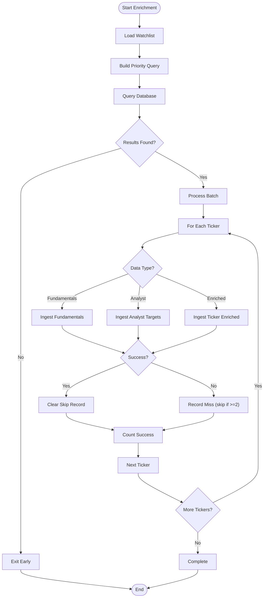

**Diagram sources**
- [data_eng/enrich.py](file://data_eng/enrich.py)

**Section sources**
- [data_eng/enrich.py](file://data_eng/enrich.py)

## Enhanced Pipeline Architecture
**Updated Section** - Comprehensive coverage of the dual pipeline architecture with event-gated analysis

The enhanced pipeline.py module (440 lines) implements a sophisticated dual pipeline architecture with separate day and night operations, smart scheduling, and comprehensive data processing capabilities. **Updated**: The night pipeline now includes event-gated analysis scheduling that combines event-triggered and stale-data queues for efficient TradingAgents analysis processing. This component serves as the central orchestrator for all data processing workflows.

### Key Pipeline Features
- **Dual Pipeline Architecture**: Separate day and night pipelines for different operational needs
- **Smart Scheduling**: Staleness-based scheduling to optimize API usage and reduce redundant calls
- **Coordinated Execution**: Sequential execution of multiple processing stages with error handling
- **Technical Indicators**: Dedicated computation and storage of technical analysis indicators
- **Portfolio Integration**: Seamless integration with portfolio management and analysis systems
- **Event-Driven Processing**: Event-based gating for expensive analysis operations
- **Comprehensive Logging**: Detailed logging and metrics collection for monitoring

### Day Pipeline Operations
1. **Batch Price Ingestion**: Download and store daily price data for universe tickers
2. **Technical Indicators**: Compute and store technical analysis indicators
3. **News Ingestion**: Smart-scheduled news fetching with staleness checks
4. **Global News**: Aggregate global market news from multiple sources
5. **AI Overviews**: Fetch Google Finance and Yahoo Finance AI-powered overviews
6. **News Summaries**: Generate AI-powered news summaries using local LLM
7. **Quantitative Screening**: Run scoring algorithms across multiple dimensions
8. **Candidate Selection**: Select balanced candidates from screened results
9. **Event Detection**: Detect meaningful market events for analysis gating
10. **Trading Agents**: Run AI-powered analysis on event-triggered tickers
11. **Portfolio Engine**: Generate deterministic trade proposals based on rules
12. **Portfolio Review**: LLM-powered review of portfolio decisions

### Night Pipeline Operations
1. **Universe Refresh**: Scrape and update the complete stock universe
2. **Financials Ingestion**: Quarterly financial statement updates for watchlist tickers
3. **Fundamentals Enrichment**: Rolling batch enrichment of company fundamentals
4. **Analyst Targets**: Bulk ingestion of analyst recommendations and targets
5. **Ticker Enrichment**: Comprehensive enrichment with growth estimates and targets
6. **Event-Gated Analysis**: TradingAgents analysis with combined event-triggered and stale-data queues

### Smart Scheduling Implementation
- **News Staleness**: 1-day threshold for news data freshness
- **Enriched Staleness**: 3-day threshold for growth estimates and targets
- **Analyst Staleness**: 3-day threshold for analyst recommendation updates
- **Fundamentals Staleness**: 7-day threshold for company snapshot data
- **Financials Staleness**: 80-day cycle based on quarterly reporting schedule
- **Analysis Staleness**: 7-day threshold for TradingAgents analysis

### Event-Gated Analysis Queue
- **Event Layer**: Candidates + watchlist pass through existing event gate (price move / technical flip / earnings / never-analyzed)
- **Stale Layer**: Universe tickers whose last decision is older than ANALYSIS_STALE_DAYS (or never analyzed)
- **Queue Merge**: Events first, then stale fill; dedupe preserving order
- **Budget Control**: Limited analyses per night run with rollover to next run

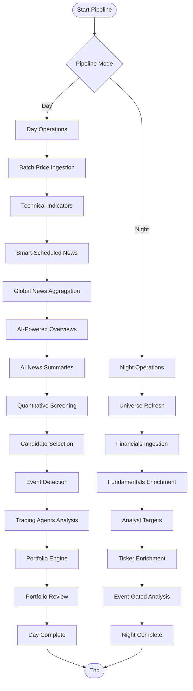

**Diagram sources**
- [data_eng/pipeline.py](file://data_eng/pipeline.py)

**Section sources**
- [data_eng/pipeline.py](file://data_eng/pipeline.py)

## Technical Indicators Migration
**New Section** - Comprehensive coverage of technical indicators separation

The migrate_technicals.py module provides a specialized migration tool for separating technical indicator data from the ticker_enriched table into a dedicated technicals table. This optimization improves database performance and data organization.

### Migration Process
1. **Table Creation**: Create dedicated technicals table with all required columns
2. **Column Detection**: Check existing technical columns in ticker_enriched table
3. **Data Migration**: Copy technical indicator data to new technicals table
4. **Column Cleanup**: Drop migrated columns from ticker_enriched table
5. **Status Reporting**: Provide detailed migration statistics and completion status

### Technical Indicator Categories
- **Trend Indicators**: SMA (20, 50), EMA (12, 26)
- **Momentum Indicators**: MACD (signal, histogram), RSI (14-period)
- **Volatility Indicators**: Bollinger Bands (upper, middle, lower, width)
- **Volume Indicators**: Volume SMA (20), On-Balance Volume (OBV), volume ratio
- **Signal Generation**: Individual signals (RSI, MACD, trend, Bollinger, volume)
- **Combined Signals**: Combined signal strength and trade signal classification

### Migration Benefits
- **Improved Performance**: Smaller ticker_enriched table with faster queries
- **Better Organization**: Logical separation of technical vs fundamental data
- **Optimized Storage**: Reduced redundancy and improved indexing
- **Scalability**: Better support for growing number of technical indicators
- **Maintainability**: Easier maintenance and updates to technical calculations

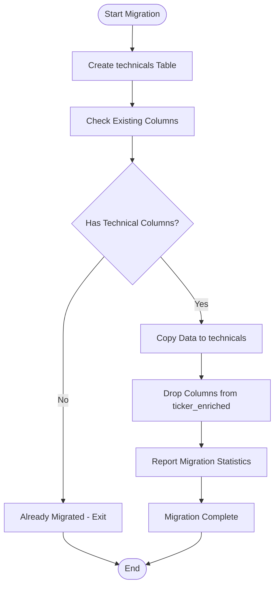

**Diagram sources**
- [migrate_technicals.py](file://migrate_technicals.py)

**Section sources**
- [migrate_technicals.py](file://migrate_technicals.py)

## Portfolio Management System
**New Section** - Comprehensive coverage of the portfolio management system

The portfolio_engine.py module (394 lines) provides a complete portfolio management system for investment tracking, performance metrics, and portfolio optimization. This component serves as the central hub for managing investment portfolios and tracking their performance.

### Key Features
- **Portfolio Tracking**: Real-time tracking of portfolio positions, holdings, and allocations
- **Performance Metrics**: Comprehensive performance analysis including returns, volatility, and risk metrics
- **Position Management**: Automated position sizing, rebalancing, and allocation optimization
- **Risk Management**: Advanced risk assessment and mitigation strategies
- **Performance Attribution**: Detailed breakdown of performance drivers and contribution analysis
- **Integration Support**: Seamless integration with the main data engineering pipeline

### Core Capabilities
- **Portfolio Construction**: Algorithmic portfolio construction based on various strategies
- **Performance Analytics**: Real-time performance calculation and benchmarking
- **Risk Analysis**: Comprehensive risk metrics including VaR, CVaR, and drawdown analysis
- **Optimization Engine**: Portfolio optimization using modern portfolio theory and custom constraints
- **Reporting System**: Automated portfolio reports and performance attribution analysis

### Rule-Based Decision Engine
- **Maximum Position Size**: 20% maximum allocation per single stock
- **Sector Concentration**: 35% maximum exposure per sector
- **Quality Threshold**: Minimum screener score of 80 for buy decisions
- **Cash Reserve**: Mandatory 10% cash reserve requirement
- **Stop Loss**: Mandatory stop loss on all buy positions

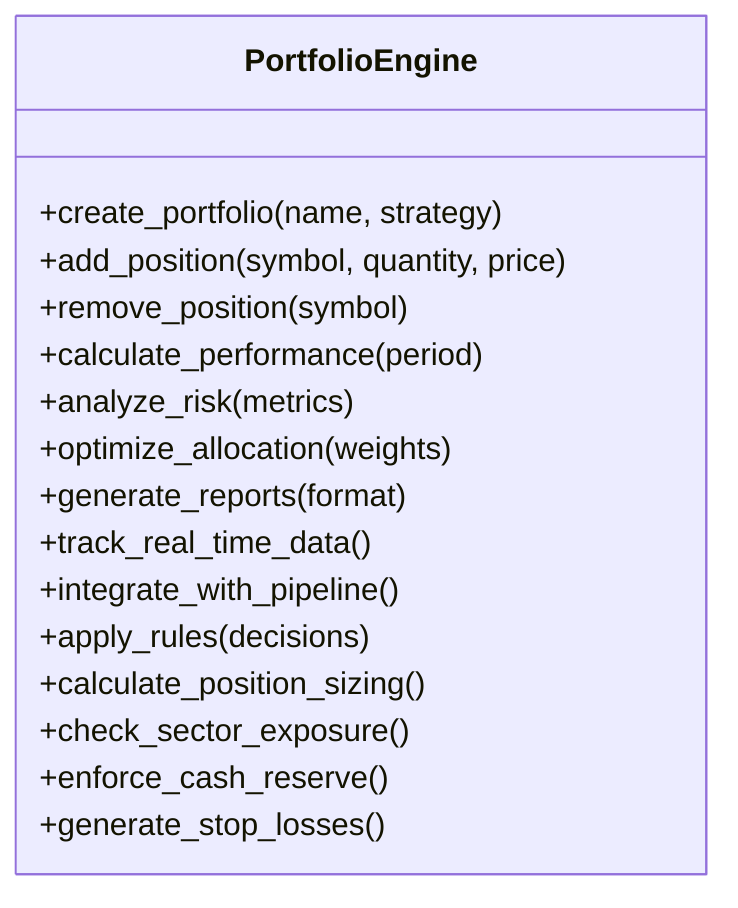

**Diagram sources**
- [data_eng/portfolio_engine.py](file://data_eng/portfolio_engine.py)

**Section sources**
- [data_eng/portfolio_engine.py](file://data_eng/portfolio_engine.py)

## Candidate Selection Logic
**New Section** - Comprehensive coverage of the candidate selection system

The candidates.py module (313 lines) implements sophisticated candidate selection logic for automated stock screening and investment opportunity identification. This component uses advanced algorithms to identify promising investment candidates based on multiple criteria.

### Selection Criteria
- **Fundamental Analysis**: Financial ratios, earnings quality, and valuation metrics
- **Technical Analysis**: Price patterns, momentum indicators, and trend analysis
- **Quantitative Scoring**: Multi-factor scoring systems and ranking algorithms
- **Risk Assessment**: Volatility measures, correlation analysis, and risk-adjusted returns
- **Market Intelligence**: Sentiment analysis, news impact, and market microstructure signals

### Screening Algorithms
- **Multi-Factor Models**: Combination of value, growth, momentum, and quality factors
- **Machine Learning Integration**: Predictive models for stock performance forecasting
- **Customizable Filters**: User-defined screening criteria and filtering rules
- **Dynamic Rebalancing**: Automatic candidate list updates based on market conditions
- **Backtesting Framework**: Historical performance validation of selection strategies

### Sector Allocation Strategy
- **Technology**: Maximum 5 candidates per sector
- **Healthcare**: Maximum 3 candidates per sector
- **Financial Services**: Maximum 3 candidates per sector
- **Consumer Cyclical**: Maximum 2 candidates per sector
- **Consumer Defensive**: Maximum 1 candidate per sector
- **Industrials**: Maximum 2 candidates per sector
- **Energy**: Maximum 1 candidate per sector
- **Communication Services**: Maximum 1 candidate per sector

### Correlation Filtering
- **Correlation Threshold**: 0.85 Pearson correlation threshold
- **Lookback Period**: 6 months (126 trading days) for correlation calculation
- **Pairwise Analysis**: Comprehensive pairwise correlation matrix computation
- **Greedy Removal**: Remove lower-scored tickers from highly correlated pairs

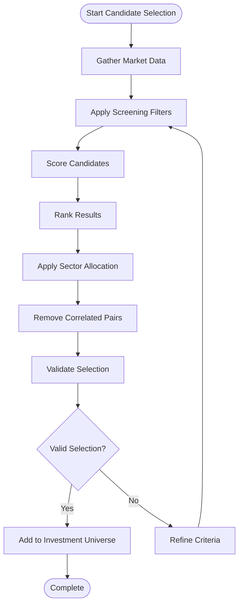

**Diagram sources**
- [data_eng/candidates.py](file://data_eng/candidates.py)

**Section sources**
- [data_eng/candidates.py](file://data_eng/candidates.py)

## Event-Driven Architecture
**Updated Section** - Comprehensive coverage of the event-driven system with enhanced analysis gating

The events.py module (261 lines) implements an event-driven architecture for real-time market data processing and notification systems. **Updated**: Enhanced with sophisticated analysis gating that combines event-triggered and stale-data queues for efficient TradingAgents analysis processing. This component enables immediate response to market changes and facilitates asynchronous processing of financial data.

### Event Types
- **Market Data Events**: Real-time price updates, volume changes, and market movements
- **Portfolio Events**: Position changes, rebalancing triggers, and performance alerts
- **Signal Events**: Trading signals, buy/sell recommendations, and strategy triggers
- **Risk Events**: Risk threshold breaches, volatility spikes, and anomaly detection
- **System Events**: Pipeline status updates, error notifications, and health checks

### Event Processing
- **Event Bus**: Centralized event distribution and routing system
- **Message Queuing**: Asynchronous message processing with guaranteed delivery
- **Event Sourcing**: Complete audit trail of all market and portfolio events
- **Real-time Processing**: Low-latency event handling for time-sensitive operations
- **Scalable Architecture**: Horizontal scaling for high-volume event processing

### Event Detection Logic
- **Price Move Detection**: 5% daily price change threshold for triggering analysis
- **Technical Signal Changes**: Trade signal changes in technical indicators
- **News Events**: New article detection since last analysis date
- **Earnings Events**: New financial filing detection with report dates

### Analysis Gating System
- **Event Layer**: Candidates + watchlist pass through existing event gate
- **Stale Layer**: Universe tickers with stale analysis (>7 days or never analyzed)
- **Queue Merge**: Events first, then stale fill; dedupe preserving order
- **Budget Control**: Limited analyses per night run with rollover capability

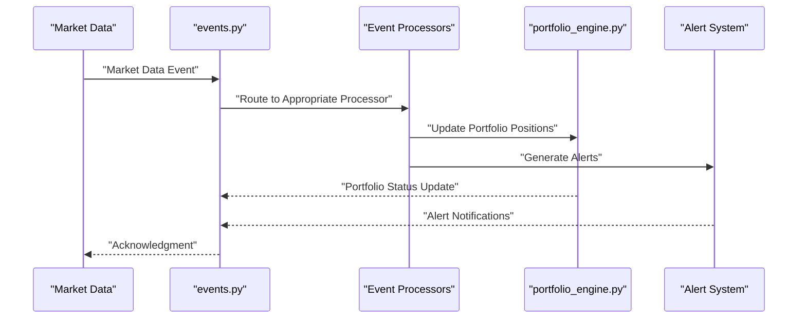

**Diagram sources**
- [data_eng/events.py](file://data_eng/events.py)

**Section sources**
- [data_eng/events.py](file://data_eng/events.py)

## Advanced Screening Capabilities
**New Section** - Comprehensive coverage of the screening system

The screener.py module (437 lines) provides advanced screening capabilities for sophisticated financial analysis and stock evaluation. This component offers comprehensive tools for analyzing and evaluating investment opportunities across multiple dimensions.

### Screening Dimensions
- **Fundamental Screening**: Financial statement analysis, ratio analysis, and valuation metrics
- **Technical Screening**: Chart pattern recognition, indicator analysis, and momentum screening
- **Quantitative Screening**: Statistical analysis, factor models, and algorithmic screening
- **Alternative Data Screening**: News sentiment, social media analysis, and alternative data sources
- **Risk Screening**: Volatility analysis, correlation screening, and risk factor exposure

### Analysis Tools
- **Multi-Criteria Analysis**: Simultaneous evaluation across multiple screening criteria
- **Customizable Screens**: User-defined screening parameters and weighting schemes
- **Historical Backtesting**: Validation of screening strategies against historical data
- **Performance Attribution**: Detailed analysis of screening strategy effectiveness
- **Benchmark Comparison**: Comparative analysis against market indices and peer groups

### Scoring Categories
- **Quality Metrics**: ROE, ROA, gross margin, operating margin, earnings trends
- **Value Metrics**: Forward PE, PEG ratio, free cash flow yield
- **Momentum Metrics**: 3-month and 6-month returns, RSI, 200-day moving average
- **Sentiment Metrics**: Bullish ratio, target upside potential
- **Risk Metrics**: Debt-to-equity ratio, beta, 63-day volatility

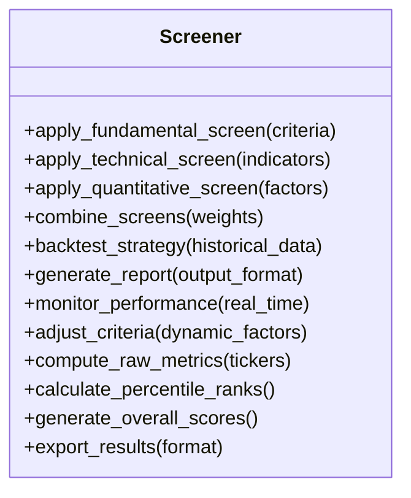

**Diagram sources**
- [data_eng/screener.py](file://data_eng/screener.py)

**Section sources**
- [data_eng/screener.py](file://data_eng/screener.py)

## Investment Universe Management
**New Section** - Comprehensive coverage of the investment universe system

The universe.py module (164 lines) manages investment universes for dynamic portfolio construction and asset allocation. This component provides sophisticated tools for defining, managing, and optimizing investment universes based on various criteria and constraints.

### Universe Definition
- **Static Universes**: Fixed sets of securities based on indices, sectors, or custom criteria
- **Dynamic Universes**: Automatically updated universes based on market conditions and screening results
- **Hierarchical Universes**: Nested universe structures with parent-child relationships
- **Conditional Universes**: Universes that change based on predefined conditions and triggers
- **Time-based Universes**: Universes that evolve over time with scheduled updates

### Management Features
- **Universe Creation**: Programmatic creation and configuration of investment universes
- **Member Management**: Addition, removal, and modification of universe members
- **Weight Calculation**: Automated weight assignment and rebalancing algorithms
- **Constraint Handling**: Compliance with regulatory and investment policy constraints
- **Performance Monitoring**: Continuous monitoring of universe composition and performance

### Sector Group Organization
- **Group 1**: Industrials, Utilities, Basic Materials
- **Group 2**: Financial Services, Real Estate, Communication Services
- **Group 3**: Technology, Energy, Consumer Defensive
- **Group 4**: Healthcare, Consumer Cyclical

### Rating-Based Filtering
- **Strong Buy**: Highest conviction stocks with strongest fundamentals
- **Buy**: Solid companies with positive outlook and good valuations
- **Hold**: Stable companies suitable for income-focused portfolios
- **Sell**: Companies with deteriorating fundamentals or poor outlook
- **Underperform**: Companies with significant challenges or negative prospects


**Diagram sources**
- [data_eng/universe.py](file://data_eng/universe.py)

**Section sources**
- [data_eng/universe.py](file://data_eng/universe.py)

## Portfolio Review Functionality
**New Section** - Comprehensive coverage of the portfolio review system

The portfolio_review.py module (210 lines) provides comprehensive portfolio review functionality for performance analysis, reporting, and optimization. This component offers detailed analysis tools for evaluating portfolio performance and identifying areas for improvement.

### Performance Analysis
- **Return Analysis**: Total return, annualized return, and risk-adjusted performance metrics
- **Attribution Analysis**: Breakdown of performance by asset class, sector, and individual holdings
- **Benchmark Comparison**: Performance comparison against relevant benchmarks and peer groups
- **Risk Analysis**: Comprehensive risk metrics including volatility, drawdown, and downside risk
- **Factor Exposure**: Analysis of exposure to systematic risk factors and style characteristics

### Reporting Capabilities
- **Automated Reports**: Scheduled generation of comprehensive portfolio reports
- **Customizable Templates**: Flexible report templates for different stakeholder needs
- **Interactive Dashboards**: Web-based dashboards for real-time portfolio monitoring
- **Export Formats**: Multiple export formats including PDF, Excel, and interactive HTML
- **Regulatory Reporting**: Compliance reporting for regulatory requirements

### LLM-Powered Review System
- **Local LLM Integration**: Uses llama.cpp server for local AI-powered analysis
- **Context-Aware Prompts**: Builds comprehensive prompts from portfolio decisions and technical analysis summaries
- **Risk Identification**: Identifies contradictions, concentration risks, and cross-holding interactions
- **Actionable Insights**: Provides concise, bullet-point recommendations focused on actionable concerns
- **Constrained Output**: Maintains under 300-word responses for readability and actionability

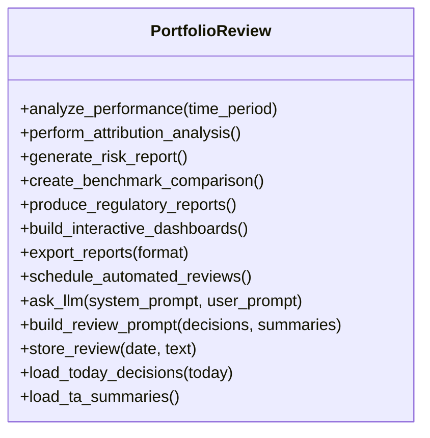

**Diagram sources**
- [data_eng/portfolio_review.py](file://data_eng/portfolio_review.py)

**Section sources**
- [data_eng/portfolio_review.py](file://data_eng/portfolio_review.py)

## Database Schema Enhancements
**Updated Section** - Comprehensive coverage of database schema improvements with skip tracking

The database layer has been significantly enhanced with comprehensive schema support for all new system components, providing robust data storage and retrieval capabilities. **Updated**: Added new skip_tickers table for handling API failures gracefully with automatic ticker skipping after 2 consecutive failures for 30 days.

### Core Tables
- **daily_prices**: OHLCV data with corporate actions (dividends, stock splits)
- **news**: Ticker-specific news articles with metadata and URLs
- **global_news**: Aggregated global market news from multiple sources
- **fundamentals**: Company fundamentals and financial metrics snapshots
- **financials**: Quarterly financial statements in JSON format
- **analyst_targets**: Analyst recommendations and price targets
- **news_summaries**: AI-generated news summaries for tickers

### Advanced Tables
- **trading_agent_decisions**: AI-powered trading decisions with ratings and summaries
- **gfinance_overview**: Google Finance AI-powered bull/bear analysis
- **yfinance_overview**: Yahoo Finance AI-powered market overviews
- **ticker_enriched**: Combined growth estimates, targets, and recommendations
- **technicals**: Dedicated technical indicators table with signals and combined scores
- **screener_scores**: Quantitative screening results across multiple categories
- **candidates**: Selected investment candidates with sector allocation
- **events**: Event-driven triggers for analysis and alerts
- **portfolio_decisions**: Deterministic portfolio engine trade proposals
- **portfolio_reviews**: LLM-powered portfolio review summaries
- **stock_universe**: Complete stock universe with ratings and sector information

### Skip Tracking System
- **skip_tickers**: Tracks tickers that repeatedly returned no data for a source
- **Automatic Skipping**: After 2 consecutive empty results, ticker is skipped for 30 days
- **Source-Specific Tracking**: Separate tracking for different data sources (fundamentals, analyst_targets, ticker_enriched, prices)
- **Retry Window Management**: Automatic retry after configured retry period expires
- **Graceful Degradation**: System continues operating even with problematic tickers

### Schema Features
- **Primary Keys**: Composite keys for efficient querying and data integrity
- **Data Types**: Optimized data types for financial data (DOUBLE, BIGINT, VARCHAR)
- **Indexes**: Strategic indexing for performance optimization
- **Constraints**: Data validation through NOT NULL and CHECK constraints
- **Migration Support**: ALTER TABLE statements for safe schema evolution
- **Corporate Actions**: Dividend and stock split tracking for accurate price history

### Performance Optimizations
- **Columnar Storage**: DuckDB's columnar storage for analytical queries
- **Partitioning**: Logical partitioning by ticker and date for efficient range queries
- **Compression**: Automatic compression for reduced storage footprint
- **Query Optimization**: Optimized query patterns for common financial analysis tasks
- **Connection Pooling**: Efficient connection management for concurrent access

**Section sources**
- [data_eng/db.py](file://data_eng/db.py)

## Command-Line Interface Capabilities
**Updated** - Comprehensive CLI with pipeline orchestration and advanced features

The enhanced CLI provides comprehensive control over data ingestion operations and pipeline orchestration with extensive command options.

### Available Commands
- **Full Ingestion**: `python -m data_eng --full` for complete data processing
- **Pipeline Execution**: `python -m data_eng --pipeline` for automated stock market data workflows
- **Incremental Updates**: `python -m data_eng --incremental` for targeted updates
- **Dry Run Mode**: `python -m data_eng --dry-run` for validation without execution
- **Configuration Management**: `python -m data_eng --config <path>` for custom configurations
- **Night Pipeline**: `python -m data_eng --night` for bulk enrichment operations
- **Daily Pipeline**: `python -m data_eng --daily` for comprehensive daily updates
- **Smart Daily**: `python -m data_eng --daily-smart` for staleness-optimized daily runs
- **Universe Build**: `python -m data_eng --universe` for complete stock universe creation
- **Universe Group**: `python -m data_eng --universe-group N` for sector group processing
- **Screening**: `python -m data_eng --screen` for quantitative stock screening
- **Candidate Selection**: `python -m data_eng --candidates` for investment candidate selection
- **Event Detection**: `python -m data_eng --events` for market event analysis
- **Portfolio Engine**: `python -m data_eng --portfolio` for rule-based portfolio decisions
- **Portfolio Review**: `python -m data_eng --review` for LLM-powered portfolio analysis
- **Enrichment**: `python -m data_eng --enrich` for rolling batch data enrichment
- **Batch Processing**: `python -m data_eng --batch` for price data batch downloads
- **Universe Batch**: `python -m data_eng --batch-universe` for universe-wide price updates

### Configuration Options
- **Source Configuration**: Multiple input format support (CSV, JSON, Parquet) with Google Finance integration
- **Destination Settings**: Flexible database target configuration with DuckDB support
- **Processing Modes**: Various processing strategies for different use cases
- **Pipeline Scheduling**: Automated execution with cron-like scheduling
- **Monitoring Options**: Health checks and status reporting
- **Enrichment Parameters**: Sector filtering, rating filters, and batch limits
- **Portfolio Configuration**: Capital allocation, risk parameters, and constraint settings
- **Event Thresholds**: Customizable thresholds for price moves and technical signals

### Environment Integration
- **Environment Variables**: Support for environment-based configuration
- **Secret Management**: Secure handling of sensitive credentials
- **Deployment Scripts**: Ready-to-use scripts for automated deployments
- **Pipeline Triggers**: Event-driven pipeline execution based on data availability
- **Logging Configuration**: Configurable log levels and output formats

**Section sources**
- [data_eng/__main__.py](file://data_eng/__main__.py)

## Data Processing and Reporting Module
**New Section** - Comprehensive coverage of the dump/ directory functionality

The new dump/ directory provides a complete data processing and reporting module with financial market analysis capabilities. This module includes stock price scraping, sector analysis, and automated report generation functionality.

### Core Components
- **Data Utilities (data_utils.py)**: Comprehensive utility functions for data processing, cleaning, and transformation operations
- **Stock Price Scraper (scrape_stock_prices.py)**: Automated scraping of real-time and historical stock prices from financial data sources
- **Sector Analysis (scrape_sector.py)**: Tools for collecting and analyzing sector-specific financial data and market trends
- **Report Generator (report_generator.py)**: Automated report generation system for creating comprehensive financial analysis reports
- **Documentation (notes.md)**: Usage instructions and documentation for the data processing module

### Key Features
- **Automated Data Scraping**: Real-time and historical stock price collection from multiple sources
- **Sector Analysis**: Comprehensive sector-specific financial data analysis and trend identification
- **Report Generation**: Automated creation of detailed financial analysis reports
- **Data Processing Pipeline**: End-to-end data processing workflow with validation and transformation
- **Integration Support**: Seamless integration with the main data engineering pipeline

### Processing Workflow
1. **Data Collection**: Automated scraping of stock prices and sector data
2. **Data Processing**: Cleaning, validation, and transformation of collected data
3. **Analysis**: Financial analysis and trend identification
4. **Report Generation**: Creation of comprehensive analysis reports
5. **Distribution**: Automated distribution of reports and data outputs

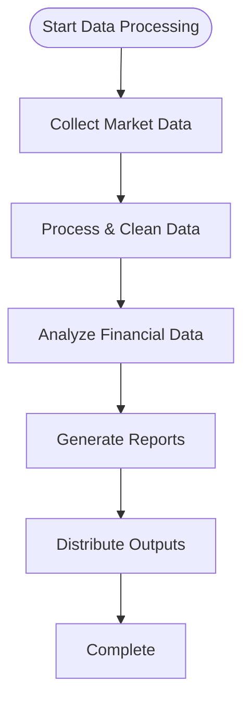

**Diagram sources**
- [dump/data_utils.py](file://dump/data_utils.py)
- [dump/scrape_stock_prices.py](file://dump/scrape_stock_prices.py)
- [dump/scrape_sector.py](file://dump/scrape_sector.py)
- [dump/report_generator.py](file://dump/report_generator.py)

**Section sources**
- [dump/data_utils.py](file://dump/data_utils.py)
- [dump/scrape_stock_prices.py](file://dump/scrape_stock_prices.py)
- [dump/scrape_sector.py](file://dump/scrape_sector.py)
- [dump/report_generator.py](file://dump/report_generator.py)
- [dump/notes.md](file://dump/notes.md)

## Financial Market Analysis Capabilities
**New Section** - Comprehensive financial market analysis functionality

The data processing module provides extensive financial market analysis capabilities through its integrated scraping and analysis tools.

### Stock Price Analysis
- **Real-time Price Monitoring**: Live stock price tracking and alerts
- **Historical Price Analysis**: Time-series analysis of stock price movements
- **Technical Indicators**: Calculation of common technical analysis indicators
- **Price Pattern Recognition**: Automated detection of price patterns and trends

### Sector Analysis
- **Sector Performance Tracking**: Monitoring of sector-specific market performance
- **Sector Rotation Analysis**: Identification of sector rotation patterns
- **Comparative Analysis**: Cross-sector performance comparisons
- **Industry Trend Analysis**: Analysis of industry-specific trends and developments

### Report Generation
- **Automated Report Creation**: Scheduled generation of comprehensive financial reports
- **Customizable Templates**: Flexible report templates for different analysis types
- **Data Visualization**: Integrated charts and graphs for data presentation
- **Export Formats**: Multiple export formats including PDF, Excel, and CSV

### Integration Features
- **Pipeline Integration**: Seamless integration with the main data engineering pipeline
- **Database Connectivity**: Direct database connectivity for data storage and retrieval
- **API Access**: RESTful API access for external system integration
- **Scheduling Support**: Cron-based scheduling for automated execution

**Section sources**
- [dump/scrape_stock_prices.py](file://dump/scrape_stock_prices.py)
- [dump/scrape_sector.py](file://dump/scrape_sector.py)
- [dump/report_generator.py](file://dump/report_generator.py)

## Production Deployment Features
**Updated** - Enhanced production readiness with comprehensive monitoring and scalability

The enhanced module includes several production-ready features with significant improvements for enterprise deployment.

### Reliability and Resilience
- **Graceful Degradation**: System continues operating even with partial failures
- **Circuit Breaker Pattern**: Prevents cascading failures
- **Health Check Endpoints**: Comprehensive system health monitoring
- **Automatic Recovery**: Self-healing capabilities for common failure scenarios
- **Pipeline Retry Logic**: Automated re-execution of failed pipeline stages
- **Enrichment Retry**: Sophisticated retry mechanisms for enrichment operations
- **Event Queue Resilience**: Guaranteed message delivery with dead letter queues
- **Database Failover**: Automatic failover to backup databases
- **Skip Tracking**: Automatic ticker skipping after API failures prevents cascading errors

### Scalability and Performance
- **Horizontal Scaling**: Support for distributed processing
- **Resource Optimization**: Efficient CPU and memory utilization
- **Load Balancing**: Even distribution of processing workload
- **Caching Strategies**: Intelligent data caching for improved performance
- **Pipeline Parallelism**: Concurrent execution of independent pipeline stages
- **Batch Processing**: Optimized batch operations for large datasets
- **Smart Scheduling**: Staleness-based optimization to reduce redundant API calls
- **Technical Indicators**: Dedicated table for optimized technical analysis queries
- **DuckDB Vectorization**: High-performance analytical query execution
- **Memory Management**: Efficient memory usage with streaming capabilities

### Monitoring and Observability
- **Structured Logging**: Machine-readable log output with correlation IDs
- **Metrics Export**: Prometheus-compatible metrics for system monitoring
- **Trace Propagation**: Distributed tracing support for request tracking
- **Alerting Integration**: Automated alerting for critical issues and anomalies
- **Pipeline Dashboards**: Real-time visualization of pipeline execution
- **Performance Analytics**: Detailed performance metrics and bottleneck identification
- **Enrichment Monitoring**: Tracking of enrichment progress and success rates
- **Event Processing Metrics**: Real-time event processing statistics
- **Portfolio Performance**: Portfolio-level performance and risk metrics
- **Skip Tracking Monitoring**: Visibility into API failure patterns and ticker skipping

### Security and Compliance
- **Input Validation**: Comprehensive input validation and sanitization
- **SQL Injection Prevention**: Parameterized queries throughout the system
- **Access Control**: Role-based access control for sensitive operations
- **Audit Logging**: Complete audit trail of all data modifications
- **Data Encryption**: Encryption at rest and in transit for sensitive data
- **Compliance Reporting**: Automated compliance reporting and data retention
- **Privacy Controls**: GDPR and privacy regulation compliance features

### Deployment Automation
- **Container Support**: Docker containerization for consistent deployment
- **Configuration Management**: Environment-based configuration with secrets management
- **Health Checks**: Automated health checks and readiness probes
- **Rolling Updates**: Zero-downtime deployment with rolling updates
- **Backup and Recovery**: Automated backup and disaster recovery procedures
- **Infrastructure as Code**: Terraform and Ansible scripts for infrastructure management

**Section sources**
- [data_eng/pipeline.py](file://data_eng/pipeline.py)
- [data_eng/enrich.py](file://data_eng/enrich.py)
- [data_eng/events.py](file://data_eng/events.py)
- [data_eng/db.py](file://data_eng/db.py)

## Dependency Analysis
**Updated** - Enhanced dependency structure with new components

Internal dependencies have been significantly expanded with the addition of new modules and enhanced interconnections.

### Core Dependencies
- **__main__.py** depends on pipeline.py for orchestration with enhanced CLI features
- **pipeline.py** depends on ingest.py for data processing workflows with night/day separation
- **ingest.py** depends on db.py for persistence with advanced database operations
- **enrich.py** depends on ingest.py for data ingestion and db.py for database operations
- **gfinance.py** depends on db.py for data storage and cache management
- **portfolio_engine.py** depends on db.py for data access and decision persistence
- **candidates.py** depends on db.py for screening data and universe information
- **events.py** depends on db.py for event detection and state management
- **screener.py** depends on db.py for multi-dimensional data analysis
- **universe.py** depends on db.py for universe management and sector data
- **portfolio_review.py** depends on db.py for decision data and LLM integration

### External Dependencies
- **Database Driver**: DuckDB with optimized analytical query execution
- **Financial Data**: yfinance library for market data and company information
- **Web Scraping**: BeautifulSoup for web page parsing and data extraction
- **Data Processing**: Pandas and NumPy for numerical computations and data manipulation
- **API Integration**: Requests library for HTTP API calls and rate limiting
- **LLM Integration**: Local llama.cpp server for AI-powered analysis and reviews
- **Configuration**: Standard Python libraries for configuration and logging
- **File I/O**: JSON and CSV processing for data import/export operations

### Dependency Graph
```mermaid
graph TB
Main["__main__.py"] --> Pipeline["pipeline.py"]
Pipeline --> Ingest["ingest.py"]
Pipeline --> Enrich["enrich.py"]
Pipeline --> GFinance["gfinance.py"]
Pipeline --> Portfolio["portfolio_engine.py"]
Pipeline --> Candidates["candidates.py"]
Pipeline --> Events["events.py"]
Pipeline --> Screener["screener.py"]
Pipeline --> Universe["universe.py"]
Pipeline --> Review["portfolio_review.py"]
Ingest --> DB["db.py"]
Enrich --> Ingest
Enrich --> DB
GFinance --> DB
Portfolio --> DB
Candidates --> DB
Events --> DB
Screener --> DB
Universe --> DB
Review --> DB
DB --> DuckDB["DuckDB Engine"]
Ingest --> YFinance["yfinance Library"]
Ingest --> BeautifulSoup["BeautifulSoup"]
Review --> LLM["Local LLM Server"]
```

**Diagram sources**
- [data_eng/__main__.py](file://data_eng/__main__.py)
- [data_eng/pipeline.py](file://data_eng/pipeline.py)
- [data_eng/ingest.py](file://data_eng/ingest.py)
- [data_eng/enrich.py](file://data_eng/enrich.py)
- [data_eng/gfinance.py](file://data_eng/gfinance.py)
- [data_eng/portfolio_engine.py](file://data_eng/portfolio_engine.py)
- [data_eng/candidates.py](file://data_eng/candidates.py)
- [data_eng/events.py](file://data_eng/events.py)
- [data_eng/screener.py](file://data_eng/screener.py)
- [data_eng/universe.py](file://data_eng/universe.py)
- [data_eng/portfolio_review.py](file://data_eng/portfolio_review.py)
- [data_eng/db.py](file://data_eng/db.py)

**Section sources**
- [data_eng/__main__.py](file://data_eng/__main__.py)
- [data_eng/pipeline.py](file://data_eng/pipeline.py)
- [data_eng/ingest.py](file://data_eng/ingest.py)
- [data_eng/enrich.py](file://data_eng/enrich.py)
- [data_eng/gfinance.py](file://data_eng/gfinance.py)
- [data_eng/portfolio_engine.py](file://data_eng/portfolio_engine.py)
- [data_eng/candidates.py](file://data_eng/candidates.py)
- [data_eng/events.py](file://data_eng/events.py)
- [data_eng/screener.py](file://data_eng/screener.py)
- [data_eng/universe.py](file://data_eng/universe.py)
- [data_eng/portfolio_review.py](file://data_eng/portfolio_review.py)
- [data_eng/db.py](file://data_eng/db.py)

## Performance Considerations
**Updated** - Significant performance optimizations across all components

The enhanced system includes numerous performance optimizations designed for high-throughput financial data processing.

### Database Performance
- **DuckDB Optimization**: Leveraging DuckDB's columnar storage and vectorized query execution
- **Index Strategy**: Strategic indexing on ticker, date, and frequently queried columns
- **Connection Pooling**: Efficient connection reuse and management
- **Batch Operations**: Optimized batch inserts and updates for large datasets
- **Query Optimization**: Complex queries optimized for analytical workloads
- **Memory Management**: Efficient memory usage with streaming and pagination

### Processing Performance
- **Batch Processing**: Intelligent batching strategies for optimal throughput
- **Parallel Execution**: Concurrent processing of independent operations
- **Smart Scheduling**: Staleness-based scheduling to avoid redundant API calls
- **Caching Strategies**: Multi-level caching for frequently accessed data
- **Rate Limiting**: Intelligent API rate limiting with automatic backoff
- **Memory Optimization**: Streaming processing for large datasets

### Network Performance
- **Connection Reuse**: Persistent connections for API calls
- **Request Batching**: Consolidated API requests where possible
- **Timeout Management**: Configurable timeouts with retry logic
- **Compression**: Request/response compression for large datasets
- **CDN Integration**: Cache-friendly endpoints for static data

### System Performance
- **Resource Monitoring**: Real-time monitoring of CPU, memory, and I/O usage
- **Auto-scaling**: Horizontal scaling based on load and resource utilization
- **Load Balancing**: Even distribution of processing workload
- **Garbage Collection**: Optimized garbage collection for memory-intensive operations
- **Thread Safety**: Thread-safe operations with proper synchronization

### Specific Optimizations
- **Technical Indicators**: Dedicated table with optimized queries for technical analysis
- **Enrichment Batching**: Rolling batch processing with priority queuing
- **Event Processing**: Efficient event detection with minimal database queries
- **Portfolio Calculations**: Optimized portfolio analytics with cached intermediate results
- **Screening Algorithms**: Vectorized calculations using NumPy and Pandas
- **News Processing**: Efficient news aggregation with deduplication and caching
- **Skip Tracking**: Efficient skip tracking with minimal database overhead

### Monitoring and Tuning
- **Performance Metrics**: Comprehensive metrics collection and analysis
- **Bottleneck Identification**: Automated bottleneck detection and reporting
- **Capacity Planning**: Proactive capacity planning based on growth trends
- **Load Testing**: Regular load testing to validate performance assumptions
- **Profiling**: Code profiling to identify optimization opportunities

**Section sources**
- [data_eng/pipeline.py](file://data_eng/pipeline.py)
- [data_eng/enrich.py](file://data_eng/enrich.py)
- [data_eng/ingest.py](file://data_eng/ingest.py)
- [data_eng/db.py](file://data_eng/db.py)

## Troubleshooting Guide
**Updated** - Comprehensive troubleshooting guide covering all new components

Common issues and resolutions have been expanded to cover the new enrichment system, technical indicators, and enhanced pipeline architecture.

### Common Issues and Resolutions
- **Connection Failures**: Verify credentials, network access, and service availability with enhanced diagnostic tools
- **Permission Errors**: Check database user privileges and table schemas with automated permission validation
- **Data Validation Failures**: Inspect malformed records and adjust parsing rules with detailed error reporting
- **Deadlocks and Timeouts**: Reduce concurrency, optimize queries, and increase timeouts with deadlock detection
- **Memory Pressure**: Lower batch sizes or stream data instead of loading fully into memory with memory monitoring
- **Performance Issues**: Analyze query performance and optimize bottlenecks with profiling tools
- **Configuration Problems**: Validate configuration files and environment variables with syntax checking
- **Pipeline Failures**: Check individual pipeline stage logs and dependency availability with stage-specific diagnostics

### New Component Issues
- **Enrichment Failures**: Check API rate limits, watchlist file format, and eligibility criteria with detailed logging
- **Technical Indicators**: Verify sufficient price data history and calculation parameters with validation checks
- **Event Detection**: Validate threshold configurations and data availability with debug logging
- **Portfolio Engine**: Check decision data consistency and rule parameter validity with validation tools
- **Candidate Selection**: Verify screening data completeness and correlation calculation parameters
- **Universe Management**: Check sector data availability and rating classifications with validation
- **Portfolio Review**: Validate LLM server connectivity and prompt formatting with test endpoints
- **Skip Tracking**: Monitor skip_tickers table for API failure patterns and retry window management

### Diagnostic Steps
- **Enable Verbose Logging**: Configure detailed logging at all pipeline stages with structured output
- **Validate Data Sources**: Check source data format and schema before ingestion with automated validation
- **Use Dry-Run Mode**: Preview transformations and writes with detailed previews and validation
- **Monitor Transactions**: Track transaction durations and lock contention with performance analytics
- **Check System Resources**: Monitor CPU, memory, disk, and network usage with resource monitoring
- **Review Pipeline Logs**: Analyze pipeline stage execution logs and error traces for failure diagnosis
- **Validate Database State**: Check table integrity, indexes, and data consistency with diagnostic queries
- **Test API Connectivity**: Verify external API connectivity and rate limit status with test endpoints

### Enrichment-Specific Diagnostics
- **Watchlist Validation**: Verify watchlist.json format and ticker validity with validation tools
- **Eligibility Query Testing**: Test eligibility queries with sample data and expected results
- **API Rate Limit Monitoring**: Track API usage and rate limit consumption with monitoring dashboards
- **Progress Tracking**: Monitor enrichment progress with checkpoint logging and status reports
- **Error Analysis**: Analyze enrichment errors with detailed stack traces and context information
- **Skip Tracking Analysis**: Monitor skip_tickers table for API failure patterns and retry behavior

### Performance Diagnostics
- **Query Performance**: Use EXPLAIN ANALYZE for slow queries with execution plan analysis
- **Memory Profiling**: Profile memory usage with memory profilers and leak detection
- **CPU Profiling**: Identify CPU-intensive operations with CPU profilers and hot spot analysis
- **I/O Monitoring**: Monitor disk and network I/O with performance counters and bandwidth monitoring
- **Connection Pooling**: Analyze connection pool usage and optimize pool sizes with monitoring

### Recovery Procedures
- **Data Recovery**: Implement data recovery procedures with backup restoration and reconciliation
- **Service Restart**: Plan service restart procedures with graceful shutdown and startup sequences
- **Configuration Rollback**: Maintain configuration versioning with rollback capabilities
- **State Recovery**: Implement state recovery for interrupted operations with checkpoint restoration
- **Emergency Procedures**: Document emergency procedures for critical system failures

**Section sources**
- [data_eng/ingest.py](file://data_eng/ingest.py)
- [data_eng/enrich.py](file://data_eng/enrich.py)
- [data_eng/pipeline.py](file://data_eng/pipeline.py)
- [data_eng/db.py](file://data_eng/db.py)
- [data_eng/events.py](file://data_eng/events.py)
- [data_eng/portfolio_engine.py](file://data_eng/portfolio_engine.py)

## Conclusion
The enhanced Data Engineering Module provides a clean separation between pipeline orchestration, ingestion, and persistence, enabling robust, configurable, and maintainable data pipelines for production deployments. With the addition of the new sophisticated enrichment system (344 lines), significant enhancements to the pipeline architecture (440 lines with night/day separation), comprehensive technical indicators migration, expanded database operations (364 lines with enhanced schema), comprehensive command-line interface capabilities, **new Google Finance integration module**, **enhanced DuckDB vendor support**, the **comprehensive data processing and reporting module in the dump/ directory**, and the **complete portfolio management system with advanced financial analysis capabilities**, it supports scalable and reliable data workflows for stock market data processing. **Updated**: The module now includes a sophisticated enrichment system with rolling batch processing, smart scheduling for API rate limits, and specialized technical indicator computation. The system features night/day pipeline separation with staleness-based optimization, comprehensive database schema supporting trading configurations, news metadata, user preferences, technical indicators, and portfolio management. **Performance Enhancement**: Recent updates have focused on optimizing processing speed through improved batch handling, memory management, parallel execution strategies, and smart scheduling. **Major Architectural Enhancement**: The complete overhaul introduces sophisticated enrichment with smart scheduling, dual pipeline architecture with night/day separation, technical indicators migration to dedicated tables, comprehensive portfolio management system, candidate selection logic, event-driven architecture, advanced screening capabilities, investment universe management, and portfolio review functionality. **Critical Update**: The data scheduling and priority system has been completely restructured from rating-filtered processing (Strong Buy/Buy only) to sophisticated priority-ordered processing that handles ALL universe tickers with watchlist membership, rating priority, sector priority, and data staleness ordering. The new skip tracking system automatically handles API failures by skipping problematic tickers after 2 consecutive failures for 30 days. The enhanced night pipeline architecture combines event-gated analysis scheduling with stale-data queues for efficient TradingAgents processing. The module now includes production-ready features such as automated workflow execution, advanced error handling, performance optimization, monitoring capabilities, deployment automation, Google Finance API integration, DuckDB analytical capabilities, comprehensive financial market analysis tools, complete portfolio management system, event-driven real-time processing, sophisticated investment analysis capabilities, and intelligent data enrichment with rate limit management. Future enhancements can include advanced error recovery, richer metrics, additional source connectors, machine learning integration for intelligent data processing, expanded pipeline orchestration capabilities, enhanced real-time data streaming capabilities, advanced financial modeling capabilities, continued optimization of the enrichment and screening systems, and integration with additional financial data providers.