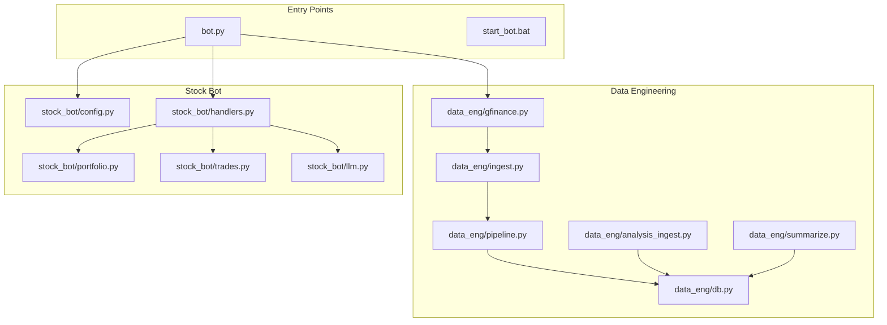
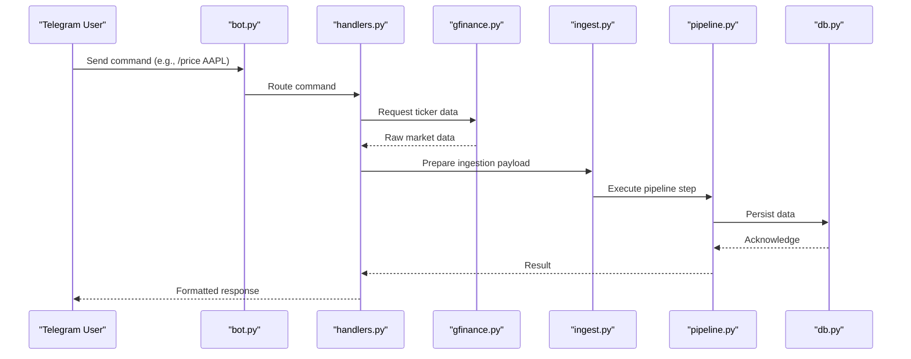
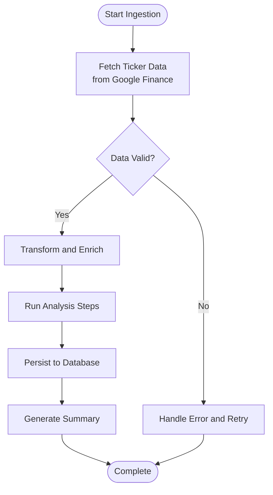
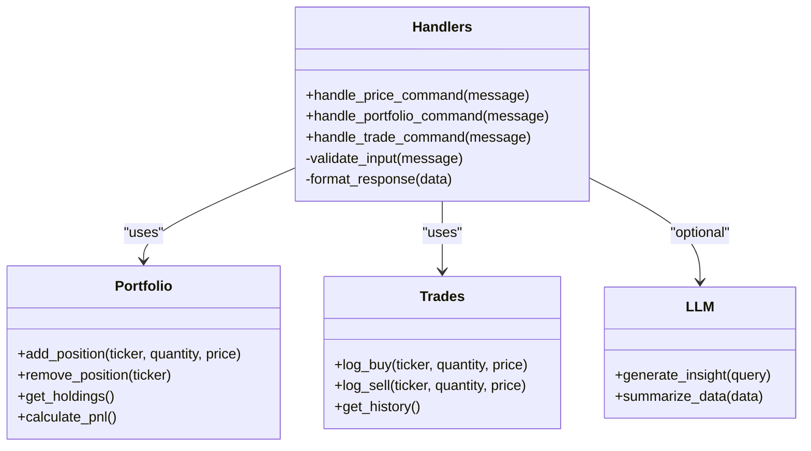
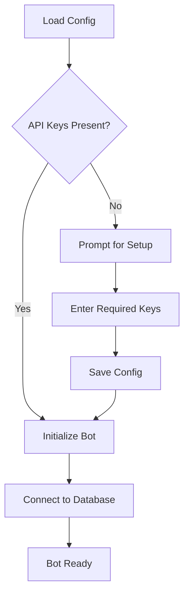
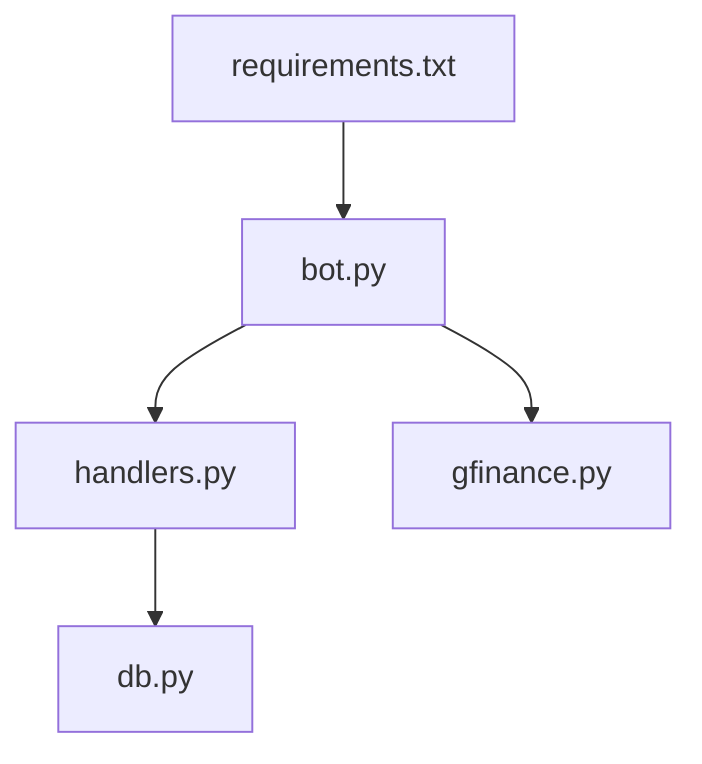

# Google Finance Bot

<cite>
**Referenced Files in This Document**
- [bot.py](file://bot.py)
- [requirements.txt](file://requirements.txt)
- [start_bot.bat](file://start_bot.bat)
- [data_eng/gfinance.py](file://data_eng/gfinance.py)
- [data_ingest.py](file://data_eng/ingest.py)
- [data_eng/pipeline.py](file://data_eng/pipeline.py)
- [data_eng/db.py](file://data_eng/db.py)
- [data_eng/analysis_ingest.py](file://data_eng/analysis_ingest.py)
- [data_eng/summarize.py](file://data_eng/summarize.py)
- [stock_bot/config.py](file://stock_bot/config.py)
- [stock_bot/handlers.py](file://stock_bot/handlers.py)
- [stock_bot/portfolio.py](file://stock_bot/portfolio.py)
- [stock_bot/trades.py](file://stock_bot/trades.py)
- [stock_bot/llm.py](file://stock_bot/llm.py)
- [notes/bot-guide.md](file://notes/bot-guide.md)
- [notes/setup.md](file://notes/setup.md)
</cite>

## Table of Contents
1. [Introduction](#introduction)
2. [Project Structure](#project-structure)
3. [Core Components](#core-components)
4. [Architecture Overview](#architecture-overview)
5. [Detailed Component Analysis](#detailed-component-analysis)
6. [Dependency Analysis](#dependency-analysis)
7. [Performance Considerations](#performance-considerations)
8. [Troubleshooting Guide](#troubleshooting-guide)
9. [Conclusion](#conclusion)
10. [Appendices](#appendices)

## Introduction
This document describes the Google Finance Bot, a Telegram-based system that ingests financial data from Google Finance, processes and stores it, and exposes interactive capabilities through a Telegram bot. The project is organized into modular components for data ingestion, analysis, storage, and user interaction. It also includes utilities for portfolio tracking, trade logging, and optional LLM-powered features.

## Project Structure
The repository is structured around distinct functional areas:
- Entry points and runtime configuration
- Data engineering pipeline for fetching, transforming, and storing market data
- Stock bot modules for handling commands, portfolios, trades, and optional LLM integrations
- Notes and setup documentation

**Diagram sources**
- [bot.py](file://bot.py)
- [start_bot.bat](file://start_bot.bat)
- [data_eng/gfinance.py](file://data_eng/gfinance.py)
- [data_eng/ingest.py](file://data_eng/ingest.py)
- [data_eng/pipeline.py](file://data_eng/pipeline.py)
- [data_eng/db.py](file://data_eng/db.py)
- [data_eng/analysis_ingest.py](file://data_eng/analysis_ingest.py)
- [data_eng/summarize.py](file://data_eng/summarize.py)
- [stock_bot/config.py](file://stock_bot/config.py)
- [stock_bot/handlers.py](file://stock_bot/handlers.py)
- [stock_bot/portfolio.py](file://stock_bot/portfolio.py)
- [stock_bot/trades.py](file://stock_bot/trades.py)
- [stock_bot/llm.py](file://stock_bot/llm.py)

**Section sources**
- [bot.py](file://bot.py)
- [start_bot.bat](file://start_bot.bat)
- [requirements.txt](file://requirements.txt)

## Core Components
- Data ingestion from Google Finance: Fetches ticker information and market data via dedicated modules.
- Pipeline orchestration: Coordinates ingestion, transformation, and persistence steps.
- Database layer: Provides storage abstractions for market data and related analytics.
- Telegram bot handlers: Exposes commands to users for querying data, managing portfolios, and logging trades.
- Optional LLM integration: Adds AI-driven insights or summaries when enabled.

Key responsibilities:
- gfinance.py: Interacts with Google Finance endpoints or APIs to retrieve stock data.
- ingest.py and pipeline.py: Orchestrate batch or streaming ingestion and processing.
- db.py: Manages database connections and queries for persistent storage.
- analysis_ingest.py and summarize.py: Perform analytical transformations and generate summaries.
- handlers.py: Implements Telegram command handlers and message routing.
- portfolio.py and trades.py: Manage portfolio state and trade records.
- llm.py: Integrates with an LLM service for enhanced responses.

**Section sources**
- [data_eng/gfinance.py](file://data_eng/gfinance.py)
- [data_eng/ingest.py](file://data_eng/ingest.py)
- [data_eng/pipeline.py](file://data_eng/pipeline.py)
- [data_eng/db.py](file://data_eng/db.py)
- [data_eng/analysis_ingest.py](file://data_eng/analysis_ingest.py)
- [data_eng/summarize.py](file://data_eng/summarize.py)
- [stock_bot/handlers.py](file://stock_bot/handlers.py)
- [stock_bot/portfolio.py](file://stock_bot/portfolio.py)
- [stock_bot/trades.py](file://stock_bot/trades.py)
- [stock_bot/llm.py](file://stock_bot/llm.py)

## Architecture Overview
The system follows a layered architecture:
- Presentation layer: Telegram bot interface driven by handlers.
- Business logic layer: Portfolio management, trade operations, and optional LLM features.
- Data layer: Ingestion pipeline, analysis transforms, and database persistence.

**Diagram sources**
- [bot.py](file://bot.py)
- [stock_bot/handlers.py](file://stock_bot/handlers.py)
- [data_eng/gfinance.py](file://data_eng/gfinance.py)
- [data_eng/ingest.py](file://data_eng/ingest.py)
- [data_eng/pipeline.py](file://data_eng/pipeline.py)
- [data_eng/db.py](file://data_eng/db.py)

## Detailed Component Analysis

### Data Ingestion and Pipeline
The ingestion pipeline fetches data from Google Finance, transforms it, and persists results. It supports both ad-hoc requests and scheduled runs.

**Diagram sources**
- [data_eng/gfinance.py](file://data_eng/gfinance.py)
- [data_eng/ingest.py](file://data_eng/ingest.py)
- [data_eng/pipeline.py](file://data_eng/pipeline.py)
- [data_eng/analysis_ingest.py](file://data_eng/analysis_ingest.py)
- [data_eng/summarize.py](file://data_eng/summarize.py)
- [data_eng/db.py](file://data_eng/db.py)

**Section sources**
- [data_eng/gfinance.py](file://data_eng/gfinance.py)
- [data_eng/ingest.py](file://data_eng/ingest.py)
- [data_eng/pipeline.py](file://data_eng/pipeline.py)
- [data_eng/analysis_ingest.py](file://data_eng/analysis_ingest.py)
- [data_eng/summarize.py](file://data_eng/summarize.py)
- [data_eng/db.py](file://data_eng/db.py)

### Telegram Bot Handlers
Handlers route user commands to appropriate business logic, interact with data services, and format responses.

**Diagram sources**
- [stock_bot/handlers.py](file://stock_bot/handlers.py)
- [stock_bot/portfolio.py](file://stock_bot/portfolio.py)
- [stock_bot/trades.py](file://stock_bot/trades.py)
- [stock_bot/llm.py](file://stock_bot/llm.py)

**Section sources**
- [stock_bot/handlers.py](file://stock_bot/handlers.py)
- [stock_bot/portfolio.py](file://stock_bot/portfolio.py)
- [stock_bot/trades.py](file://stock_bot/trades.py)
- [stock_bot/llm.py](file://stock_bot/llm.py)

### Configuration and Setup
Configuration centralizes environment variables, API keys, and bot settings. Setup notes guide installation and initial run.

**Diagram sources**
- [stock_bot/config.py](file://stock_bot/config.py)
- [notes/setup.md](file://notes/setup.md)
- [notes/bot-guide.md](file://notes/bot-guide.md)

**Section sources**
- [stock_bot/config.py](file://stock_bot/config.py)
- [notes/setup.md](file://notes/setup.md)
- [notes/bot-guide.md](file://notes/bot-guide.md)

## Dependency Analysis
External dependencies are declared in requirements.txt. The bot relies on Telegram libraries, data fetching tools, and database drivers.

**Diagram sources**
- [requirements.txt](file://requirements.txt)
- [bot.py](file://bot.py)
- [stock_bot/handlers.py](file://stock_bot/handlers.py)
- [data_eng/gfinance.py](file://data_eng/gfinance.py)
- [data_eng/db.py](file://data_eng/db.py)

**Section sources**
- [requirements.txt](file://requirements.txt)

## Performance Considerations
- Batch ingestion: Prefer batching requests to reduce network overhead.
- Caching: Cache frequent ticker lookups to minimize repeated API calls.
- Async operations: Use asynchronous patterns for I/O-bound tasks like HTTP requests and database writes.
- Connection pooling: Reuse database connections to avoid overhead.
- Rate limiting: Implement rate limiting to respect external API constraints.

[No sources needed since this section provides general guidance]

## Troubleshooting Guide
Common issues and resolutions:
- Missing API keys: Ensure all required environment variables are set.
- Network errors: Check connectivity and retry logic in ingestion pipeline.
- Database connection failures: Verify credentials and endpoint availability.
- Command parsing errors: Validate input formats in handlers.

**Section sources**
- [notes/bot-guide.md](file://notes/bot-guide.md)
- [notes/setup.md](file://notes/setup.md)

## Conclusion
The Google Finance Bot integrates data ingestion, analysis, and user interaction into a cohesive system. Its modular design allows for easy extension and maintenance. By following best practices for performance and error handling, the bot can reliably serve financial data and insights to users.

[No sources needed since this section summarizes without analyzing specific files]

## Appendices
- Setup instructions: Refer to setup notes for environment configuration.
- Usage guide: Consult the bot guide for command examples and workflows.

**Section sources**
- [notes/setup.md](file://notes/setup.md)
- [notes/bot-guide.md](file://notes/bot-guide.md)