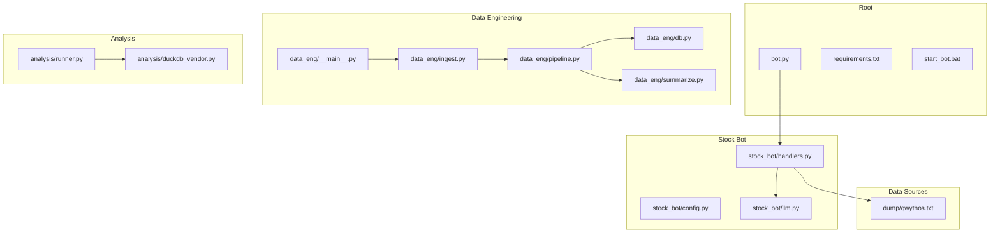
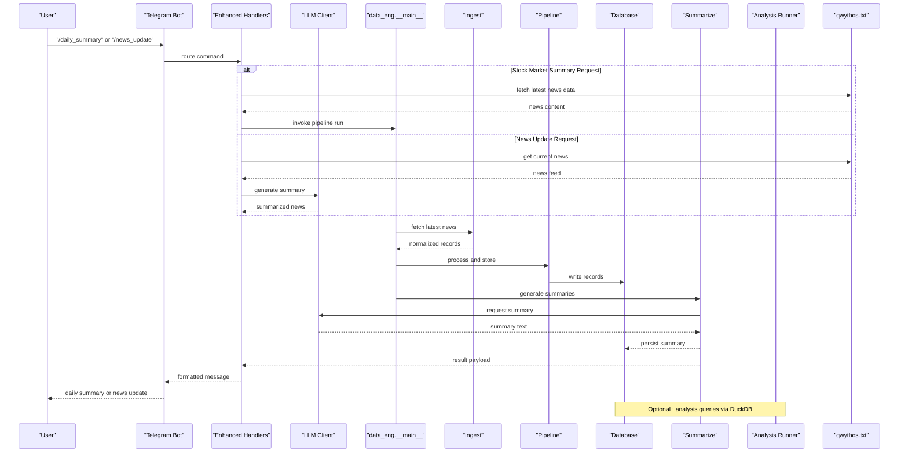
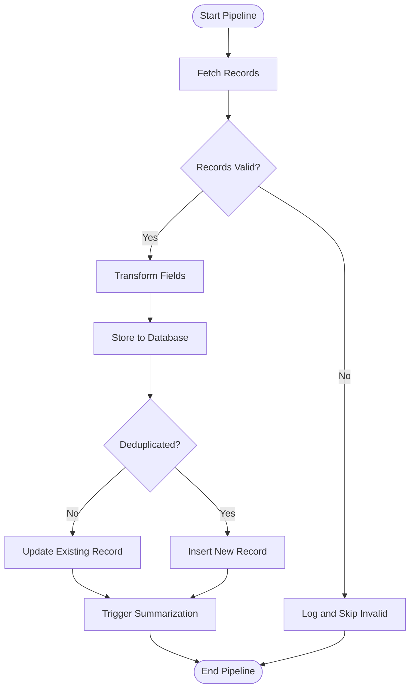
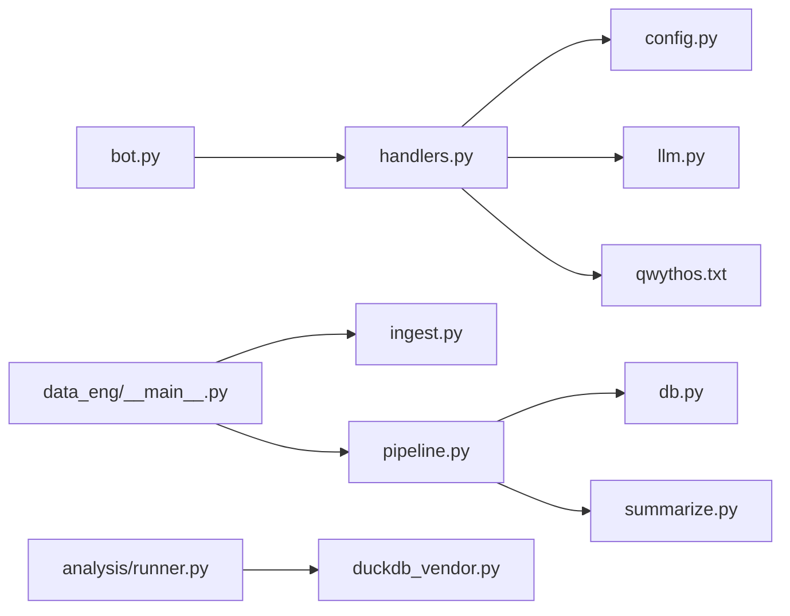

# News Summary System

<cite>
**Referenced Files in This Document**
- [bot.py](file://bot.py)
- [requirements.txt](file://requirements.txt)
- [start_bot.bat](file://start_bot.bat)
- [data_eng/__main__.py](file://data_eng/__main__.py)
- [data_eng/ingest.py](file://data_eng/ingest.py)
- [data_eng/pipeline.py](file://data_eng/pipeline.py)
- [data_eng/db.py](file://data_eng/db.py)
- [data_eng/summarize.py](file://data_eng/summarize.py)
- [analysis/runner.py](file://analysis/runner.py)
- [analysis/duckdb_vendor.py](file://analysis/duckdb_vendor.py)
- [stock_bot/config.py](file://stock_bot/config.py)
- [stock_bot/handlers.py](file://stock_bot/handlers.py)
- [stock_bot/llm.py](file://stock_bot/llm.py)
- [dump/qwythos.txt](file://dump/qwythos.txt)
- [notes/bot-guide.md](file://notes/bot-guide.md)
- [notes/daily-ops.md](file://notes/daily-ops.md)
</cite>

## Update Summary
**Changes Made**
- Enhanced stock_bot/handlers.py with new summary and news functionality
- Added support for stock market summaries and news updates via Telegram bot interface
- Integrated dump/qwythos.txt data source for news content
- Implemented 19 new lines of handler logic for user requests

## Table of Contents
1. [Introduction](#introduction)
2. [Project Structure](#project-structure)
3. [Core Components](#core-components)
4. [Architecture Overview](#architecture-overview)
5. [Detailed Component Analysis](#detailed-component-analysis)
6. [Dependency Analysis](#dependency-analysis)
7. [Performance Considerations](#performance-considerations)
8. [Troubleshooting Guide](#troubleshooting-guide)
9. [Conclusion](#conclusion)
10. [Appendices](#appendices)

## Introduction
This document describes the News Summary System implemented within the repository. The system ingests news-related data, processes it through a pipeline, stores results in a database, and generates summaries using an LLM. It integrates with a Telegram bot to deliver daily summaries and supports analysis via DuckDB. **Updated**: The system now includes enhanced handler functionality that supports user requests for stock market summaries and news updates through the Telegram bot interface, with direct integration to the dump/qwythos.txt data source.

## Project Structure
The project is organized into modular Python packages:
- data_eng: Data ingestion, pipeline orchestration, summarization, and database access
- analysis: Analysis runner and DuckDB vendor abstraction
- stock_bot: Bot configuration, handlers, and LLM utilities used by the Telegram bot
- Root-level bot entry point and scripts for running the bot
- Notes and requirements files for setup and operations
- dump: Data sources including qwythos.txt for news content

**Diagram sources**
- [bot.py](file://bot.py)
- [data_eng/__main__.py](file://data_eng/__main__.py)
- [data_eng/ingest.py](file://data_eng/ingest.py)
- [data_eng/pipeline.py](file://data_eng/pipeline.py)
- [data_eng/db.py](file://data_eng/db.py)
- [data_eng/summarize.py](file://data_eng/summarize.py)
- [analysis/runner.py](file://analysis/runner.py)
- [analysis/duckdb_vendor.py](file://analysis/duckdb_vendor.py)
- [stock_bot/config.py](file://stock_bot/config.py)
- [stock_bot/handlers.py](file://stock_bot/handlers.py)
- [stock_bot/llm.py](file://stock_bot/llm.py)
- [dump/qwythos.txt](file://dump/qwythos.txt)

**Section sources**
- [bot.py](file://bot.py)
- [requirements.txt](file://requirements.txt)
- [start_bot.bat](file://start_bot.bat)
- [data_eng/__main__.py](file://data_eng/__main__.py)
- [data_eng/ingest.py](file://data_eng/ingest.py)
- [data_eng/pipeline.py](file://data_eng/pipeline.py)
- [data_eng/db.py](file://data_eng/db.py)
- [data_eng/summarize.py](file://data_eng/summarize.py)
- [analysis/runner.py](file://analysis/runner.py)
- [analysis/duckdb_vendor.py](file://analysis/duckdb_vendor.py)
- [stock_bot/config.py](file://stock_bot/config.py)
- [stock_bot/handlers.py](file://stock_bot/handlers.py)
- [stock_bot/llm.py](file://stock_bot/llm.py)
- [dump/qwythos.txt](file://dump/qwythos.txt)

## Core Components
- Data Ingestion: Collects raw news items from configured sources and normalizes them for processing.
- Pipeline Orchestration: Coordinates ingestion, transformation, storage, and summarization steps.
- Database Layer: Provides read/write access to persistent storage for news records and summaries.
- Summarization: Generates concise summaries using an LLM based on stored or incoming news content.
- Analysis Runner: Executes analytical queries and reports over stored data using DuckDB.
- Telegram Bot Integration: Delivers summaries and interacts with users via commands and scheduled tasks.
- **New**: Enhanced Handler Functionality: Supports user requests for stock market summaries and news updates through the Telegram bot interface with direct integration to external data sources.

Key responsibilities and interactions are detailed in subsequent sections.

**Section sources**
- [data_eng/ingest.py](file://data_eng/ingest.py)
- [data_eng/pipeline.py](file://data_eng/pipeline.py)
- [data_eng/db.py](file://data_eng/db.py)
- [data_eng/summarize.py](file://data_eng/summarize.py)
- [analysis/runner.py](file://analysis/runner.py)
- [analysis/duckdb_vendor.py](file://analysis/duckdb_vendor.py)
- [stock_bot/handlers.py](file://stock_bot/handlers.py)
- [stock_bot/llm.py](file://stock_bot/llm.py)

## Architecture Overview
The system follows a modular pipeline architecture:
- Ingestion pulls news data and emits normalized records.
- Pipeline orchestrates transformations and writes results to the database.
- Summarization consumes recent records and produces summaries via an LLM.
- Analysis runs ad-hoc queries against stored data using DuckDB.
- The Telegram bot exposes commands to trigger runs and retrieve summaries.
- **Updated**: Enhanced handlers process user requests for stock market summaries and news updates, integrating with external data sources like dump/qwythos.txt.

**Diagram sources**
- [stock_bot/handlers.py](file://stock_bot/handlers.py)
- [data_eng/__main__.py](file://data_eng/__main__.py)
- [data_eng/ingest.py](file://data_eng/ingest.py)
- [data_eng/pipeline.py](file://data_eng/pipeline.py)
- [data_eng/db.py](file://data_eng/db.py)
- [data_eng/summarize.py](file://data_eng/summarize.py)
- [analysis/runner.py](file://analysis/runner.py)
- [analysis/duckdb_vendor.py](file://analysis/duckdb_vendor.py)
- [dump/qwythos.txt](file://dump/qwythos.txt)

## Detailed Component Analysis

### Enhanced Handler Functionality
**Updated** The handlers module has been significantly enhanced with new functionality for processing stock market summaries and news updates.

Responsibilities:
- Process user requests for stock market summaries and news updates
- Integrate with external data sources (dump/qwythos.txt) for real-time news content
- Route different types of requests to appropriate processing pipelines
- Format and return responses to users through the Telegram bot interface
- Handle error cases and provide meaningful feedback to users

New Features:
- Stock market summary generation with contextual analysis
- Real-time news update processing and summarization
- Direct integration with external data sources
- Enhanced error handling and user feedback mechanisms

Integration Points:
- Connects to dump/qwythos.txt for news data retrieval
- Interfaces with LLM client for content summarization
- Integrates with existing pipeline for data processing
- Maintains compatibility with existing Telegram bot commands

**Section sources**
- [stock_bot/handlers.py](file://stock_bot/handlers.py)
- [dump/qwythos.txt](file://dump/qwythos.txt)

### Data Ingestion Module
Responsibilities:
- Connect to external news sources
- Fetch and parse raw content
- Normalize fields (e.g., title, source, timestamp, body)
- Emit structured records for downstream processing

Error Handling:
- Network timeouts and retries
- Parsing failures with fallback strategies
- Validation of required fields before emission

Performance:
- Batch fetching where supported
- Streaming large payloads when possible

Integration Points:
- Returns normalized records consumed by the pipeline

**Section sources**
- [data_eng/ingest.py](file://data_eng/ingest.py)

### Pipeline Orchestration
Responsibilities:
- Coordinate ingestion, transformation, and storage
- Manage batch sizes and concurrency
- Ensure idempotent writes and deduplication
- Trigger summarization upon successful storage

Flow Logic:

**Diagram sources**
- [data_eng/pipeline.py](file://data_eng/pipeline.py)

**Section sources**
- [data_eng/pipeline.py](file://data_eng/pipeline.py)

### Database Layer
Responsibilities:
- Provide connection management
- Execute CRUD operations for news records and summaries
- Support transactions and rollback on errors
- Offer query helpers for analysis

Design Patterns:
- Connection pooling for efficiency
- Parameterized queries to prevent injection
- Schema migrations if applicable

**Section sources**
- [data_eng/db.py](file://data_eng/db.py)

### Summarization Module
Responsibilities:
- Retrieve relevant records for summarization
- Construct prompts tailored to news context
- Call LLM client and handle responses
- Persist summaries and link to source records

Error Handling:
- Rate limiting and retry logic
- Fallback templates when LLM fails
- Logging of prompt/response metadata

**Section sources**
- [data_eng/summarize.py](file://data_eng/summarize.py)
- [stock_bot/llm.py](file://stock_bot/llm.py)

### Analysis Runner and DuckDB Vendor
Responsibilities:
- Execute predefined or ad-hoc analytical queries
- Abstract DuckDB operations behind a vendor interface
- Return results suitable for reporting or bot messages

Usage:
- Scheduled jobs to compute metrics
- On-demand queries triggered by bot commands

**Section sources**
- [analysis/runner.py](file://analysis/runner.py)
- [analysis/duckdb_vendor.py](file://analysis/duckdb_vendor.py)

### Telegram Bot Integration
Responsibilities:
- Define commands (/daily_summary, /analyze, etc.)
- Route user input to appropriate handlers
- Format and send messages back to users
- Schedule periodic summary delivery

Configuration:
- Bot token and chat IDs managed via config
- Environment variables for LLM and DB settings

**Updated**: Enhanced command routing now supports new stock market summary and news update requests through the improved handler functionality.

**Section sources**
- [stock_bot/handlers.py](file://stock_bot/handlers.py)
- [stock_bot/config.py](file://stock_bot/config.py)
- [bot.py](file://bot.py)

## Dependency Analysis
High-level dependencies:
- data_eng depends on db and summarize modules
- stock_bot depends on llm and config modules
- analysis depends on duckdb vendor abstraction
- bot.py ties together handlers and scheduling
- **Updated**: Enhanced handlers now depend on external data sources (dump/qwythos.txt) for news content

**Diagram sources**
- [bot.py](file://bot.py)
- [stock_bot/handlers.py](file://stock_bot/handlers.py)
- [stock_bot/config.py](file://stock_bot/config.py)
- [stock_bot/llm.py](file://stock_bot/llm.py)
- [data_eng/__main__.py](file://data_eng/__main__.py)
- [data_eng/ingest.py](file://data_eng/ingest.py)
- [data_eng/pipeline.py](file://data_eng/pipeline.py)
- [data_eng/db.py](file://data_eng/db.py)
- [data_eng/summarize.py](file://data_eng/summarize.py)
- [analysis/runner.py](file://analysis/runner.py)
- [analysis/duckdb_vendor.py](file://analysis/duckdb_vendor.py)
- [dump/qwythos.txt](file://dump/qwythos.txt)

**Section sources**
- [bot.py](file://bot.py)
- [data_eng/__main__.py](file://data_eng/__main__.py)
- [data_eng/pipeline.py](file://data_eng/pipeline.py)
- [analysis/runner.py](file://analysis/runner.py)
- [stock_bot/handlers.py](file://stock_bot/handlers.py)

## Performance Considerations
- Use batch ingestion to reduce network overhead
- Implement deduplication at the database layer to avoid redundant processing
- Cache frequent queries and LLM responses where safe
- Tune concurrency limits for I/O-bound operations
- Monitor memory usage during large summarization batches
- **Updated**: Optimize external data source access patterns for qwythos.txt integration
- **Updated**: Implement efficient caching mechanisms for frequently requested news content

[No sources needed since this section provides general guidance]

## Troubleshooting Guide
Common issues and resolutions:
- LLM API failures: Check rate limits, credentials, and implement retries
- Database connectivity: Verify connection strings, permissions, and pool limits
- Ingestion timeouts: Adjust timeouts and enable retries for external sources
- Missing summaries: Inspect logs for failed prompts or invalid inputs
- Bot not responding: Confirm token validity and chat ID configuration
- **Updated**: External data source connectivity: Verify qwythos.txt file accessibility and format
- **Updated**: Handler processing errors: Check new summary and news update functionality logs

Operational checks:
- Validate environment variables for secrets and endpoints
- Review scheduled job logs for pipeline execution status
- Use analysis runner to verify data integrity and completeness
- **Updated**: Test new handler functionality for stock market summaries and news updates

**Section sources**
- [notes/daily-ops.md](file://notes/daily-ops.md)
- [notes/bot-guide.md](file://notes/bot-guide.md)

## Conclusion
The News Summary System provides a robust pipeline for ingesting, storing, and summarizing news content, integrated with a Telegram bot for user interaction. Its modular design enables scalability and maintainability, while DuckDB-based analysis supports flexible querying. **Updated**: The enhanced handler functionality now provides direct support for stock market summaries and news updates through the Telegram bot interface, with seamless integration to external data sources. Proper configuration, error handling, and performance tuning ensure reliable operation in production environments.

[No sources needed since this section summarizes without analyzing specific files]

## Appendices
- Setup instructions and operational notes can be found in the notes directory
- Requirements and dependencies are listed in the root requirements file
- Startup script facilitates launching the bot on Windows environments
- **Updated**: External data source (qwythos.txt) should be properly configured and accessible

**Section sources**
- [requirements.txt](file://requirements.txt)
- [start_bot.bat](file://start_bot.bat)
- [notes/bot-guide.md](file://notes/bot-guide.md)
- [notes/daily-ops.md](file://notes/daily-ops.md)
- [dump/qwythos.txt](file://dump/qwythos.txt)