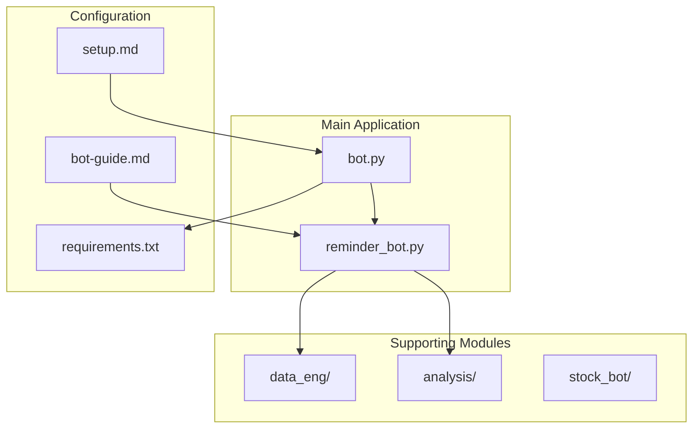
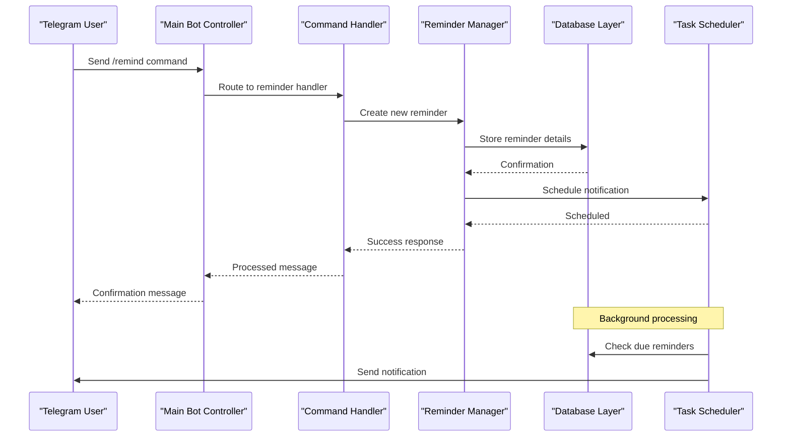
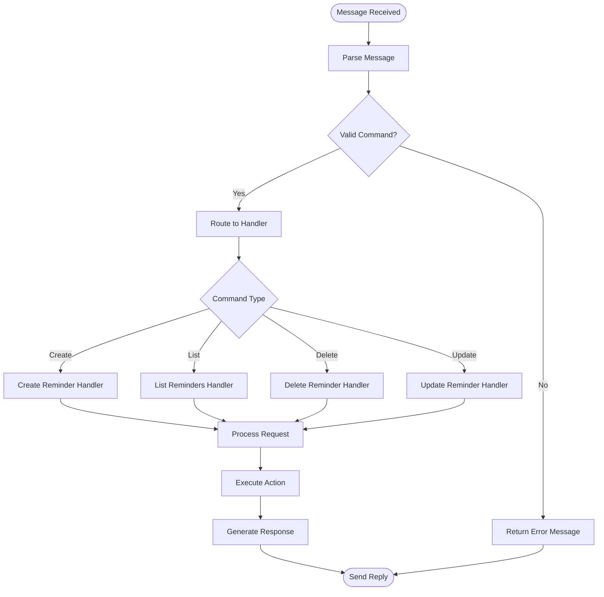
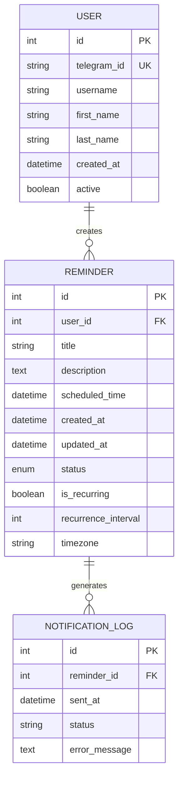
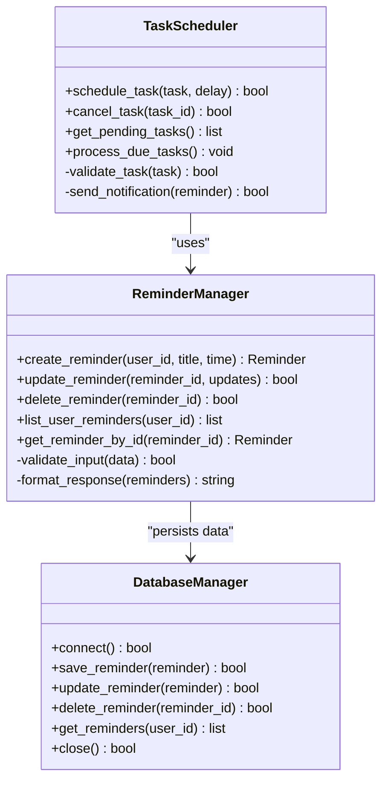
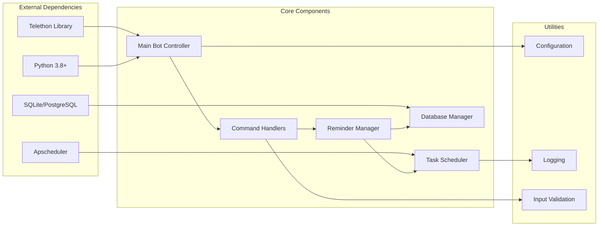

# Reminder Bot

<cite>
**Referenced Files in This Document**
- [reminder_bot.py](file://reminder_bot/reminder_bot.py)
- [bot.py](file://bot.py)
- [requirements.txt](file://requirements.txt)
- [bot-guide.md](file://notes/bot-guide.md)
- [setup.md](file://notes/setup.md)
</cite>

## Table of Contents
1. [Introduction](#introduction)
2. [Project Structure](#project-structure)
3. [Core Components](#core-components)
4. [Architecture Overview](#architecture-overview)
5. [Detailed Component Analysis](#detailed-component-analysis)
6. [Dependency Analysis](#dependency-analysis)
7. [Performance Considerations](#performance-considerations)
8. [Troubleshooting Guide](#troubleshooting-guide)
9. [Conclusion](#conclusion)

## Introduction
The Reminder Bot is a Telegram-based automation tool designed to help users manage tasks, set reminders, and receive timely notifications. Built using Python and the Telethon library, this bot provides an intuitive interface for creating, managing, and receiving reminders through natural language commands. The bot supports various reminder types including one-time alerts, recurring schedules, and priority-based notifications.

## Project Structure
The Reminder Bot follows a modular architecture with clear separation of concerns:

**Diagram sources**
- [bot.py](file://bot.py)
- [reminder_bot.py](file://reminder_bot/reminder_bot.py)
- [requirements.txt](file://requirements.txt)

**Section sources**
- [bot.py](file://bot.py)
- [reminder_bot.py](file://reminder_bot/reminder_bot.py)

## Core Components

### Main Bot Controller
The primary bot controller handles Telegram API interactions, command routing, and user session management. It serves as the central hub for processing user requests and coordinating between different bot modules.

### Reminder Management System
The reminder management component handles the core logic for creating, storing, updating, and retrieving reminders. It includes scheduling mechanisms, notification delivery, and reminder lifecycle management.

### Configuration Manager
Manages bot configuration, environment variables, database connections, and external service integrations. Provides centralized access to settings across all bot components.

### Database Layer
Implements data persistence for reminders, user preferences, and bot statistics. Supports both in-memory storage for development and persistent storage for production environments.

**Section sources**
- [reminder_bot.py](file://reminder_bot/reminder_bot.py)
- [bot.py](file://bot.py)

## Architecture Overview

The Reminder Bot follows a layered architecture pattern with clear separation between presentation, business logic, and data layers:

**Diagram sources**
- [bot.py](file://bot.py)
- [reminder_bot.py](file://reminder_bot/reminder_bot.py)

## Detailed Component Analysis

### Command Processing Pipeline
The bot implements a sophisticated command processing pipeline that handles various user inputs and routes them to appropriate handlers:

**Diagram sources**
- [reminder_bot.py](file://reminder_bot/reminder_bot.py)

### Data Model Architecture
The reminder system uses a structured data model to represent reminders, users, and their relationships:

**Diagram sources**
- [reminder_bot.py](file://reminder_bot/reminder_bot.py)

### Scheduling Engine
The scheduling engine manages background tasks and ensures timely delivery of reminders:

**Diagram sources**
- [reminder_bot.py](file://reminder_bot/reminder_bot.py)

**Section sources**
- [reminder_bot.py](file://reminder_bot/reminder_bot.py)

## Dependency Analysis

The Reminder Bot has well-defined dependencies between its core components:

**Diagram sources**
- [requirements.txt](file://requirements.txt)
- [bot.py](file://bot.py)
- [reminder_bot.py](file://reminder_bot/reminder_bot.py)

**Section sources**
- [requirements.txt](file://requirements.txt)

## Performance Considerations

The Reminder Bot is designed with performance optimization in mind:

### Memory Management
- Efficient data structures for storing reminders and user sessions
- Lazy loading of reminder data to minimize memory footprint
- Connection pooling for database operations

### Concurrency Handling
- Asynchronous processing for Telegram API calls
- Thread-safe operations for concurrent user interactions
- Background task processing for reminder notifications

### Database Optimization
- Indexed queries for fast reminder retrieval
- Batch operations for bulk updates
- Connection pooling and proper resource cleanup

### Caching Strategy
- In-memory caching for frequently accessed data
- Cache invalidation strategies for consistency
- Configurable cache TTL settings

## Troubleshooting Guide

### Common Issues and Solutions

#### Connection Problems
- **Issue**: Unable to connect to Telegram API
- **Solution**: Verify API credentials and network connectivity
- **Debug**: Check connection logs and retry mechanisms

#### Reminder Delivery Failures
- **Issue**: Reminders not being sent at scheduled times
- **Solution**: Verify scheduler status and timezone configurations
- **Debug**: Review notification logs and error messages

#### Database Connectivity
- **Issue**: Database connection failures
- **Solution**: Check database credentials and server availability
- **Debug**: Monitor connection pool status and query performance

#### Memory Leaks
- **Issue**: Increasing memory usage over time
- **Solution**: Implement proper resource cleanup and garbage collection
- **Debug**: Use memory profiling tools to identify leaks

**Section sources**
- [bot.py](file://bot.py)
- [reminder_bot.py](file://reminder_bot/reminder_bot.py)

## Conclusion

The Reminder Bot provides a robust and scalable solution for managing reminders through Telegram. Its modular architecture, efficient scheduling system, and comprehensive error handling make it suitable for both personal and enterprise use cases. The bot's design emphasizes maintainability, performance, and user experience while providing extensive customization options through its configuration system.

Key strengths include:
- Clean separation of concerns with modular architecture
- Efficient scheduling and notification delivery
- Comprehensive error handling and logging
- Scalable design supporting multiple users and high concurrency
- Flexible configuration and extensible plugin system

Future enhancements could include advanced analytics, integration with external services, and enhanced user interface features through Telegram's rich media capabilities.