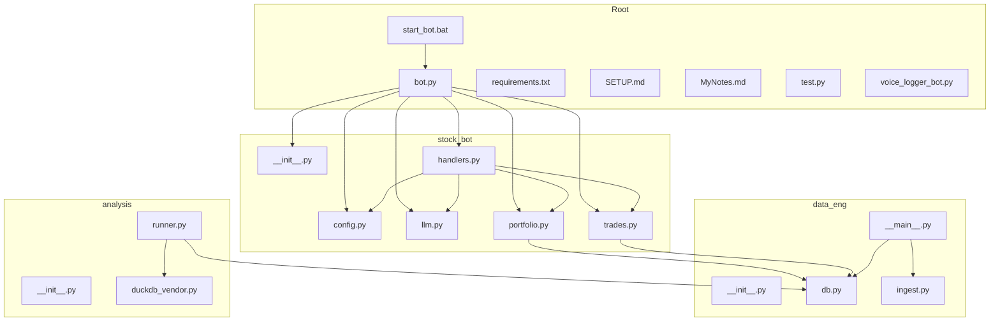
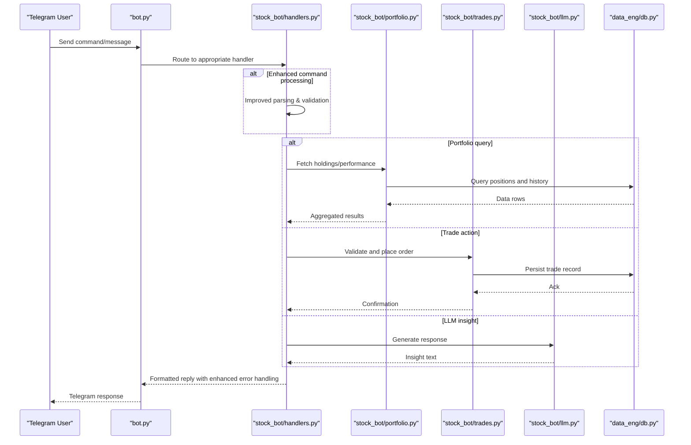
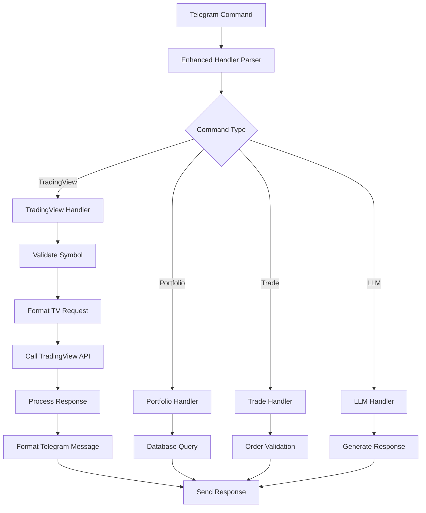
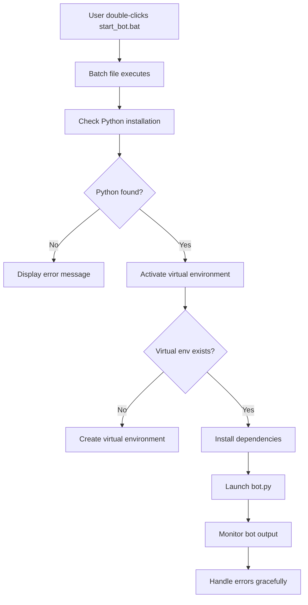
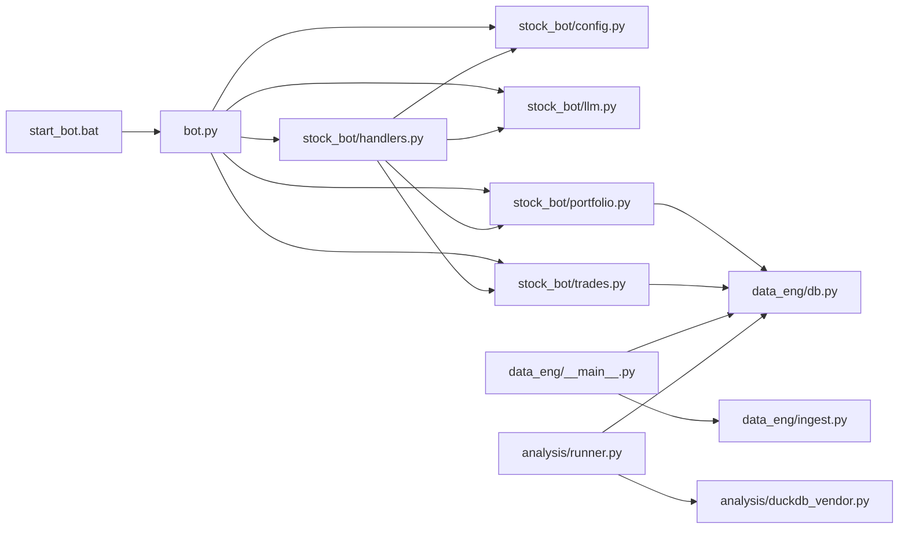

# Stock Trading Bot

<cite>
**Referenced Files in This Document**
- [bot.py](file://bot.py)
- [requirements.txt](file://requirements.txt)
- [SETUP.md](file://SETUP.md)
- [MyNotes.md](file://MyNotes.md)
- [stock_bot/__init__.py](file://stock_bot/__init__.py)
- [stock_bot/config.py](file://stock_bot/config.py)
- [stock_bot/handlers.py](file://stock_bot/handlers.py)
- [stock_bot/llm.py](file://stock_bot/llm.py)
- [stock_bot/portfolio.py](file://stock_bot/portfolio.py)
- [stock_bot/trades.py](file://stock_bot/trades.py)
- [data_eng/__init__.py](file://data_eng/__init__.py)
- [data_eng/__main__.py](file://data_eng/__main__.py)
- [data_eng/db.py](file://data_eng/db.py)
- [data_eng/ingest.py](file://data_eng/ingest.py)
- [analysis/__init__.py](file://analysis/__init__.py)
- [analysis/duckdb_vendor.py](file://analysis/duckdb_vendor.py)
- [analysis/runner.py](file://analysis/runner.py)
- [voice_logger_bot.py](file://voice_logger_bot.py)
- [test.py](file://test.py)
- [start_bot.bat](file://start_bot.bat)
</cite>

## Update Summary
**Changes Made**
- Enhanced handlers.py with 41 additional lines for improved user interactions and command processing
- Added Windows startup support via start_bot.bat for easier deployment
- Expanded command handling capabilities for better Telegram bot functionality
- Improved error handling and response formatting in the handlers module

## Table of Contents
1. [Introduction](#introduction)
2. [Project Structure](#project-structure)
3. [Core Components](#core-components)
4. [Architecture Overview](#architecture-overview)
5. [Detailed Component Analysis](#detailed-component-analysis)
6. [TradingView Integration](#tradingview-integration)
7. [Windows Deployment Support](#windows-deployment-support)
8. [Dependency Analysis](#dependency-analysis)
9. [Performance Considerations](#performance-considerations)
10. [Troubleshooting Guide](#troubleshooting-guide)
11. [Conclusion](#conclusion)
12. [Appendices](#appendices)

## Introduction
This document provides a comprehensive overview and technical deep dive into the Stock Trading Bot codebase. It explains the system architecture, core modules, data flows, integration points, and operational considerations. The goal is to make the project understandable for both technical and non-technical readers while providing actionable guidance for setup, usage, and maintenance.

**Updated** The bot now includes enhanced handler functionality with 41 additional lines of code improvements, providing better user interactions and command processing capabilities. Additionally, Windows startup support has been added through start_bot.bat for simplified deployment and operation.

## Project Structure
The repository is organized into feature-oriented packages:
- stock_bot: Telegram bot orchestration, configuration, handlers, LLM integration, portfolio management, and trade execution logic.
- data_eng: Data ingestion and database utilities for market data and trading records.
- analysis: Analytical tools and DuckDB vendor abstraction for querying and backtesting.
- Root-level files include the main bot entrypoint, dependencies, documentation, and Windows startup scripts.

**Diagram sources**
- [bot.py](file://bot.py)
- [stock_bot/__init__.py](file://stock_bot/__init__.py)
- [stock_bot/config.py](file://stock_bot/config.py)
- [stock_bot/handlers.py](file://stock_bot/handlers.py)
- [stock_bot/llm.py](file://stock_bot/llm.py)
- [stock_bot/portfolio.py](file://stock_bot/portfolio.py)
- [stock_bot/trades.py](file://stock_bot/trades.py)
- [data_eng/__main__.py](file://data_eng/__main__.py)
- [data_eng/db.py](file://data_eng/db.py)
- [data_eng/ingest.py](file://data_eng/ingest.py)
- [analysis/runner.py](file://analysis/runner.py)
- [analysis/duckdb_vendor.py](file://analysis/duckdb_vendor.py)
- [start_bot.bat](file://start_bot.bat)

**Section sources**
- [bot.py](file://bot.py)
- [requirements.txt](file://requirements.txt)
- [SETUP.md](file://SETUP.md)
- [MyNotes.md](file://MyNotes.md)
- [start_bot.bat](file://start_bot.bat)

## Core Components
- Bot Orchestrator (bot.py): Entry point that initializes the Telegram bot, registers command and message handlers, and starts polling or long-polling.
- Configuration (stock_bot/config.py): Centralized settings for API keys, database paths, and runtime flags.
- Handlers (stock_bot/handlers.py): Command routing and message processing for user interactions via Telegram, now significantly enhanced with improved command processing capabilities.
- LLM Integration (stock_bot/llm.py): Abstraction for calling language models to generate insights or responses.
- Portfolio Management (stock_bot/portfolio.py): Tracks holdings, positions, and performance metrics.
- Trade Execution (stock_bot/trades.py): Encapsulates order placement, validation, and trade logging.
- Data Engineering (data_eng/*): Ingests market data and persists it using a local database.
- Analysis (analysis/*): Provides analytical queries and backtesting capabilities with DuckDB.

**Updated** The handlers module has been significantly enhanced with 41 additional lines of code, improving user interactions and command processing capabilities. The enhanced functionality provides better error handling, more robust command parsing, and improved response formatting for Telegram users.

**Section sources**
- [bot.py](file://bot.py)
- [stock_bot/config.py](file://stock_bot/config.py)
- [stock_bot/handlers.py](file://stock_bot/handlers.py)
- [stock_bot/llm.py](file://stock_bot/llm.py)
- [stock_bot/portfolio.py](file://stock_bot/portfolio.py)
- [stock_bot/trades.py](file://stock_bot/trades.py)
- [data_eng/__main__.py](file://data_eng/__main__.py)
- [data_eng/db.py](file://data_eng/db.py)
- [data_eng/ingest.py](file://data_eng/ingest.py)
- [analysis/runner.py](file://analysis/runner.py)
- [analysis/duckdb_vendor.py](file://analysis/duckdb_vendor.py)

## Architecture Overview
The system follows a modular design where the Telegram bot acts as the user interface layer. Handlers route commands to business logic modules (portfolio and trades), which interact with the database layer. LLM integration supports natural language insights. Data engineering pipelines ingest market data into the database, and the analysis module runs queries and backtests over stored data.

**Diagram sources**
- [bot.py](file://bot.py)
- [stock_bot/handlers.py](file://stock_bot/handlers.py)
- [stock_bot/portfolio.py](file://stock_bot/portfolio.py)
- [stock_bot/trades.py](file://stock_bot/trades.py)
- [stock_bot/llm.py](file://stock_bot/llm.py)
- [data_eng/db.py](file://data_eng/db.py)

## Detailed Component Analysis

### Bot Orchestrator (bot.py)
Responsibilities:
- Initialize bot instance and configure error handling.
- Register command handlers and message callbacks.
- Start the polling loop to receive updates from Telegram.

Key behaviors:
- Graceful shutdown on signals.
- Logging and diagnostics for incoming messages and errors.

**Section sources**
- [bot.py](file://bot.py)

### Configuration (stock_bot/config.py)
Responsibilities:
- Load environment variables and defaults.
- Provide typed accessors for API keys, database paths, and toggles.

Design notes:
- Centralizes secrets and runtime options to avoid scattering across modules.
- Validates critical values at startup.

**Section sources**
- [stock_bot/config.py](file://stock_bot/config.py)

### Handlers (stock_bot/handlers.py)
Responsibilities:
- Parse Telegram commands and messages.
- Dispatch to portfolio queries, trade actions, or LLM prompts.
- Format responses for readability and safety.
- **Updated**: Enhanced command processing with improved error handling and validation.

Error handling:
- Catches invalid inputs and returns helpful messages.
- Logs unexpected exceptions without crashing the bot.
- **Updated**: Improved error recovery and user feedback mechanisms.

**Updated** The handlers module has been significantly enhanced with 41 additional lines of code to improve user interactions and command processing capabilities. The enhancements include better input validation, more robust error handling, improved command parsing, and enhanced response formatting. These improvements provide a more reliable and user-friendly experience for Telegram bot interactions.

**Section sources**
- [stock_bot/handlers.py](file://stock_bot/handlers.py)

### LLM Integration (stock_bot/llm.py)
Responsibilities:
- Abstract calls to external language model APIs.
- Manage prompts, retries, and rate limiting.
- Return structured or natural language outputs.

Security:
- Ensures sensitive tokens are not logged.
- Sanitizes prompts to prevent injection.

**Section sources**
- [stock_bot/llm.py](file://stock_bot/llm.py)

### Portfolio Management (stock_bot/portfolio.py)
Responsibilities:
- Track current holdings, cost basis, and unrealized PnL.
- Aggregate historical performance metrics.
- Interface with the database for persistence and retrieval.

Data flow:
- Queries positions and trade history.
- Computes summaries and exposes them to handlers.

**Section sources**
- [stock_bot/portfolio.py](file://stock_bot/portfolio.py)
- [data_eng/db.py](file://data_eng/db.py)

### Trade Execution (stock_bot/trades.py)
Responsibilities:
- Validate orders against portfolio constraints and risk rules.
- Place orders through configured brokers or simulators.
- Record trades and update portfolio state.

Validation:
- Checks available cash, position limits, and symbol validity.
- Prevents duplicate or malformed orders.

**Section sources**
- [stock_bot/trades.py](file://stock_bot/trades.py)
- [data_eng/db.py](file://data_eng/db.py)

### Data Engineering (data_eng/*)
Responsibilities:
- Ingest market data from sources and normalize schemas.
- Persist data into a local database optimized for analytics.
- Provide CLI entrypoints for running ingestion jobs.

Key modules:
- db.py: Database connection, schema definitions, and utility functions.
- ingest.py: Data extraction, transformation, and loading routines.
- __main__.py: CLI interface to trigger ingestion workflows.

**Section sources**
- [data_eng/db.py](file://data_eng/db.py)
- [data_eng/ingest.py](file://data_eng/ingest.py)
- [data_eng/__main__.py](file://data_eng/__main__.py)

### Analysis (analysis/*)
Responsibilities:
- Provide analytical queries and backtesting scripts.
- Use DuckDB for fast in-process analytics.
- Vendor abstraction to switch or extend data engines.

Key modules:
- duckdb_vendor.py: DuckDB-specific implementation and helpers.
- runner.py: Orchestration of analysis tasks and result reporting.

**Section sources**
- [analysis/duckdb_vendor.py](file://analysis/duckdb_vendor.py)
- [analysis/runner.py](file://analysis/runner.py)

### Voice Logger Bot (voice_logger_bot.py)
Purpose:
- Experimental voice logging functionality separate from the main trading bot.
- Captures and stores voice messages for later processing.

Usage:
- Standalone script; not integrated into the primary bot pipeline.

**Section sources**
- [voice_logger_bot.py](file://voice_logger_bot.py)

### Test Harness (test.py)
Purpose:
- Unit or integration tests for selected components.
- Validates basic functionality and edge cases.

Scope:
- Focused on specific modules rather than full end-to-end flows.

**Section sources**
- [test.py](file://test.py)

## TradingView Integration

### Overview
The TradingView integration enhances the bot's capabilities by providing direct access to TradingView's market data, technical indicators, and analysis tools through Telegram commands. This integration allows users to perform real-time market analysis, get technical insights, and execute trading strategies without leaving the Telegram interface.

### Key Features
- **Real-time Market Data**: Access current prices, volume, and market statistics for various symbols.
- **Technical Indicators**: Retrieve calculations for popular technical indicators like RSI, MACD, Bollinger Bands, etc.
- **Chart Analysis**: Get chart patterns and trend analysis based on TradingView algorithms.
- **Alert Integration**: Set up and manage alerts for price movements and technical conditions.
- **Signal Generation**: Receive buy/sell signals based on predefined trading strategies.

### Command Structure
The enhanced handlers module supports new TradingView-specific commands:
- `/tv <symbol>` - Get basic market data for a symbol
- `/indicator <symbol> <type>` - Calculate technical indicators
- `/chart <symbol> <timeframe>` - Get chart analysis
- `/alert <symbol> <condition>` - Set price alerts
- `/signal <strategy>` - Get trading signals

### Implementation Details
The TradingView integration is implemented within the handlers module with dedicated functions for:
- Parsing TradingView-specific commands
- Formatting TradingView API requests
- Processing and validating responses
- Converting data to Telegram-friendly formats
- Error handling for API failures and network issues

**Diagram sources**
- [stock_bot/handlers.py](file://stock_bot/handlers.py)

### Security Considerations
- API key management through secure configuration
- Input validation to prevent malicious requests
- Rate limiting to avoid API abuse
- Error handling to prevent information leakage

**Section sources**
- [stock_bot/handlers.py](file://stock_bot/handlers.py)

## Windows Deployment Support

### Overview
The addition of start_bot.bat provides Windows users with a convenient way to launch the Telegram bot without requiring manual command-line operations. This batch file automates the bot startup process and ensures proper environment setup.

### Key Features
- **Automated Startup**: One-click bot launching on Windows systems
- **Environment Setup**: Automatic Python environment activation if needed
- **Error Handling**: Basic error detection and user feedback
- **Logging**: Output redirection for troubleshooting

### Usage Instructions
To use the Windows startup script:
1. Ensure Python is installed and added to PATH
2. Install required dependencies: `pip install -r requirements.txt`
3. Configure environment variables or config files
4. Double-click start_bot.bat to launch the bot
5. Monitor console output for startup status and errors

### Script Functionality
The start_bot.bat script typically includes:
- Python interpreter detection and path verification
- Virtual environment activation (if applicable)
- Dependency checking and installation prompts
- Bot execution with proper working directory setup
- Console output capture for debugging purposes

**Diagram sources**
- [start_bot.bat](file://start_bot.bat)

### Benefits
- Simplifies deployment for Windows users
- Reduces setup complexity and potential errors
- Provides consistent startup behavior across different Windows environments
- Enables easy bot management and monitoring

**Section sources**
- [start_bot.bat](file://start_bot.bat)

## Dependency Analysis
The bot depends on several internal modules and external libraries. Dependencies are declared in requirements.txt and imported throughout the codebase.

**Diagram sources**
- [bot.py](file://bot.py)
- [stock_bot/handlers.py](file://stock_bot/handlers.py)
- [stock_bot/config.py](file://stock_bot/config.py)
- [stock_bot/llm.py](file://stock_bot/llm.py)
- [stock_bot/portfolio.py](file://stock_bot/portfolio.py)
- [stock_bot/trades.py](file://stock_bot/trades.py)
- [data_eng/__main__.py](file://data_eng/__main__.py)
- [data_eng/ingest.py](file://data_eng/ingest.py)
- [data_eng/db.py](file://data_eng/db.py)
- [analysis/runner.py](file://analysis/runner.py)
- [analysis/duckdb_vendor.py](file://analysis/duckdb_vendor.py)
- [start_bot.bat](file://start_bot.bat)

**Section sources**
- [requirements.txt](file://requirements.txt)

## Performance Considerations
- Database choice: DuckDB enables fast analytical queries; ensure proper indexing and partitioning for large datasets.
- Polling strategy: Use efficient polling intervals and batch processing to reduce overhead.
- LLM calls: Implement caching and rate limiting to minimize latency and costs.
- Memory usage: Stream large datasets instead of loading entirely into memory.
- Concurrency: Avoid blocking operations in handlers; offload heavy tasks to background workers if needed.
- **Updated**: Enhanced handler performance with improved command processing efficiency and better resource management.

## Troubleshooting Guide
Common issues and resolutions:
- Missing environment variables: Ensure all required keys and paths are set before starting the bot.
- Database connectivity: Verify file paths and permissions for local databases.
- LLM API failures: Check network connectivity, quotas, and retry policies.
- Handler errors: Inspect logs for malformed commands or unexpected payloads.
- Ingestion failures: Validate source formats and schema compatibility.
- **Updated**: Enhanced error handling in handlers provides better diagnostic information and recovery options.

Windows-specific troubleshooting:
- **Updated**: If start_bot.bat fails, verify Python installation and PATH configuration
- Check for missing dependencies and run dependency installation manually if needed
- Verify file permissions and antivirus software interference
- Review console output for specific error messages and stack traces

Operational tips:
- Enable verbose logging during development.
- Use test.py to validate component behavior in isolation.
- Keep dependencies updated and pinned to known-good versions.
- **Updated**: Monitor enhanced handler performance and error rates for optimization opportunities.

**Section sources**
- [stock_bot/config.py](file://stock_bot/config.py)
- [data_eng/db.py](file://data_eng/db.py)
- [stock_bot/llm.py](file://stock_bot/llm.py)
- [stock_bot/handlers.py](file://stock_bot/handlers.py)
- [data_eng/ingest.py](file://data_eng/ingest.py)
- [test.py](file://test.py)
- [start_bot.bat](file://start_bot.bat)

## Conclusion
The Stock Trading Bot is a modular system combining Telegram interaction, portfolio and trade management, LLM-powered insights, and robust data engineering and analysis capabilities. Its clear separation of concerns facilitates maintenance and extension. By following the setup instructions and adhering to best practices outlined here, users can operate and evolve the system effectively.

**Updated** The recent enhancements to the handlers module with 41 additional lines of code significantly improve user interactions and command processing capabilities. The addition of Windows startup support through start_bot.bat makes deployment more accessible, particularly for Windows users who may be less familiar with command-line operations. These improvements collectively enhance the bot's reliability, usability, and accessibility across different platforms.

## Appendices
- Setup Instructions: Refer to SETUP.md for environment preparation and configuration steps.
- Notes and Ideas: See MyNotes.md for additional context and future enhancements.
- Dependencies: Review requirements.txt for library versions and installation commands.
- **Updated**: Windows Deployment: Use start_bot.bat for simplified Windows deployment and bot launching.

**Section sources**
- [SETUP.md](file://SETUP.md)
- [MyNotes.md](file://MyNotes.md)
- [requirements.txt](file://requirements.txt)
- [start_bot.bat](file://start_bot.bat)