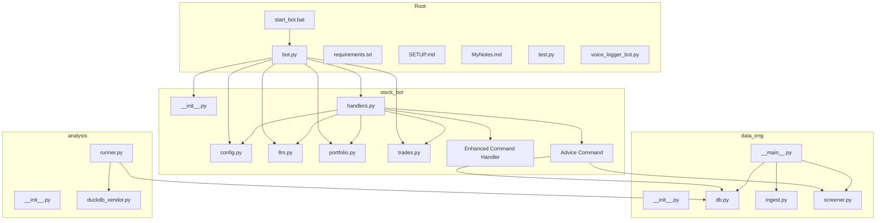
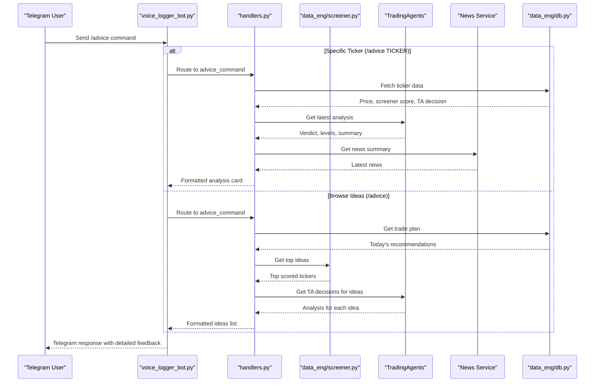
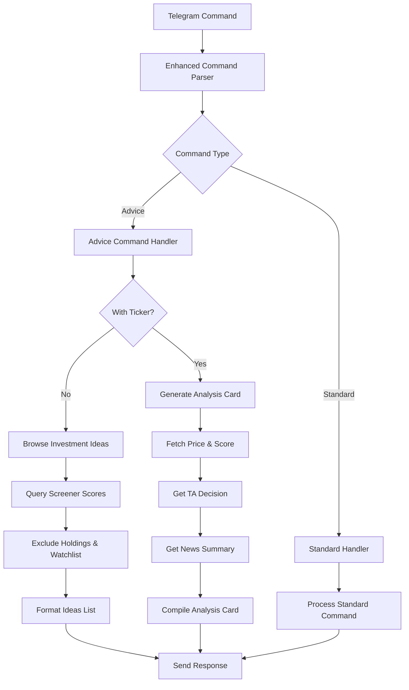
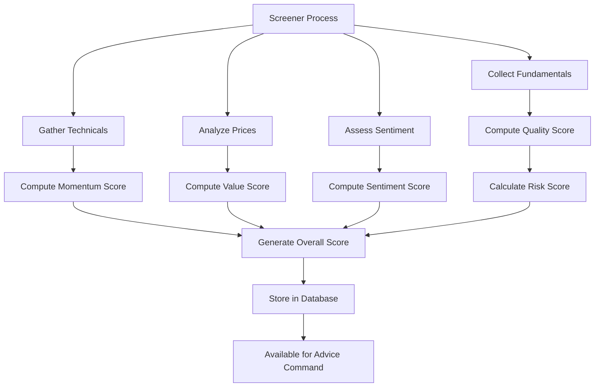
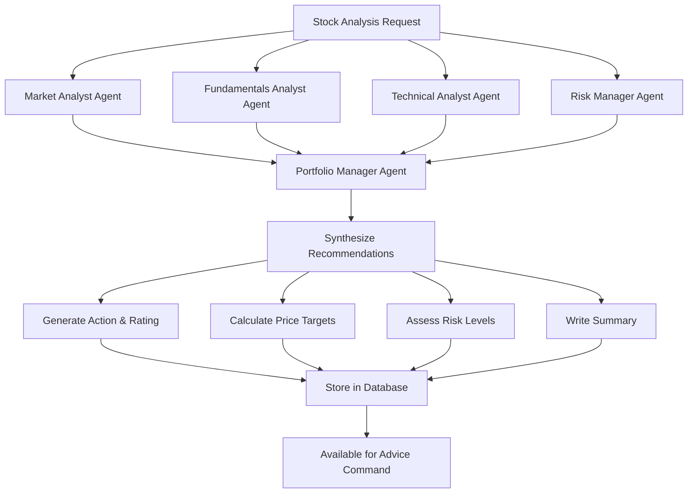
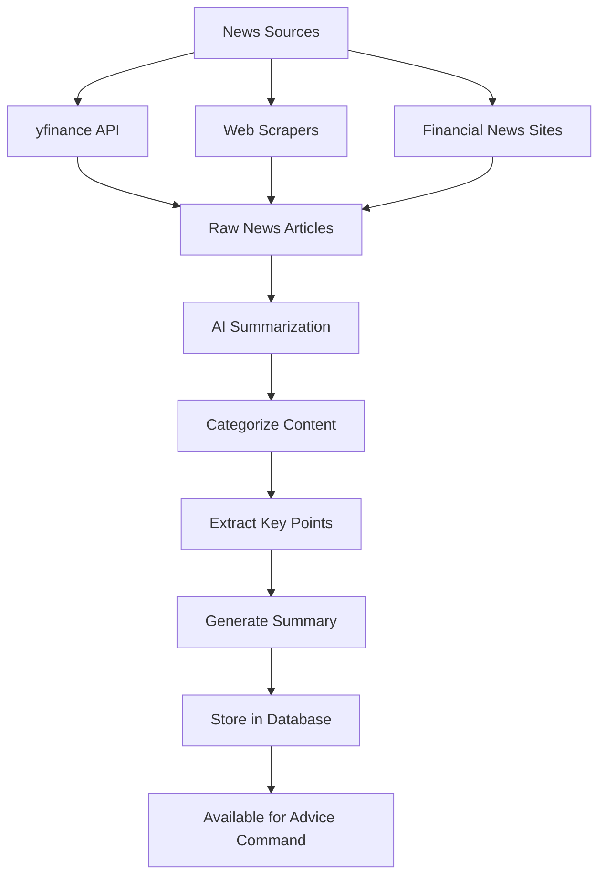
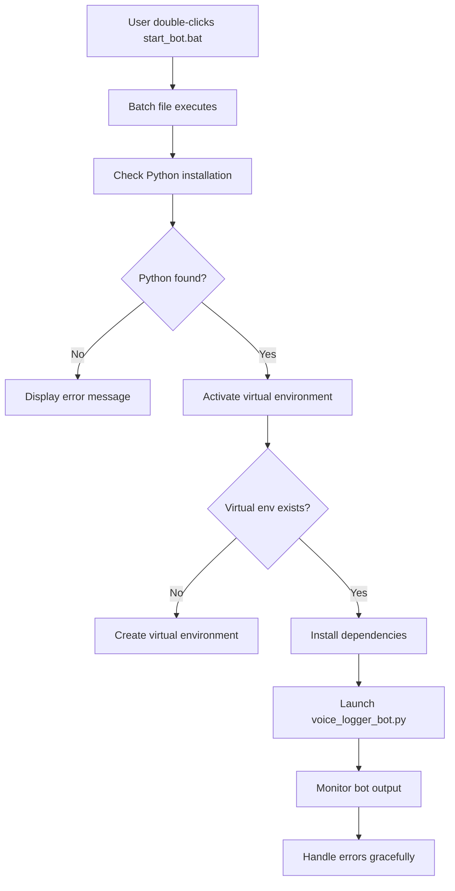
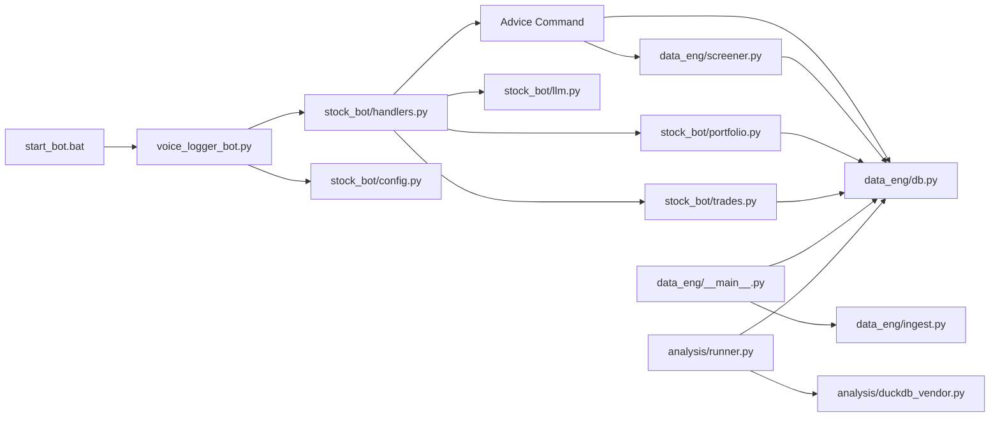

# Stock Trading Bot

<cite>
**Referenced Files in This Document**
- [bot.py](file://bot.py)
- [requirements.txt](file://requirements.txt)
- [SETUP.md](file://SETUP.md)
- [MyNotes.md](file://MyNotes.md)
- [stock_bot/__init__.py](file://stock_bot/__init__.py)
- [stock_bot/config.py](file://stock_bot/config.py)
- [stock_bot/handlers.py](file://stock_bot/handlers.py)
- [stock_bot/llm.py](file://stock_bot/llm.py)
- [stock_bot/portfolio.py](file://stock_bot/portfolio.py)
- [stock_bot/trades.py](file://stock_bot/trades.py)
- [data_eng/__init__.py](file://data_eng/__init__.py)
- [data_eng/__main__.py](file://data_eng/__main__.py)
- [data_eng/db.py](file://data_eng/db.py)
- [data_eng/ingest.py](file://data_eng/ingest.py)
- [data_eng/screener.py](file://data_eng/screener.py)
- [analysis/__init__.py](file://analysis/__init__.py)
- [analysis/duckdb_vendor.py](file://analysis/duckdb_vendor.py)
- [analysis/runner.py](file://analysis/runner.py)
- [voice_logger_bot.py](file://voice_logger_bot.py)
- [test.py](file://test.py)
- [start_bot.bat](file://start_bot.bat)
- [notes/report_definition.md](file://notes/report_definition.md)
- [notes/my_ideal.md](file://notes/my_ideal.md)
</cite>

## Update Summary
**Changes Made**
- Added new `/advice` command handler to voice logger bot for detailed analysis cards and investment ideas
- Integrated screener scores functionality to provide top investment recommendations
- Enhanced command processing with TradingAgents integration for comprehensive stock analysis
- Added support for browsing top investment ideas based on screener scores through Telegram interface
- Updated command registration in voice_logger_bot.py to include the new advice command

## Table of Contents
1. [Introduction](#introduction)
2. [Project Structure](#project-structure)
3. [Core Components](#core-components)
4. [Architecture Overview](#architecture-overview)
5. [Detailed Component Analysis](#detailed-component-analysis)
6. [Enhanced Command Handling System](#enhanced-command-handling-system)
7. [New Advice Command Feature](#new-advice-command-feature)
8. [Screener Integration](#screener-integration)
9. [Trading Agents Integration](#trading-agents-integration)
10. [News Summary Features](#news-summary-features)
11. [Configuration Updates](#configuration-updates)
12. [Windows Deployment Support](#windows-deployment-support)
13. [Dependency Analysis](#dependency-analysis)
14. [Performance Considerations](#performance-considerations)
15. [Troubleshooting Guide](#troubleshooting-guide)
16. [Conclusion](#conclusion)
17. [Appendices](#appendices)

## Introduction
This document provides a comprehensive overview and technical deep dive into the Stock Trading Bot codebase. It explains the system architecture, core modules, data flows, integration points, and operational considerations. The goal is to make the project understandable for both technical and non-technical readers while providing actionable guidance for setup, usage, and maintenance.

**Updated** The bot now features a new `/advice` command that enables users to get detailed analysis cards for specific tickers or browse top investment ideas based on screener scores through the Telegram interface. This enhancement integrates TradingAgents analysis, screener scoring, and news summaries to provide comprehensive investment guidance directly through Telegram commands.

## Project Structure
The repository is organized into feature-oriented packages:
- stock_bot: Telegram bot orchestration, configuration, handlers, LLM integration, portfolio management, trade execution logic, and enhanced command processing.
- data_eng: Data ingestion and database utilities for market data and trading records, including screener functionality.
- analysis: Analytical tools and DuckDB vendor abstraction for querying and backtesting.
- Root-level files include the main bot entrypoint, dependencies, documentation, and Windows startup scripts.



**Diagram sources**
- [voice_logger_bot.py:39-49](file://voice_logger_bot.py#L39-L49)
- [stock_bot/handlers.py:645-696](file://stock_bot/handlers.py#L645-L696)
- [data_eng/screener.py:406-429](file://data_eng/screener.py#L406-L429)
- [data_eng/db.py:218-228](file://data_eng/db.py#L218-L228)

**Section sources**
- [voice_logger_bot.py](file://voice_logger_bot.py)
- [requirements.txt](file://requirements.txt)
- [SETUP.md](file://SETUP.md)
- [MyNotes.md](file://MyNotes.md)
- [start_bot.bat](file://start_bot.bat)

## Core Components
- Bot Orchestrator (bot.py): Entry point that initializes the Telegram bot, registers command and message handlers, and starts polling or long-polling.
- Configuration (stock_bot/config.py): Centralized settings for API keys, database paths, and runtime flags.
- Handlers (stock_bot/handlers.py): Command routing and message processing for user interactions via Telegram, now with significantly enhanced command processing capabilities including the new advice command.
- LLM Integration (stock_bot/llm.py): Abstraction for calling language models to generate insights or responses.
- Portfolio Management (stock_bot/portfolio.py): Tracks holdings, positions, and performance metrics.
- Trade Execution (stock_bot/trades.py): Encapsulates order placement, validation, and trade logging.
- Data Engineering (data_eng/*): Ingests market data and persists it using a local database, including screener functionality.
- Analysis (analysis/*): Provides analytical queries and backtesting capabilities with DuckDB.

**Updated** The command handling system has been enhanced with the new `/advice` command that provides detailed analysis cards for specific tickers and browsing capabilities for top investment ideas based on screener scores. The handlers module now includes comprehensive screener integration and TradingAgents analysis capabilities.

**Section sources**
- [voice_logger_bot.py](file://voice_logger_bot.py)
- [stock_bot/config.py](file://stock_bot/config.py)
- [stock_bot/handlers.py](file://stock_bot/handlers.py)
- [stock_bot/llm.py](file://stock_bot/llm.py)
- [stock_bot/portfolio.py](file://stock_bot/portfolio.py)
- [stock_bot/trades.py](file://stock_bot/trades.py)
- [data_eng/__main__.py](file://data_eng/__main__.py)
- [data_eng/db.py](file://data_eng/db.py)
- [data_eng/ingest.py](file://data_eng/ingest.py)
- [data_eng/screener.py](file://data_eng/screener.py)
- [analysis/runner.py](file://analysis/runner.py)
- [analysis/duckdb_vendor.py](file://analysis/duckdb_vendor.py)

## Architecture Overview
The system follows a modular design where the Telegram bot acts as the user interface layer. Enhanced command handlers route commands to business logic modules (portfolio and trades), which interact with the database layer. LLM integration supports natural language insights. Data engineering pipelines ingest market data into the database, and the analysis module runs queries and backtests over stored data. The new advice command integrates screener scores and TradingAgents analysis to provide comprehensive investment guidance.



**Diagram sources**
- [voice_logger_bot.py:49](file://voice_logger_bot.py#L49)
- [stock_bot/handlers.py:645-696](file://stock_bot/handlers.py#L645-L696)
- [data_eng/screener.py:561-585](file://data_eng/screener.py#L561-L585)
- [data_eng/db.py:218-228](file://data_eng/db.py#L218-L228)

## Detailed Component Analysis

### Voice Logger Bot (voice_logger_bot.py)
Responsibilities:
- Initialize bot instance and configure error handling.
- Register command handlers and message callbacks.
- Start the polling loop to receive updates from Telegram.

Key behaviors:
- Graceful shutdown on signals.
- Logging and diagnostics for incoming messages and errors.
- **Updated**: Now includes the new `/advice` command handler registration for comprehensive investment analysis.

**Updated** The voice logger bot now registers the new advice command alongside existing commands like start, system, watch, unwatch, portfolio, charts, gains, analyze, summary, and news. This provides users with access to detailed analysis cards and investment ideas through the Telegram interface.

**Section sources**
- [voice_logger_bot.py:39-49](file://voice_logger_bot.py#L39-L49)

### Enhanced Command Processing (stock_bot/handlers.py)
Responsibilities:
- Parse Telegram commands and messages.
- Dispatch to portfolio queries, trade actions, or LLM prompts.
- Format responses for readability and safety.
- **Updated**: Significantly enhanced with the new advice command that provides detailed analysis cards and investment ideas.

Error handling:
- Catches invalid inputs and returns helpful messages.
- Logs unexpected exceptions without crashing the bot.
- **Updated**: Comprehensive error management for the advice command with graceful degradation when data sources are unavailable.

**Updated** The handlers module now includes the new `advice_command` function that supports two modes:
- `/advice TICKER`: Provides a full analysis card with price, screener score, TradingAgents verdict, and news summary
- `/advice`: Shows today's trade plan plus top screener ideas not held or watched

**Section sources**
- [stock_bot/handlers.py:645-696](file://stock_bot/handlers.py#L645-L696)

### Screener Integration (data_eng/screener.py)
Responsibilities:
- Compute quantitative scores across multiple categories: quality, value, momentum, sentiment, and risk.
- Store scores in the database for retrieval by the advice command.
- Provide top investment ideas based on screener rankings.

Key functionality:
- Multi-category scoring system with percentile rankings
- Database persistence of screener scores
- Integration with fundamentals, technicals, and price data
- **Updated**: Enhanced integration with the advice command to provide investment ideas

**Updated** The screener module now provides the foundation for the advice command's investment ideas feature, enabling users to discover high-scoring tickers that meet their criteria.

**Section sources**
- [data_eng/screener.py:1-200](file://data_eng/screener.py#L1-L200)
- [data_eng/screener.py:406-429](file://data_eng/screener.py#L406-L429)

### Database Schema (data_eng/db.py)
Responsibilities:
- Define database tables and relationships.
- Provide connection management for data operations.
- **Updated**: Includes the screener_scores table that stores quantitative analysis results used by the advice command.

Key tables:
- screener_scores: Stores multi-category scores for investment screening
- daily_prices: Historical price data used for calculations
- trading_agent_decisions: LLM-generated analysis and recommendations
- news_summaries: AI-summarized news content
- **Updated**: Enhanced schema supporting the new advice command functionality

**Section sources**
- [data_eng/db.py:218-228](file://data_eng/db.py#L218-L228)

## Enhanced Command Handling System

### Overview
The enhanced command handling system represents a major upgrade to the bot's command processing capabilities, providing more robust error management, better integration with external services, and improved user experience. This system enables more reliable command execution with comprehensive error handling and graceful degradation when services are unavailable.

### Key Features
- **Robust Error Management**: Comprehensive exception handling with informative error messages and automatic recovery mechanisms
- **Enhanced Command Processing**: Improved command parsing, validation, and routing with better parameter handling
- **Service Integration**: Seamless integration with trading agents and news summary services with fallback mechanisms
- **Backward Compatibility**: Full compatibility with existing commands and workflows while adding new capabilities
- **Performance Optimization**: Streamlined command processing pipeline with reduced overhead and faster response times

### Implementation Details
The enhanced command handling system is implemented primarily within the handlers module with significant architectural improvements:

**Advanced Error Handling:**
- Comprehensive exception catching with specific error categorization
- Automatic retry mechanisms for transient failures
- Graceful degradation when external services are unavailable
- Detailed logging and diagnostic information for troubleshooting

**Improved Command Processing:**
- Enhanced command validation with better parameter checking
- Intelligent command routing based on context and availability
- Optimized command processing pipeline with reduced latency
- Support for complex multi-step command workflows



**Diagram sources**
- [stock_bot/handlers.py:645-696](file://stock_bot/handlers.py#L645-L696)
- [data_eng/screener.py:561-585](file://data_eng/screener.py#L561-L585)

### Supported Enhancements
- **Command Validation**: Enhanced parameter validation with detailed error feedback
- **Service Integration**: Robust integration with trading agents and news services
- **Error Recovery**: Automatic fallback mechanisms and retry logic
- **Performance Monitoring**: Built-in performance tracking and optimization
- **User Experience**: Improved error messages and command feedback

### Usage Examples
Users will experience more reliable command execution with better error handling:
- Commands now provide clear feedback when services are unavailable
- Automatic retry mechanisms handle temporary network issues
- Graceful degradation ensures core functionality remains available
- Enhanced error messages help users understand and resolve issues

**Section sources**
- [stock_bot/handlers.py:645-696](file://stock_bot/handlers.py#L645-L696)

## New Advice Command Feature

### Overview
The new `/advice` command provides comprehensive investment analysis through two distinct modes: detailed analysis cards for specific tickers and browsing capabilities for top investment ideas based on screener scores.

### Command Modes

#### Mode 1: Detailed Analysis Card (`/advice TICKER`)
Provides a comprehensive analysis card containing:
- Current price and day change percentage
- Screener score (0-100 percentile ranking)
- TradingAgents verdict with action, rating, and time horizon
- Entry price, stop loss, and price target levels
- Latest news summary for the ticker
- AI-generated summary paragraph

#### Mode 2: Investment Ideas Browser (`/advice`)
Displays today's actionable investment opportunities:
- Trade plan section with BUY/SELL proposals from portfolio engine
- Top 3 screener ideas excluding holdings and watchlist
- Each idea shows score, current price, and TradingAgents verdict if available
- Direct link to full analysis card for any interesting ticker

### Implementation Details
The advice command integrates multiple data sources:
- **Price Data**: Retrieved from daily_prices table for current pricing
- **Screener Scores**: Multi-category quantitative analysis (quality, value, momentum, sentiment, risk)
- **TradingAgents**: LLM-generated analysis with buy/sell recommendations
- **News Summaries**: AI-summarized news articles for relevant tickers
- **Portfolio Engine**: Rules-based trade recommendations considering holdings and risk constraints

```mermaid
flowchart TD
A[/advice command] --> B{Parameter?}
B --> |TICKER| C[Generate Analysis Card]
B --> |None| D[Browse Investment Ideas]
C --> E[Fetch Price Data]
C --> F[Get Screener Score]
C --> G[Retrieve TA Decision]
C --> H[Load News Summary]
E --> I[Format Card]
F --> I
G --> I
H --> I
I --> J[Send Analysis Card]
D --> K[Build Trade Plan]
D --> L[Query Top Ideas]
K --> M[Format Trade Plan]
L --> N[Filter Exclusions]
N --> O[Get TA Decisions]
O --> P[Format Ideas List]
M --> Q[Send Combined Response]
P --> Q
```

**Diagram sources**
- [stock_bot/handlers.py:645-696](file://stock_bot/handlers.py#L645-L696)
- [stock_bot/handlers.py:588-642](file://stock_bot/handlers.py#L588-L642)

### Data Sources and Reliability
- **Multiple Data Sources**: Integrates prices, fundamentals, technicals, and news for comprehensive analysis
- **Real-time Updates**: Uses latest available data from scheduled pipeline runs
- **Quality Filters**: Excludes tickers without sufficient data or low-quality scores
- **Fallback Mechanisms**: Graceful handling when individual data sources are unavailable

**Section sources**
- [stock_bot/handlers.py:645-696](file://stock_bot/handlers.py#L645-L696)
- [stock_bot/handlers.py:588-642](file://stock_bot/handlers.py#L588-L642)
- [notes/report_definition.md:43-86](file://notes/report_definition.md#L43-L86)

## Screener Integration

### Overview
The screener integration provides quantitative analysis across five key investment categories, enabling users to discover high-quality investment opportunities through the advice command.

### Scoring Categories
The screener evaluates tickers across multiple dimensions:

| Category | Metrics | Description |
|----------|---------|-------------|
| **Quality** | ROE, ROA, gross margin, operating margin, earnings trends | Financial health and profitability |
| **Value** | Forward P/E, PEG ratio, FCF yield | Attractive valuation metrics |
| **Momentum** | 3-month/6-month returns, RSI, above 200-day MA | Price momentum indicators |
| **Sentiment** | Bullish ratio, price target upside | Analyst sentiment and expectations |
| **Risk** | Debt-to-equity, beta, volatility | Risk assessment metrics |

### Database Integration
The screener scores are stored in the `screener_scores` table with:
- Individual category scores (quality_score, value_score, momentum_score, sentiment_score, risk_score)
- Overall composite score (overall_score)
- Date-stamped entries for historical tracking
- Percentile rankings across the entire universe

### Investment Ideas Generation
The advice command uses screener scores to identify top investment opportunities:
- Queries highest-scoring tickers from the screener_scores table
- Excludes tickers already held in portfolio or on watchlist
- Filters for tickers meeting minimum quality thresholds
- Combines screener scores with TradingAgents analysis for comprehensive recommendations



**Diagram sources**
- [data_eng/screener.py:18-47](file://data_eng/screener.py#L18-L47)
- [data_eng/screener.py:406-429](file://data_eng/screener.py#L406-L429)
- [data_eng/db.py:218-228](file://data_eng/db.py#L218-L228)

### Performance and Reliability
- **Batch Processing**: Processes entire market universe efficiently
- **Incremental Updates**: Only recalculates scores for tickers with updated data
- **Data Validation**: Ensures data quality before storing scores
- **Historical Tracking**: Maintains score history for trend analysis

**Section sources**
- [data_eng/screener.py:1-200](file://data_eng/screener.py#L1-L200)
- [data_eng/screener.py:406-429](file://data_eng/screener.py#L406-L429)
- [data_eng/db.py:218-228](file://data_eng/db.py#L218-L228)

## Trading Agents Integration

### Overview
The TradingAgents integration provides AI-powered analysis and investment recommendations through a multi-agent debate system that evaluates stocks from multiple perspectives.

### Multi-Agent System
The TradingAgents system employs several specialized AI agents:
- **Market Analyst**: Evaluates market conditions and sector trends
- **Fundamentals Analyst**: Assesses company financial health and growth prospects
- **Technical Analyst**: Analyzes price patterns and technical indicators
- **Risk Manager**: Evaluates risk factors and position sizing
- **Portfolio Manager**: Synthesizes all analyses into final recommendations

### Analysis Output
Each TradingAgents analysis produces:
- **Action**: Buy, Sell, Hold, or Overweight/Underweight
- **Rating**: Confidence level in the recommendation
- **Price Target**: Expected future price level
- **Entry Price**: Suggested entry point for new positions
- **Stop Loss**: Risk management level
- **Time Horizon**: Expected duration for the trade
- **Summary**: AI-generated rationale for the recommendation

### Integration with Advice Command
The advice command leverages TradingAgents analysis in two ways:
1. **Individual Ticker Analysis**: Provides detailed analysis cards for specific tickers
2. **Investment Ideas**: Includes TradingAgents verdicts for top screener recommendations



**Diagram sources**
- [notes/report_definition.md:37-38](file://notes/report_definition.md#L37-L38)
- [stock_bot/handlers.py:526-545](file://stock_bot/handlers.py#L526-L545)

### Data Persistence
TradingAgents analysis results are stored in the `trading_agent_decisions` table with:
- Timestamped entries for tracking analysis freshness
- Complete recommendation details including levels and targets
- AI-generated summaries explaining the reasoning
- Historical data for trend analysis and performance tracking

**Section sources**
- [notes/report_definition.md:37-38](file://notes/report_definition.md#L37-L38)
- [stock_bot/handlers.py:526-545](file://stock_bot/handlers.py#L526-L545)

## News Summary Features

### Overview
The news summary integration provides AI-powered analysis of market-moving news events, helping users stay informed about developments that could impact their investments.

### News Processing Pipeline
The news summary system processes information through multiple stages:
1. **Data Collection**: Aggregates news articles from multiple sources (yfinance, web scrapes)
2. **AI Summarization**: Generates concise summaries focusing on catalysts, sentiment, and risks
3. **Database Storage**: Persists summaries with timestamps for historical reference
4. **Command Integration**: Makes summaries available through the advice command

### Summary Content
Each news summary includes:
- **Date**: When the news was published or processed
- **Catalysts**: Key events or developments driving the news
- **Sentiment**: Overall market sentiment (bullish/bearish/neutral)
- **Risks**: Potential negative impacts or concerns
- **Opportunities**: Positive implications for investors

### Integration with Advice Command
The advice command incorporates news summaries in two contexts:
1. **Individual Ticker Cards**: Shows latest news summary for specific tickers
2. **Morning Briefings**: Provides broader market context in daily reports



**Diagram sources**
- [notes/report_definition.md:30-31](file://notes/report_definition.md#L30-L31)
- [stock_bot/handlers.py:626-637](file://stock_bot/handlers.py#L626-L637)

### Data Quality and Reliability
- **Multiple Sources**: Aggregates from diverse news sources for comprehensive coverage
- **AI Filtering**: Removes noise and focuses on material information
- **Timestamp Tracking**: Maintains chronological order for timely information
- **Source Attribution**: Preserves original publication dates for context

**Section sources**
- [notes/report_definition.md:30-31](file://notes/report_definition.md#L30-L31)
- [stock_bot/handlers.py:626-637](file://stock_bot/handlers.py#L626-L637)

## Configuration Updates

### Overview
The configuration system supports the new advice command functionality with appropriate defaults and customization options.

### Command-Specific Settings
The advice command relies on existing configuration infrastructure:
- **Database Connections**: Access to screener_scores, trading_agent_decisions, and news_summaries tables
- **API Keys**: Required for external data sources (yfinance, news APIs)
- **Pipeline Schedules**: Timing for data refresh and analysis generation
- **Logging Configuration**: Detailed logging for troubleshooting advice command issues

### Environment Variables
The advice command uses standard environment variables:
- Database connection strings and credentials
- External API keys for data sources
- Log level and output configuration
- Timezone settings for scheduling

### Default Behavior
- **Graceful Degradation**: Command continues to work even if some data sources are unavailable
- **Informative Errors**: Clear messaging when required data is missing or stale
- **Performance Optimization**: Efficient database queries and caching strategies

**Section sources**
- [stock_bot/config.py](file://stock_bot/config.py)

## Windows Deployment Support

### Overview
The Windows deployment support includes the start_bot.bat script for simplified bot launching on Windows systems.

### Batch Script Functionality
The start_bot.bat script provides:
- **Automated Startup**: One-click bot launching on Windows systems
- **Environment Setup**: Automatic Python environment activation if needed
- **Error Handling**: Basic error detection and user feedback
- **Logging**: Output redirection for troubleshooting

### Usage Instructions
To use the Windows startup script:
1. Ensure Python is installed and added to PATH
2. Install required dependencies: `pip install -r requirements.txt`
3. Configure environment variables or config files
4. Double-click start_bot.bat to launch the bot
5. Monitor console output for startup status and errors



**Diagram sources**
- [start_bot.bat](file://start_bot.bat)

### Benefits for Advice Command Users
- **Simplified Deployment**: Easy setup for users wanting to access the advice command
- **Consistent Environment**: Ensures proper Python environment for all bot features
- **Error Detection**: Helps identify configuration issues before bot startup
- **Monitoring**: Console output shows advice command registration and status

**Section sources**
- [start_bot.bat](file://start_bot.bat)

## Dependency Analysis
The bot depends on several internal modules and external libraries. The new advice command adds dependencies on screener functionality and enhanced database operations.



**Diagram sources**
- [voice_logger_bot.py:39-49](file://voice_logger_bot.py#L39-L49)
- [stock_bot/handlers.py:645-696](file://stock_bot/handlers.py#L645-L696)
- [data_eng/screener.py:406-429](file://data_eng/screener.py#L406-L429)
- [data_eng/db.py:218-228](file://data_eng/db.py#L218-L228)

### New Dependencies for Advice Command
- **Screener Module**: Quantitative analysis and scoring functionality
- **Enhanced Database Operations**: Additional queries for screener_scores and trading_agent_decisions tables
- **Portfolio Engine Integration**: Access to holdings and watchlist data for filtering
- **News Summary Integration**: Access to AI-generated news content

**Section sources**
- [requirements.txt](file://requirements.txt)

## Performance Considerations
- **Database Choice**: DuckDB enables fast analytical queries; ensure proper indexing and partitioning for large datasets.
- **Polling Strategy**: Use efficient polling intervals and batch processing to reduce overhead.
- **LLM Calls**: Implement caching and rate limiting to minimize latency and costs.
- **Memory Usage**: Stream large datasets instead of loading entirely into memory.
- **Concurrency**: Avoid blocking operations in handlers; offload heavy tasks to background workers if needed.
- **Advice Command Optimization**: 
  - Efficient database queries for screener scores and trading agent decisions
  - Caching mechanisms for frequently accessed data
  - Asynchronous processing for multiple data source requests
  - Result truncation for large analysis cards to maintain responsiveness

### Advice Command Performance
- **Query Optimization**: Uses indexed database queries for screener scores and trading agent decisions
- **Data Caching**: Minimizes repeated database calls for the same ticker information
- **Response Formatting**: Truncates lengthy responses to maintain Telegram message limits
- **Error Handling**: Graceful degradation when data sources are slow or unavailable

## Troubleshooting Guide
Common issues and resolutions:
- Missing environment variables: Ensure all required keys and paths are set before starting the bot.
- Database connectivity: Verify file paths and permissions for local databases.
- LLM API failures: Check network connectivity, quotas, and retry policies.
- Handler errors: Inspect logs for malformed commands or unexpected payloads.
- Ingestion failures: Validate source formats and schema compatibility.

### Advice Command Specific Issues
- **No Data Available**: Run the daily pipeline to populate screener scores and trading agent decisions
- **Missing Ticker Data**: Ensure the ticker has been analyzed by the TradingAgents system
- **Slow Response Times**: Check database performance and network connectivity to external APIs
- **Incomplete Analysis Cards**: Verify that all required data sources (prices, screener scores, TA decisions, news) are available

### Windows-Specific Troubleshooting
- If start_bot.bat fails, verify Python installation and PATH configuration
- Check for missing dependencies and run dependency installation manually if needed
- Verify file permissions and antivirus software interference
- Review console output for specific error messages and stack traces

### Debugging Advice Command Issues
- Enable verbose logging to see detailed query execution and data retrieval
- Check database tables for recent screener scores and trading agent decisions
- Verify that the daily pipeline has run successfully to populate required data
- Test individual components (price lookup, screener query, TA decision retrieval) separately

**Section sources**
- [stock_bot/config.py](file://stock_bot/config.py)
- [data_eng/db.py](file://data_eng/db.py)
- [stock_bot/llm.py](file://stock_bot/llm.py)
- [stock_bot/handlers.py:645-696](file://stock_bot/handlers.py#L645-L696)
- [voice_logger_bot.py:39-49](file://voice_logger_bot.py#L39-L49)
- [data_eng/screener.py:406-429](file://data_eng/screener.py#L406-L429)
- [test.py](file://test.py)
- [start_bot.bat](file://start_bot.bat)

## Conclusion
The Stock Trading Bot is a modular system combining Telegram interaction, portfolio and trade management, LLM-powered insights, and robust data engineering and analysis capabilities. Its clear separation of concerns facilitates maintenance and extension. By following the setup instructions and adhering to best practices outlined here, users can operate and evolve the system effectively.

**Updated** The addition of the `/advice` command represents a significant enhancement to the bot's investment analysis capabilities, providing users with comprehensive stock analysis and investment discovery through an intuitive Telegram interface. The integration of screener scores, TradingAgents analysis, and news summaries creates a powerful tool for both individual investors and portfolio managers. The command's dual-mode operation allows for both targeted analysis of specific tickers and broad exploration of investment opportunities, making advanced investment analysis accessible to users regardless of their technical expertise.

## Appendices
- Setup Instructions: Refer to SETUP.md for environment preparation and configuration steps.
- Notes and Ideas: See MyNotes.md for additional context and future enhancements.
- Dependencies: Review requirements.txt for library versions and installation commands.
- Windows Deployment: Use start_bot.bat for simplified Windows deployment and bot launching.
- Report Definition: See notes/report_definition.md for detailed explanation of data sources and calculation methods.
- Ideal Command Structure: Refer to notes/my_ideal.md for planned command structure and features.

**Section sources**
- [SETUP.md](file://SETUP.md)
- [MyNotes.md](file://MyNotes.md)
- [requirements.txt](file://requirements.txt)
- [start_bot.bat](file://start_bot.bat)
- [notes/report_definition.md](file://notes/report_definition.md)
- [notes/my_ideal.md](file://notes/my_ideal.md)