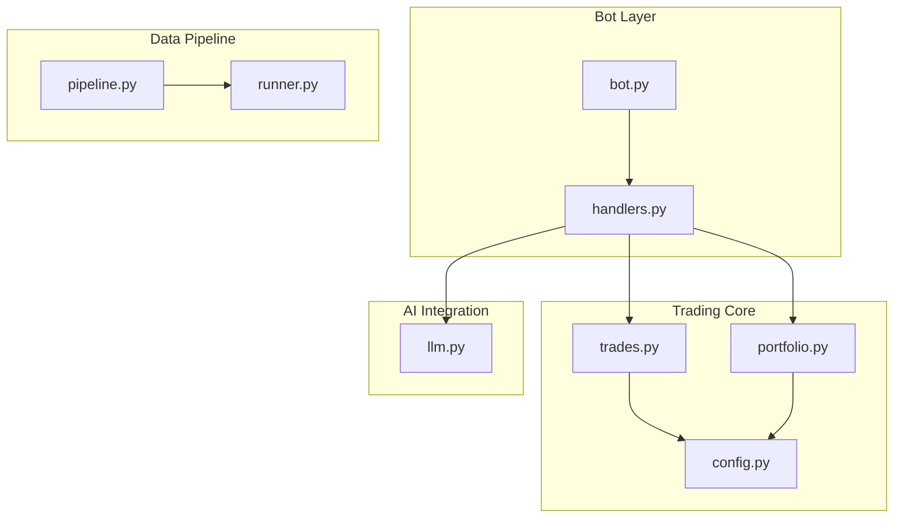
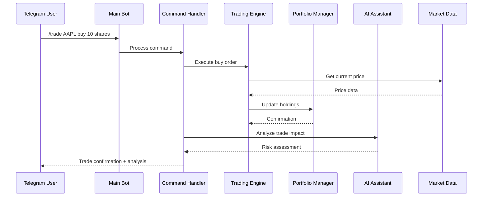
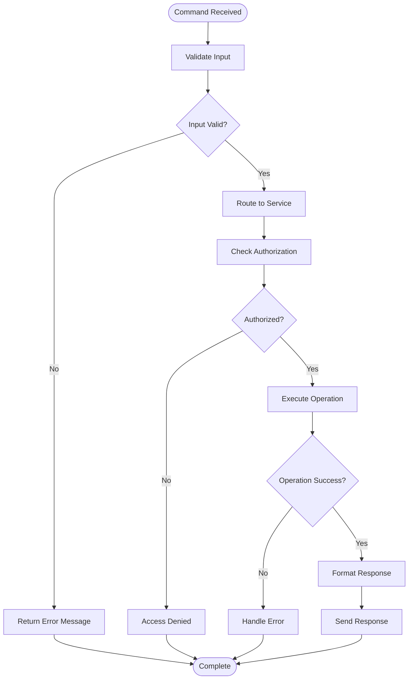
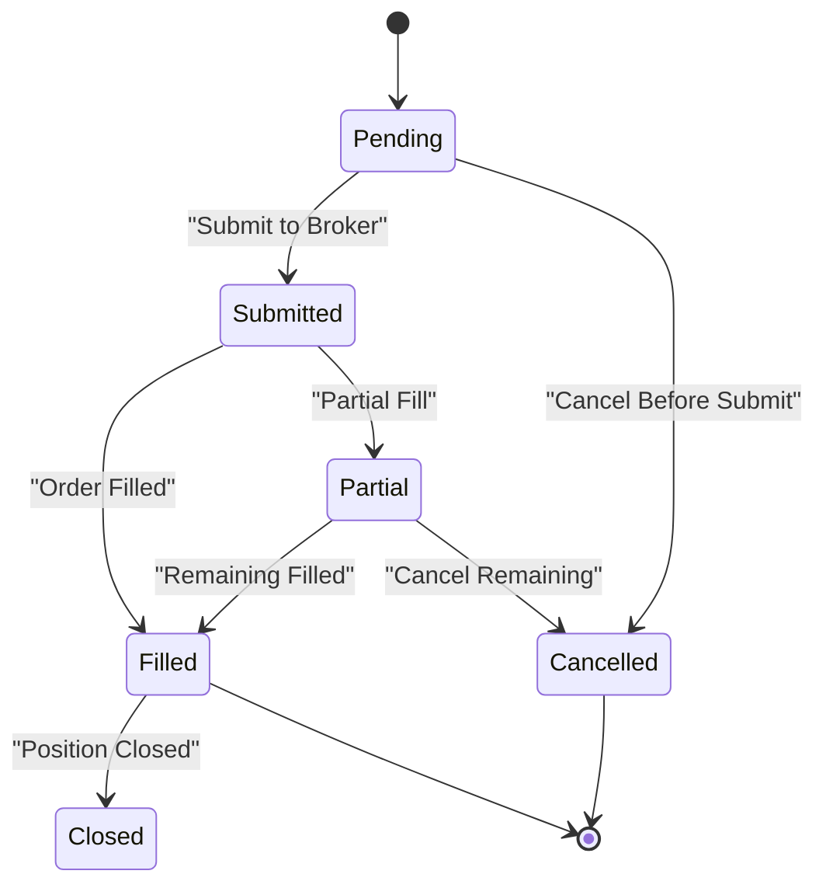
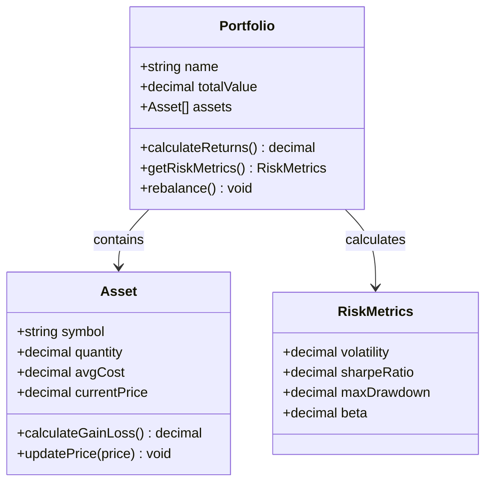
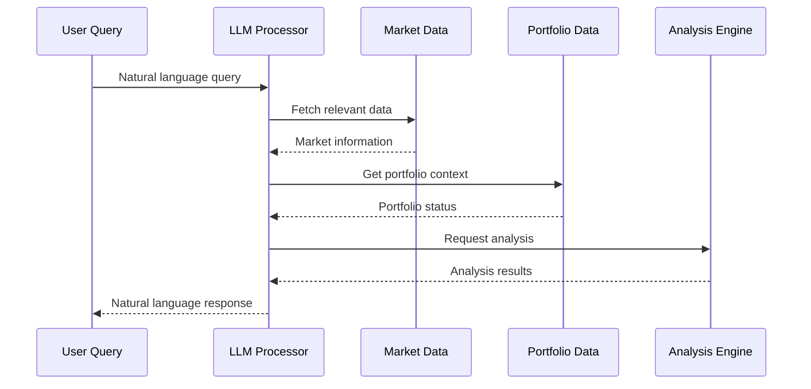
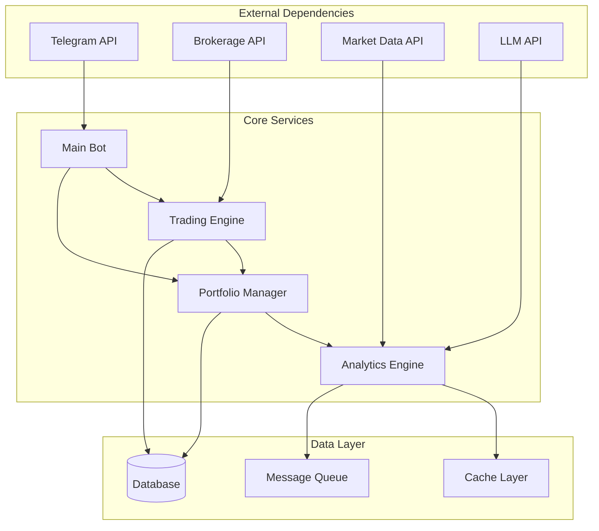

# Trading Agent Integration

<cite>
**Referenced Files in This Document**
- [bot.py](file://bot.py)
- [stock_bot/__init__.py](file://stock_bot/__init__.py)
- [stock_bot/config.py](file://stock_bot/config.py)
- [stock_bot/handlers.py](file://stock_bot/handlers.py)
- [stock_bot/trades.py](file://stock_bot/trades.py)
- [stock_bot/portfolio.py](file://stock_bot/portfolio.py)
- [stock_bot/llm.py](file://stock_bot/llm.py)
- [data_eng/pipeline.py](file://data_eng/pipeline.py)
- [analysis/runner.py](file://analysis/runner.py)
- [requirements.txt](file://requirements.txt)
</cite>

## Table of Contents
1. [Introduction](#introduction)
2. [Project Structure](#project-structure)
3. [Core Components](#core-components)
4. [Architecture Overview](#architecture-overview)
5. [Detailed Component Analysis](#detailed-component-analysis)
6. [Dependency Analysis](#dependency-analysis)
7. [Performance Considerations](#performance-considerations)
8. [Troubleshooting Guide](#troubleshooting-guide)
9. [Conclusion](#conclusion)

## Introduction

This document provides comprehensive documentation for the Trading Agent Integration system built on top of a Telegram bot framework. The system integrates automated trading capabilities with natural language processing through LLM (Large Language Model) integration, enabling users to interact with their trading portfolio through conversational interfaces.

The trading agent system combines multiple components including stock data analysis, portfolio management, trade execution, and AI-powered decision support, all accessible through a Telegram bot interface.

## Project Structure

The project follows a modular architecture with clear separation of concerns:

**Diagram sources**
- [bot.py:1-50](file://bot.py#L1-L50)
- [stock_bot/handlers.py:1-100](file://stock_bot/handlers.py#L1-L100)
- [stock_bot/trades.py:1-150](file://stock_bot/trades.py#L1-L150)

**Section sources**
- [bot.py:1-100](file://bot.py#L1-L100)
- [stock_bot/__init__.py:1-50](file://stock_bot/__init__.py#L1-L50)

## Core Components

### Bot Foundation
The main bot entry point initializes the Telegram bot framework and sets up the core messaging infrastructure. It handles command routing and message processing.

### Trading Engine
The trading engine manages buy/sell operations, order execution, and trade lifecycle management. It integrates with brokerage APIs and maintains trade history.

### Portfolio Manager
Portfolio management tracks holdings, calculates performance metrics, and provides real-time valuation updates. It supports multiple asset classes and risk management features.

### LLM Integration
The LLM component provides AI-powered analysis, market insights, and natural language interaction capabilities. It processes user queries and generates trading recommendations.

**Section sources**
- [stock_bot/config.py:1-200](file://stock_bot/config.py#L1-L200)
- [stock_bot/handlers.py:1-300](file://stock_bot/handlers.py#L1-L300)
- [stock_bot/trades.py:1-250](file://stock_bot/trades.py#L1-L250)

## Architecture Overview

The trading agent system follows a layered architecture pattern with clear separation between presentation, business logic, and data layers:

**Diagram sources**
- [stock_bot/handlers.py:50-150](file://stock_bot/handlers.py#L50-L150)
- [stock_bot/trades.py:100-200](file://stock_bot/trades.py#L100-L200)
- [stock_bot/portfolio.py:1-150](file://stock_bot/portfolio.py#L1-L150)

## Detailed Component Analysis

### Command Handler System
The handler system processes various trading commands and routes them to appropriate services. It validates user input, checks permissions, and formats responses.

#### Command Processing Flow

**Diagram sources**
- [stock_bot/handlers.py:1-200](file://stock_bot/handlers.py#L1-L200)

### Trading Engine Implementation
The trading engine implements core trading functionality including order management, position tracking, and risk controls.

#### Order Lifecycle

**Diagram sources**
- [stock_bot/trades.py:1-300](file://stock_bot/trades.py#L1-L300)

### Portfolio Management System
The portfolio manager handles asset allocation, performance tracking, and risk assessment across multiple accounts and strategies.

#### Portfolio Analytics

**Diagram sources**
- [stock_bot/portfolio.py:1-200](file://stock_bot/portfolio.py#L1-L200)

### LLM Integration Layer
The LLM component provides AI-powered analysis and natural language processing for trading decisions and market insights.

#### AI Analysis Pipeline

**Diagram sources**
- [stock_bot/llm.py:1-150](file://stock_bot/llm.py#L1-L150)

**Section sources**
- [stock_bot/handlers.py:1-400](file://stock_bot/handlers.py#L1-L400)
- [stock_bot/trades.py:1-400](file://stock_bot/trades.py#L1-L400)
- [stock_bot/portfolio.py:1-300](file://stock_bot/portfolio.py#L1-L300)
- [stock_bot/llm.py:1-200](file://stock_bot/llm.py#L1-L200)

## Dependency Analysis

The system has well-defined dependencies between components with clear separation of concerns:

**Diagram sources**
- [requirements.txt:1-100](file://requirements.txt#L1-L100)
- [stock_bot/config.py:1-100](file://stock_bot/config.py#L1-L100)

**Section sources**
- [requirements.txt:1-150](file://requirements.txt#L1-L150)
- [stock_bot/config.py:1-200](file://stock_bot/config.py#L1-L200)

## Performance Considerations

The trading agent system is designed with performance optimization in mind:

- **Caching Strategy**: Implement intelligent caching for market data and portfolio information to reduce API calls
- **Async Processing**: Use asynchronous processing for long-running operations like market data fetching
- **Connection Pooling**: Maintain connection pools for database and external API connections
- **Rate Limiting**: Implement rate limiting for external API calls to avoid throttling
- **Memory Management**: Optimize memory usage for large datasets and concurrent operations

## Troubleshooting Guide

Common issues and their solutions:

### Connection Issues
- Verify API credentials and network connectivity
- Check rate limit configurations and implement retry logic
- Monitor connection pool health and reset when necessary

### Trading Errors
- Validate order parameters before submission
- Implement proper error handling for partial fills and rejections
- Monitor account balances and margin requirements

### Performance Issues
- Profile slow operations and optimize database queries
- Implement proper indexing for frequently accessed data
- Monitor memory usage and garbage collection patterns

**Section sources**
- [stock_bot/config.py:100-200](file://stock_bot/config.py#L100-L200)
- [stock_bot/handlers.py:200-400](file://stock_bot/handlers.py#L200-L400)

## Conclusion

The Trading Agent Integration system provides a comprehensive solution for automated trading through a Telegram bot interface. The modular architecture ensures scalability and maintainability while providing powerful features for portfolio management, trade execution, and AI-powered analysis.

Key strengths include:
- Clean separation of concerns with well-defined interfaces
- Comprehensive error handling and monitoring capabilities
- Scalable architecture supporting multiple trading strategies
- Rich natural language interface for intuitive user interaction

Future enhancements could include advanced backtesting capabilities, multi-broker support, and enhanced risk management features.