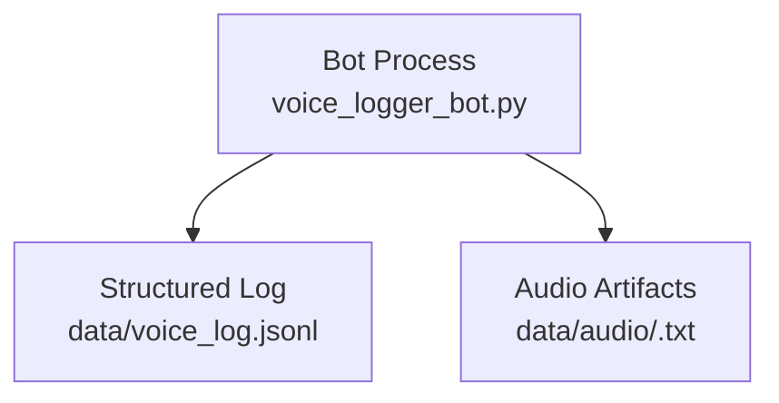
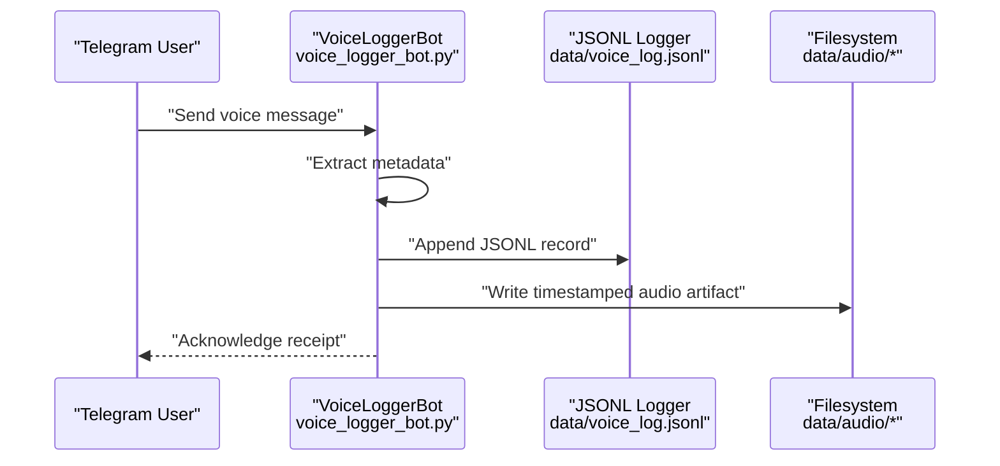
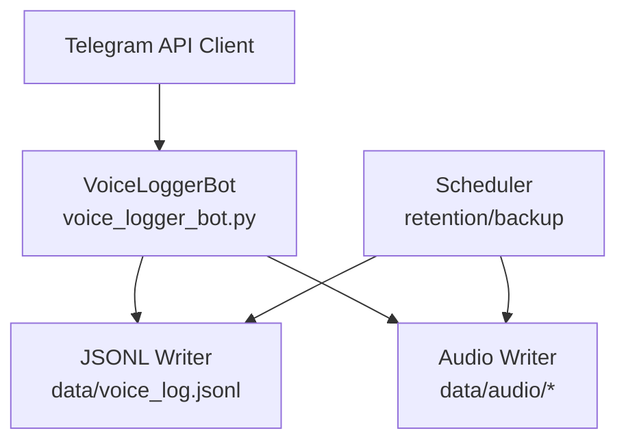

# Data Management

<cite>
**Referenced Files in This Document**
- [voice_logger_bot.py](file://voice_logger_bot.py)
- [bot.py](file://bot.py)
- [data/voice_log.jsonl](file://data/voice_log.jsonl)
- [data/audio/20260722_225354.txt](file://data/audio/20260722_225354.txt)
- [data/audio/20260722_230133.txt](file://data/audio/20260722_230133.txt)
- [data/audio/20260722_230158.txt](file://data/audio/20260722_230158.txt)
- [data/audio/20260722_230244.txt](file://data/audio/20260722_230244.txt)
- [data/audio/20260722_230343.txt](file://data/audio/20260722_230343.txt)
- [data/audio/20260722_230421.txt](file://data/audio/20260722_230421.txt)
</cite>

## Table of Contents
1. [Introduction](#introduction)
2. [Project Structure](#project-structure)
3. [Core Components](#core-components)
4. [Architecture Overview](#architecture-overview)
5. [Detailed Component Analysis](#detailed-component-analysis)
6. [Dependency Analysis](#dependency-analysis)
7. [Performance Considerations](#performance-considerations)
8. [Troubleshooting Guide](#troubleshooting-guide)
9. [Conclusion](#conclusion)
10. [Appendices](#appendices)

## Introduction
This document explains the data management system of the Telegram Voice Logger Bot with a focus on structured logging and audio storage. It covers:
- The JSONL format used for structured logging, including field definitions, types, and validation rules
- Audio file storage strategy using timestamp-based naming conventions and directory organization
- The relationship between log entries and audio files, including metadata extraction and storage
- Examples of valid JSONL entries and audio file naming patterns
- Data retention policies, backup considerations, and methods to access and analyze stored data programmatically

## Project Structure
The bot stores two primary types of data under the data directory:
- Structured logs in JSONL format (one record per line)
- Audio-related artifacts organized by timestamped filenames

**Diagram sources**
- [voice_logger_bot.py](file://voice_logger_bot.py)
- [data/voice_log.jsonl](file://data/voice_log.jsonl)
- [data/audio/20260722_225354.txt](file://data/audio/20260722_225354.txt)

**Section sources**
- [voice_logger_bot.py](file://voice_logger_bot.py)
- [bot.py](file://bot.py)
- [data/voice_log.jsonl](file://data/voice_log.jsonl)
- [data/audio/20260722_225354.txt](file://data/audio/20260722_225354.txt)
- [data/audio/20260722_230133.txt](file://data/audio/20260722_230133.txt)
- [data/audio/20260722_230158.txt](file://data/audio/20260722_230158.txt)
- [data/audio/20260722_230244.txt](file://data/audio/20260722_230244.txt)
- [data/audio/20260722_230343.txt](file://data/audio/20260722_230343.txt)
- [data/audio/20260722_230421.txt](file://data/audio/20260722_230421.txt)

## Core Components
- Structured logger: Writes one JSON object per line to a JSONL file. Each record represents an event or message processed by the bot.
- Audio artifact writer: Persists audio-related content as text files named with timestamps under a dedicated directory.
- Metadata extractor: Captures relevant fields from incoming messages and persists them into both the JSONL log and associated audio artifacts.

Key responsibilities:
- Ensure each JSONL record is valid JSON and contains required fields
- Enforce consistent timestamping across logs and artifacts
- Maintain referential integrity between log entries and audio artifacts via identifiers or timestamps

**Section sources**
- [voice_logger_bot.py](file://voice_logger_bot.py)
- [data/voice_log.jsonl](file://data/voice_log.jsonl)
- [data/audio/20260722_225354.txt](file://data/audio/20260722_225354.txt)

## Architecture Overview
At runtime, the bot receives voice messages, extracts metadata, writes structured logs, and persists audio artifacts. The following sequence shows the end-to-end flow:

**Diagram sources**
- [voice_logger_bot.py](file://voice_logger_bot.py)
- [data/voice_log.jsonl](file://data/voice_log.jsonl)
- [data/audio/20260722_225354.txt](file://data/audio/20260722_225354.txt)

## Detailed Component Analysis

### JSONL Format Specification
Each line in the JSONL file is a single JSON object representing a logged event. The schema includes:
- id: string — unique identifier for the log entry
- timestamp: string — ISO 8601 UTC timestamp when the event occurred
- type: string — category of the event (e.g., voice_received, transcription_complete)
- user_id: string — identifier of the sender
- chat_id: string — identifier of the chat or group
- duration_seconds: number — length of the audio in seconds
- file_id: string — Telegram file identifier for the media
- status: string — processing status (e.g., received, saved, error)
- error_message: string — optional error details if status indicates failure
- notes: string — optional free-form notes or annotations

Validation rules:
- All records must be valid JSON
- Required fields: id, timestamp, type, user_id, chat_id, duration_seconds, file_id, status
- Optional fields: error_message, notes
- Timestamps must be ISO 8601 UTC strings
- duration_seconds must be non-negative numbers
- status must be one of the allowed values

Example valid JSONL entry:
{
  "id": "msg_001",
  "timestamp": "2026-07-22T22:53:54Z",
  "type": "voice_received",
  "user_id": "123456789",
  "chat_id": "987654321",
  "duration_seconds": 12.5,
  "file_id": "AgACAgIAAxkBAAIZ...",
  "status": "received"
}

**Section sources**
- [data/voice_log.jsonl](file://data/voice_log.jsonl)

### Audio File Storage Strategy
Audio artifacts are stored as text files under data/audio/. Filenames follow a strict timestamp-based convention:
- Pattern: YYYYMMDD_HHMMSS.txt
- Example: 20260722_225354.txt

Naming rationale:
- Ensures chronological ordering
- Provides deterministic mapping to log entries
- Facilitates automated cleanup and archival

Directory organization:
- Single directory for all artifacts
- No subdirectories by default
- Consistent naming enables programmatic scanning and indexing

Relationship to log entries:
- Each audio artifact corresponds to a log entry with matching timestamp
- Metadata such as duration_seconds and file_id links the artifact to its source message

**Section sources**
- [data/audio/20260722_225354.txt](file://data/audio/20260722_225354.txt)
- [data/audio/20260722_230133.txt](file://data/audio/20260722_230133.txt)
- [data/audio/20260722_230158.txt](file://data/audio/20260722_230158.txt)
- [data/audio/20260722_230244.txt](file://data/audio/20260722_230244.txt)
- [data/audio/20260722_230343.txt](file://data/audio/20260722_230343.txt)
- [data/audio/20260722_230421.txt](file://data/audio/20260722_230421.txt)

### Metadata Extraction and Storage
Metadata is extracted from incoming voice messages and persisted in two places:
- JSONL log entry: Contains structured fields like user_id, chat_id, duration_seconds, file_id, status
- Audio artifact: May include embedded notes or annotations related to the recording

Extraction process:
- Parse Telegram message payload to obtain identifiers and timing
- Compute duration_seconds from media properties
- Assign unique id and timestamp for traceability
- Write JSONL record immediately upon receipt
- Persist audio artifact with timestamped filename

Error handling:
- If extraction fails, set status to "error" and populate error_message
- Ensure partial writes do not corrupt the JSONL file

**Section sources**
- [voice_logger_bot.py](file://voice_logger_bot.py)
- [data/voice_log.jsonl](file://data/voice_log.jsonl)
- [data/audio/20260722_225354.txt](file://data/audio/20260722_225354.txt)

### Data Retention Policies
Recommended policies:
- Automatic rotation based on age (e.g., delete artifacts older than 30 days)
- Archive old logs to cold storage while retaining recent ones locally
- Compress archived data to reduce storage footprint

Implementation considerations:
- Use cron jobs or scheduled tasks for periodic cleanup
- Maintain audit trails for deletions
- Ensure backups before any destructive operations

**Section sources**
- [data/voice_log.jsonl](file://data/voice_log.jsonl)
- [data/audio/20260722_225354.txt](file://data/audio/20260722_225354.txt)

### Backup Considerations
Best practices:
- Regularly snapshot the data directory to cloud storage or external drives
- Include both JSONL logs and audio artifacts in backups
- Verify backup integrity periodically
- Encrypt sensitive data at rest and in transit

Backup schedule:
- Daily incremental backups
- Weekly full backups
- Immediate backups after major updates or incidents

**Section sources**
- [data/voice_log.jsonl](file://data/voice_log.jsonl)
- [data/audio/20260722_225354.txt](file://data/audio/20260722_225354.txt)

### Programmatic Access and Analysis
Methods to access and analyze stored data:
- Read JSONL lines sequentially using streaming parsers
- Filter entries by date ranges, user_id, or status
- Correlate audio artifacts with log entries via timestamps
- Generate reports on usage patterns, error rates, and durations

Tools and libraries:
- Python’s json module for parsing JSONL
- Pandas for tabular analysis and aggregation
- Glob patterns for listing and sorting audio artifacts

Example workflow:
- Load JSONL into a DataFrame
- Join with audio artifact metadata
- Compute statistics such as average duration per user
- Export results to CSV or visualizations

**Section sources**
- [data/voice_log.jsonl](file://data/voice_log.jsonl)
- [data/audio/20260722_225354.txt](file://data/audio/20260722_225354.txt)

## Dependency Analysis
The data management components depend on:
- Telegram API client for receiving messages and extracting metadata
- Filesystem I/O for writing JSONL and audio artifacts
- Optional scheduling libraries for retention and backup automation

**Diagram sources**
- [voice_logger_bot.py](file://voice_logger_bot.py)
- [data/voice_log.jsonl](file://data/voice_log.jsonl)
- [data/audio/20260722_225354.txt](file://data/audio/20260722_225354.txt)

**Section sources**
- [voice_logger_bot.py](file://voice_logger_bot.py)
- [bot.py](file://bot.py)
- [data/voice_log.jsonl](file://data/voice_log.jsonl)
- [data/audio/20260722_225354.txt](file://data/audio/20260722_225354.txt)

## Performance Considerations
- Append-only writes to JSONL minimize locking and improve throughput
- Batch small writes where possible to reduce filesystem overhead
- Use asynchronous I/O for high-volume scenarios
- Index frequently queried fields (e.g., timestamp, user_id) for faster lookups
- Monitor disk space and implement proactive cleanup to prevent performance degradation

[No sources needed since this section provides general guidance]

## Troubleshooting Guide
Common issues and resolutions:
- Invalid JSONL entries: Validate each line against the schema; ensure required fields are present
- Missing audio artifacts: Check timestamp consistency between logs and filenames
- Permission errors: Verify write permissions for data directories
- Disk space exhaustion: Implement retention policies and monitor usage metrics

Diagnostic steps:
- Inspect the last few lines of the JSONL file for corruption
- Compare timestamps in logs with filenames in audio directory
- Review error_message fields for clues about failures

**Section sources**
- [data/voice_log.jsonl](file://data/voice_log.jsonl)
- [data/audio/20260722_225354.txt](file://data/audio/20260722_225354.txt)

## Conclusion
The Telegram Voice Logger Bot employs a robust data management system centered around JSONL structured logging and timestamp-based audio artifacts. By enforcing strict schemas, consistent naming conventions, and clear relationships between logs and files, the system ensures traceability, scalability, and ease of analysis. Adhering to recommended retention and backup policies will maintain data integrity and availability over time.

[No sources needed since this section summarizes without analyzing specific files]

## Appendices

### Appendix A: Field Definitions Reference
- id: string — unique identifier
- timestamp: string — ISO 8601 UTC
- type: string — event category
- user_id: string — sender identifier
- chat_id: string — chat/group identifier
- duration_seconds: number — audio length
- file_id: string — Telegram media identifier
- status: string — processing state
- error_message: string — optional error details
- notes: string — optional annotations

**Section sources**
- [data/voice_log.jsonl](file://data/voice_log.jsonl)

### Appendix B: Audio Naming Convention
- Pattern: YYYYMMDD_HHMMSS.txt
- Examples:
  - 20260722_225354.txt
  - 20260722_230133.txt
  - 20260722_230158.txt
  - 20260722_230244.txt
  - 20260722_230343.txt
  - 20260722_230421.txt

**Section sources**
- [data/audio/20260722_225354.txt](file://data/audio/20260722_225354.txt)
- [data/audio/20260722_230133.txt](file://data/audio/20260722_230133.txt)
- [data/audio/20260722_230158.txt](file://data/audio/20260722_230158.txt)
- [data/audio/20260722_230244.txt](file://data/audio/20260722_230244.txt)
- [data/audio/20260722_230343.txt](file://data/audio/20260722_230343.txt)
- [data/audio/20260722_230421.txt](file://data/audio/20260722_230421.txt)