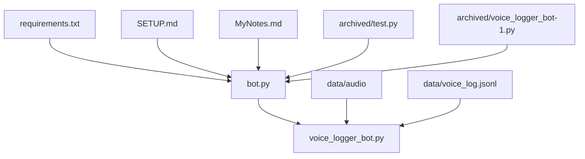
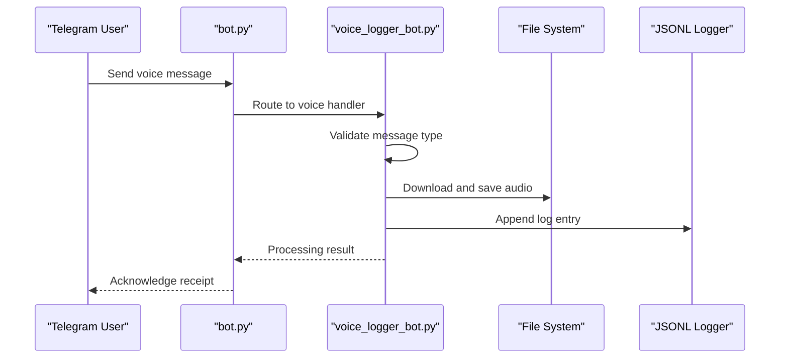
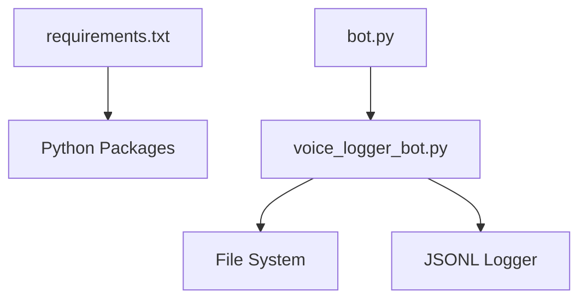

# Development Guide

<cite>
**Referenced Files in This Document**
- [bot.py](file://bot.py)
- [voice_logger_bot.py](file://voice_logger_bot.py)
- [requirements.txt](file://requirements.txt)
- [SETUP.md](file://SETUP.md)
- [MyNotes.md](file://MyNotes.md)
- [test.py](file://archived/test.py)
- [voice_logger_bot-1.py](file://archived/voice_logger_bot-1.py)
</cite>

## Table of Contents
1. [Introduction](#introduction)
2. [Project Structure](#project-structure)
3. [Core Components](#core-components)
4. [Architecture Overview](#architecture-overview)
5. [Detailed Component Analysis](#detailed-component-analysis)
6. [Dependency Analysis](#dependency-analysis)
7. [Performance Considerations](#performance-considerations)
8. [Troubleshooting Guide](#troubleshooting-guide)
9. [Conclusion](#conclusion)
10. [Appendices](#appendices)

## Introduction
This document provides a comprehensive development guide for extending and maintaining the Telegram Voice Logger Bot. It explains the codebase structure, coding conventions, and architectural decisions. It also includes guidance on adding new message handlers, implementing custom audio processing, integrating additional services, testing strategies using archived test files, debugging techniques, error handling patterns, performance optimization tips, and common extension examples such as speech-to-text integration, user authentication, and database storage. Version history and migration procedures are documented based on archived files.

## Project Structure
The project is organized into a small set of Python modules and supporting directories:
- Entry points and main logic: bot.py, voice_logger_bot.py
- Configuration and setup: requirements.txt, SETUP.md, MyNotes.md
- Archived versions and tests: archived/test.py, archived/voice_logger_bot-1.py
- Data storage: data/audio (audio metadata), data/voice_log.jsonl (log entries)

**Diagram sources**
- [bot.py](file://bot.py)
- [voice_logger_bot.py](file://voice_logger_bot.py)
- [requirements.txt](file://requirements.txt)
- [SETUP.md](file://SETUP.md)
- [MyNotes.md](file://MyNotes.md)
- [test.py](file://archived/test.py)
- [voice_logger_bot-1.py](file://archived/voice_logger_bot-1.py)

**Section sources**
- [bot.py](file://bot.py)
- [voice_logger_bot.py](file://voice_logger_bot.py)
- [requirements.txt](file://requirements.txt)
- [SETUP.md](file://SETUP.md)
- [MyNotes.md](file://MyNotes.md)
- [test.py](file://archived/test.py)
- [voice_logger_bot-1.py](file://archived/voice_logger_bot-1.py)

## Core Components
- Main entry point: bot.py initializes the bot lifecycle, sets up configuration, and starts the polling loop or webhook server depending on deployment mode.
- Voice logger core: voice_logger_bot.py implements message handling, audio download, file naming, logging to JSONL, and optional processing hooks.
- Dependencies: requirements.txt lists third-party libraries used by the bot.
- Setup and notes: SETUP.md describes environment variables and deployment steps; MyNotes.md contains developer notes and usage hints.

Key responsibilities:
- Message routing and handler registration
- Audio file retrieval and persistence
- Logging and audit trail via JSONL
- Extensibility points for custom processors and integrations

**Section sources**
- [bot.py](file://bot.py)
- [voice_logger_bot.py](file://voice_logger_bot.py)
- [requirements.txt](file://requirements.txt)
- [SETUP.md](file://SETUP.md)
- [MyNotes.md](file://MyNotes.md)

## Architecture Overview
The system follows a modular architecture with clear separation between the Telegram client layer and the voice processing pipeline. The main flow involves receiving messages, identifying voice content, downloading audio, storing it, and optionally processing it through custom pipelines.

**Diagram sources**
- [bot.py](file://bot.py)
- [voice_logger_bot.py](file://voice_logger_bot.py)

## Detailed Component Analysis

### Main Entry Point (bot.py)
Responsibilities:
- Initialize bot instance and load configuration
- Register message handlers for different message types
- Start long-polling or webhook server
- Handle graceful shutdown and error propagation

Extensions:
- Add new handlers by registering callbacks for specific message types or commands
- Integrate middleware for logging, rate limiting, or authentication before routing

**Section sources**
- [bot.py](file://bot.py)

### Voice Logger Core (voice_logger_bot.py)
Responsibilities:
- Parse incoming messages and detect voice content
- Download audio from Telegram servers
- Generate deterministic filenames and organize storage
- Write structured logs to JSONL
- Provide hooks for custom audio processing pipelines

Extensions:
- Implement custom processors by plugging into the processing pipeline
- Add speech-to-text integration by invoking external APIs after download
- Store metadata in databases by extending the logging step

**Section sources**
- [voice_logger_bot.py](file://voice_logger_bot.py)

### Requirements and Dependencies (requirements.txt)
Responsibilities:
- Declare Python packages required for Telegram API access, audio handling, and logging
- Ensure reproducible environments across development and production

Extensions:
- Add new dependencies for speech-to-text, OCR, or database drivers
- Pin versions to avoid breaking changes

**Section sources**
- [requirements.txt](file://requirements.txt)

### Setup and Notes (SETUP.md, MyNotes.md)
Responsibilities:
- SETUP.md outlines environment variables, token configuration, and deployment options
- MyNotes.md contains practical tips, known issues, and workflow suggestions

Extensions:
- Follow setup instructions to configure secrets securely
- Use notes as reference for troubleshooting and best practices

**Section sources**
- [SETUP.md](file://SETUP.md)
- [MyNotes.md](file://MyNotes.md)

### Archived Test and Legacy Code (archived/test.py, archived/voice_logger_bot-1.py)
Responsibilities:
- archived/test.py demonstrates testing strategies for message handling and audio processing
- archived/voice_logger_bot-1.py shows an earlier version of the core logic, useful for migration and feature comparison

Extensions:
- Use archived tests as templates for unit and integration tests
- Compare legacy implementation to understand evolution and refactor safely

**Section sources**
- [test.py](file://archived/test.py)
- [voice_logger_bot-1.py](file://archived/voice_logger_bot-1.py)

## Dependency Analysis
The project has minimal external dependencies declared in requirements.txt. The main coupling is between bot.py and voice_logger_bot.py, with file system and JSONL logging as secondary dependencies.

**Diagram sources**
- [requirements.txt](file://requirements.txt)
- [bot.py](file://bot.py)
- [voice_logger_bot.py](file://voice_logger_bot.py)

**Section sources**
- [requirements.txt](file://requirements.txt)
- [bot.py](file://bot.py)
- [voice_logger_bot.py](file://voice_logger_bot.py)

## Performance Considerations
- Efficient audio downloads: batch requests where possible and use streaming to reduce memory usage
- File naming strategy: ensure deterministic names to avoid duplicates and simplify cleanup
- Logging throughput: append-only JSONL writes are fast; consider buffering for high-volume scenarios
- Concurrency: handle multiple voice messages concurrently while respecting Telegram rate limits
- Resource cleanup: close network connections and temporary files promptly

[No sources needed since this section provides general guidance]

## Troubleshooting Guide
Common issues and resolutions:
- Authentication failures: verify bot token and permissions; check environment variable configuration
- Network errors: implement retries with exponential backoff for Telegram API calls
- Disk space: monitor data/audio directory size and implement rotation policies
- Logging corruption: validate JSONL format and ensure atomic writes
- Debugging: enable verbose logging and capture request/response payloads in development mode

**Section sources**
- [SETUP.md](file://SETUP.md)
- [MyNotes.md](file://MyNotes.md)

## Conclusion
The Telegram Voice Logger Bot is designed for extensibility and maintainability. By following the documented patterns for adding handlers, integrating custom processors, and leveraging archived tests, developers can extend functionality safely. Adhering to performance and troubleshooting guidelines ensures robust operation in production environments.

[No sources needed since this section summarizes without analyzing specific files]

## Appendices

### Adding New Message Handlers
Steps:
- Identify the message type or command to handle
- Register a callback in the main entry point
- Implement validation, processing, and response logic
- Add appropriate error handling and logging

**Section sources**
- [bot.py](file://bot.py)

### Implementing Custom Audio Processing
Steps:
- Extend the processing pipeline in the voice logger core
- Insert custom processors for tasks like transcription, analysis, or transformation
- Ensure asynchronous execution to avoid blocking the main loop
- Persist results alongside audio files or in a database

**Section sources**
- [voice_logger_bot.py](file://voice_logger_bot.py)

### Integrating Additional Services
Examples:
- Speech-to-text: call external APIs after audio download
- Database storage: persist metadata and results using drivers listed in requirements.txt
- Notification services: send alerts or summaries via email or messaging platforms

**Section sources**
- [requirements.txt](file://requirements.txt)
- [voice_logger_bot.py](file://voice_logger_bot.py)

### Testing Strategies Using Archived Tests
Guidelines:
- Use archived/test.py as a template for unit and integration tests
- Mock Telegram API responses to isolate logic
- Validate audio download and logging behavior
- Automate tests in CI/CD pipelines

**Section sources**
- [test.py](file://archived/test.py)

### Version History and Migration Procedures
Based on archived files:
- archived/voice_logger_bot-1.py represents an earlier implementation; compare features and behaviors
- Migrate incrementally by updating handlers and processors while maintaining backward compatibility
- Update requirements.txt and environment configuration as needed

**Section sources**
- [voice_logger_bot-1.py](file://archived/voice_logger_bot-1.py)