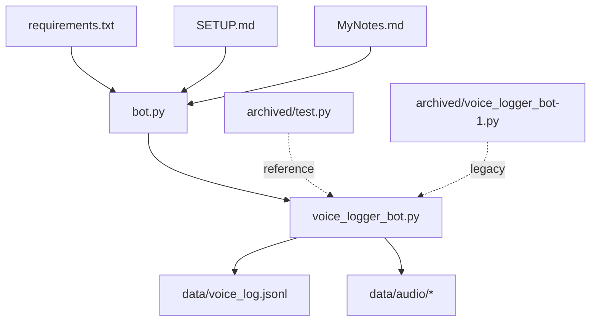
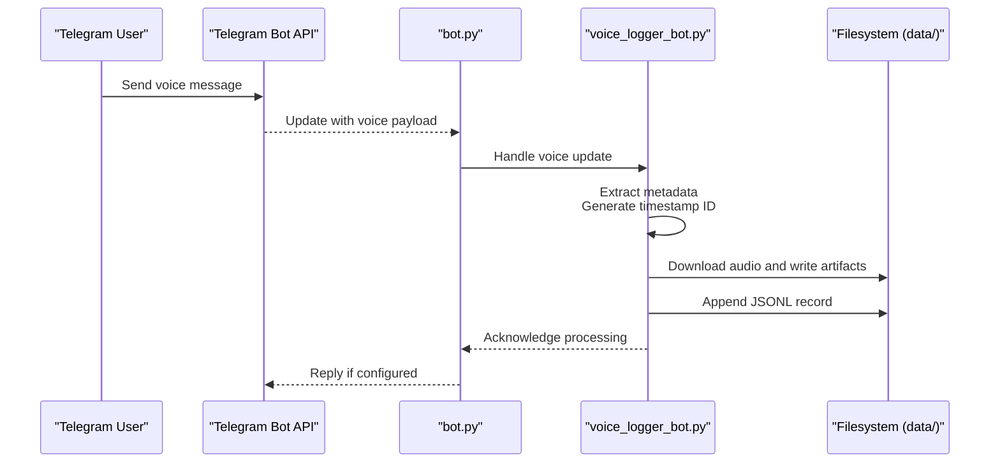
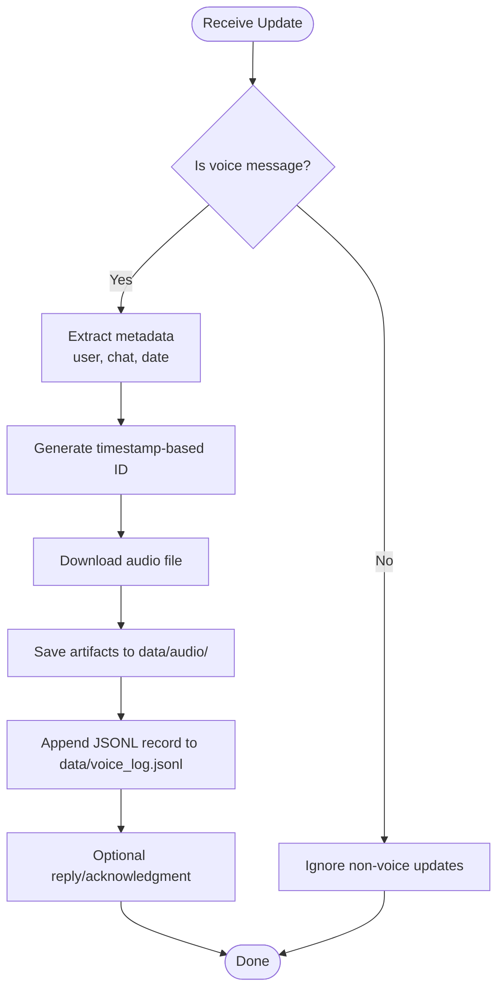
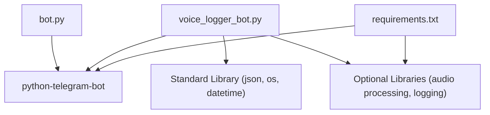

# Project Overview

<cite>
**Referenced Files in This Document**
- [bot.py](file://bot.py)
- [voice_logger_bot.py](file://voice_logger_bot.py)
- [requirements.txt](file://requirements.txt)
- [SETUP.md](file://SETUP.md)
- [MyNotes.md](file://MyNotes.md)
- [data/voice_log.jsonl](file://data/voice_log.jsonl)
- [archived/test.py](file://archived/test.py)
- [archived/voice_logger_bot-1.py](file://archived/voice_logger_bot-1.py)
</cite>

## Table of Contents
1. [Introduction](#introduction)
2. [Project Structure](#project-structure)
3. [Core Components](#core-components)
4. [Architecture Overview](#architecture-overview)
5. [Detailed Component Analysis](#detailed-component-analysis)
6. [Dependency Analysis](#dependency-analysis)
7. [Performance Considerations](#performance-considerations)
8. [Troubleshooting Guide](#troubleshooting-guide)
9. [Conclusion](#conclusion)
10. [Appendices](#appendices)

## Introduction
This project implements a Telegram Voice Logger Bot that captures voice messages sent by users and logs them in a structured, timestamped format. The bot is built with Python and the python-telegram-bot library to handle incoming updates, process audio payloads, and persist metadata and references to downloaded media files. It organizes outputs using timestamps and writes structured records to a JSONL file for downstream processing or archival.

Target audience:
- Beginners learning how to build Telegram bots with Python
- Intermediate developers extending logging, storage, or analytics features
- Experienced engineers integrating transcription, archiving, or analysis pipelines

Scope and limitations:
- Scope: Captures voice messages from Telegram chats, downloads audio, and records structured logs with timestamps and metadata.
- Limitations: Focuses on voice message capture and logging; does not include transcription or real-time streaming out of the box. Storage is local by default and can be extended to cloud backends.

Potential use cases:
- Voice transcription services (as a pre-processing pipeline)
- Audio archiving and compliance recording
- Communication analysis tools requiring structured logs and media references

[No sources needed since this section provides general guidance]

## Project Structure
The repository is organized around two primary bot implementations, supporting configuration, dependencies, and data output:

- Entry points and logic:
  - bot.py: Main application entry point for running the bot
  - voice_logger_bot.py: Core implementation of the voice logger functionality
- Configuration and setup:
  - requirements.txt: Python dependencies
  - SETUP.md: Setup instructions and environment variables
  - MyNotes.md: Developer notes and context
- Data outputs:
  - data/voice_log.jsonl: Structured log entries for each captured voice message
  - data/audio/: Timestamped text artifacts associated with processed audio
- Archived versions:
  - archived/test.py: Test utilities or experiments
  - archived/voice_logger_bot-1.py: Previous iteration of the core logic

**Diagram sources**
- [bot.py](file://bot.py)
- [voice_logger_bot.py](file://voice_logger_bot.py)
- [requirements.txt](file://requirements.txt)
- [SETUP.md](file://SETUP.md)
- [MyNotes.md](file://MyNotes.md)
- [data/voice_log.jsonl](file://data/voice_log.jsonl)
- [archived/test.py](file://archived/test.py)
- [archived/voice_logger_bot-1.py](file://archived/voice_logger_bot-1.py)

**Section sources**
- [bot.py](file://bot.py)
- [voice_logger_bot.py](file://voice_logger_bot.py)
- [requirements.txt](file://requirements.txt)
- [SETUP.md](file://SETUP.md)
- [MyNotes.md](file://MyNotes.md)
- [data/voice_log.jsonl](file://data/voice_log.jsonl)
- [archived/test.py](file://archived/test.py)
- [archived/voice_logger_bot-1.py](file://archived/voice_logger_bot-1.py)

## Core Components
- Bot runner (bot.py): Initializes the telegram bot instance, configures handlers, and starts the polling loop to receive updates.
- Voice logger (voice_logger_bot.py): Implements message handling for voice content, processes audio payloads, and writes structured logs.
- Dependencies (requirements.txt): Declares python-telegram-bot and any additional libraries required for audio handling or persistence.
- Setup documentation (SETUP.md): Describes environment variables, token configuration, and deployment steps.
- Logs and artifacts (data/voice_log.jsonl and data/audio/): Store structured JSONL records and timestamped artifacts for each captured voice message.

Key responsibilities:
- Capture voice messages from Telegram users
- Download and manage audio files securely
- Generate timestamp-based identifiers and organize outputs
- Persist structured metadata in JSONL format for downstream processing

**Section sources**
- [bot.py](file://bot.py)
- [voice_logger_bot.py](file://voice_logger_bot.py)
- [requirements.txt](file://requirements.txt)
- [SETUP.md](file://SETUP.md)
- [data/voice_log.jsonl](file://data/voice_log.jsonl)

## Architecture Overview
At runtime, the bot listens for incoming updates via the Telegram Bot API. When a voice message arrives, the handler extracts relevant metadata, downloads the audio file, and writes a structured record to the JSONL log. Timestamps are used to organize outputs and ensure traceability.

**Diagram sources**
- [bot.py](file://bot.py)
- [voice_logger_bot.py](file://voice_logger_bot.py)
- [data/voice_log.jsonl](file://data/voice_log.jsonl)

## Detailed Component Analysis

### Bot Runner (bot.py)
Responsibilities:
- Initialize the telegram bot instance with the provided token
- Register message handlers for voice content
- Start the polling loop to receive updates continuously

Behavior highlights:
- Configures error handling and logging at startup
- Delegates message processing to the voice logger module
- Ensures graceful shutdown and resource cleanup

**Section sources**
- [bot.py](file://bot.py)

### Voice Logger (voice_logger_bot.py)
Responsibilities:
- Detect and validate incoming voice messages
- Extract user and chat metadata
- Download audio files and generate timestamp-based identifiers
- Write structured JSONL records to data/voice_log.jsonl
- Organize related artifacts under data/audio/

Processing flow:
- Validate update type and payload
- Compute unique identifiers based on timestamps
- Save audio artifacts and append JSONL entries
- Return appropriate responses or acknowledgments

**Diagram sources**
- [voice_logger_bot.py](file://voice_logger_bot.py)
- [data/voice_log.jsonl](file://data/voice_log.jsonl)

**Section sources**
- [voice_logger_bot.py](file://voice_logger_bot.py)

### Data Outputs and Organization
- JSONL log (data/voice_log.jsonl): Each line represents a structured record containing metadata such as user identifiers, chat details, timestamps, and references to audio artifacts.
- Audio artifacts (data/audio/): Timestamped text files or references corresponding to processed voice messages.

Benefits:
- Easy parsing and integration with external tools
- Traceable and auditable records
- Scalable for batch processing and analysis

**Section sources**
- [data/voice_log.jsonl](file://data/voice_log.jsonl)

### Configuration and Dependencies
- requirements.txt: Lists python-telegram-bot and other dependencies necessary for HTTP requests, file handling, and optional audio processing.
- SETUP.md: Provides instructions for setting up environment variables, obtaining a bot token, and running the application locally or in production.

Best practices:
- Keep secrets out of version control
- Pin dependency versions for reproducibility
- Use environment variables for configuration

**Section sources**
- [requirements.txt](file://requirements.txt)
- [SETUP.md](file://SETUP.md)

### Legacy and Experimental Code
- archived/voice_logger_bot-1.py: Previous iteration of the voice logger logic, useful for understanding evolution and potential migration paths.
- archived/test.py: Test utilities or experimental scripts that may assist in development and debugging.

Use cases:
- Reference for past behavior and feature sets
- Inspiration for new features or refactoring strategies

**Section sources**
- [archived/voice_logger_bot-1.py](file://archived/voice_logger_bot-1.py)
- [archived/test.py](file://archived/test.py)

## Dependency Analysis
The project relies primarily on python-telegram-bot for Telegram API interactions and standard Python libraries for file operations and JSON serialization. Additional libraries may be included for audio processing or enhanced logging.

**Diagram sources**
- [bot.py](file://bot.py)
- [voice_logger_bot.py](file://voice_logger_bot.py)
- [requirements.txt](file://requirements.txt)

**Section sources**
- [requirements.txt](file://requirements.txt)

## Performance Considerations
- Concurrency: Ensure the polling loop handles multiple updates efficiently without blocking.
- File I/O: Batch writes where possible and avoid excessive disk operations per message.
- Memory usage: Stream large audio files when feasible and clean up temporary resources promptly.
- Logging overhead: Use structured logging and limit verbose outputs in production.

[No sources needed since this section provides general guidance]

## Troubleshooting Guide
Common issues and resolutions:
- Token misconfiguration: Verify environment variables and permissions for the Telegram Bot API token.
- Permission errors: Ensure the bot has read/write access to data directories.
- Network timeouts: Implement retries and monitor connectivity to Telegram servers.
- Invalid payloads: Validate update types and handle unexpected formats gracefully.

Operational tips:
- Monitor logs for errors and warnings
- Validate JSONL schema integrity periodically
- Back up data/voice_log.jsonl and audio artifacts regularly

**Section sources**
- [SETUP.md](file://SETUP.md)
- [MyNotes.md](file://MyNotes.md)

## Conclusion
The Telegram Voice Logger Bot provides a robust foundation for capturing and structuring voice messages from Telegram users. Its architecture emphasizes simplicity, reliability, and extensibility, making it suitable for a range of applications including transcription pipelines, archival systems, and communication analytics. By following best practices for configuration, performance, and troubleshooting, developers can scale and customize the bot to meet diverse needs.

[No sources needed since this section summarizes without analyzing specific files]

## Appendices
- Quick start checklist:
  - Install dependencies from requirements.txt
  - Configure environment variables per SETUP.md
  - Run bot.py and verify voice message logging
- Extension ideas:
  - Integrate transcription APIs
  - Add cloud storage backends
  - Implement advanced analytics dashboards

[No sources needed since this section provides general guidance]