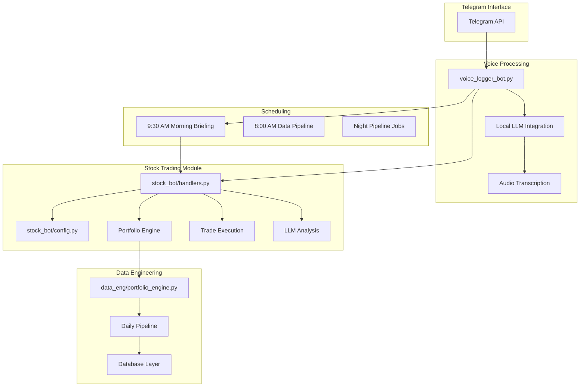
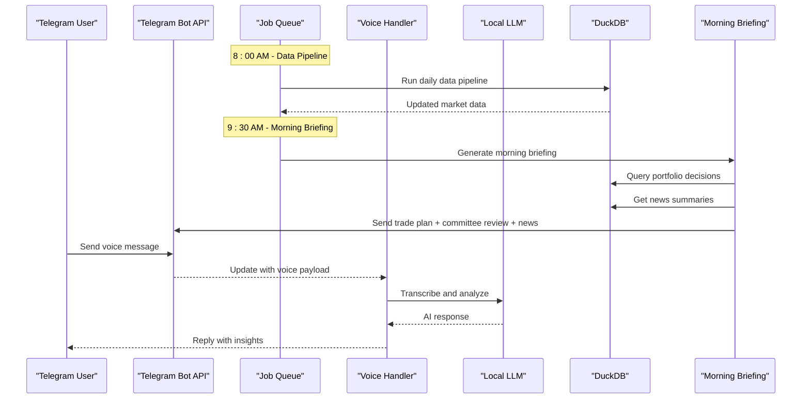
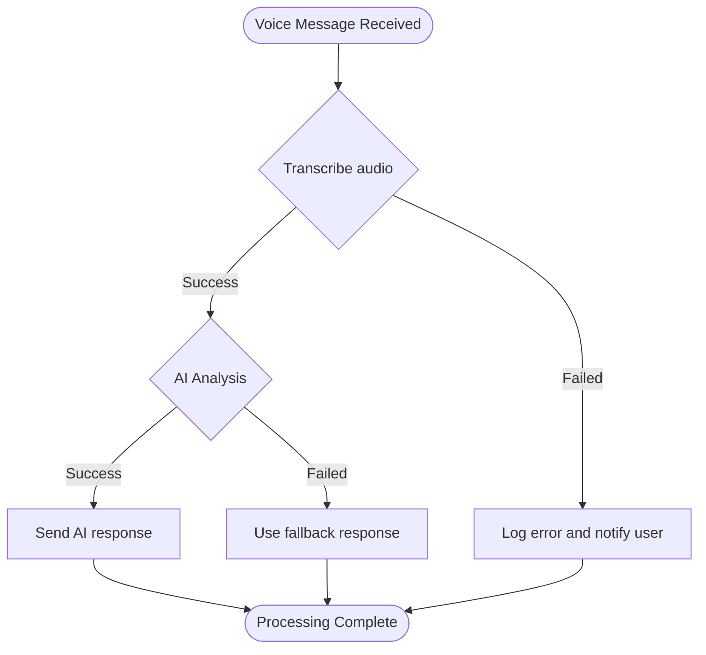
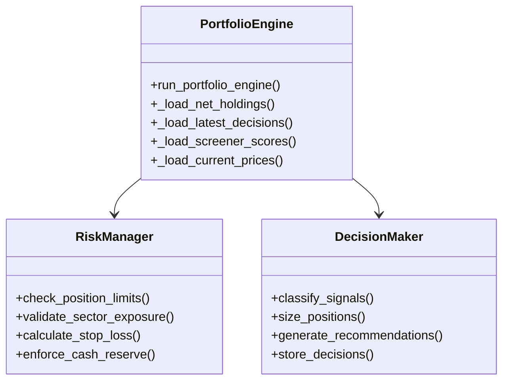
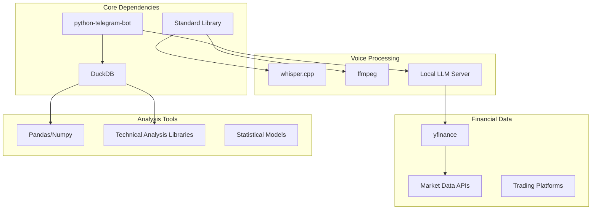

# Project Overview

<cite>
**Referenced Files in This Document**
- [voice_logger_bot.py](file://voice_logger_bot.py)
- [stock_bot/handlers.py](file://stock_bot/handlers.py)
- [stock_bot/config.py](file://stock_bot/config.py)
- [data_eng/portfolio_engine.py](file://data_eng/portfolio_engine.py)
- [notes/report_definition.md](file://notes/report_definition.md)
- [notes/my_ideal.md](file://notes/my_ideal.md)
- [bot.py](file://bot.py)
- [requirements.txt](file://requirements.txt)
</cite>

## Update Summary
**Changes Made**
- Added comprehensive morning briefing system with 9:30 AM automated delivery
- Implemented detailed report definition document mapping all data sources
- Enhanced /advice command with full trade plan and ideas functionality
- Integrated committee review system for portfolio decisions
- Added news briefing component to daily summaries
- Expanded voice message processing with AI-powered responses

## Table of Contents
1. [Introduction](#introduction)
2. [Project Structure](#project-structure)
3. [Core Components](#core-components)
4. [Architecture Overview](#architecture-overview)
5. [Detailed Component Analysis](#detailed-component-analysis)
6. [Morning Briefing System](#morning-briefing-system)
7. [Report Definition and Data Sources](#report-definition-and-data-sources)
8. [Dependency Analysis](#dependency-analysis)
9. [Performance Considerations](#performance-considerations)
10. [Troubleshooting Guide](#troubleshooting-guide)
11. [Conclusion](#conclusion)
12. [Appendices](#appendices)

## Introduction
This project implements a comprehensive Telegram Voice Logger Bot system that has evolved from a simple voice logging tool into a sophisticated financial trading assistant. The system captures voice messages sent by users and processes them through specialized modules for data engineering, stock trading integration, and analytical processing. Originally built with Python and the python-telegram-bot library, the system now provides automated morning briefings at 9:30 AM, comprehensive trade advice, and intelligent voice message processing with local AI capabilities.

Target audience:
- Beginners learning how to build modular Telegram bots with Python
- Intermediate developers extending data pipelines, trading integrations, or analytics features
- Experienced engineers integrating transcription services, real-time streaming, or advanced analysis capabilities
- Financial traders seeking automated market analysis and trading signals

Scope and limitations:
- Scope: Captures voice messages from Telegram chats, processes audio through specialized modules, provides structured outputs for various use cases including stock trading signals, data archiving, communication analysis, and automated financial reporting.
- Limitations: While originally focused on voice message capture and logging, the system now supports multiple domains but requires careful configuration for each module's specific requirements.

Potential use cases:
- Voice-to-trading signal conversion for automated stock trading
- Audio archiving and compliance recording with structured metadata
- Communication analysis tools requiring multi-module data processing
- Real-time voice transcription services integrated with financial data
- Automated daily financial briefings and portfolio management

## Project Structure
The repository has been restructured from a monolithic design to a modular architecture with three primary functional areas:

### Voice Logger Bot (Main Application)
- **voice_logger_bot.py**: Main application entry point with scheduling and command handlers
- **bot.py**: Legacy motivation check-in bot with voice transcription
- **requirements.txt**: Updated dependencies for modular architecture

### Stock Trading Module (stock_bot/)
- **handlers.py**: Comprehensive command handlers including advice, portfolio, and morning briefing
- **config.py**: Configuration management for trading operations and scheduling
- **llm.py**: Large language model integration for analysis and voice processing
- **portfolio.py**: Portfolio management and tracking
- **trades.py**: Trade execution and monitoring

### Data Engineering Module (data_eng/)
- **portfolio_engine.py**: Deterministic portfolio decision engine with risk management rules
- **db.py**: Database connectivity and management
- **pipeline.py**: Daily data pipeline orchestration

### Analysis and Support
- **analysis/**: Analytics framework with DuckDB integration
- **notes/report_definition.md**: Comprehensive data source mapping documentation
- **archived/**: Contains legacy implementations for reference

**Diagram sources**
- [voice_logger_bot.py:28-75](file://voice_logger_bot.py#L28-L75)
- [stock_bot/handlers.py:175-202](file://stock_bot/handlers.py#L175-L202)
- [data_eng/portfolio_engine.py:153-349](file://data_eng/portfolio_engine.py#L153-L349)
- [stock_bot/config.py:49-57](file://stock_bot/config.py#L49-L57)

**Section sources**
- [voice_logger_bot.py:1-75](file://voice_logger_bot.py#L1-L75)
- [stock_bot/handlers.py:1-886](file://stock_bot/handlers.py#L1-L886)
- [data_eng/portfolio_engine.py:1-390](file://data_eng/portfolio_engine.py#L1-L390)

## Core Components
The modular architecture distributes responsibilities across specialized modules:

### Voice Processing Pipeline
- **Voice Message Handler**: Processes incoming voice messages with automatic transcription
- **Local LLM Integration**: Provides intelligent responses using Qwythos-9B model
- **Audio Processing**: Converts and transcribes audio files using whisper.cpp
- **Message Logging**: Structured JSONL logging with timestamps and metadata

### Stock Trading Integration
- **Comprehensive Command Handlers**: Process trading-related commands including /advice, /portfolio, /charts
- **Configuration Management**: Handles trading parameters, API credentials, and scheduling
- **Portfolio Engine**: Deterministic rules-based trading decisions with risk management
- **Morning Briefing System**: Automated 9:30 AM financial reports with trade plans and news

### Data Engineering Framework
- **Portfolio Decision Engine**: Applies hard rules to generate actionable trading proposals
- **Daily Pipeline**: Automated data ingestion from Yahoo Finance and other sources
- **Database Layer**: DuckDB integration for high-performance analytical queries
- **News Processing**: AI-powered news summarization and sentiment analysis

Key responsibilities:
- Modular voice message processing pipeline with AI responses
- Specialized handling for different message types and trading intents
- Scalable data storage and retrieval mechanisms
- Integrated trading and analysis capabilities with automated reporting

**Section sources**
- [voice_logger_bot.py:39-52](file://voice_logger_bot.py#L39-L52)
- [stock_bot/handlers.py:645-697](file://stock_bot/handlers.py#L645-L697)
- [data_eng/portfolio_engine.py:153-349](file://data_eng/portfolio_engine.py#L153-L349)

## Architecture Overview
The new modular architecture follows a pipeline pattern where voice messages flow through specialized processing stages with automated scheduling:

**Diagram sources**
- [voice_logger_bot.py:54-67](file://voice_logger_bot.py#L54-L67)
- [stock_bot/handlers.py:175-202](file://stock_bot/handlers.py#L175-L202)
- [stock_bot/config.py:49-57](file://stock_bot/config.py#L49-L57)

## Detailed Component Analysis

### Voice Processing Module
The main voice logger bot handles core voice message processing with AI integration:

**Main Application (voice_logger_bot.py)**
- Initializes the bot with comprehensive command handlers
- Sets up scheduled jobs for daily pipeline and morning briefings
- Manages local LLM server startup and configuration
- Routes voice messages to appropriate processing handlers

**Command Handlers (handlers.py)**
- `/advice`: Comprehensive trading advice with trade plans and ideas
- `/portfolio`: Portfolio summary with charts and performance metrics
- `/analyze`: On-demand analysis of specific tickers
- `/news`: News summaries for watchlist and candidates
- Voice message processing with automatic transcription and AI responses

**Configuration Management (config.py)**
- Centralized configuration for all bot components
- Scheduling setup for daily tasks and pipeline runs
- Local LLM server configuration with Qwythos-9B model
- File paths and logging configuration

**Diagram sources**
- [voice_logger_bot.py:125-159](file://voice_logger_bot.py#L125-L159)
- [stock_bot/handlers.py:765-798](file://stock_bot/handlers.py#L765-L798)

**Section sources**
- [voice_logger_bot.py:28-75](file://voice_logger_bot.py#L28-L75)
- [stock_bot/handlers.py:645-844](file://stock_bot/handlers.py#L645-L844)
- [stock_bot/config.py:1-99](file://stock_bot/config.py#L1-L99)

### Portfolio Decision Engine
The portfolio engine applies deterministic rules to generate actionable trading proposals:

**Decision Logic (portfolio_engine.py)**
- Loads holdings from trades.csv and current market data
- Applies risk management rules (max 20% per stock, 35% per sector)
- Enforces minimum screener score threshold (top 20%)
- Calculates position sizing based on deployable capital
- Generates BUY/SELL/HOLD recommendations with stop losses

**Risk Management Rules**
- Maximum 20% portfolio allocation per stock
- Maximum 35% exposure per sector
- Minimum screener score of 80 for buy signals
- Mandatory 10% cash reserve
- Default 8% stop loss if not provided by TradingAgents

**Diagram sources**
- [data_eng/portfolio_engine.py:153-349](file://data_eng/portfolio_engine.py#L153-L349)

**Section sources**
- [data_eng/portfolio_engine.py:1-390](file://data_eng/portfolio_engine.py#L1-L390)

## Morning Briefing System
The system includes a comprehensive automated morning briefing delivered at 9:30 AM:

**Scheduled Delivery**
- Runs daily at 9:30 AM NZT time
- Sends charts for all tracked tickers first
- Delivers portfolio summary with current holdings and performance
- Provides trade plan with actionable BUY/SELL recommendations
- Includes committee review highlighting risks and contradictions
- Concludes with news briefings for watchlist and candidates

**Content Components**
- **Charts**: 90-day price charts for all tracked stocks
- **Portfolio Summary**: Current holdings, performance metrics, and P&L
- **Trade Plan**: Today's actionable trading proposals with position sizing
- **Committee Review**: LLM-generated analysis of portfolio decisions
- **News Briefing**: AI-summarized news for relevant tickers

**Robust Error Handling**
- Each component wrapped in try-catch blocks
- Individual failures don't prevent other components from executing
- Detailed logging for troubleshooting and monitoring
- Graceful degradation when data sources are unavailable

**Section sources**
- [stock_bot/handlers.py:175-202](file://stock_bot/handlers.py#L175-L202)
- [stock_bot/handlers.py:437-456](file://stock_bot/handlers.py#L437-L456)
- [stock_bot/config.py:49-57](file://stock_bot/config.py#L49-L57)

## Report Definition and Data Sources
A comprehensive report definition document maps every number in the system back to its source:

**External Data Sources**
- **Yahoo Finance API**: Stock prices, fundamentals, analyst targets, growth estimates, news articles
- **Web Scrapes**: Stock universe ratings, Google Finance AI overviews, Yahoo Finance AI insights
- **trades.csv**: Executed trade records with share counts and transaction details
- **Local LLM**: News summaries, TradingAgents analyses, committee reviews using Qwythos-9B

**DuckDB Data Tables**
- `daily_prices`: Latest stock prices refreshed daily at 8 AM
- `technicals`: Computed technical indicators from price data
- `news_summaries`: AI-summarized news with catalysts, sentiment, and risks
- `fundamentals`: Company fundamentals including P/E ratios and margins
- `trading_agent_decisions`: Multi-agent LLM trading recommendations
- `portfolio_decisions`: Rules-based trading proposals with position sizing
- `portfolio_reviews`: Committee review of portfolio decisions

**Advice Command Mapping**
- `/advice TICKER`: Full buy card with price, day change, screener score, TradingAgents verdict, entry/stop/target levels, horizon, summary, and news
- `/advice`: Trade plan section showing today's BUY/SELL proposals plus top screener ideas not held or watched

**Trust Guidelines**
- Hard numbers (prices, day changes, share counts) are factual and reliable
- Screener scores are mechanical and reproducible but relative rankings
- TradingAgents verdicts are informed opinions grounded in stored data
- Trade plan represents deterministic rules applied to available inputs
- Committee review highlights potential blind spots but doesn't introduce new facts

**Section sources**
- [notes/report_definition.md:1-106](file://notes/report_definition.md#L1-L106)
- [notes/my_ideal.md:242-264](file://notes/my_ideal.md#L242-L264)

## Dependency Analysis
The modular architecture introduces sophisticated dependency patterns while maintaining backward compatibility:

**Diagram sources**
- [requirements.txt](file://requirements.txt)
- [stock_bot/config.py:16-29](file://stock_bot/config.py#L16-L29)

**Section sources**
- [requirements.txt](file://requirements.txt)
- [stock_bot/config.py:1-99](file://stock_bot/config.py#L1-L99)

## Performance Considerations
The modular architecture enables several performance optimizations:

- **Parallel Processing**: Each module can be scaled independently based on workload
- **Memory Management**: Specialized modules optimize memory usage for their specific tasks
- **Database Optimization**: DuckDB provides high-performance analytical queries for large datasets
- **Caching Strategies**: Module-level caching reduces redundant computations and API calls
- **Resource Isolation**: Failures in one module don't impact others due to error boundaries
- **Scheduled Processing**: Heavy computational tasks run during off-peak hours
- **Batch Processing**: Night pipeline processes data in manageable batches to avoid resource exhaustion

## Troubleshooting Guide
Common issues and resolutions for the modular architecture:

### Module-Specific Issues
- **Voice Processing**: Check whisper.cpp installation, ffmpeg availability, and local LLM server status
- **Stock Trading**: Verify API credentials, network connectivity to trading platforms, and database connections
- **Data Pipeline**: Ensure Yahoo Finance access, web scraping permissions, and data validation
- **Morning Briefing**: Check scheduled job status, database connectivity, and file permissions

### Cross-Module Communication
- **Message Routing**: Verify proper routing between voice processing and trading modules
- **Data Format Compatibility**: Ensure consistent data schemas across modules
- **Error Propagation**: Implement proper error handling between module boundaries
- **Synchronization**: Monitor timing between scheduled jobs and data availability

### Operational Tips
- Monitor individual module health and performance metrics
- Use structured logging across all modules for better debugging
- Implement circuit breakers for external service dependencies
- Regular backup of critical data stores and configuration files
- Test morning briefing delivery after any system updates

**Section sources**
- [stock_bot/handlers.py:437-456](file://stock_bot/handlers.py#L437-L456)
- [voice_logger_bot.py:54-67](file://voice_logger_bot.py#L54-L67)

## Conclusion
The Telegram Voice Logger Bot has successfully evolved from a simple voice logging tool into a sophisticated financial trading assistant with automated morning briefings. The system now provides comprehensive voice message processing with AI responses, automated daily financial reporting, and intelligent trading recommendations based on multi-source data analysis.

The modular architecture enables better scalability, maintainability, and extensibility while preserving the core functionality of voice message processing. The addition of the morning briefing system at 9:30 AM delivers actionable trading insights, committee reviews, and news summaries automatically to users.

The comprehensive report definition ensures transparency in data sourcing and processing, allowing users to understand exactly where each number and recommendation comes from. This transparency builds trust in the system's outputs while providing clear guidance on which data points to rely upon for different types of decisions.

Future enhancements can leverage this modular foundation to add new capabilities such as real-time streaming, advanced machine learning models, additional trading strategies, or expanded market coverage without disrupting existing functionality.

## Appendices
### Quick Start Checklist
- Install dependencies from requirements.txt
- Configure environment variables for bot token and local LLM server
- Set up DuckDB database and initialize tables
- Configure trading API credentials and portfolio settings
- Start the main bot with `python voice_logger_bot.py`
- Verify morning briefing delivery at 9:30 AM
- Test voice message processing and AI responses

### Extension Ideas
- Add new command handlers for different voice command types
- Integrate additional financial data sources for enhanced analysis
- Implement real-time streaming capabilities for live market data
- Add advanced machine learning models for prediction and pattern recognition
- Create web dashboard for monitoring and control
- Implement mobile app integration for on-the-go trading decisions
- Expand morning briefing content with additional market indicators

### Migration Notes
The evolution from monolithic to modular architecture involved:
- Separation of concerns into specialized modules for voice processing, trading, and data engineering
- Implementation of clear interfaces between modules with well-defined APIs
- Refactoring of shared functionality into common libraries and utilities
- Addition of comprehensive error handling and logging throughout the system
- Creation of deployment scripts and configuration management for each module
- Implementation of scheduled jobs for automated processing and reporting

[No sources needed since this section provides general guidance]