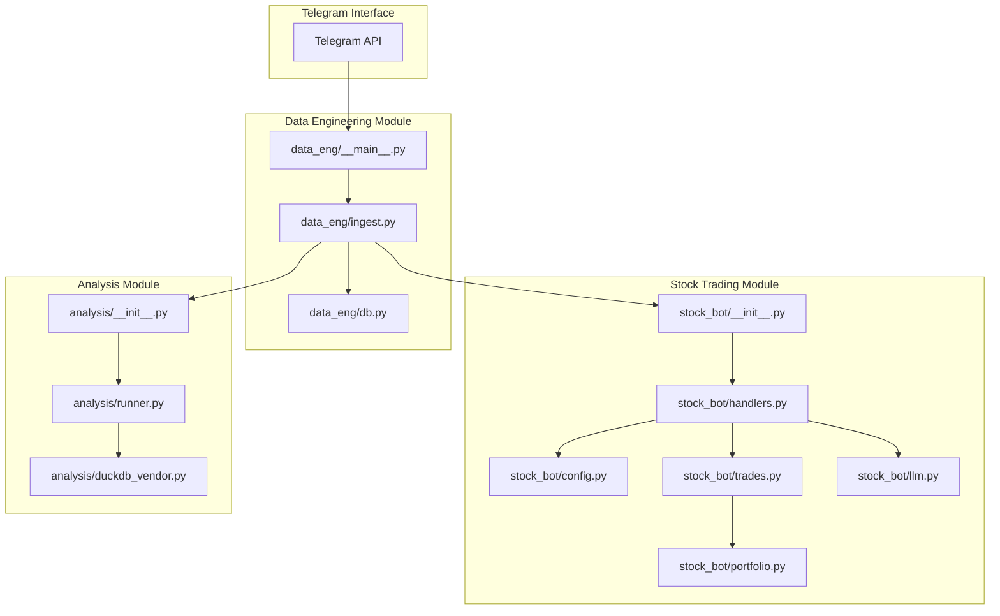
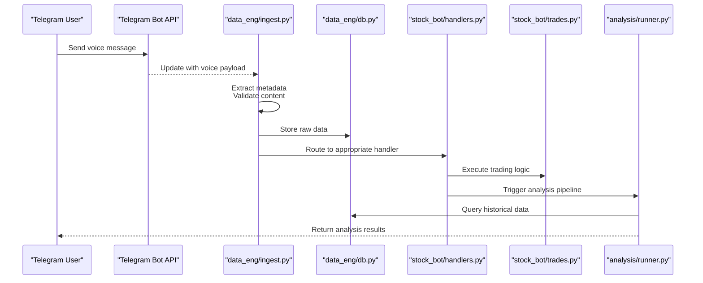
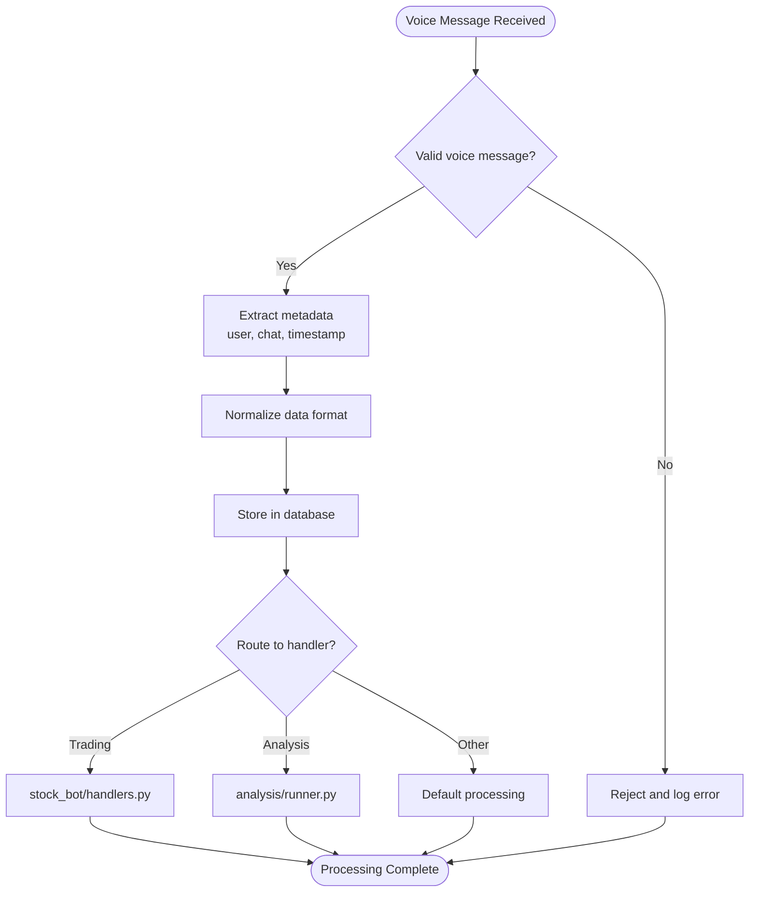
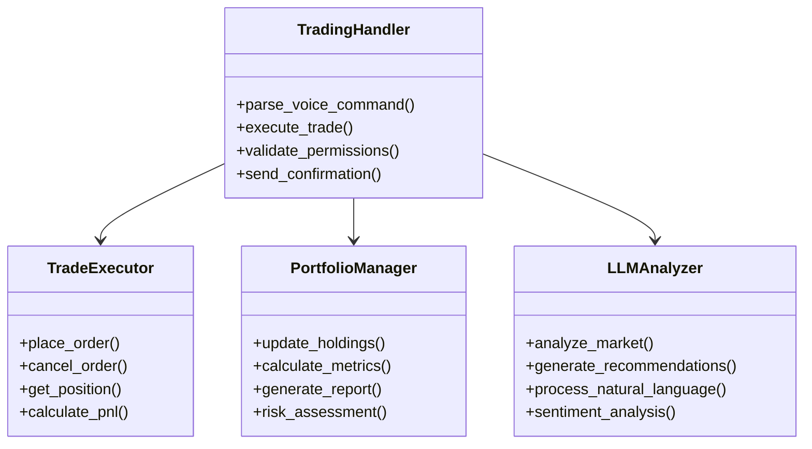
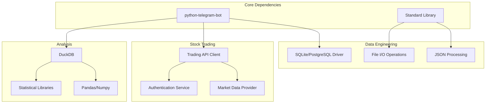

# Project Overview

<cite>
**Referenced Files in This Document**
- [data_eng/__main__.py](file://data_eng/__main__.py)
- [data_eng/db.py](file://data_eng/db.py)
- [data_eng/ingest.py](file://data_eng/ingest.py)
- [stock_bot/__init__.py](file://stock_bot/__init__.py)
- [stock_bot/config.py](file://stock_bot/config.py)
- [stock_bot/handlers.py](file://stock_bot/handlers.py)
- [stock_bot/llm.py](file://stock_bot/llm.py)
- [stock_bot/portfolio.py](file://stock_bot/portfolio.py)
- [stock_bot/trades.py](file://stock_bot/trades.py)
- [analysis/__init__.py](file://analysis/__init__.py)
- [analysis/duckdb_vendor.py](file://analysis/duckdb_vendor.py)
- [analysis/runner.py](file://analysis/runner.py)
- [requirements.txt](file://requirements.txt)
- [SETUP.md](file://SETUP.md)
- [MyNotes.md](file://MyNotes.md)
- [archived/test.py](file://archived/test.py)
- [archived/voice_logger_bot-1.py](file://archived/voice_logger_bot-1.py)
</cite>

## Update Summary
**Changes Made**
- Updated project structure to reflect modular architecture migration
- Added new sections for data engineering, stock trading bot, and analysis modules
- Revised core components to show distributed functionality
- Updated architecture diagrams to reflect new module interactions
- Enhanced dependency analysis for the new modular structure

## Table of Contents
1. [Introduction](#introduction)
2. [Project Structure](#project-structure)
3. [Core Components](#core-components)
4. [Architecture Overview](#architecture-overview)
5. [Detailed Component Analysis](#detailed-component-analysis)
6. [Dependency Analysis](#dependency-analysis)
7. [Performance Considerations](#performance-considerations)
8. [Troubleshooting Guide](#troubleshooting-guide)
9. [Conclusion](#conclusion)
10. [Appendices](#appendices)

## Introduction
This project implements a comprehensive Telegram Voice Logger Bot system that has evolved from a monolithic architecture to a modular design. The system captures voice messages sent by users and processes them through specialized modules for data engineering, stock trading integration, and analytical processing. Originally built with Python and the python-telegram-bot library, the system now distributes functionality across dedicated modules: data engineering for ingestion and storage, stock bot for trading operations, and analysis for data processing and insights generation.

Target audience:
- Beginners learning how to build modular Telegram bots with Python
- Intermediate developers extending data pipelines, trading integrations, or analytics features
- Experienced engineers integrating transcription services, real-time streaming, or advanced analysis capabilities

Scope and limitations:
- Scope: Captures voice messages from Telegram chats, processes audio through specialized modules, and provides structured outputs for various use cases including stock trading signals, data archiving, and communication analysis.
- Limitations: While originally focused on voice message capture and logging, the system now supports multiple domains but requires careful configuration for each module's specific requirements.

Potential use cases:
- Voice-to-trading signal conversion for automated stock trading
- Audio archiving and compliance recording with structured metadata
- Communication analysis tools requiring multi-module data processing
- Real-time voice transcription services integrated with financial data

[No sources needed since this section provides general guidance]

## Project Structure
The repository has been restructured from a monolithic design to a modular architecture with three primary functional areas:

### Data Engineering Module (data_eng/)
- **__main__.py**: Entry point for data ingestion pipeline
- **db.py**: Database connectivity and management
- **ingest.py**: Voice message ingestion and processing logic

### Stock Trading Bot Module (stock_bot/)
- **__init__.py**: Package initialization and exports
- **config.py**: Configuration management for trading operations
- **handlers.py**: Telegram message handlers for trading commands
- **llm.py**: Large language model integration for analysis
- **portfolio.py**: Portfolio management and tracking
- **trades.py**: Trade execution and monitoring

### Analysis Module (analysis/)
- **__init__.py**: Package initialization
- **duckdb_vendor.py**: DuckDB database integration for analytics
- **runner.py**: Analysis pipeline orchestration

### Legacy and Support Files
- **requirements.txt**: Updated dependencies for modular architecture
- **SETUP.md**: Comprehensive setup instructions for all modules
- **MyNotes.md**: Developer notes covering the migration process
- **archived/**: Contains legacy implementations for reference

**Diagram sources**
- [data_eng/__main__.py](file://data_eng/__main__.py)
- [data_eng/ingest.py](file://data_eng/ingest.py)
- [data_eng/db.py](file://data_eng/db.py)
- [stock_bot/__init__.py](file://stock_bot/__init__.py)
- [stock_bot/handlers.py](file://stock_bot/handlers.py)
- [stock_bot/config.py](file://stock_bot/config.py)
- [stock_bot/trades.py](file://stock_bot/trades.py)
- [stock_bot/portfolio.py](file://stock_bot/portfolio.py)
- [stock_bot/llm.py](file://stock_bot/llm.py)
- [analysis/__init__.py](file://analysis/__init__.py)
- [analysis/runner.py](file://analysis/runner.py)
- [analysis/duckdb_vendor.py](file://analysis/duckdb_vendor.py)

**Section sources**
- [data_eng/__main__.py](file://data_eng/__main__.py)
- [stock_bot/__init__.py](file://stock_bot/__init__.py)
- [analysis/__init__.py](file://analysis/__init__.py)

## Core Components
The modular architecture distributes responsibilities across specialized modules:

### Data Engineering Pipeline
- **Ingestion Engine**: Processes incoming voice messages and extracts metadata
- **Database Layer**: Manages persistent storage and data relationships
- **Entry Point**: Orchestrates the data flow from Telegram to storage

### Stock Trading Integration
- **Message Handlers**: Process trading-related commands and signals
- **Configuration Management**: Handles trading parameters and API credentials
- **Trade Execution**: Manages order placement and portfolio tracking
- **LLM Integration**: Provides intelligent analysis and decision support

### Analysis Framework
- **Analytics Runner**: Coordinates data analysis workflows
- **DuckDB Integration**: Enables high-performance analytical queries
- **Vendor Abstraction**: Supports multiple data backends

Key responsibilities:
- Modular voice message processing pipeline
- Specialized handling for different message types and intents
- Scalable data storage and retrieval mechanisms
- Integrated trading and analysis capabilities

**Section sources**
- [data_eng/ingest.py](file://data_eng/ingest.py)
- [stock_bot/handlers.py](file://stock_bot/handlers.py)
- [analysis/runner.py](file://analysis/runner.py)

## Architecture Overview
The new modular architecture follows a pipeline pattern where voice messages flow through specialized processing stages:

**Diagram sources**
- [data_eng/ingest.py](file://data_eng/ingest.py)
- [data_eng/db.py](file://data_eng/db.py)
- [stock_bot/handlers.py](file://stock_bot/handlers.py)
- [stock_bot/trades.py](file://stock_bot/trades.py)
- [analysis/runner.py](file://analysis/runner.py)

## Detailed Component Analysis

### Data Engineering Module
The data engineering module handles the core voice message processing pipeline:

**Ingestion Engine (ingest.py)**
- Validates incoming voice messages and extracts metadata
- Performs initial processing and format normalization
- Routes messages to appropriate downstream handlers

**Database Layer (db.py)**
- Manages connections to storage backends
- Implements CRUD operations for voice message records
- Handles data persistence and retrieval

**Entry Point (__main__.py)**
- Initializes the ingestion pipeline
- Configures error handling and logging
- Manages lifecycle of processing workers

**Diagram sources**
- [data_eng/ingest.py](file://data_eng/ingest.py)
- [data_eng/db.py](file://data_eng/db.py)

**Section sources**
- [data_eng/ingest.py](file://data_eng/ingest.py)
- [data_eng/db.py](file://data_eng/db.py)
- [data_eng/__main__.py](file://data_eng/__main__.py)

### Stock Trading Module
The stock trading module integrates voice commands with trading operations:

**Message Handlers (handlers.py)**
- Parse voice messages for trading intent
- Execute appropriate trading actions based on user commands
- Provide feedback and confirmation responses

**Configuration Management (config.py)**
- Manages trading parameters and API credentials
- Validates configuration settings
- Provides environment-specific configurations

**Trade Execution (trades.py)**
- Executes buy/sell orders based on voice commands
- Tracks trade history and performance
- Manages risk parameters and position limits

**Portfolio Management (portfolio.py)**
- Maintains current portfolio state
- Calculates performance metrics
- Generates portfolio reports

**LLM Integration (llm.py)**
- Provides intelligent analysis of market conditions
- Supports natural language trading commands
- Generates trading recommendations

**Diagram sources**
- [stock_bot/handlers.py](file://stock_bot/handlers.py)
- [stock_bot/trades.py](file://stock_bot/trades.py)
- [stock_bot/portfolio.py](file://stock_bot/portfolio.py)
- [stock_bot/llm.py](file://stock_bot/llm.py)

**Section sources**
- [stock_bot/handlers.py](file://stock_bot/handlers.py)
- [stock_bot/config.py](file://stock_bot/config.py)
- [stock_bot/trades.py](file://stock_bot/trades.py)
- [stock_bot/portfolio.py](file://stock_bot/portfolio.py)
- [stock_bot/llm.py](file://stock_bot/llm.py)

### Analysis Module
The analysis module provides powerful data processing capabilities:

**Analytics Runner (runner.py)**
- Orchestrates analysis workflows
- Manages data pipeline execution
- Coordinates between different analysis components

**DuckDB Integration (duckdb_vendor.py)**
- Provides high-performance analytical queries
- Supports complex data transformations
- Enables efficient batch processing

**Package Initialization (__init__.py)**
- Exposes public APIs for analysis functions
- Manages module dependencies
- Provides configuration interfaces

**Section sources**
- [analysis/runner.py](file://analysis/runner.py)
- [analysis/duckdb_vendor.py](file://analysis/duckdb_vendor.py)
- [analysis/__init__.py](file://analysis/__init__.py)

### Legacy Code Reference
The archived directory contains previous implementations that provide insight into the evolution of the system:

- **archived/voice_logger_bot-1.py**: Original monolithic implementation showing the starting point of the architecture
- **archived/test.py**: Test utilities and experimental code from earlier development phases

These files serve as valuable references for understanding the migration process and potential future enhancements.

**Section sources**
- [archived/voice_logger_bot-1.py](file://archived/voice_logger_bot-1.py)
- [archived/test.py](file://archived/test.py)

## Dependency Analysis
The modular architecture introduces new dependency patterns while maintaining backward compatibility:

**Diagram sources**
- [requirements.txt](file://requirements.txt)

**Section sources**
- [requirements.txt](file://requirements.txt)

## Performance Considerations
The modular architecture enables several performance optimizations:

- **Parallel Processing**: Each module can be scaled independently based on workload
- **Memory Management**: Specialized modules optimize memory usage for their specific tasks
- **Database Optimization**: Dedicated database layer provides optimized query performance
- **Caching Strategies**: Module-level caching reduces redundant computations
- **Resource Isolation**: Failures in one module don't impact others

## Troubleshooting Guide
Common issues and resolutions for the modular architecture:

### Module-Specific Issues
- **Data Engineering**: Check database connectivity and ingestion pipeline status
- **Stock Trading**: Verify API credentials and network connectivity to trading platforms
- **Analysis**: Ensure sufficient computational resources for data processing

### Cross-Module Communication
- **Message Routing**: Verify proper routing between data engineering and other modules
- **Data Format Compatibility**: Ensure consistent data schemas across modules
- **Error Propagation**: Implement proper error handling between module boundaries

### Operational Tips
- Monitor individual module health and performance metrics
- Use structured logging across all modules for better debugging
- Implement circuit breakers for external service dependencies
- Regular backup of critical data stores

**Section sources**
- [SETUP.md](file://SETUP.md)
- [MyNotes.md](file://MyNotes.md)

## Conclusion
The Telegram Voice Logger Bot has successfully evolved from a monolithic architecture to a sophisticated modular system. This transformation enables better scalability, maintainability, and extensibility while preserving the core functionality of voice message processing. The new architecture supports diverse use cases ranging from simple voice logging to complex trading automation and advanced analytics.

The modular design allows developers to focus on specific aspects of the system without being overwhelmed by the entire codebase. Each module can be developed, tested, and deployed independently, enabling faster iteration cycles and more robust error isolation.

Future enhancements can leverage this modular foundation to add new capabilities such as real-time streaming, advanced machine learning models, or additional trading strategies without disrupting existing functionality.

[No sources needed since this section summarizes without analyzing specific files]

## Appendices
### Quick Start Checklist
- Install dependencies from requirements.txt
- Configure environment variables per SETUP.md for each module
- Set up database connections in data engineering module
- Configure trading API credentials in stock bot module
- Initialize analysis pipelines in the analysis module
- Run individual modules using their respective entry points

### Extension Ideas
- Add new message handlers for different voice command types
- Integrate additional data sources for enhanced analysis
- Implement real-time streaming capabilities
- Add advanced machine learning models for prediction
- Create web dashboard for monitoring and control
- Implement mobile app integration

### Migration Notes
The migration from monolithic to modular architecture involved:
- Separation of concerns into specialized modules
- Implementation of clear interfaces between modules
- Refactoring of shared functionality into common libraries
- Addition of comprehensive error handling and logging
- Creation of deployment scripts for each module

[No sources needed since this section provides general guidance]