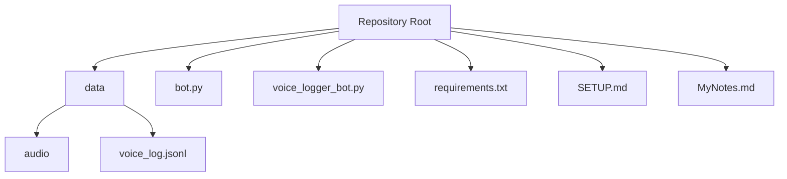
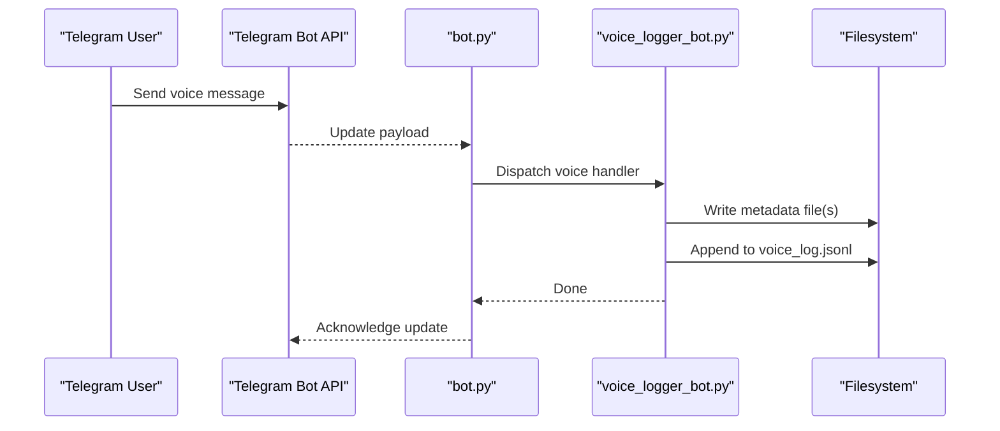
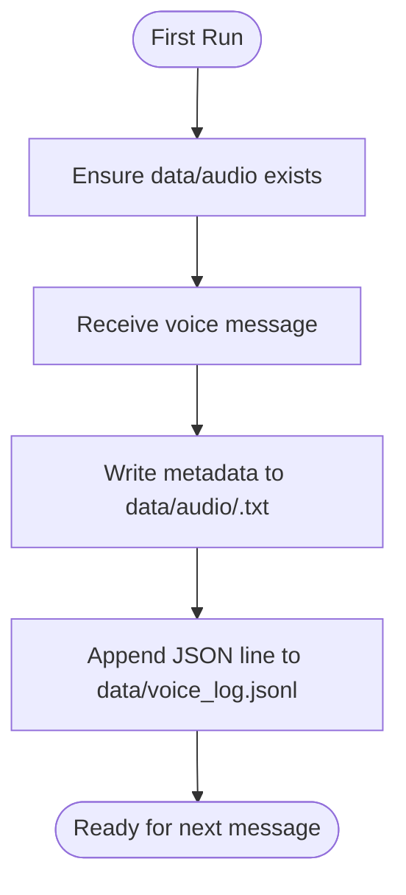
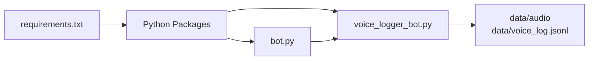

# Quick Start Guide

<cite>
**Referenced Files in This Document**
- [bot.py](file://bot.py)
- [voice_logger_bot.py](file://voice_logger_bot.py)
- [requirements.txt](file://requirements.txt)
- [SETUP.md](file://SETUP.md)
- [MyNotes.md](file://MyNotes.md)
</cite>

## Table of Contents
1. [Introduction](#introduction)
2. [Project Structure](#project-structure)
3. [Core Components](#core-components)
4. [Architecture Overview](#architecture-overview)
5. [Detailed Component Analysis](#detailed-component-analysis)
6. [Dependency Analysis](#dependency-analysis)
7. [Performance Considerations](#performance-considerations)
8. [Troubleshooting Guide](#troubleshooting-guide)
9. [Conclusion](#conclusion)
10. [Appendices](#appendices)

## Introduction
This guide helps you set up and run the Telegram Voice Logger Bot quickly. You will create a Python environment, install dependencies from requirements.txt, configure your Telegram bot token, and start the bot. After setup, you can send voice messages to the bot; audio files are saved under data/audio and logs are written to voice_log.jsonl.

## Project Structure
After your first run, the repository will include:
- data/audio: per-message text metadata files named with timestamps (e.g., 20260722_225354.txt). Actual audio payloads are handled by the Telegram library and stored according to its configuration.
- data/voice_log.jsonl: one JSON line per event for logging.

**Section sources**
- [SETUP.md](file://SETUP.md)
- [MyNotes.md](file://MyNotes.md)

## Core Components
- bot.py: Entry point that initializes and runs the Telegram bot using the configured token and handler logic.
- voice_logger_bot.py: Implements the core behavior for handling incoming voice messages and writing logs.
- requirements.txt: Lists Python packages required by the project.

What happens when the bot starts:
- The script loads the Telegram bot token from environment variables or configuration.
- It sets up handlers to receive updates from Telegram.
- On receiving a voice message, it saves metadata and records an event in voice_log.jsonl.

**Section sources**
- [bot.py](file://bot.py)
- [voice_logger_bot.py](file://voice_logger_bot.py)
- [requirements.txt](file://requirements.txt)

## Architecture Overview
The runtime flow is straightforward:
- The bot process connects to Telegram’s Bot API.
- Incoming voice messages trigger a handler.
- The handler persists metadata and logs events.

**Diagram sources**
- [bot.py](file://bot.py)
- [voice_logger_bot.py](file://voice_logger_bot.py)

## Detailed Component Analysis

### Setup and Installation
1. Prepare Python
   - Install Python 3.x on your system if not already installed.
   - Create a virtual environment in the repository root.
   - Activate the virtual environment.

2. Install dependencies
   - Run the dependency installer using requirements.txt.

3. Configure the Telegram bot token
   - Obtain a bot token from @BotFather on Telegram.
   - Set the token via an environment variable expected by the bot (for example, TELEGRAM_BOT_TOKEN), or follow the instructions in SETUP.md if it specifies a different method.

4. Start the bot
   - Run the entry script (typically bot.py) from the activated virtual environment.

Verification steps
- Check the console output for startup confirmation and polling errors.
- Send a voice message to your bot on Telegram.
- Confirm that:
  - A new timestamped file appears under data/audio.
  - A new line is appended to data/voice_log.jsonl.

Common issues and resolutions
- Missing dependencies: Ensure all packages in requirements.txt are installed successfully.
- Invalid or missing token: Verify the token value and environment variable name match what the bot expects.
- Permission errors: Ensure the process has write permissions to data/audio and data/voice_log.jsonl.
- Network connectivity: Confirm outbound HTTPS access to Telegram servers.

**Section sources**
- [requirements.txt](file://requirements.txt)
- [SETUP.md](file://SETUP.md)
- [bot.py](file://bot.py)
- [voice_logger_bot.py](file://voice_logger_bot.py)

### Usage Examples
- Send a voice message to your bot on Telegram.
- Observe the following after delivery:
  - A new metadata file created under data/audio with a timestamp-based filename.
  - A new log entry added to data/voice_log.jsonl.

Where to find outputs
- Audio metadata: data/audio/<timestamp>.txt
- Event logs: data/voice_log.jsonl

Note: Actual audio payloads are managed by the Telegram library; consult the library documentation for storage details.

**Section sources**
- [voice_logger_bot.py](file://voice_logger_bot.py)
- [bot.py](file://bot.py)

### Directory Structure After First Run
Expected layout:
- data/audio: contains timestamped .txt files per message.
- data/voice_log.jsonl: append-only log file with one JSON object per event.

**Diagram sources**
- [voice_logger_bot.py](file://voice_logger_bot.py)

## Dependency Analysis
- External libraries listed in requirements.txt provide Telegram API integration and any additional utilities used by the bot.
- The bot depends on environment configuration for the token and filesystem access for persistence.

**Diagram sources**
- [requirements.txt](file://requirements.txt)
- [bot.py](file://bot.py)
- [voice_logger_bot.py](file://voice_logger_bot.py)

**Section sources**
- [requirements.txt](file://requirements.txt)

## Performance Considerations
- Keep the virtual environment isolated to avoid dependency conflicts.
- Avoid excessive logging; only record necessary fields to keep voice_log.jsonl manageable.
- Monitor disk usage for data/audio and rotate or archive old entries as needed.

[No sources needed since this section provides general guidance]

## Troubleshooting Guide
Symptoms and checks:
- Bot does not start
  - Verify Python version and virtual environment activation.
  - Confirm all packages from requirements.txt are installed.
  - Check that the token environment variable is set correctly.
- No files created after sending voice
  - Ensure write permissions to data/audio and data/voice_log.jsonl.
  - Look for error messages in the console output.
- Logs not updating
  - Confirm the bot is running and connected to Telegram.
  - Validate network access to Telegram endpoints.

Useful references
- SETUP.md: Any project-specific setup notes or alternative configuration methods.
- MyNotes.md: Additional hints or known caveats.

**Section sources**
- [SETUP.md](file://SETUP.md)
- [MyNotes.md](file://MyNotes.md)

## Conclusion
You now have a working Telegram Voice Logger Bot. Send voice messages to capture metadata and logs. If you encounter issues, review the troubleshooting tips and ensure your environment and permissions are correct.

[No sources needed since this section summarizes without analyzing specific files]

## Appendices
- Environment variables: Define the token using the variable name expected by the bot (commonly TELEGRAM_BOT_TOKEN).
- Logging format: Each line in voice_log.jsonl represents one event; parse with standard JSON tools.
- Cleanup: Archive or delete old files in data/audio as needed to manage disk space.

[No sources needed since this section provides general guidance]