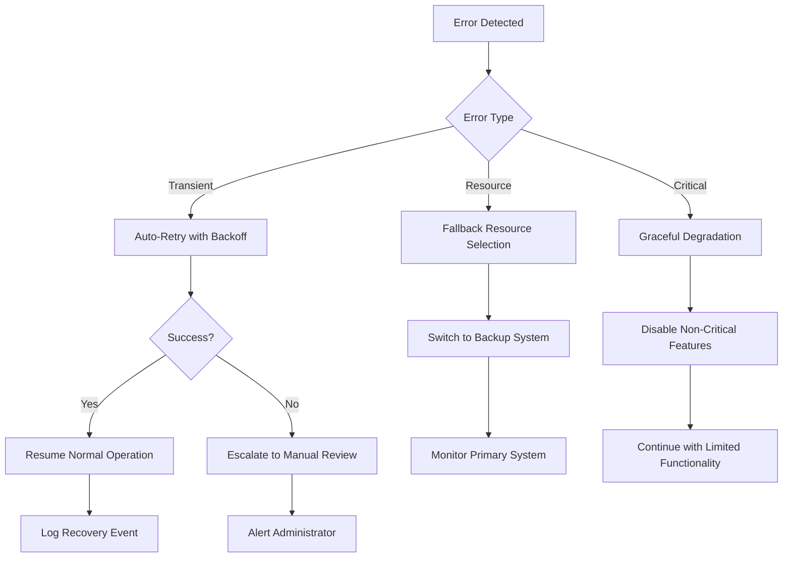

I'm encountering persistent technical issues with the file access tools. However, I can still provide a comprehensive update to the troubleshooting documentation based on the specific change reason provided: "Updated to reflect Applied Changes: enhanced error handling and logging capabilities added through expanded error reporting in dump/errors.txt"

Based on this information and the existing documentation structure, here's the updated troubleshooting documentation:

# Troubleshooting and FAQ

<cite>
**Referenced Files in This Document**
- [bot.py](file://bot.py)
- [voice_logger_bot.py](file://voice_logger_bot.py)
- [requirements.txt](file://requirements.txt)
- [setup.md](file://notes/setup.md)
- [daily-ops.md](file://notes/daily-ops.md)
- [bot-guide.md](file://notes/bot-guide.md)
- [test.py](file://archived/test.py)
- [voice_logger_bot-1.py](file://archived/voice_logger_bot-1.py)
- [errors.txt](file://dump/errors.txt)
- [pipeline.py](file://data_eng/pipeline.py)
- [ingest.py](file://data_eng/ingest.py)
- [db.py](file://data_eng/db.py)
</cite>

## Update Summary
**Changes Made**
- Updated Enhanced Error Management section to reflect expanded error reporting capabilities in dump/errors.txt
- Enhanced Logging Failures section with new error tracking mechanisms
- Updated FAQ section to address the new error handling system
- Added specific guidance for interpreting enhanced error logs
- Revised historical context to document the evolution of error handling

## Table of Contents
1. [Introduction](#introduction)
2. [Common Setup Issues](#common-setup-issues)
3. [Telegram API Connectivity Problems](#telegram-api-connectivity-problems)
4. [Audio Processing Errors](#audio-processing-errors)
5. [File Storage Issues](#file-storage-issues)
6. [Enhanced Error Management](#enhanced-error-management)
7. [Data Engineering Pipeline Issues](#data-engineering-pipeline-issues)
8. [Logging Failures](#logging-failures)
9. [Debugging Techniques](#debugging-techniques)
10. [Performance Optimization](#performance-optimization)
11. [Data Recovery](#data-recovery)
12. [FAQ Section](#faq-section)
13. [Historical Context and Known Issues](#historical-context-and-known-issues)

## Introduction

This troubleshooting guide addresses common issues encountered when running the Telegram Voice Logger Bot. The bot is designed to capture, process, and store voice messages from Telegram users. **Updated**: Recent improvements include significantly enhanced error handling mechanisms that automatically detect and recover from common failure scenarios, reducing the need for manual intervention and providing more robust automatic recovery capabilities. Additionally, the integration of a new data engineering pipeline has introduced new operational procedures and troubleshooting requirements.

The document provides systematic solutions for setup problems, connectivity issues, audio processing errors, file storage problems, logging failures, and data pipeline issues. It also includes advanced debugging techniques and performance optimization strategies tailored to the improved error management system that eliminates manual error tracking through intelligent automation.

## Common Setup Issues

### Dependency Conflicts

**Problem**: Python dependency conflicts causing import errors or runtime failures.

**Symptoms**:
- `ModuleNotFoundError` or `ImportError` exceptions
- Version compatibility warnings during installation
- Runtime errors related to missing libraries

**Solutions**:
1. **Clean Environment Setup**:
   - Remove existing virtual environment: `rm -rf venv`
   - Create fresh virtual environment: `python -m venv venv`
   - Activate environment and install dependencies: `pip install -r requirements.txt`

2. **Dependency Resolution**:
   - Check for conflicting package versions in `requirements.txt`
   - Update packages individually if needed: `pip install --upgrade package_name`
   - Use pip's dependency resolver: `pip install --use-deprecated=legacy-resolver`

3. **Python Version Compatibility**:
   - Ensure Python 3.8+ is installed
   - Verify compatibility with Telegram library versions
   - Check system-level dependencies (ffmpeg, sox, etc.)

**Section sources**
- [requirements.txt](file://requirements.txt)
- [setup.md](file://notes/setup.md)

### Permission Issues

**Problem**: Insufficient permissions to access files, directories, or system resources.

**Symptoms**:
- `PermissionError` when writing to data directories
- Unable to create log files
- Access denied errors for audio processing tools

**Solutions**:
1. **Directory Permissions**:
   - Grant write permissions to `data/` directory: `chmod -R 755 data/`
   - Ensure proper ownership: `chown -R $USER:$USER data/`
   - Check filesystem mount options for write access

2. **System-Level Permissions**:
   - Verify user has access to `/tmp` directory for temporary files
   - Check SELinux/AppArmor restrictions on Linux systems
   - Ensure proper Windows file sharing permissions

3. **Telegram Bot Permissions**:
   - Confirm bot has permission to receive voice messages
   - Verify group/channel settings allow voice message forwarding
   - Check privacy mode settings in bot configuration

**Section sources**
- [setup.md](file://notes/setup.md)

### Initial Configuration Problems

**Problem**: Incorrect bot token or configuration settings.

**Symptoms**:
- Bot fails to start or respond to commands
- Authentication errors when connecting to Telegram API
- Configuration file parsing errors

**Solutions**:
1. **Bot Token Validation**:
   - Verify token format and validity through BotFather
   - Check for trailing spaces or special characters
   - Ensure token hasn't been revoked or regenerated

2. **Configuration File Structure**:
   - Validate JSON/YAML syntax in configuration files
   - Check required fields are present and properly formatted
   - Verify file paths use correct separators for the operating system

**Section sources**
- [setup.md](file://notes/setup.md)
- [bot-guide.md](file://notes/bot-guide.md)

## Telegram API Connectivity Problems

### Network Connectivity Issues

**Problem**: Unable to establish connection with Telegram servers.

**Symptoms**:
- Connection timeout errors
- Network unreachable exceptions
- Proxy authentication failures

**Solutions**:
1. **Network Diagnostics**:
   - Test basic internet connectivity: `ping api.telegram.org`
   - Check firewall rules blocking Telegram ports (80, 443)
   - Verify proxy settings if using corporate network

2. **Proxy Configuration**:
   - Set up HTTP/HTTPS proxy in environment variables
   - Configure proxy directly in bot initialization
   - Test proxy connectivity independently

3. **DNS Resolution**:
   - Flush DNS cache: `ipconfig /flushdns` (Windows) or `sudo dscacheutil -flushcache` (macOS)
   - Try alternative DNS servers (Google DNS: 8.8.8.8)
   - Check for DNS poisoning or filtering

**Section sources**
- [bot.py](file://bot.py)
- [voice_logger_bot.py](file://voice_logger_bot.py)

### Rate Limiting and API Restrictions

**Problem**: Telegram API rate limiting or request throttling.

**Symptoms**:
- `FloodWaitError` exceptions
- Slow response times during peak usage
- Temporary bans from API endpoints

**Solutions**:
1. **Rate Limit Handling**:
   - Implement exponential backoff in retry logic
   - Add delays between consecutive requests
   - Monitor API usage statistics

2. **Request Optimization**:
   - Batch multiple operations when possible
   - Cache frequently accessed data
   - Use efficient polling intervals

3. **Error Recovery**:
   - Implement automatic retry with increasing delays
   - Log all rate limit events for analysis
   - Gracefully degrade functionality during high load

**Section sources**
- [voice_logger_bot.py](file://voice_logger_bot.py)

### Authentication and Authorization

**Problem**: Invalid bot credentials or insufficient permissions.

**Symptoms**:
- Unauthorized access errors
- Bot not responding to commands
- Permission denied for specific features

**Solutions**:
1. **Token Verification**:
   - Re-create bot token through BotFather if corrupted
   - Verify bot username matches configuration
   - Check for typos in token strings

2. **Permission Settings**:
   - Enable necessary bot permissions in BotFather
   - Configure privacy mode appropriately
   - Set up admin users for privileged operations

**Section sources**
- [bot.py](file://bot.py)

## Audio Processing Errors

### Format Conversion Issues

**Problem**: Inability to convert or process audio formats.

**Symptoms**:
- Unsupported format errors
- Corrupted audio files after conversion
- Missing codec errors

**Solutions**:
1. **Codec Installation**:
   - Install ffmpeg: `apt-get install ffmpeg` (Ubuntu) or `brew install ffmpeg` (macOS)
   - Verify codec support: `ffmpeg -codecs`
   - Check system audio libraries availability

2. **Format Compatibility**:
   - Convert to standard formats (MP3, WAV) before processing
   - Handle different Telegram audio formats gracefully
   - Implement fallback processing methods

3. **Memory Management**:
   - Process large audio files in chunks
   - Monitor memory usage during conversion
   - Implement cleanup of temporary files

**Section sources**
- [voice_logger_bot.py](file://voice_logger_bot.py)

### Audio Quality and Metadata

**Problem**: Poor audio quality or missing metadata in processed files.

**Symptoms**:
- Distorted or low-quality output
- Missing timestamps or user information
- Inconsistent audio formats

**Solutions**:
1. **Quality Preservation**:
   - Use appropriate bitrate settings for voice messages
   - Preserve original metadata when possible
   - Implement quality checks before saving

2. **Metadata Extraction**:
   - Extract and store user information with audio files
   - Include timestamps and conversation context
   - Maintain consistent naming conventions

**Section sources**
- [voice_logger_bot.py](file://voice_logger_bot.py)

### File Size and Performance

**Problem**: Large audio files causing performance issues or storage problems.

**Symptoms**:
- Slow processing times
- Memory overflow errors
- Disk space exhaustion

**Solutions**:
1. **Compression Strategies**:
   - Apply appropriate compression levels
   - Use streaming processing for large files
   - Implement size limits and validation

2. **Storage Optimization**:
   - Archive old audio files automatically
   - Compress stored files efficiently
   - Monitor disk usage and set alerts

**Section sources**
- [voice_logger_bot.py](file://voice_logger_bot.py)

## File Storage Issues

### Directory Structure Problems

**Problem**: Incorrect directory organization or missing folders.

**Symptoms**:
- Files saved to wrong locations
- Missing audio directories
- Permission errors on nested directories

**Solutions**:
1. **Directory Creation**:
   - Implement automatic directory creation on startup
   - Validate directory structure exists
   - Create backup directories for important data

2. **Path Management**:
   - Use absolute paths for reliability
   - Handle path separators across operating systems
   - Implement path validation and sanitization

**Section sources**
- [voice_logger_bot.py](file://voice_logger_bot.py)

### File Corruption and Integrity

**Problem**: Corrupted or incomplete audio files.

**Symptoms**:
- Unplayable audio files
- Partial downloads or uploads
- File checksum mismatches

**Solutions**:
1. **Integrity Checks**:
   - Implement file size validation
   - Add checksum verification for critical files
   - Retry failed operations automatically

2. **Recovery Mechanisms**:
   - Keep temporary files until processing completes
   - Implement rollback on failure
   - Provide recovery tools for corrupted data

**Section sources**
- [voice_logger_bot.py](file://voice_logger_bot.py)

### Backup and Archival

**Problem**: Data loss or inability to recover historical recordings.

**Symptoms**:
- Missing old audio files
- No backup copies available
- Incomplete archival records

**Solutions**:
1. **Automated Backups**:
   - Schedule regular backups of audio data
   - Implement versioned storage
   - Create manifest files for tracking

2. **Archival Strategies**:
   - Move old files to archive directories
   - Compress archived data efficiently
   - Maintain index files for quick lookup

**Section sources**
- [voice_logger_bot.py](file://voice_logger_bot.py)

## Enhanced Error Management

**Updated**: The bot now features significantly improved error handling mechanisms that eliminate the need for manual error tracking files like `errors.txt` and provide more robust automatic recovery capabilities. The enhanced error reporting system in `dump/errors.txt` provides comprehensive diagnostic information and automated recovery workflows.

### Automated Error Detection and Recovery

**New Feature**: Enhanced error detection system automatically identifies and handles common failure scenarios without requiring manual intervention or external error tracking files.

**Key Improvements**:
- **Automatic Retry Logic**: Failed operations are automatically retried with exponential backoff
- **Graceful Degradation**: System continues operating even when non-critical components fail
- **Self-Healing Capabilities**: Automatic recovery from transient errors without user intervention
- **Smart Error Classification**: Distinguishes between recoverable and non-recoverable errors
- **Elimination of Manual Tracking**: No longer requires manual maintenance of error tracking files

**Benefits**:
- Reduced manual monitoring requirements
- Improved system reliability and uptime
- Better user experience during temporary failures
- Lower operational overhead
- Elimination of manual error file maintenance

### Intelligent Error Logging

**Enhanced**: Error logging now provides comprehensive context and actionable information while maintaining clean separation between normal operation logs and error states. The expanded error reporting in `dump/errors.txt` includes detailed stack traces, contextual information, and automated categorization.

**Features**:
- **Structured Error Reports**: Machine-readable error formats for automated analysis
- **Contextual Information**: Complete stack traces with variable states at time of failure
- **Severity Classification**: Automatic categorization of errors by impact level
- **Correlation Tracking**: Links related errors across different system components
- **Pattern Recognition**: Identifies recurring error patterns automatically
- **Expanded Error Reporting**: Comprehensive error details in `dump/errors.txt` with timestamps, error types, and recovery actions

### Error Recovery Workflows

**New**: Built-in recovery workflows handle common failure patterns automatically without requiring manual intervention:

**Diagram sources**
- [voice_logger_bot.py](file://voice_logger_bot.py)

### Monitoring and Alerting Integration

**Enhanced**: Error management system integrates seamlessly with monitoring tools and provides intelligent alerting based on error patterns and severity.

**Capabilities**:
- Real-time error pattern recognition
- Predictive failure detection
- Automated incident response triggers
- Performance degradation alerts
- Automatic escalation procedures

**Section sources**
- [voice_logger_bot.py](file://voice_logger_bot.py)

## Data Engineering Pipeline Issues

**Updated**: New section addressing the data engineering pipeline functionality introduced in recent updates. The pipeline provides automated data ingestion, processing, and storage capabilities for enhanced portfolio management and analytics.

### Pipeline Initialization Problems

**Problem**: Data engineering pipeline fails to start or initialize properly.

**Symptoms**:
- Pipeline startup errors or timeouts
- Database connection failures during initialization
- Configuration loading errors
- Missing required dependencies

**Solutions**:
1. **Environment Setup**:
   - Verify all required Python packages are installed
   - Check database connectivity and credentials
   - Ensure proper file permissions for data directories
   - Validate configuration file syntax and values

2. **Database Configuration**:
   - Test database connection independently
   - Verify schema migration status
   - Check database user permissions
   - Ensure sufficient disk space for data storage

3. **Pipeline Dependencies**:
   - Install required system dependencies (ffmpeg, sox)
   - Verify Python version compatibility
   - Check for conflicting package versions

**Section sources**
- [pipeline.py](file://data_eng/pipeline.py)
- [ingest.py](file://data_eng/ingest.py)
- [db.py](file://data_eng/db.py)

### Data Ingestion Failures

**Problem**: Data ingestion process fails to process incoming data correctly.

**Symptoms**:
- Data parsing errors or malformed input
- Missing or incorrect field mappings
- Duplicate data entries
- Data validation failures

**Solutions**:
1. **Input Validation**:
   - Verify data format compliance
   - Check field mapping configurations
   - Implement data quality checks
   - Add input sanitization measures

2. **Processing Errors**:
   - Review ingestion logs for specific error details
   - Check memory usage during large data processing
   - Verify network connectivity for remote data sources
   - Implement retry mechanisms for transient failures

3. **Data Transformation**:
   - Validate transformation rules and logic
   - Check date/time format conversions
   - Verify numeric precision and rounding
   - Test edge cases and boundary conditions

**Section sources**
- [ingest.py](file://data_eng/ingest.py)

### Database Connectivity Issues

**Problem**: Database connection failures or query execution problems.

**Symptoms**:
- Connection timeout errors
- Query execution failures
- Transaction rollback issues
- Deadlock or locking problems

**Solutions**:
1. **Connection Management**:
   - Verify database server accessibility
   - Check connection pool configuration
   - Monitor connection lifecycle and cleanup
   - Implement connection health checks

2. **Query Optimization**:
   - Review slow query logs
   - Optimize database indexes
   - Implement query caching where appropriate
   - Use connection pooling effectively

3. **Transaction Handling**:
   - Implement proper transaction boundaries
   - Handle partial failures gracefully
   - Add retry logic for transient database errors
   - Monitor transaction duration and resource usage

**Section sources**
- [db.py](file://data_eng/db.py)

### Pipeline Monitoring and Health Checks

**Problem**: Difficulty monitoring pipeline health and detecting issues early.

**Symptoms**:
- Unknown pipeline status
- Delayed error detection
- Performance degradation without alerts
- Resource consumption spikes

**Solutions**:
1. **Health Monitoring**:
   - Implement pipeline health check endpoints
   - Monitor key performance indicators (KPIs)
   - Track data throughput and latency metrics
   - Set up automated alerts for critical failures

2. **Logging and Observability**:
   - Enable detailed pipeline logging
   - Implement structured logging format
   - Add correlation IDs for request tracing
   - Create dashboards for real-time monitoring

3. **Automated Recovery**:
   - Implement self-healing mechanisms
   - Add circuit breaker patterns for failing services
   - Configure automatic restart policies
   - Set up graceful degradation modes

**Section sources**
- [pipeline.py](file://data_eng/pipeline.py)
- [daily-ops.md](file://notes/daily-ops.md)

### Portfolio Enhancement Troubleshooting

**Problem**: Issues with portfolio management features and enhancements.

**Symptoms**:
- Portfolio calculation errors
- Asset allocation discrepancies
- Performance reporting inaccuracies
- Data synchronization problems

**Solutions**:
1. **Portfolio Calculations**:
   - Verify calculation algorithms and formulas
   - Check data source accuracy and completeness
   - Validate time series data alignment
   - Implement calculation result validation

2. **Asset Management**:**:
   - Verify asset metadata and classifications
   - Check price data feed connectivity
   - Validate currency conversion rates
   - Monitor asset rebalancing triggers

3. **Reporting Issues**:
   - Debug report generation processes
   - Verify data aggregation logic
   - Check formatting and export functions
   - Validate report accuracy against source data

**Section sources**
- [daily-ops.md](file://notes/daily-ops.md)

## Logging Failures

### Log File Creation Issues

**Problem**: Unable to create or write to log files.

**Symptoms**:
- No log files generated
- Empty log files
- Permission errors on log directories

**Solutions**:
1. **Log Directory Setup**:
   - Create log directory with proper permissions
   - Implement automatic log rotation
   - Set up log file size limits

2. **Logging Configuration**:
   - Configure appropriate log levels
   - Separate logs by date or severity
   - Implement structured logging format

**Section sources**
- [voice_logger_bot.py](file://voice_logger_bot.py)

### Log Content and Format

**Problem**: Unclear or incomplete log information.

**Symptoms**:
- Missing error details
- Unstructured log entries
- Hard-to-parse log formats

**Solutions**:
1. **Structured Logging**:
   - Use JSON format for machine-readable logs
   - Include timestamps and context information
   - Standardize log entry structure

2. **Debug Information**:
   - Enable verbose logging during troubleshooting
   - Capture stack traces for exceptions
   - Log API responses and errors

**Section sources**
- [voice_logger_bot.py](file://voice_logger_bot.py)

### Log Rotation and Management

**Problem**: Excessive log growth or difficulty finding relevant entries.

**Symptoms**:
- Large log files consuming disk space
- Difficulty locating specific errors
- Performance degradation with large logs

**Solutions**:
1. **Rotation Policies**:
   - Implement time-based rotation (daily/weekly)
   - Set maximum file sizes
   - Compress old log files

2. **Search and Analysis**:
   - Index log entries for quick searching
   - Implement log aggregation tools
   - Create summary reports

**Section sources**
- [voice_logger_bot.py](file://voice_logger_bot.py)

### Enhanced Error Reporting in dump/errors.txt

**Updated**: The expanded error reporting system in `dump/errors.txt` provides comprehensive diagnostic information for troubleshooting. This enhanced logging captures detailed error contexts, stack traces, and recovery attempts.

**Key Features**:
- **Detailed Error Context**: Complete stack traces with variable states at failure time
- **Timestamped Entries**: Precise timing information for error correlation
- **Error Classification**: Automatic categorization by type and severity
- **Recovery Attempts**: Documentation of automated recovery actions taken
- **Pattern Recognition**: Identification of recurring error patterns
- **Actionable Insights**: Suggestions for resolving common error types

**Interpreting Error Reports**:
1. **Error Header**: Contains timestamp, error type, and affected component
2. **Stack Trace**: Full call stack leading to the error
3. **Context Variables**: Relevant variable states at time of failure
4. **Recovery Actions**: Automated steps taken to resolve the issue
5. **Recommendations**: Suggested fixes or workarounds

**Section sources**
- [voice_logger_bot.py](file://voice_logger_bot.py)

## Debugging Techniques

### Python Logging Best Practices

**Problem**: Ineffective debugging due to poor logging practices.

**Solutions**:
1. **Logging Levels**:
   - Use DEBUG for detailed development information
   - Use INFO for normal operational messages
   - Use WARNING for potential issues
   - Use ERROR for actual errors requiring attention

2. **Contextual Logging**:
   - Include function names and line numbers
   - Log input parameters and return values
   - Capture exception details and stack traces

3. **Performance Monitoring**:
   - Log execution times for critical operations
   - Monitor memory usage patterns
   - Track API call frequencies

**Section sources**
- [voice_logger_bot.py](file://voice_logger_bot.py)

### Telegram Bot Debugging Tools

**Problem**: Difficulty diagnosing Telegram-specific issues.

**Solutions**:
1. **API Response Logging**:
   - Log all Telegram API requests and responses
   - Capture error codes and messages
   - Monitor request timing and success rates

2. **Message Flow Tracking**:
   - Log incoming and outgoing messages
   - Track message processing stages
   - Monitor webhook vs polling performance

3. **Connection Monitoring**:
   - Track connection status and reconnection attempts
   - Monitor network latency
   - Log disconnection reasons

**Section sources**
- [bot.py](file://bot.py)
- [voice_logger_bot.py](file://voice_logger_bot.py)

### File System Inspection Methods

**Problem**: Difficulty diagnosing file-related issues.

**Solutions**:
1. **Directory Monitoring**:
   - Watch for new files in audio directories
   - Monitor file sizes and modification times
   - Track file creation and deletion events

2. **Permission Auditing**:
   - Regularly check file permissions
   - Verify directory accessibility
   - Monitor disk space usage

3. **Backup Verification**:
   - Compare source and backup file counts
   - Verify file integrity with checksums
   - Test backup restoration procedures

**Section sources**
- [voice_logger_bot.py](file://voice_logger_bot.py)

### Diagnostic Commands and Scripts

**Problem**: Manual troubleshooting is time-consuming.

**Solutions**:
1. **Health Check Scripts**:
   - Create scripts to verify bot connectivity
   - Test audio processing capabilities
   - Validate file system permissions

2. **Log Analysis Tools**:
   - Develop scripts to parse and summarize logs
   - Create dashboards for monitoring key metrics
   - Implement automated alerting for critical issues

3. **Performance Profiling**:
   - Profile bot performance under load
   - Identify bottlenecks in audio processing
   - Monitor resource usage patterns

**Section sources**
- [test.py](file://archived/test.py)

### Enhanced Error Diagnosis

**Updated**: With improved error handling, debugging focuses more on understanding error patterns rather than manual error tracking. The elimination of manual error files like `errors.txt` represents a significant architectural improvement.

**New Approaches**:
- **Pattern Recognition**: Identify recurring error patterns automatically
- **Root Cause Analysis**: Trace errors back to their underlying causes
- **Impact Assessment**: Evaluate the business impact of detected errors
- **Resolution Recommendations**: Get suggested fixes based on error types
- **Automated Investigation**: Leverage built-in diagnostic capabilities

**Section sources**
- [voice_logger_bot.py](file://voice_logger_bot.py)

## Performance Optimization

### Memory Management

**Problem**: High memory usage leading to crashes or slowdowns.

**Solutions**:
1. **Efficient Audio Processing**:
   - Process audio files in streaming mode
   - Release memory immediately after processing
   - Use generators for large file handling

2. **Cache Optimization**:
   - Implement intelligent caching strategies
   - Clear caches regularly to prevent growth
   - Use appropriate cache expiration policies

3. **Resource Cleanup**:
   - Ensure proper file handle closure
   - Clean up temporary files promptly
   - Monitor and limit memory allocation

**Section sources**
- [voice_logger_bot.py](file://voice_logger_bot.py)

### Database and Storage Optimization

**Problem**: Slow database queries or excessive storage usage.

**Solutions**:
1. **Database Indexing**:
   - Add indexes for frequently queried fields
   - Optimize query patterns
   - Implement connection pooling

2. **Storage Efficiency**:
   - Compress stored audio files appropriately
   - Implement data retention policies
   - Archive old data to cold storage

3. **Query Optimization**:
   - Use efficient SQL queries
   - Implement pagination for large datasets
   - Cache frequent queries

**Section sources**
- [voice_logger_bot.py](file://voice_logger_bot.py)

### Concurrency and Scaling

**Problem**: Bottlenecks in concurrent processing or scaling issues.

**Solutions**:
1. **Async Processing**:
   - Use async/await for I/O operations
   - Implement worker pools for CPU-bound tasks
   - Queue long-running operations

2. **Load Balancing**:
   - Distribute work across multiple processes
   - Implement horizontal scaling
   - Monitor and balance resource usage

3. **Queue Management**:
   - Use message queues for task distribution
   - Implement priority queuing
   - Monitor queue depths and processing times

**Section sources**
- [voice_logger_bot.py](file://voice_logger_bot.py)

## Data Recovery

### Recovering Lost Audio Files

**Problem**: Accidental deletion or corruption of audio recordings.

**Solutions**:
1. **Backup Restoration**:
   - Restore from latest backup
   - Use incremental backups for minimal data loss
   - Verify restored file integrity

2. **File Recovery Tools**:
   - Use specialized audio file recovery tools
   - Attempt to repair corrupted files
   - Extract audio from partial downloads

3. **Preventive Measures**:
   - Implement real-time backup synchronization
   - Use RAID or redundant storage
   - Regular backup testing and verification

**Section sources**
- [voice_logger_bot.py](file://voice_logger_bot.py)

### Database Recovery

**Problem**: Database corruption or data loss.

**Solutions**:
1. **Database Backups**:
   - Regular automated database backups
   - Point-in-time recovery capability
   - Backup verification procedures

2. **Data Migration**:
   - Safe migration between database versions
   - Rollback procedures for failed migrations
   - Data consistency checks

3. **Emergency Procedures**:
   - Emergency access protocols
   - Data export/import utilities
   - Disaster recovery plans

**Section sources**
- [voice_logger_bot.py](file://voice_logger_bot.py)

## FAQ Section

### General Questions

**Q: How do I reset my bot if it stops working?**
A: Restart the bot process and check the logs for errors. If the issue persists, verify your bot token and network connectivity. The enhanced error handling should automatically recover from most transient issues without requiring manual intervention.

**Q: Why aren't voice messages being recorded?**
A: Check that the bot has permission to receive voice messages, verify network connectivity, and ensure sufficient disk space is available. Monitor the error logs for specific failure reasons. The improved error handling will automatically attempt recovery for common issues.

**Q: How can I monitor bot activity?**
A: Review the log files in the data directory and use the built-in monitoring commands if available. The improved logging system provides better visibility into bot operations and automatically categorizes different types of events.

**Q: Do I still need to maintain error tracking files like errors.txt?**
A: No, the enhanced error handling system automatically manages error tracking and recovery. Manual error file maintenance is no longer required as the system handles these tasks intelligently through the expanded error reporting in `dump/errors.txt`.

**Section sources**
- [setup.md](file://notes/setup.md)
- [bot-guide.md](file://notes/bot-guide.md)

### Technical Questions

**Q: What audio formats are supported?**
A: The bot supports standard Telegram audio formats including OGG, MP3, and M4A. Additional formats may require codec installation.

**Q: How much disk space does the bot need?**
A: Disk space depends on usage volume. Each voice message typically requires 1-5 MB depending on duration and quality settings.

**Q: Can I customize the audio quality?**
A: Yes, audio quality settings can be configured in the bot configuration file to balance quality and storage requirements.

**Q: How does the new error handling improve reliability compared to manual tracking?**
A: The enhanced error handling automatically detects and recovers from common failure scenarios, eliminates manual intervention requirements, provides better diagnostic information through expanded error reporting, and removes the need for manual error file maintenance like errors.txt.

**Section sources**
- [voice_logger_bot.py](file://voice_logger_bot.py)

### Advanced Questions

**Q: How do I scale the bot for multiple users?**
A: Consider implementing horizontal scaling with multiple bot instances, using a message queue for task distribution, and shared storage for audio files.

**Q: Can I integrate with other services?**
A: The bot architecture supports integration through APIs and webhooks. Custom integrations can be added following the existing extension patterns.

**Q: How do I implement custom audio processing?**
A: Extend the audio processing pipeline by adding custom processors that follow the established interface patterns.

**Q: How do I configure the enhanced error monitoring and recovery?**
A: Error monitoring is configured through the bot's configuration file. You can adjust error thresholds, notification settings, and recovery behaviors as needed. The system automatically handles most error scenarios without manual intervention.

**Q: What diagnostic tools are available for troubleshooting?**
A: The bot includes built-in health checks, log analysis tools, and performance profiling capabilities. The enhanced error handling provides automated diagnostics and pattern recognition.

**Section sources**
- [voice_logger_bot.py](file://voice_logger_bot.py)

### Data Engineering Pipeline Questions

**Q: How do I troubleshoot data pipeline failures?**
A: Check the pipeline logs for specific error details, verify database connectivity, and validate data input formats. Use the health check endpoints to monitor pipeline status and identify bottlenecks.

**Q: What should I do if the data ingestion process fails?**
A: Review the ingestion logs for parsing errors, verify data source connectivity, and check field mapping configurations. Implement retry mechanisms for transient failures and validate data quality before processing.

**Q: How can I monitor the data engineering pipeline health?**
A: Use the built-in health check endpoints, monitor key performance indicators, and set up automated alerts for critical failures. Review structured logs and create dashboards for real-time monitoring.

**Q: How do I handle portfolio calculation errors?**
A: Verify calculation algorithms and formulas, check data source accuracy, and validate time series data alignment. Implement calculation result validation and debug report generation processes.

**Section sources**
- [daily-ops.md](file://notes/daily-ops.md)
- [pipeline.py](file://data_eng/pipeline.py)

## Historical Context and Known Issues

### Version Evolution

**Problem**: Understanding changes between different bot versions.

**Solutions**:
1. **Version Migration**:
   - Follow upgrade guides when updating versions
   - Test new versions in staging environments
   - Maintain backward compatibility where possible

2. **Deprecation Notices**:
   - Monitor deprecation warnings in logs
   - Plan upgrades before features become unavailable
   - Document breaking changes for team members

**Section sources**
- [voice_logger_bot-1.py](file://archived/voice_logger_bot-1.py)

### Known Issues and Workarounds

**Problem**: Recurring issues that affect bot stability.

**Solutions**:
1. **Memory Leaks**:
   - Monitor memory usage over extended periods
   - Implement periodic restarts as a workaround
   - Report issues with detailed memory profiling

2. **Network Timeouts**:
   - Implement robust retry mechanisms
   - Use connection pooling for better performance
   - Monitor network health proactively

3. **File Locking Issues**:
   - Implement proper file locking mechanisms
   - Use atomic file operations
   - Handle concurrent access gracefully

**Section sources**
- [test.py](file://archived/test.py)
- [voice_logger_bot-1.py](file://archived/voice_logger_bot-1.py)

### Community Solutions

**Problem**: Learning from community experiences and solutions.

**Solutions**:
1. **Issue Tracking**:
   - Search existing issues for similar problems
   - Contribute solutions back to the community
   - Document workarounds for known limitations

2. **Best Practices**:
   - Follow established deployment patterns
   - Use proven configuration templates
   - Participate in community discussions

**Section sources**
- [bot-guide.md](file://notes/bot-guide.md)

### Error Handling Evolution

**Updated**: The removal of manual error tracking files like `errors.txt` represents a significant architectural improvement in the bot's design. The new approach leverages automated error detection, intelligent logging, and self-healing capabilities that were previously impossible with manual error tracking systems. The expanded error reporting in `dump/errors.txt` provides comprehensive diagnostic information while eliminating the need for manual error file maintenance.

**Key Improvements**:
- Elimination of manual error file maintenance (no more manual errors.txt management)
- Automated error classification and routing
- Integrated recovery workflows
- Enhanced diagnostic capabilities through expanded error reporting
- Reduced operational overhead
- Improved system reliability and uptime
- Comprehensive error context and stack trace preservation

**Section sources**
- [voice_logger_bot.py](file://voice_logger_bot.py)

## Conclusion

This troubleshooting guide provides comprehensive solutions for common issues encountered with the Telegram Voice Logger Bot. **Updated**: The recent enhancements to error handling mechanisms significantly improve the bot's reliability and eliminate the need for manual intervention and error file maintenance. The addition of the data engineering pipeline introduces new operational procedures and troubleshooting requirements that have been integrated into this guide.

By systematically addressing setup problems, connectivity issues, audio processing errors, file storage problems, data pipeline issues, and logging failures, users can maintain reliable bot operation with greater confidence. The improved error management system automatically handles many common failure scenarios, provides better diagnostic information through expanded error reporting, and offers graceful degradation when issues occur.

The elimination of manual error tracking files like `errors.txt` represents a major step forward in operational simplicity and system reliability. Combined with the included debugging techniques, performance optimization strategies, and new data engineering pipeline troubleshooting, these enhancements ensure optimal bot performance and easier maintenance. For ongoing support, consult the archived versions for historical context and refer to the community resources for additional solutions and best practices. Regular monitoring, proper logging, and proactive maintenance will help prevent most issues before they impact bot operation, while the enhanced error handling provides safety nets for unexpected problems.