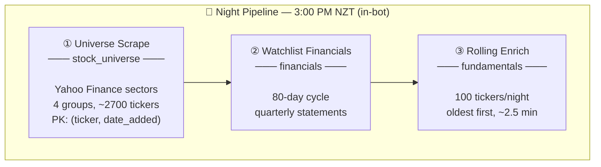
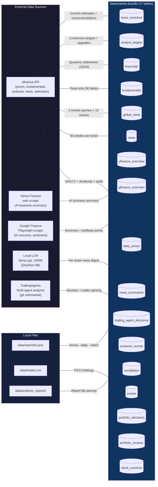
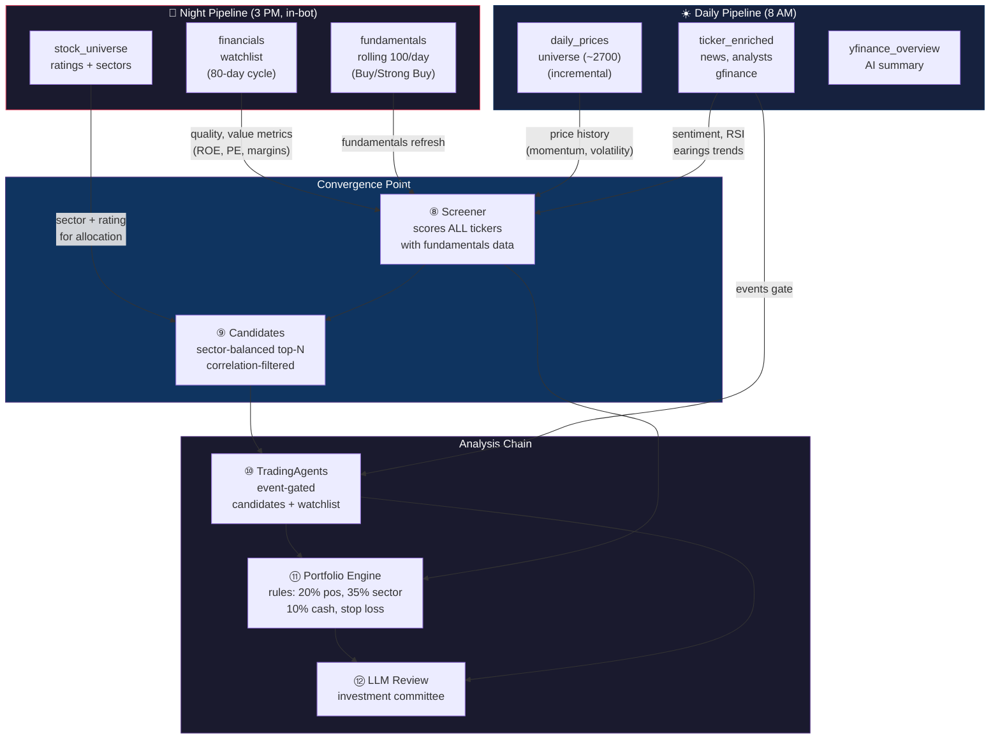
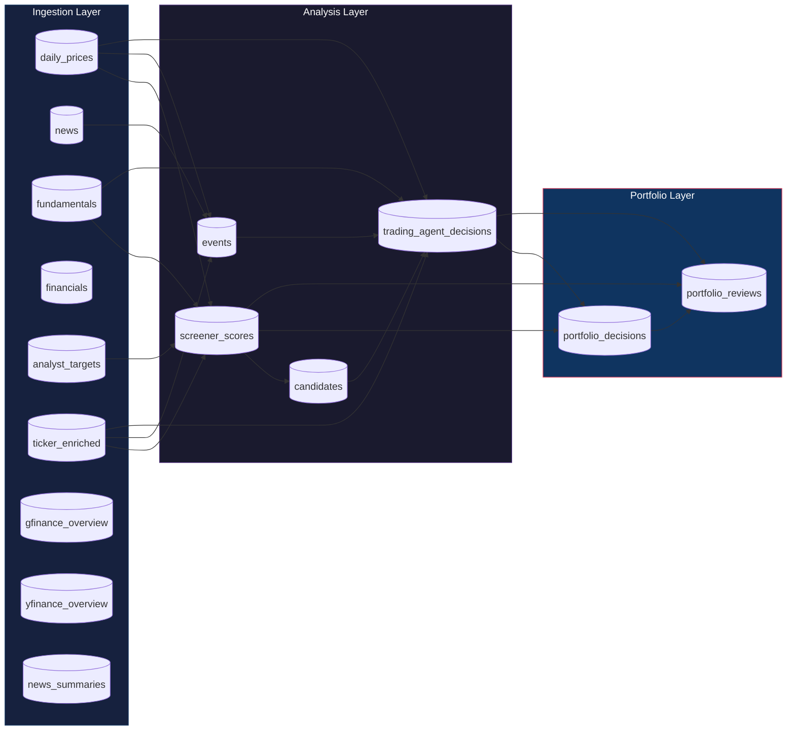
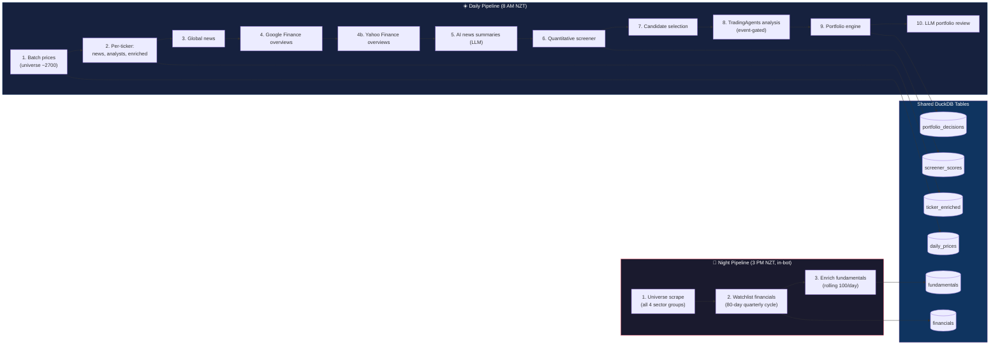
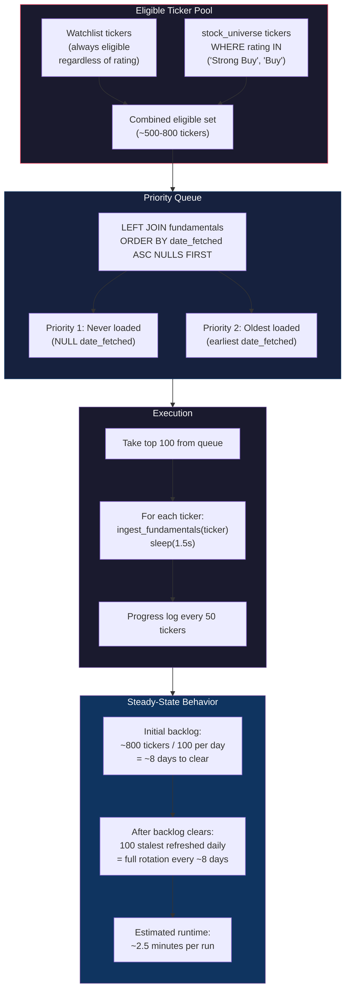

# Data Flow Diagrams

Mermaid diagrams illustrating the daily and nightly pipeline data flows.

---

### 1. Daily Pipeline (`--daily` / `--daily-smart`) — 8:00 AM NZT

**Tickers:** Step ① uses full `stock_universe`; steps ②–④ use `data/watchlist.json`; step ⑧ analyzes candidates + watchlist (event-gated)

```mermaid
flowchart LR
    subgraph ROW1["Per-ticker loop (steps ②–④)"]
        direction LR
        S1["① Batch Prices (universe)\n─── daily_prices ───\n~2700 tickers, incremental"]
        S2["② News\n─── news ───"]
        S3["③ Analyst Targets\n─── analyst_targets ───"]
        S4["④ Enriched\n─── ticker_enriched ───"]
        S1 --> S2 --> S3 --> S4
    end

    subgraph ROW2[" "]
        direction LR
        S5["⑤ Global News\n─── global_news ───"]
        S6["⑥ Google Finance\n─── gfinance_overview ───"]
        S6b["⑥b Yahoo Finance\n─── yfinance_overview ───"]
        S7["⑦ AI Summaries\n─── news_summaries ───"]
        S5 --> S6 --> S6b --> S7
    end

    subgraph ROW3[" "]
        direction LR
        S8["⑧ Screener\n─── screener_scores ───"]
        S9["⑨ Candidates\n─── candidates ───"]
        S10["⑩ TradingAgents\n─── trading_agent_decisions ───\nevent-gated, candidates+watchlist"]
        S11["⑪ Portfolio Engine\n─── portfolio_decisions ───"]
        S12["⑫ LLM Review\n─── portfolio_reviews ───"]
        S8 --> S9 --> S10 --> S11 --> S12
    end

    S4 --> S5
    S7 --> S8
```

### Smart Scheduling Staleness Thresholds

| Table | Date Column | Max Age | Refresh Rule |
|-------|------------|---------|--------------|
| `news` | `date` | 1 day | Changes daily |
| `ticker_enriched` | `date_fetched` | 3 days | Slow-changing estimates |
| `analyst_targets` | `date_fetched` | 3 days | Overlaps enrichment cycle |
| `financials` | `report_date` | report_date + 80 days | Quarterly (night pipeline) |

---

### 2. Night Pipeline (`--night`) — 3:00 PM NZT (automated in bot)

**Tickers:** Full `stock_universe` for scrape; watchlist for financials; enrich gated by rating (Buy/Strong Buy) + watchlist

---

## 3. Data Source → DuckDB Table Mapping

### How Night (1) and Daily (2) Converge

Night builds **breadth** (2700+ tickers with prices + fundamentals). Daily builds **depth** (news, enriched, technicals for watchlist). They meet at the screener.

---

## 4. Inter-Table Data Dependencies (Analysis Pipeline)

Shows how DuckDB tables feed into each other through the screening → analysis → portfolio chain.

---

## 5. Night vs Daily — Side-by-Side Comparison

---

## 6. Rolling Enrichment Detail

How the 100/day limit works in the nightly pipeline.

